# JVM

> 摘自《深入理解Java虚拟机》

## JVM运行时数据区域

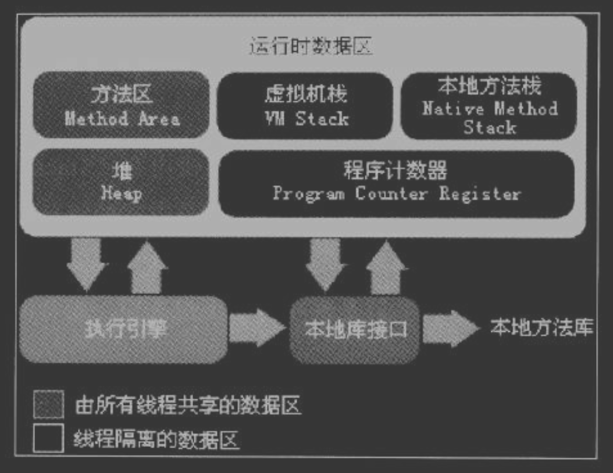

### 虚拟机栈

Java虚拟机栈是线程私有的，它的生命周期与线程相同。虚拟机栈描述的是Java方法执行的内存模型：每个方法在执行的同时都会创建一个栈帧用于存储**局部变量表、操作数栈、动态链接、方法出口**等信息。每个方法从调用直到执行完成的过程，就对应着一个栈帧从虚拟机栈中入栈到出栈的过程。

# Java多线程

> 摘自《Java多线程编程核心技术》

## 对象及变量的并发访问

- “非线程安全”问题存在于“实例变量”中，如果是**方法内部的私有变量**，则不存在“非线程安全”问题，这是方法内部的变量是私有的特性造成的。
- 如果多个线程共同访问同一个对象中的实例变量，则有可能出现“非线程安全”问题。用线程访问的对象中如果有多个实例变量，则运行的结果可能出现交叉的情况。如果对象仅有一个实例变量，则有可能出现覆盖的情况。

### Synchronized关键字

多个对象多个锁示例：

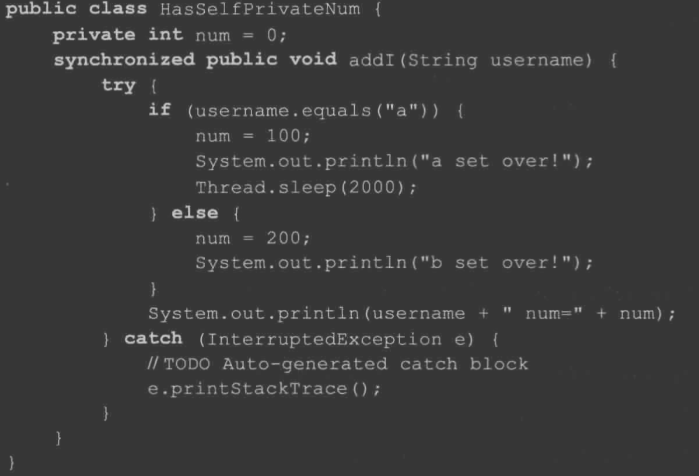

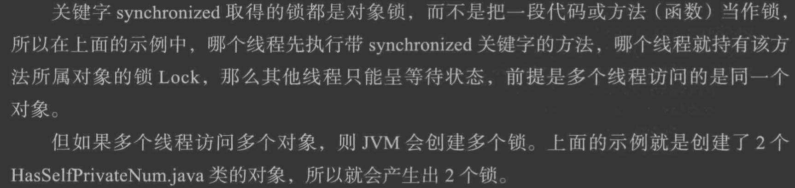

> 调用关键字Synchronized声明的方法一定是排队执行的，只有共享资源的读写访问才需要同步化，如果不是共享资源，根本就没有同步的必要。

### Synchronized方法与锁对象

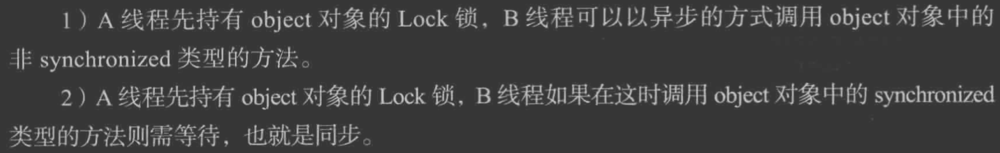

### 脏读


### Synchronized可重入

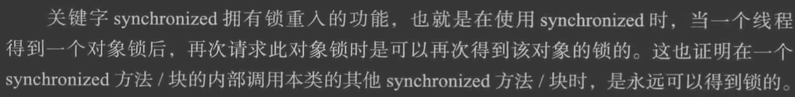

> - 当存在父子类继承关系时，子类完全可以通过“可重入锁”调用父类的同步方法。
> - 当一个线程执行的代码出现异常时，其所持有的锁会自动释放。
> - 同步不具有继承性

### Synchronized同步语句块

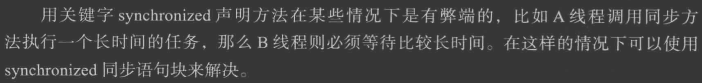


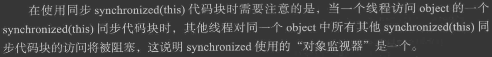

> 和Synchronized方法一样Synchronized(this)代码块锁住的也是当前的对象

### 将任意对象作为对象监视器

> Synchronized(非this对象)格式的作用：synchronized(非this对象x)同步代码块。
>
> - 在多个线程持有“对象监视器”为同一个对象的前提下，同一时间只有一个线程可以执行synchronized(非this对象x)同步代码块中的代码。
> - 当持有“对象监视器”为同一个对象的前提下，同一时间只有一个线程可以执行synchronized(非this对象x)同步代码块中的代码。
>
> **优点：**
>
> > 锁非this对象具有一定的优点：如果在一个类中有多个synchronized方法，这时虽然可以实现同步，但会受到阻塞，所以影响运行效率；但是使用同步代码块锁（非this对象），则synchronized（非this）代码块中的程序与同步方法是异步的，不与其他锁this同步方法争抢this锁，则可以大大提高运行效率。
> >
> > **Tip：**使用synchronized(非this对象x)同步代码块格式进行同步操作时，非this对象x对象监视器必须是同一个对象，否则运行的结果就是异步调用了。

### 静态同步synchronized方法与synchronized（class）代码块

> 关键字synchronized还可以应用在static方法上，如果这样写，那是对当前的**.java**文件对应的Class类进行持锁。
>
> - 关键字synchronized加在在static方法上是给Class类上锁（可以对类的所有对象实例起作用），关键字synchronized加在非static方法上是给对象上锁，**并不是同一把锁**。
> - synchronized（class）代码块的作用和synchronized static方法的作用是一样的。

### 数据类型String的常量池特性

> 在JVM中具有String的常量池缓存功能，将synchronized（string）同步块与String联合使用时，要注意常量池带来的一些例外。因此在大多数情况下，同步synchronized代码块都不使用string作为锁对象，而改用其他。比如：new Object（）实例化一个Object对象，但它并不放入缓存中。

## Volatile

​	关键字volatile的作用主要是使变量在多个线程可见，强制从公共堆栈中取变量的值，而不是从线程的私有数据栈中取得变量的值。

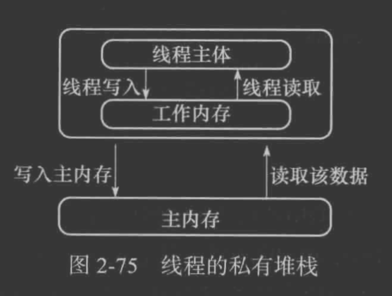

​	使用Volatile关键字读取公共内存

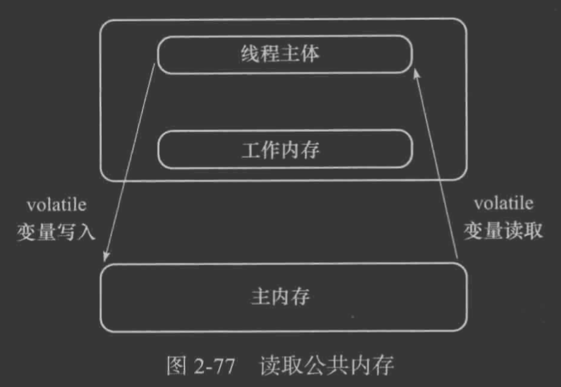

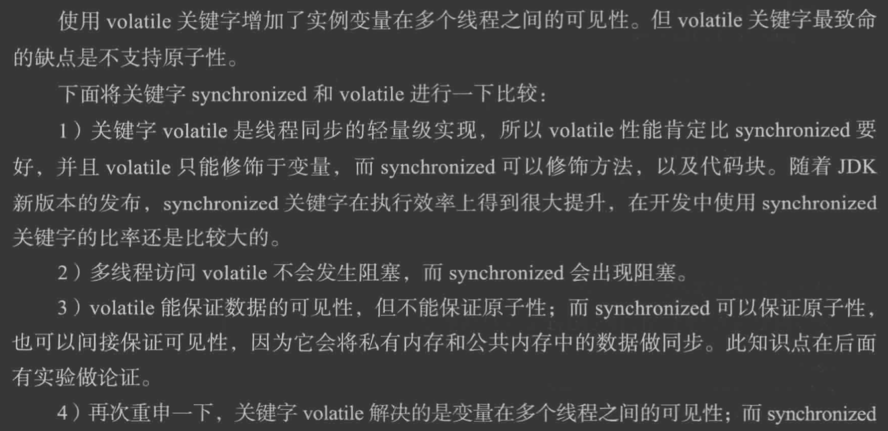


> 关键字Volatile主要的使用场合是在多个线程中可以感知实例变量被更改了，并且可以获取最新的值使用，也就是多线程读取共享变量时可以获取最新的值使用。
>
> 关键字Volatile提示线程每次从共享内存中读取变量，而不是从私有内存中读取，这样就保证了同步数据的可见性。如果修改实例变量中的数据，比如 i++，也就是 i=i+1 ，则这样的操作其实并不是一个原子操作，非线程安全的。表达式 i++ 的操作步骤分解如下：
>
> - 从内存中读取i的值
> - 计算i的值
> - 将i的值写到内存中
>
> 假如在第二步计算值的时候，另一个线程也修改i的值，那么这个时候就会出现脏数据。解决的办法就是使用Synchronized关键字。所以说Volatile关键字本身并不处理数据的原子性，而是强制对数据的读写及时影响到主内存的。

### 变量在内存中的工作过程

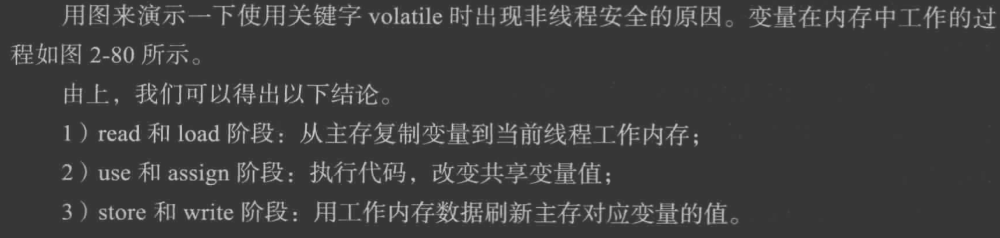

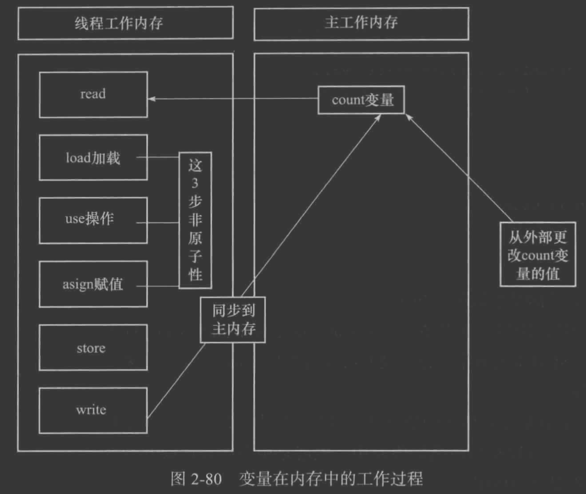

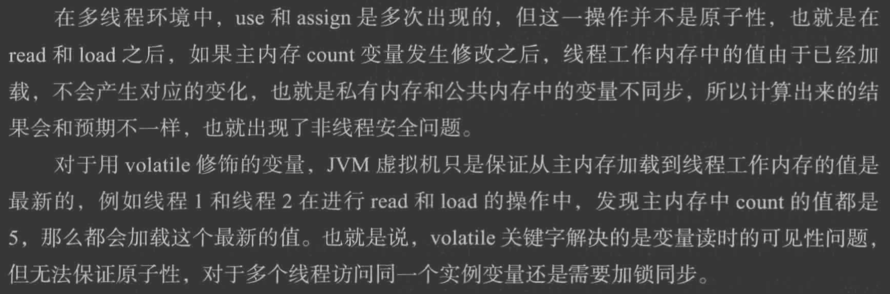

> 除了在i++操作时使用Synchronized关键字实现同步外，还可以使用原子类实现同步。

### synchronized同步代码块有Voaltile同步的功能

关键字synchronized可以使多个线程访问同一个资源具有同步性，而且它具有将线程工作内存中私有变量与公共内存中的变量同步的功能。

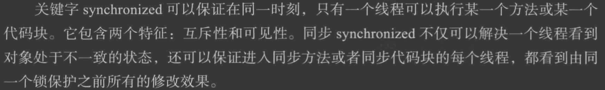

## 线程间通信

### 等待/通知机制的实现

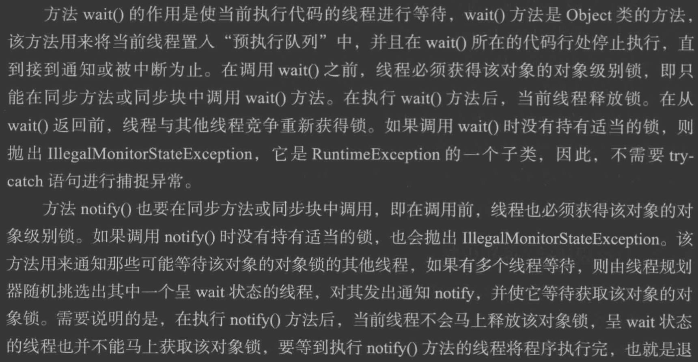

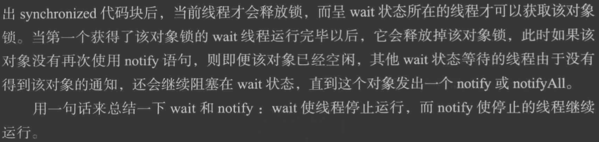

### 线程切换

wait()方法可以使调用该方法的线程释放共享资源的锁，然后从运行状态退出，进入等待队列，直到被再次唤醒。

wait(long)方法的功能是等待某一时间内是否有线程对锁进行唤醒，如果超过这个时间则自动唤醒。

notify()方法可以随机唤醒等待队列中等待同一共享资源的*一个*线程，并使该线程退出等待队列，进入可运行状态，也就是motify()方法仅通知*一个*线程。

notifyAll()方法可以使所有正在等待队列中等待同一共享资源的*全部*线程从等待状态退出，进入可运行状态。此时，优先级最高的那个线程最先执行，但也有可能是随机执行，因为这要取决于JVM的实现。

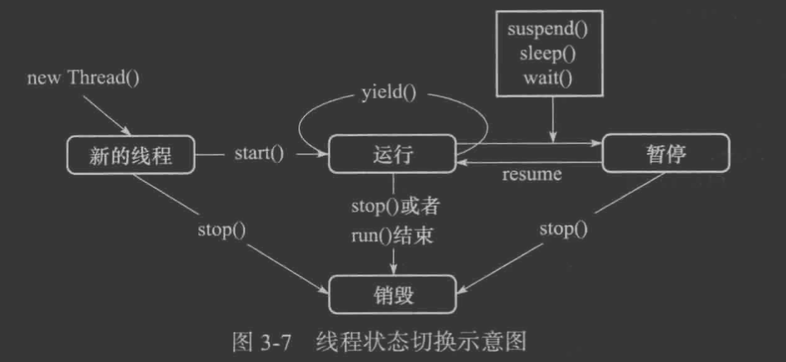

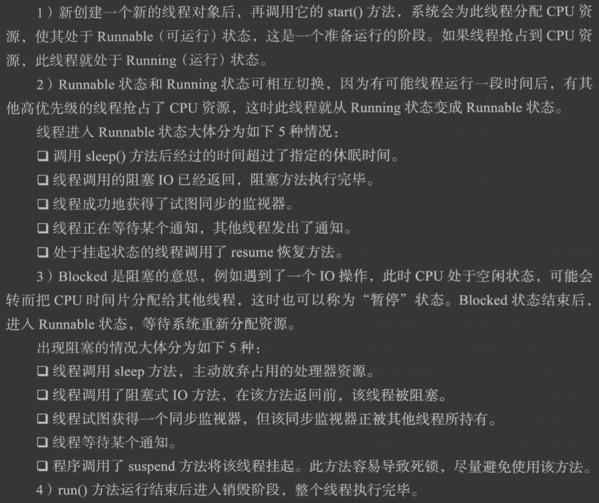

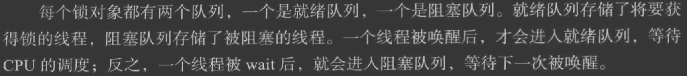

### 生产者和消费者模式的实现

```java
public class MyStack {
    private List list = new ArrayList();

    synchronized public void push() {
        try {
            while (list.size() == 1) {
                this.wait();
            }
            list.add("str");
            this.nofityAll();
        } catch (Exception e) {
            e.printStackTrace();
        }
    }

    synchronized public String pop() {
        String returnValue = "";
        try {
            while (list.size() == 0) {
                this.wait();
            }
            returnValue = list.get(0);
            list.remove(0);
            this.nofityAll();
        } catch (Exception e) {
            e.printStackTrace();
        }
        return returnValue;
    }
}
```

> - 为了避免程序因为条件改变而没有得到及时的响应，多个呈wait状态的线程被唤醒，继而出现异常。解决的办法是将 if 改为while。
> - 为了避免程序出现**假死**现象，使用notifyAll()方法唤醒所有等待线程。**假死**出现的主要原因有可能连续唤醒了同类。

### join()方法

方法join()的作用是使所属的线程对象x正常执行run()方法中的任务，而使当前线程z进行无限期的阻塞，等待线程x销毁后再继续执行线程z后面的代码。


> 方法join(long)与sleep(long)的区别：
>
> 方法join(long)的功能在内部是使用wait(long)方法实现的，所以join(long)方法具有释放锁的特点。

​	方法join具有是线程排队运行的作用，有些类似同步的运行效果。

在join的过程中，如果当前线程呢个对象被中断，则当前线程出现异常。


## Lock


## 线程池

> 参考：
>
> [Java 并发编程实战](https://www.infoq.cn/article/java-threadPool/)
>
> [Java四种线程池的使用](https://www.iteye.com/blog/cuisuqiang-2019372)

> 合理利用线程池能够带来三个好处:
>
> - 降低资源消耗。通过重复利用已创建的线程降低线程创建和销毁造成的消耗。
> - 提高响应速度。当任务到达时，任务可以不需要等到线程创建就能立即执行。
> - 提高线程的可管理性。线程是稀缺资源，如果无限制的创建，不仅会消耗系统资源，还会降低系统的稳定性，使用线程池可以进行统一的分配，调优和监控。

### 线程池的使用

```java
new  ThreadPoolExecutor(corePoolSize, maximumPoolSize, keepAliveTime, milliseconds,runnableTaskQueue, handler);
```

创建一个线程池需要输入几个参数：

> - corePoolSize（线程池的基本大小）：当提交一个任务到线程池时，线程池会创建一个线程来执行任务，即使其他空闲的基本线程能够执行新任务也会创建线程，等到需要执行的任务数大于线程池基本大小时就不再创建。如果调用了线程池的 prestartAllCoreThreads 方法，线程池会提前创建并启动所有基本线程。
> - runnableTaskQueue（任务队列）：用于保存等待执行的任务的阻塞队列。 可以选择以下几个阻塞队列。
>   - ArrayBlockingQueue：是一个基于数组结构的有界阻塞队列，此队列按 FIFO（先进先出）原则对元素进行排序。
>   - LinkedBlockingQueue：一个基于链表结构的阻塞队列，此队列按 FIFO （先进先出） 排序元素，吞吐量通常要高于 ArrayBlockingQueue。静态工厂方法 Executors.newFixedThreadPool() 使用了这个队列。
>   - SynchronousQueue：一个不存储元素的阻塞队列。每个插入操作必须等到另一个线程调用移除操作，否则插入操作一直处于阻塞状态，吞吐量通常要高于 LinkedBlockingQueue，静态工厂方法 Executors.newCachedThreadPool 使用了这个队列。
>   - PriorityBlockingQueue：一个具有优先级的无限阻塞队列.
> - maximumPoolSize（线程池最大大小）：线程池允许创建的最大线程数。如果队列满了，并且已创建的线程数小于最大线程数，则线程池会再创建新的线程执行任务。值得注意的是如果使用了无界的任务队列这个参数就没什么效果。
> - ThreadFactory：用于设置创建线程的工厂，可以通过线程工厂给每个创建出来的线程设置更有意义的名字。
> - RejectedExecutionHandler（饱和策略）：当队列和线程池都满了，说明线程池处于饱和状态，那么必须采取一种策略处理提交的新任务。这个策略默认情况下是 AbortPolicy，表示无法处理新任务时抛出异常。以下是 JDK1.5 提供的四种策略。
>   - AbortPolicy：直接抛出异常。
>   - CallerRunsPolicy：只用调用者所在线程来运行任务。
>   - DiscardOldestPolicy：丢弃队列里最近的一个任务，并执行当前任务。
>   - DiscardPolicy：不处理，丢弃掉。
>   - 当然也可以根据应用场景需要来实现 RejectedExecutionHandler 接口自定义策略。如记录日志或持久化不能处理的任务。
> - keepAliveTime（线程活动保持时间）：线程池的工作线程空闲后，保持存活的时间。所以如果任务很多，并且每个任务执行的时间比较短，可以调大这个时间，提高线程的利用率。
> - TimeUnit（线程活动保持时间的单位）：可选的单位有天（DAYS），小时（HOURS），分钟（MINUTES），毫秒 (MILLISECONDS)，微秒 (MICROSECONDS, 千分之一毫秒) 和毫微秒 (NANOSECONDS, 千分之一微秒)。

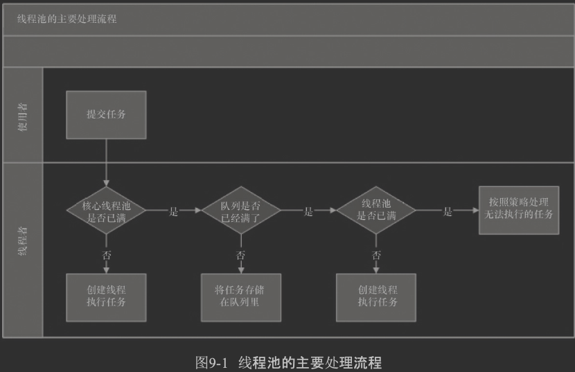

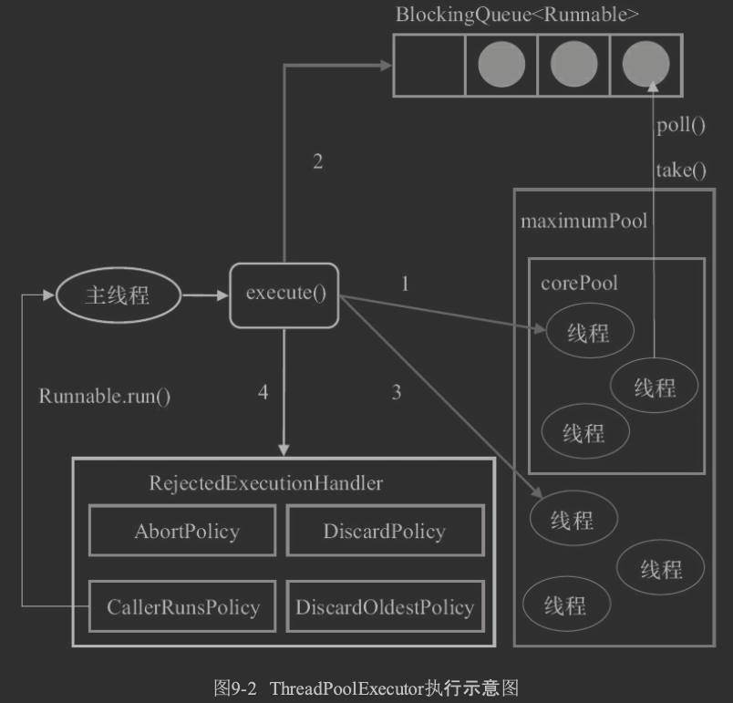

􏲡􏱩􏱪􏳪􏰵􏰬􏰅􏰆􏴮􏰥􏰚􏱌􏱉􏰘􏱋􏱌􏱌􏱄􏲏􏰣􏲖􏰘􏰔􏱲􏲞􏲟􏲩􏰅􏰆􏱤􏰴􏰵􏰊􏰋􏱯􏲫􏲬􏰔􏰴􏰵􏱡􏱀􏴯􏴰 􏰧􏰨􏱥􏱦􏴱􏴲􏴳ThreadPoolExecutor执行execute方法分下面四种情况：

- 如果当前运行的线程少于corePoolSize，则创建新的线程来执行任务（注意，执行这一步骤需要获取全局锁）。

- 如果运行的线程等于或者多余corePoolSize，则将任务加入BlockingQueue。

- 如果无法将任务加入BlockingQueue（队列已满），则创建新的线程来处理任务（注意，执行这一步骤需要获取全局锁）。

- 如果创建新线程将是当前运行的线程超过maximumPoolSize，任务将被拒绝，并调用RejectedExecutionHandler.rejectedExecution（）方法。

  

  ThreadPoolExecutor采取上述步骤的总体设计思路，是为了在执行execute()方法时，尽可能地避免获取全局锁（那将是一个严重的可伸缩瓶颈）。在ThreadPoolExecutor完成预热之后（当前运行的线程数大于等于corePoolSize），几乎所有的execute()方法都是执行步骤2，而步骤2不需要获取全局锁。


## 并发容器


