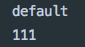
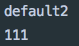
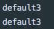
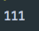
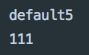
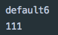
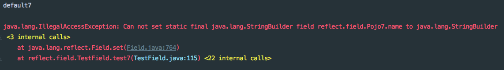
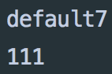

# [Java反射-修改字段值](https://www.cnblogs.com/noKing/p/9038234.html)

### 使用反射修改一个private修饰符的变量name

咱们回到主题, 先用反射来实现一个最基础的功能吧.

其中待获取的name如下:

```java
public class Pojo {
    private StringBuilder name = new StringBuilder("default");
 
    public void printName() {
        System.out.println(name);
    }
}
```

接下来咱们 使用反射来修改上面name的值.

为什么要用反射呢? 因为成员变量name是private修饰的, 而且没有提供一个setter方法.没有方法可以设置name的值.

虽然没有一个对外开放的接口, 但是反射却可以轻而易举地做到:

```java
Pojo p = new Pojo();
 
// 查看被修改之前的值
p.printName();
 
// 反射获取字段, name成员变量
Field nameField = p.getClass().getDeclaredField("name");
 
// 由于name成员变量是private, 所以需要进行访问权限设定
nameField.setAccessible(true);
 
// 使用反射进行赋值
nameField.set(p, new StringBuilder("111"));
 
// 打印查看被修改后的值
p.printName();
```

 发现被修改成功, 结果如下:




### 使用反射修改一个final修饰符的变量name

刚才使用反射成功修改了private修饰的变量, 那么如果是final修饰的变量那么还能否使用反射来进行修改呢? (因为正常的setter getter操作反正是做不到.)

声明一个final修饰的name如下. 接下来使用反射来对它进行修改. 目的也就是使name指向一个新的StringBuilder对象.

```java
public class Pojo2 {
    private final StringBuilder name = new StringBuilder("default2");
 
    public void printName() {
        System.out.println(name);
    }
}
```

　　咱们看看反射的威力吧, 它能修改final的字段的指向.也就是让name字段指向一个新的地址.

```java
Pojo2 p = new Pojo2();
 
// 查看被修改之前的值
p.printName();
 
// 反射获取字段, name成员变量
Field nameField = p.getClass().getDeclaredField("name");
 
// 由于name成员变量是private, 所以需要进行访问权限设定
nameField.setAccessible(true);
 
// 使用反射进行赋值
nameField.set(p, new StringBuilder("111"));
 
// 打印查看被修改后的值
p.printName();
```

 发现设置成功, 结果如下:




### 使用反射修改一个final修饰符的String类型变量name

如果说同学们在看我这篇文章时, 在前面偷懒了, 或者是认为StringBuilder和String没什么大区别, 于是就在前面把我代码里的StringBuilder都改为了String, 那么大家的执行结果将会是一个意外结果.

也就是我前面的例子用StringBuilder就能成功, 如果都替换成了String, 使用反射也不能够成功赋值.

为什么呢?

在讲解为什么之前, 我这里把这个问题重现一下:

把前面的StringBuilder替换为String后的Pojo3

```java
public class Pojo3 {
    private final String name = "default3";
 
    public void printName() {
        System.out.println(name);
    }
}
```

使用反射尝试着进行赋值:

```java
Pojo3 p = new Pojo3();
p.printName();
Field nameField = p.getClass().getDeclaredField("name");
nameField.setAccessible(true);
nameField.set(p, "111");
p.printName();
```

 发现赋值失败, 结果如下:



------

再一次提问: 为什么呢?

因为JVM在编译时期, 就把final类型的String进行了优化, 在编译时期就会把String处理成常量, 所以 Pojo3里的printName()方法, 就相当于:

```java
public void printName() {
        System.out.println("default3");
}
```

 其实name的值是赋值成功了, 只是printName()方法在JVM优化后就被写死了, 所以无论name是否被正确修改为其他的值, printName始终都会打印"default3".

那么怎么知道name是不是真的被重新赋值成功了呢?

看下面代码:

```java
Pojo3 p = new Pojo3();
Field nameField = p.getClass().getDeclaredField("name");
nameField.setAccessible(true);
 
// 使用反射向name进行重新赋值
nameField.set(p, "111");
 
// 再使用反射再把name值取出来
Object name = nameField.get(p);
 
// 把取出来的name值进行打印
System.out.println(name.toString());
```

 结果如下, 说明name变量确实被赋值成功.



------

那么可能有同学就问了,final修饰的String在JVM编译时就被处理为常量, 怎么样防止这种现象呢?  请看下面讲解

### 使用反射修改一个final修饰符的String类型变量name, 同时防止字符串在编译时被处理为常量

使用一些手段让final String类型的name的初始值经过一次运行才能得到, 那么就不会在编译时期就被处理为常亮了.

```java
public class Pojo4 {
    // 防止JVM编译时就把"default4"作为常量处理
    private final String name = (null == null ? "default4" : "");
 
    public void printName() {
        System.out.println(name);
    }
}
```

　　运行测试的还是那段反射代码:

```java
Pojo4 p = new Pojo4();
p.printName();
Field nameField = p.getClass().getDeclaredField("name");
nameField.setAccessible(true);
nameField.set(p, "111");
p.printName();
```

 结果如下, 发现确实成功了:　　


------

那么有同学就会问了, 除了上面这种方法外, 还有什么方法能防止JVM在编译时就把final String的变量处理为常亮呢 ?

答: 嗯...只要是让name的值经过运行才能获得, 那么就不会被处理为常量. 我再举个程序例子吧.看下面代码:

```java
public class Pojo5 {
    private final String name = new StringBuilder("default5").toString();
 
    public void printName() {
        System.out.println(name);
    }
}
```

　　还是那段反射的代码, 运行

```java
@Test
public void test5() throws Exception {
    Pojo5 p = new Pojo5();
    p.printName();
    Field nameField = p.getClass().getDeclaredField("name");
    nameField.setAccessible(true);
    nameField.set(p, "111");
    p.printName();
}
```

 结果如下, OK




### 使用反射修改一个static修饰符的变量name

刚才展示了使用反射来修改final修饰的字段, 接下来就演示一下使用反射来修改static修饰的变量:

如下的一个static修饰的一个name变量.

```java
public class Pojo6 {
    private static StringBuilder name = new StringBuilder("default6");
 
    public void printName() {
        System.out.println(name);
    }
}
```

还是那段反射代码来进行测试:

```java
Pojo6 p = new Pojo6();
p.printName();
Field nameField = p.getClass().getDeclaredField("name");
nameField.setAccessible(true);
nameField.set(p, new StringBuilder("111"));
p.printName();
```

 发现结果如下, 也可以设置成功.　　




### 使用反射修改final + static修饰符的变量name

一个同时被final和static修饰的变量如下所示:

```java
public class Pojo7 {
    private final static StringBuilder name = new StringBuilder("default7");
 
    public void printName() {
        System.out.println(name);
    }
}
```

　　如果还是通过下面这段反射代码来进行修改name的值, 那么就错了!

```java
Pojo7 p = new Pojo7();
p.printName();
Field nameField = p.getClass().getDeclaredField("name");
nameField.setAccessible(true);
nameField.set(p, new StringBuilder("111"));
p.printName();
```

 执行之后会报出如下异常, 因为**反射无法修改同时被static final修饰的变量**:



 那到底能不能修改呢?

 答案是能修改.

那怎么样修改呢?

思路是这样的, 先通过反射把name字段的final修饰符去掉.看如下代码:

先把name字段通过反射取出来, 这个和之前的步骤都一样, 反射出来的字段类型(Field)命名为'nameField'

```java
Field nameField = p.getClass().getDeclaredField("name");
nameField.setAccessible(true);
```

 接下来再通过反射, 把nameField的final修饰符去掉:

```java
Field modifiers = nameField.getClass().getDeclaredField("modifiers");
modifiers.setAccessible(true);
modifiers.setInt(nameField, nameField.getModifiers() & ~Modifier.FINAL);
```

 然后就可以正常对name字段进行值的修改了.

```java
nameField.set(p, new StringBuilder("111"));
```

 最后别忘了再把final修饰符加回来:

```java
modifiers.setInt(nameField, nameField.getModifiers() & ~Modifier.FINAL);
```

 本例子中反射部分完整的代码如下:

```java
    // 注释的这段代码这样使用是错误的
//        Pojo7 p = new Pojo7();
//        p.printName();
//        Field nameField = p.getClass().getDeclaredField("name");
//        nameField.setAccessible(true);
//        nameField.set(p, new StringBuilder("111"));
//        p.printName();
 
        Pojo7 p = new Pojo7();
        p.printName();
        Field nameField = p.getClass().getDeclaredField("name");
        nameField.setAccessible(true);
 
 
        Field modifiers = nameField.getClass().getDeclaredField("modifiers");
        modifiers.setAccessible(true);
        modifiers.setInt(nameField, nameField.getModifiers() & ~Modifier.FINAL);
 
        nameField.set(p, new StringBuilder("111"));
        modifiers.setInt(nameField, nameField.getModifiers() & ~Modifier.FINAL);
        p.printName();
```

 结果如下, 表示修改正确:　　



 

本文中的所有代码都在这里: https://github.com/GoldArowana/K-Object/tree/master/src/test/java/reflect/field  里面的TestField.java为主要反射代码