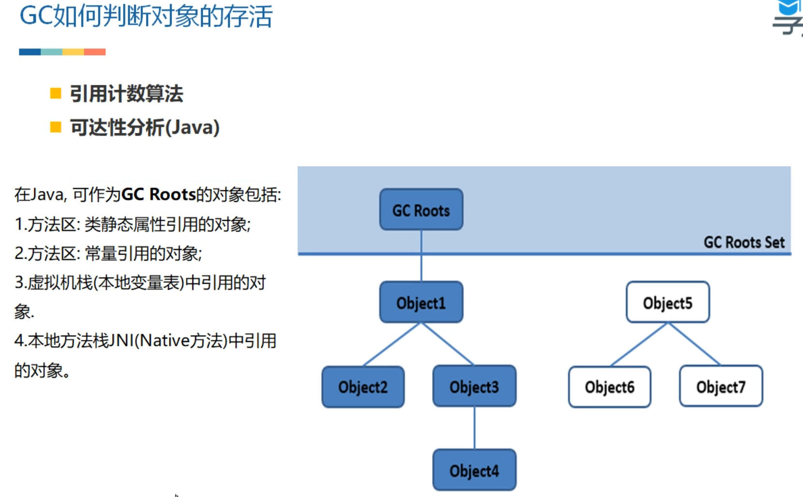
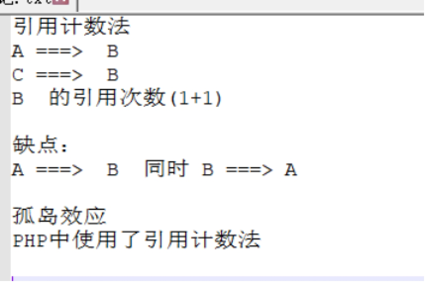
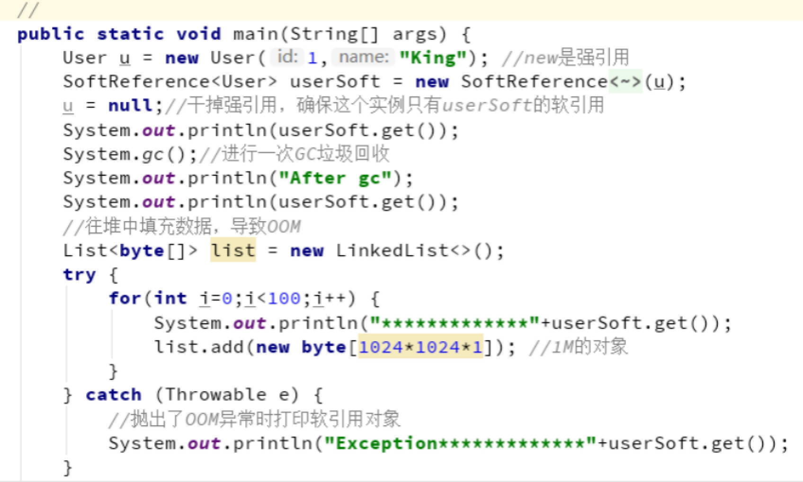
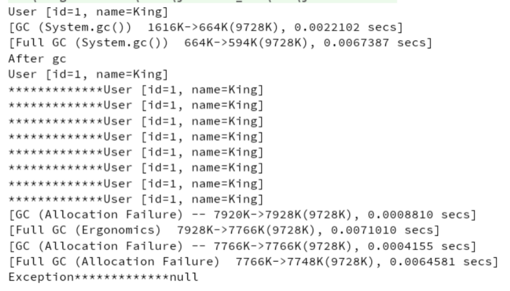
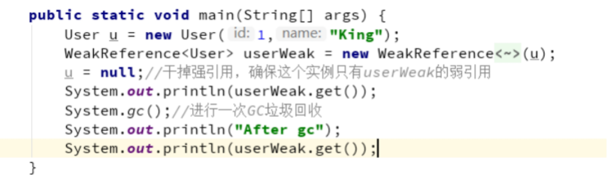
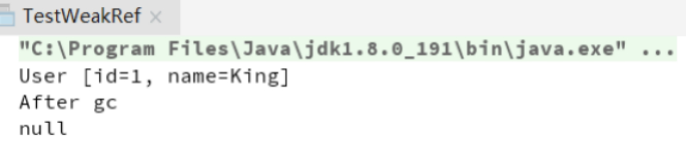
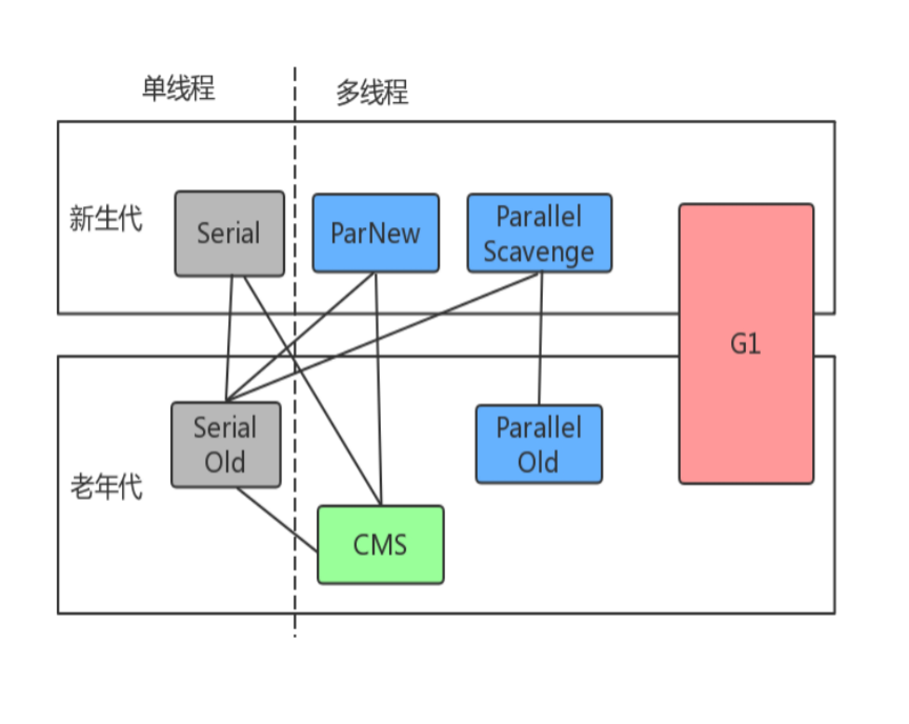
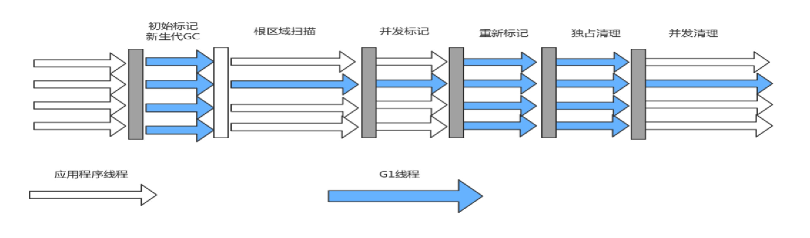

# 垃圾回收的意义

Java与C++等语言最大的技术区别：自动化的垃圾回收机制（GC）

为什么要了解GC和内存分配策略

1、面试需要

2、GC对应用的性能是有影响的；

3、写代码有好处

栈：栈中的生命周期是跟随线程，所以一般不需要关注

堆：堆中的对象是垃圾回收的重点

方法区/元空间：这一块也会发生垃圾回收，不过这块的效率比较低，一般不是我们关注的重点

# GC案例

自动回收机制也有失败的时候（Oom类）

-Xms  堆区内存初始内存分配的大小 

-Xmx  堆区内存可被分配的最大上限 

-XX:+PrintGCDetails 

打印GC详情 

-XX:+HeapDumpOnOutOfMemoryError 

当堆内存空间溢出时输出堆的内存快照 

 

# 新生代配置

新生代大小配置参数的优先级：

中间 -Xmn  限定大小

 

-XX:SurvivorRatio 

2个Survivor区和Eden区的比值

8 表示 两个Survivor ： Eden = 2： 8 ，每个Survivor占 1/10

可以修改为2

8 表示 两个Survivor ： Eden = 2： 2  ，各占一半

GC overhead limit exceeded 超过98%的时间用来做GC并且回收了不到2%的堆内存时会抛出此异常

1.垃圾回收会占据资源

2.回收效率过低也会有限制

为什么new出的对象不会被回收了，我们来看看GC是如何判断对象的存活

# 判断对象的存活

引用计数法：快，方便，实现简单，缺点：对象相互引用时，很难判断对象是否该回收。（PHP语言在用）

 

## 可达性分析

（面试时重要的知识点，牢记）

来判定对象是否存活的。这个算法的基本思路就是通过一系列的称为“GC Roots”的对象作为起始点，从这些节点开始向下搜索，搜索所走过的路径称为引用链（Reference Chain），当一个对象到GC Roots没有任何引用链相连时，则证明此对象是不可用的。

作为GC Roots的对象包括下面几种：

l 虚拟机栈（栈帧中的本地变量表）中引用的对象。

l 方法区中类静态属性引用的对象。

l 方法区中常量引用的对象。

l 本地方法栈中JNI（即一般说的Native方法）引用的对象。

# 各种引用

## 强引用

一般的Object obj = new Object() ，就属于强引用。

## 软引用 SoftReference

一些有用但是并非必需，用软引用关联的对象，系统将要发生OOM之前，这些对象就会被回收。参见代码：

VM参数 -Xms10m  -Xmx10m -XX:+PrintGC

 

运行结果

 

例如，一个程序用来处理用户提供的图片。如果将所有图片读入内存，这样虽然可以很快的打开图片，但内存空间使用巨大，一些使用较少的图片浪费内存空间，需要手动从内存中移除。如果每次打开图片都从磁盘文件中读取到内存再显示出来，虽然内存占用较少，但一些经常使用的图片每次打开都要访问磁盘，代价巨大。这个时候就可以用软引用构建缓存。

## 弱引用 WeakReference

一些有用（程度比软引用更低）但是并非必需，用弱引用关联的对象，只能生存到下一次垃圾回收之前，GC发生时，不管内存够不够，都会被回收。

参看代码：

 

 

注意：软引用 SoftReference和弱引用 WeakReference，可以用在内存资源紧张的情况下以及创建不是很重要的数据缓存。当系统内存不足的时候，缓存中的内容是可以被释放的。

实际运用（WeakHashMap、ThreadLocal）

## 虚引用 PhantomReference

幽灵引用，最弱，被垃圾回收的时候收到一个通知

# 复制算法（Copying）

将可用内存按容量划分为大小相等的两块，每次只使用其中的一块。当这一块的内存用完了，就将还存活着的对象复制到另外一块上面，然后再把已使用过的内存空间一次清理掉。这样使得每次都是对整个半区进行内存回收，内存分配时也就不用考虑内存碎片等复杂情况，只要按顺序分配内存即可，实现简单，运行高效。只是这种算法的代价是将内存缩小为了原来的一半。

注意：内存移动是必须实打实的移动（复制），不能使用指针玩。

 

专门研究表明，新生代中的对象98%是“朝生夕死”的，所以并不需要按照1:1的比例来划分内存空间，而是将内存分为一块较大的Eden空间和两块较小的Survivor空间，每次使用Eden和其中一块Survivor[1]。当回收时，将Eden和Survivor中还存活着的对象一次性地复制到另外一块Survivor空间上，最后清理掉Eden和刚才用过的Survivor空间。

HotSpot虚拟机默认Eden和Survivor的大小比例是8:1，也就是每次新生代中可用内存空间为整个新生代容量的90%（80%+10%），只有10%的内存会被“浪费”。当然，98%的对象可回收只是一般场景下的数据，我们没有办法保证每次回收都只有不多于10%的对象存活，当Survivor空间不够用时，需要依赖其他内存（这里指老年代）进行分配担保（Handle Promotion）

# 标记-清除算法（Mark-Sweep）

算法分为“标记”和“清除”两个阶段：首先标记出所有需要回收的对象，在标记完成后统一回收所有被标记的对象。

它的主要不足空间问题，标记清除之后会产生大量不连续的内存碎片，空间碎片太多可能会导致以后在程序运行过程中需要分配较大对象时，无法找到足够的连续内存而不得不提前触发另一次垃圾收集动作。

# 标记-整理算法（Mark-Compact）

首先标记出所有需要回收的对象，在标记完成后，后续步骤不是直接对可回收对象进行清理，而是让所有存活的对象都向一端移动，然后直接清理掉端边界以外的内存。

# 堆内存分配策略 

对象优先在Eden分配，如果说Eden内存空间不足，就会发生Minor GC

大对象直接进入老年代，大对象：需要大量连续内存空间的Java对象，比如很长的字符串和大型数组，1、导致内存有空间，还是需要提前进行垃圾回收获取连续空间来放他们，2、会进行大量的内存复制。

-XX:PretenureSizeThreshold 参数 ，大于这个数量直接在老年代分配，缺省为0 ，表示绝不会直接分配在老年代。

长期存活的对象将进入老年代，默认15岁，-XX:MaxTenuringThreshold调整

动态对象年龄判定，为了能更好地适应不同程序的内存状况，虚拟机并不是永远地要求对象的年龄必须达到了MaxTenuringThreshold才能晋升老年代，如果在Survivor空间中相同年龄所有对象大小的总和大于Survivor空间的一半，年龄大于或等于该年龄的对象就可以直接进入老年代，无须等到MaxTenuringThreshold中要求的年龄

空间分配担保：新生代中有大量的对象存活，survivor空间不够，当出现大量对象在MinorGC后仍然存活的情况（最极端的情况就是内存回收后新生代中所有对象都存活），就需要老年代进行分配担保，把Survivor无法容纳的对象直接进入老年代.只要老年代的连续空间大于新生代对象的总大小或者历次晋升的平均大小，就进行Minor GC，否则FullGC。

 

# 把算法们都用上

jps -v

在新生代中，每次垃圾收集时都发现有大批对象死去，只有少量存活，那就选用复制算法，只需要付出少量存活对象的复制成本就可以完成收集。

而老年代中因为对象存活率高、没有额外空间对它进行分配担保，就必须使用“标记—清理”或者“标记—整理”算法来进行回收。

请记住下图的垃圾收集器和之间的连线关系。

 

| 收集器                            | 收集对象和算法   | 收集器类型         | 说明                                                 | 适用场景                                                     |
| --------------------------------- | ---------------- | ------------------ | ---------------------------------------------------- | ------------------------------------------------------------ |
| Serial                            | 新生代，复制算法 | 单线程             |                                                      | 简单高效；适合内存不大的情况；                               |
| ParNew                            | 新生代，复制算法 | 并行的多线程收集器 | ParNew垃圾收集器是Serial收集器的多线程版本           | 搭配CMS垃圾回收器的首选                                      |
| Parallel Scavenge吞吐量优先收集器 | 新生代，复制算法 | 并行的多线程收集器 | 类似ParNew，更加关注吞吐量，达到一个可控制的吞吐量； | 本身是Server级别多CPU机器上的默认GC方式，主要适合后台运算不需要太多交互的任务； |

 

| 收集器       | 收集对象和算法                        | 收集器类型         | 说明                                                         | 适用场景                                                     |
| ------------ | ------------------------------------- | ------------------ | ------------------------------------------------------------ | ------------------------------------------------------------ |
| Serial Old   | 老年代，标记整理算法                  | 单线程             |                                                              | Client模式下虚拟机使用                                       |
| Parallel Old | 老年代，标记整理算法                  | 并行的多线程收集器 | Parallel Scavenge收集器的老年代版本，为了配合Parallel Scavenge的面向吞吐量的特性而开发的对应组合； | 在注重吞吐量以及CPU资源敏感的场合采用                        |
| CMS          | 老年代，标记清除算法                  | 并行与并发收集器   | 尽可能的缩短垃圾收集时用户线程停止时间；缺点在于： 1.内存碎片 2.需要更多cpu资源 3.浮动垃圾问题，需要更大的堆空间 | 重视服务的响应速度、系统停顿时间和用户体验的互联网网站或者B/S系统。互联网后端目前cms是主流的垃圾回收器； |
| G1           | 跨新生代和老年代；标记整理 + 化整为零 | 并行与并发收集器   | JDK1.7才正式引入，采用分区回收的思维，基本不牺牲吞吐量的前提下完成低停顿的内存回收；可预测的停顿是其最大的优势； | 面向服务端应用的垃圾回收器，目标为取代CMS                    |

 

并行：垃圾收集的多线程的同时进行。

并发：垃圾收集的多线程和应用的多线程同时进行。

 

注：吞吐量=运行用户代码时间/(运行用户代码时间+ 垃圾收集时间)

垃圾收集时间= 垃圾回收频率 * 单次垃圾回收时间

# 垃圾回收器工作示意图

## Serial/Serial Old

最古老的，单线程，独占式，成熟，适合单CPU  服务器

-XX:+UseSerialGC 新生代和老年代都用串行收集器

-XX:+UseParNewGC 新生代使用ParNew，老年代使用Serial Old

-XX:+UseParallelGC 新生代使用ParallerGC，老年代使用Serial Old

 

## ParNew 

和Serial基本没区别，唯一的区别：多线程，多CPU的，停顿时间比Serial少

-XX:+UseParNewGC 新生代使用ParNew，老年代使用Serial Old

 

## Parallel Scavenge（ParallerGC）/Parallel Old

关注吞吐量的垃圾收集器，高吞吐量则可以高效率地利用CPU时间，尽快完成程序的运算任务，主要适合在后台运算而不需要太多交互的任务。

所谓吞吐量就是CPU用于运行用户代码的时间与CPU总消耗时间的比值，即吞吐量=运行用户代码时间/（运行用户代码时间+垃圾收集时间），虚拟机总共运行了100分钟，其中垃圾收集花掉1分钟，那吞吐量就是99%。

 

## Concurrent Mark Sweep （CMS）

收集器是一种以获取最短回收停顿时间为目标的收集器。目前很大一部分的Java应用集中在互联网站或者B/S系统的服务端上，这类应用尤其重视服务的响应速度，希望系统停顿时间最短，以给用户带来较好的体验。CMS收集器就非常符合这类应用的需求。

从名字（包含“Mark Sweep”）上就可以看出，CMS收集器是基于“标记—清除”算法实现的，它的运作过程相对于前面几种收集器来说更复杂一些，整个过程分为4个步骤，包括：

**l** 初始标记-短暂，仅仅只是标记一下GC Roots能直接关联到的对象，速度很快。

**l** 并发标记-和用户的应用程序同时进行，进行GC RootsTracing的过程

**l** 重新标记-短暂，为了修正并发标记期间因用户程序继续运作而导致标记产生变动的那一部分对象的标记记录，这个阶段的停顿时间一般会比初始标记阶段稍长一些，但远比并发标记的时间短。

**l** 并发清除

由于整个过程中耗时最长的并发标记和并发清除过程收集器线程都可以与用户线程一起工作，所以，从总体上来说，CMS收集器的内存回收过程是与用户线程一起并发执行的。

-XX:+UseConcMarkSweepGC ，表示新生代使用ParNew，老年代的用CMS

浮动垃圾：由于CMS并发清理阶段用户线程还在运行着，伴随程序运行自然就还会有新的垃圾不断产生，这一部分垃圾出现在标记过程之后，CMS无法在当次收集中处理掉它们，只好留待下一次GC时再清理掉。这一部分垃圾就称为“浮动垃圾”。

 

## G1

 

-XX:+UseG1GC

并行与并发：G1能充分利用多CPU、多核环境下的硬件优势，使用多个CPU（CPU或者CPU核心）来缩短Stop-The-World停顿的时间，部分其他收集器原本需要停顿Java线程执行的GC动作，G1收集器仍然可以通过并发的方式让Java程序继续执行。

分代收集：与其他收集器一样，分代概念在G1中依然得以保留。虽然G1可以不需要其他收集器配合就能独立管理整个GC堆，但它能够采用不同的方式去处理新创建的对象和已经存活了一段时间、熬过多次GC的旧对象以获取更好的收集效果。

空间整合：与CMS的“标记—清理”算法不同，G1从整体来看是基于“标记—整理”算法实现的收集器，从局部（两个Region之间）上来看是基于“复制”算法实现的，但无论如何，这两种算法都意味着G1运作期间不会产生内存空间碎片，收集后能提供规整的可用内存。这种特性有利于程序长时间运行，分配大对象时不会因为无法找到连续内存空间而提前触发下一次GC。

内存布局：在G1之前的其他收集器进行收集的范围都是整个新生代或者老年代，而G1不再是这样。使用G1收集器时，Java堆的内存布局就与其他收集器有很大差别，它将整个Java堆划分为多个大小相等的独立区域（Region），虽然还保留有新生代和老年代的概念，但新生代和老年代不再是物理隔离的了，它们都是一部分Region（不需要连续）的集合。

n 新生代GC

回收Eden区和survivor区，回收后，所有eden区被清空，存在一个survivor区保存了部分数据。老年代区域会增多，因为部分新生代的对象会晋升到老年代。

n 并发标记周期 

初始标记：短暂，仅仅只是标记一下GC Roots能直接关联到的对象，速度很快，产生一个全局停顿，都伴随有一次新生代的GC。

根区域扫描：扫描survivor区可以直接到达的老年代区域。

并发标记阶段：扫描和查找整个堆的存活对象，并标记。

重新标记：会产生全局停顿，对并发标记阶段的结果进行修正。

独占清理：会产生全局停顿，对GC回收比例进行排序，供混合收集阶段使用

并发清理：识别并清理完全空闲的区域，并发进行

n 混合收集 

对含有垃圾比例较高的Region进行回收。

G1当出现内存不足的的情况，也可能进行的FullGC回收。

G1中重要的参数：

-XX:MaxGCPauseMillis 指定目标的最大停顿时间，G1尝试调整新生代和老年代的比例，堆大小，晋升年龄来达到这个目标时间。

-XX:ParallerGCThreads：设置GC的工作线程数量

# Stop The World现象 

GC收集器和我们GC调优的目标就是尽可能的减少STW的时间和次数。

# 内存泄漏和内存溢出辨析 

内存溢出：实实在在的内存空间不足导致；

内存泄漏：该释放的对象没有释放，多见于自己使用容器保存元素的情况下。

# 未来的垃圾回收

ZGC通过技术手段把stw的情况控制在仅有一次，就是第一次的初始标记才会发生，这样也就不难理解为什么GC停顿时间不随着堆增大而上升了，再大我也是通过并发的时间去回收了

关键技术

**1.** 有色指针（Colored Pointers）

**2.** 加载屏障（Load Barrier）

 