# RecyclerView

## 家族图谱

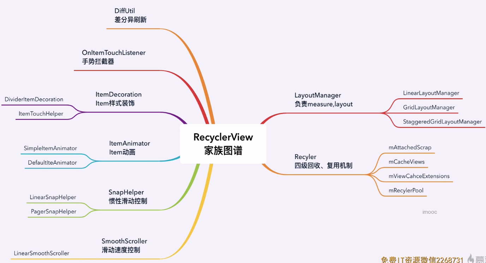

## 复用机制

### Recycler回收池

```java
public final class Recycler { 
  //#1 不需要重新bindViewHolder 
  ArrayList mAttachedScrap;//存储的是原封不动的Viewhodler
  ArrayList mChangedScrap;//存储的是发生了变化的ViewHolder

  //#2 可通过setItemCacheSize调整，默认大小为2
  // 需要进行位置一致性校验，重新划入屏幕的相同位置的viewholer也不需要重新绑定数据
  ArrayList mCachedViews;

  //#3 自定义拓展View缓存
  ViewCacheExtension mViewCacheExtension;

  //#4 根据viewType存取ViewHolder，
  // 可通过setRecycledViewPool调整,每个类型容量默认为5
  RecycledViewPool mRecyclerPool; 
}
```


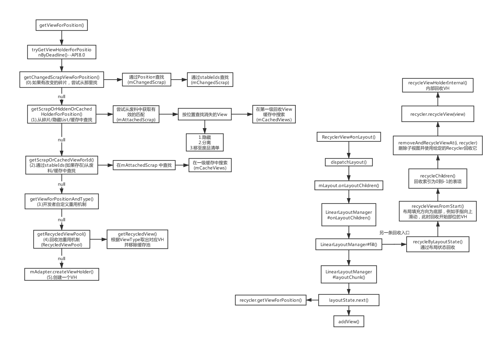

## 回收机制

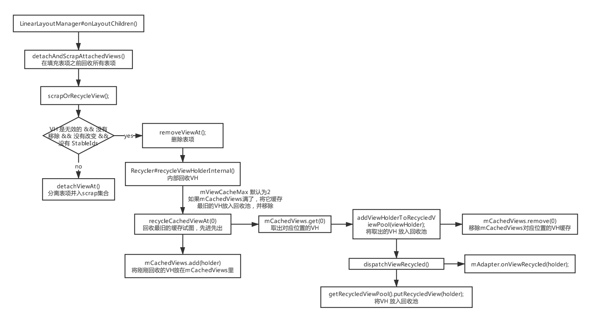

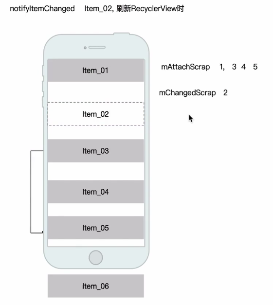

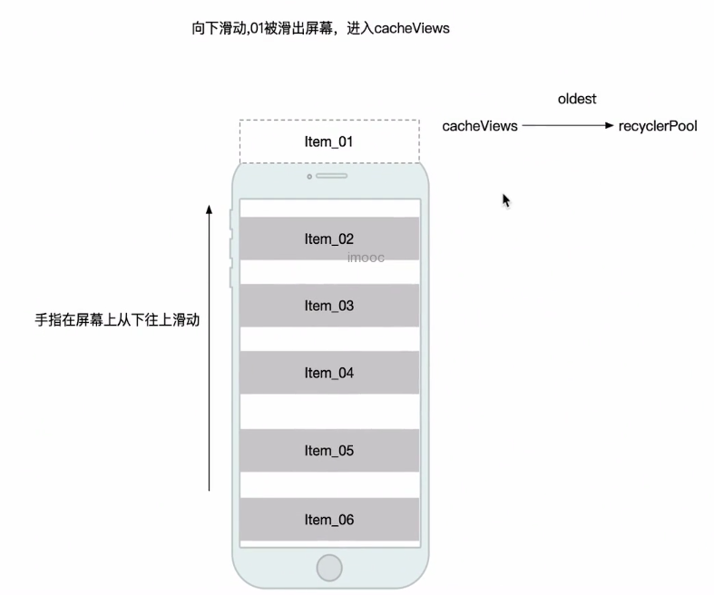

## RecyclerView的缓存结构

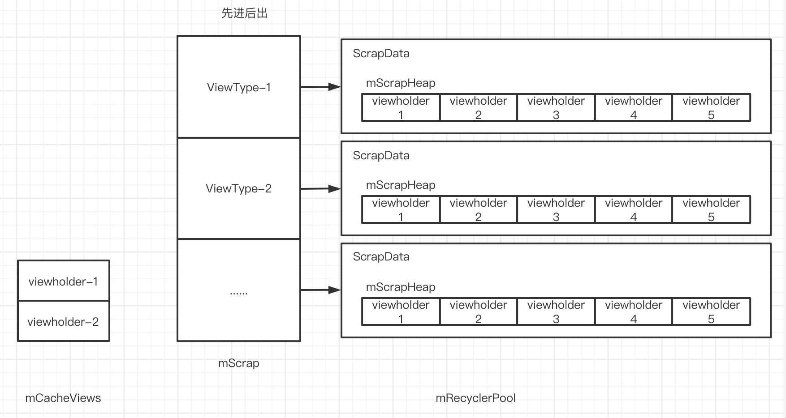

### 示例结构说明

RecyclerView在设计的时候讲上述5个缓存对象分为了3级。`每次创建ViewHolder的时候，会按照优先级依次查询缓存创建ViewHolder。每次讲ViewHolder缓存到Recycler缓存的时候，也会按照优先级依次缓存进去`。三级缓存分别是：

- 一级缓存：返回布局和内容都都有效的ViewHolder
  - 按照position或者id进行匹配
  - `命中一级缓存无需onCreateViewHolder和onBindViewHolder`
  - mAttachScrap在adapter.notifyXxx的时候用到
  - mChanedScarp在每次View绘制的时候用到，因为getViewHolderForPosition非调用多次，后面将
  - mCachedView：用来解决滑动抖动的情况，默认值为2
- 二级缓存：返回View
  - 按照position和type进行匹配
  - 直接返回View
  - 需要自己继承ViewCacheExtension实现
  - 位置固定，内容不发生改变的情况，比如说Header如果内容固定，就可以使用
- 三级缓存：返回布局有效，内容无效的ViewHolder
  - 按照type进行匹配，每个type缓存值默认=5
  - layout是有效的，但是内容是无效的
  - `多个RecycleView可共享`,可用于多个RecyclerView的优化 

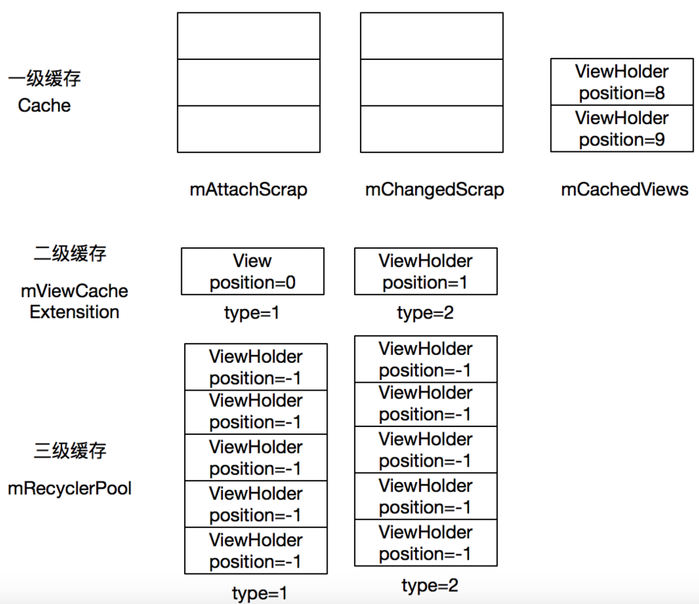

（1）由于ViewCacheExtension在实际使用的时候较少用到，因此本例中忽略二级缓存

（2）mChangedScrap和mAttchScrap是RecyclerView内部控制的缓存，本例暂时忽略。

（3）为了简化问题，暂时不考虑PreFetch的情况

（4）图片解释：

- RecyclerView包含三部分：已经出屏幕，在屏幕里面，即将进入屏幕，我们滑动的方向是向上
- RecyclerView包含三种Type：1，2，3。屏幕里面的都是Type=3
- 红色的线代表已经出屏幕的ViewHoder与Recycler的交互情况
- 绿色的线代表，即将进入屏幕的ViewHoder进入屏幕时候，ViewHolder与Recycler的交互情况
- 紫色的线代表mCacheView进入缓存池的情况

## 四级缓存说明

| 缓存级别 | 实际变量                        | 含义                                                         |
| -------- | :------------------------------ | :----------------------------------------------------------- |
| 一级缓存 | mAttachedScrap`和`mChangedScrap | 这是优先级最高的缓存，`RecyclerView`在获取`ViewHolder`时,优先会到这两个缓存来找。其中`mAttachedScrap`存储的是当前还在屏幕中的`ViewHolder`，`mChangedScrap`存储的是数据被更新的`ViewHolder`,比如说调用了`Adapter`的`notifyItemChanged`方法。可能有人对这两个缓存还是有点疑惑，不要急，待会会详细的解释。 |
| 二级缓存 | mCachedViews                    | 默认大小为2，通常用来存储预取的`ViewHolder`，同时在回收`ViewHolder`时，也会可能存储一部分的`ViewHolder`，这部分的`ViewHolder`通常来说，意义跟一级缓存差不多。 |
| 三级缓存 | ViewCacheExtension              | 自定义缓存通常用不到，先忽略                                 |
| 四级缓存 | RecyclerViewPool                | 根据`ViewType`来缓存`ViewHolder`，每个`ViewType`的数组大小为5，可以动态的改变。 |

> - `mAttachedScrap`：上表中说，它表示存储的是当前还在屏幕中`ViewHolder`。实际上是从屏幕上分离出来的`ViewHolder`，但是又即将添加到屏幕上去的`ViewHolder`。比如说，`RecyclerView`上下滑动，滑出一个新的`Item`，此时会重新调用`LayoutManager`的`onLayoutChildren`方法，从而会将屏幕上所有的`ViewHolder`先`scrap`掉(含义就是废弃掉)，添加到`mAttachedScrap`里面去，然后在重新布局每个`ItemView`时，会从优先`mAttachedScrap`里面获取，这样效率就会非常的高。这个过程不会重新`onBindViewHolder`。
>
> - `mCachedViews`：默认大小为2，不过通常是3，3由默认的大小2 + 预取的个数1。所以在`RecyclerView`在首次加载时，`mCachedViews`的`size`为3(这里以`LinearLayoutManager`的垂直布局为例)。通常来说，可以通过`RecyclerView`的`setItemViewCacheSize`方法设置大小，但是这个不包括预取大小；预取大小通过`LayoutManager`的`setItemPrefetchEnabled`方法来控制。

### ViewHolder的几个状态值

我们在看`RecyclerView`的源码时，可能到处都能看到调用`ViewHolder`的`isInvalid`、`isRemoved`、`isBound`、`isTmpDetached`、`isScrap`和`isUpdated`这几个方法。

| **方法名**    | **对应的Flag**                                          | **含义或者状态设置的时机**                                   |
| ------------- | ------------------------------------------------------- | ------------------------------------------------------------ |
| isInvalid     | FLAG_INVALID                                            | 表示当前`ViewHolder`是否已经失效。通常来说，在3种情况下会出现这种情况：1.调用了`Adapter`的`notifyDataSetChanged`方法；2. 手动调用`RecyclerView`的`invalidateItemDecorations`方法；3. 调用`RecyclerView`的`setAdapter`方法或者`swapAdapter`方法。 |
| isRemoved     | FLAG_REMOVED                                            | 表示当前的`ViewHolder`是否被移除。通常来说，数据源被移除了部分数据，然后调用`Adapter`的`notifyItemRemoved`方法。 |
| isBound       | FLAG_BOUND                                              | 表示当前`ViewHolder`是否已经调用了`onBindViewHolder`。       |
| isTmpDetached | FLAG_TMP_DETACHED                                       | 表示当前的`ItemView`是否从`RecyclerView`(即父`View`)`detach`掉。通常来说有两种情况下会出现这种情况：1.手动了`RecyclerView`的`detachView`相关方法；2. 在从`mHideViews`里面获取`ViewHolder`,会先`detach`掉这个`ViewHolder`关联的`ItemView`。 |
| isScrap       | 无Flag来表示该状态，用`mScrapContainer`是否为null来判断 | 表示是否在`mAttachedScrap`或者`mChangedScrap`数组里面，进而表示当前`ViewHolder`是否被废弃。 |
| isUpdated     | FLAG_UPDATE                                             | 表示当前`ViewHolder`是否已经更新。通常来说，在3种情况下会出现情况：1.`isInvalid`方法存在的三种情况；2.调用了`Adapter`的`onBindViewHolder`方法；3. 调用了`Adapter`的`notifyItemChanged`方法 |


## 实例分析

### 出屏幕时候的情况-mCacheViews未满

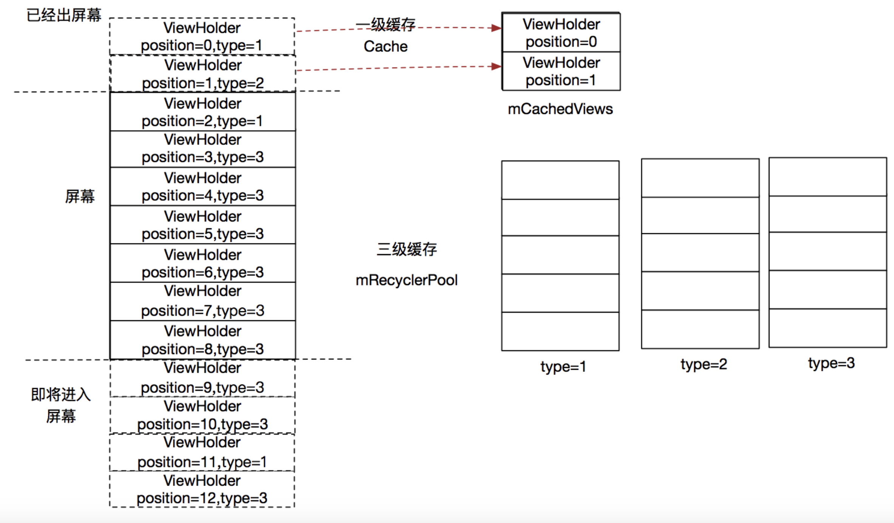

1. 当ViewHolder（position=0，type=1）出屏幕的时候，由于mCacheViews是空的，那么就直接放在mCacheViews里面（从0-N是由老到新）。此时ViewHolder在mCacheViews里面布局和内容都是有效的，因此可以直接复用。
2. ViewHolder（position=1，type=2）同步骤1

### 出屏幕时候的情况-mCacheViews已经满

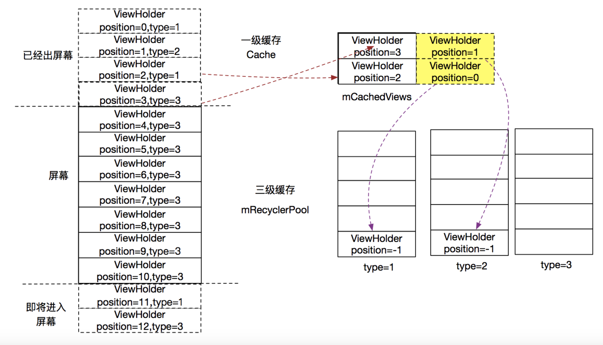

1. 当ViewHolder（position=2，type=1）出屏幕的时候由于一级缓存mCacheViews已经满了，因此然后移除mCacheViews里面最老的ViewHolder(position=0,type=1)到RecyclePool中，然后将ViewHolder（position=2，type=1）存入mCacheViews。此时被移除到RecyclePool的ViewHolder的内容会被标记为无效，当其复用的时候需要再次通过Adapter.bindViewHolder来绑定内容。
2. ViewHolder（position=3，type=3）同步骤3

### 进屏幕时候的情况

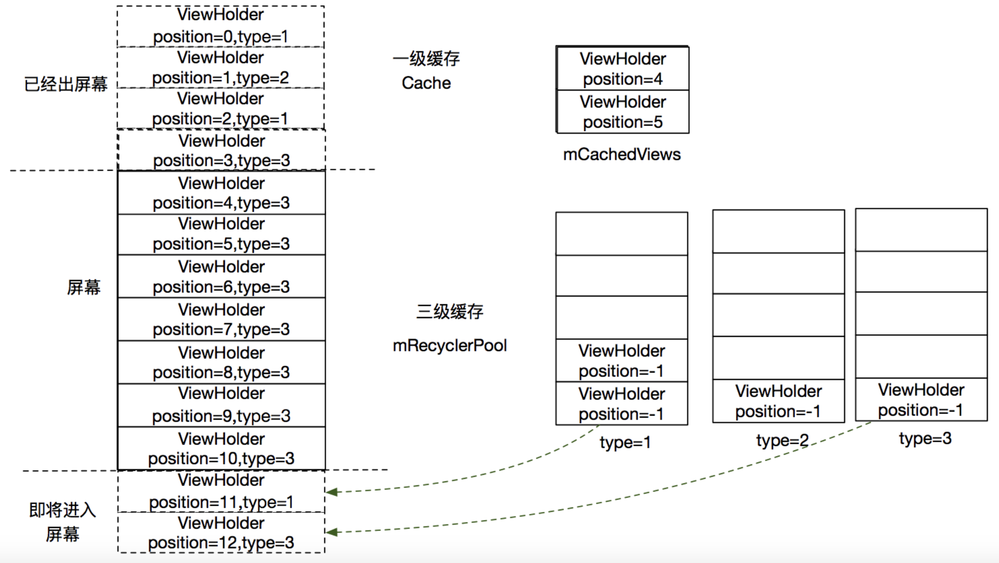

1. 当ViewHolder（position=3，type=3）进入屏幕绘制的时候，由于Recycler的mCacheViews里面找不到position匹配的View，同时RecyclerPool里面找不到type匹配的View，因此，其只能通过adapter.createViewHolder来创建ViewHolder，然后通过adapter.bindViewHolder来绑定内容。
2. 当ViewHolder（position=11，type=1）进入屏幕的时候，发现ReccylerPool里面能找到type=1的缓存，因此直接从ReccylerPool里面取来使用。由于内容是无效的，因此还需要调用bindViewHolder来绑定布局。同时ViewHolder（position=4，type=3）需要出屏幕，会经历步骤3回收的过程
3. ViewHolder（position=12，type=3）同步骤6

### 屏幕往下拉ViewHoder（position=1）进入屏幕的情况

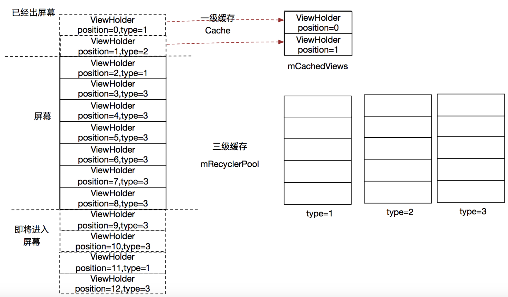

1. 由于mCacheView里面的有position=1的ViewHolder与之匹配，直接返回。由于内容是有效的，因此无需再次绑定内容
2. ViewHolder（position=0）同步骤8

### 参考

[RecyclerView缓存原理，有图有真相](https://juejin.im/post/6844903661726859271) 

[RecycleView的缓存机制](https://blog.csdn.net/yoonerloop/article/details/84727902) 

[RecyclerView 源码分析(三) - RecyclerView的缓存机制](https://www.jianshu.com/p/efe81969f69d)


## RecyclerView性能优化

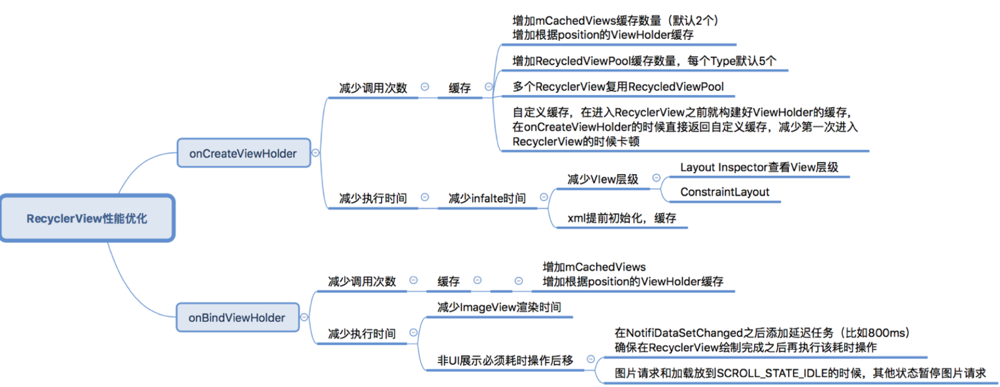

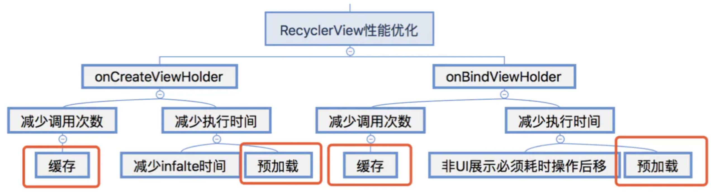

>尽量指定RecyclerView和Item的宽高
>
>尽量使用定向刷新notifyItemChanged

## RecyclerView基础（上）

[链接](https://www.cnblogs.com/dasusu/p/9159904.html)

阅读须知：

- 本篇力求列举 RecyclerView 所有功能的使用示例，由于篇幅原因，并不会将实现代码全部贴出，只贴出关键部分的代码。
- 本篇所使用的 RecyclerView 的版本是 26.0.0。
- 下列标题中，但凡是斜体字，表示该知识点目前暂时没理清楚，留待后续继续补充。
- 第 6 章至第 9 章内容在下篇：[关于RecyclerView你知道的不知道的都在这了（下）](https://www.jianshu.com/p/311df8be8633)

### 1. LayoutManager

参考：

[打造属于你的LayoutManager](https://blog.csdn.net/huachao1001/article/details/51594004)

[RecyclerView系列之四实现回收复用](https://blog.csdn.net/harvic880925/article/details/84866486)

RecyclerView 的 support 包里默认提供了三个 LayoutManager，分别是下列三个，可用于实现大部分场景的布局需求：线性布局、网格布局、瀑布流布局等等。

#### 1.1 LinearLayoutManager

线性布局，用它可以来实现横竖自由切换的线性布局，先来看看它的构造函数：

```java
public class LinearLayoutManager extends RecyclerView.LayoutManager implements ItemTouchHelper.ViewDropHandler, RecyclerView.SmoothScroller.ScrollVectorProvider {
    
    public LinearLayoutManager(Context context) {
        this(context, VERTICAL, false);
    }

    public LinearLayoutManager(Context context, int orientation, boolean reverseLayout) {
        ...
    }

    public LinearLayoutManager(Context context, AttributeSet attrs, int defStyleAttr, int defStyleRes) {
        ...
    }
}
```

总共三个，我们分别来看看它们各自的使用场景：

- **第一个构造函数**

```java
//用法(在Activity里初始化控件后)：
LinearLayoutManager layoutManager = new LinearLayoutManager(this);
mRecyclerView.setLayoutManager(layoutManager);
```

很简单，这种时候默认就是竖直方向的线性布局，效果图：

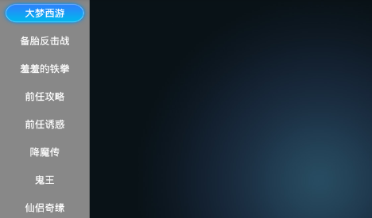

竖直LinearLayoutManager示例.png

在 Tv 应用中，这种竖直方向的 LinearLayoutManager 使用场景大多都是用于显示菜单项，使用频率并不是特别高，但在手机应用中，这种的使用频率算是特别高的了，几乎每个 app 都会有竖直方向的滑动列表控件。

- **第二个构造函数**

```java
//用法(在Activity里初始化控件后)：
//第二个参数就是用于指定方向是竖直还是水平，第三个参数用于指定是否从右到左布局，基本都是false，我们的习惯都是左到右的排列方式
LinearLayoutManager layoutManager = new LinearLayoutManager(this, LinearLayoutManager.HORIZONTAL, false);
mRecyclerView.setLayoutManager(layoutManager);
```

第二个参数就是用于指定方向是竖直还是水平，第三个参数用于指定是否从右到左布局，基本都是false，我们的习惯都是左到右的排列方式，来看看效果：


水平LinearLayoutManager.png

在 Tv 应用中，这种布局就比较常见了，常见的还有网格布局，多行布局等等；而在手机应用中，水平滑动的列表控件也还是有，但会比竖直的少见一些。

- **第三个构造函数**

```xml
//xml文件：
<android.support.v7.widget.RecyclerView
        android:id="@+id/recycler_main"
        android:layout_width="wrap_content"
        android:layout_height="wrap_content"
        android:orientation="horizontal"
        app:layoutManager="LinearLayoutManager"
        />
```

这种方式基本没见过吧，我也是看了 LinearLayoutManager 源码的构造函数，才发现，原来还有这种方式，可以直接在 xml 布局文件中指定 RecyclerView 的 LayoutManager，这时候，android:orientation 就是用来指定 LinearLayoutManager 的布局方向了。

那么使用这种 xml 方式时，还有哪些属性可以配置呢？直接去看对应的 LayoutManager 的源码就清楚了，比如：

```java
    //LinearLayoutManager.java
    /**
     * Constructor used when layout manager is set in XML by RecyclerView attribute
     * "layoutManager". Defaults to vertical orientation.
     *
     * @attr ref android.support.v7.recyclerview.R.styleable#RecyclerView_android_orientation
     * @attr ref android.support.v7.recyclerview.R.styleable#RecyclerView_reverseLayout
     * @attr ref android.support.v7.recyclerview.R.styleable#RecyclerView_stackFromEnd
     */
    //上面是源码的注释，当在 xml 中通过 app:layoutManager="LinearLayoutManager" 之后，那么此时就还可以再使用三个属性来配置 LinearLayoutManager,如下：
    //android:orientation="horizontal"
    //app:reverseLayout="false"
    //app:stackFromEnd="false"
    public LinearLayoutManager(Context context, AttributeSet attrs, int defStyleAttr,int defStyleRes) {
        Properties properties = getProperties(context, attrs, defStyleAttr, defStyleRes);
        setOrientation(properties.orientation);
        setReverseLayout(properties.reverseLayout);
        setStackFromEnd(properties.stackFromEnd);
        setAutoMeasureEnabled(true);
    }
```

另外两个 LayoutManager 同理。

以上，仅仅就是 LinearLayoutManager 支持的布局样式，我们只需要设置布局方向后，其他都不用管了。那么，LinearLayoutManager 是否还有提供其他一些可选功能来让我们使用呢？接下去就一起再看看：

- **setOrientation()**

用于设置布局方向，如果不通过构造函数来指定，也可以通过该方法指定，就两个值：
 LinearLayoutManager.HORIZONTAL
 LinearLayoutManager.VERTICAL

- **findFirstCompletelyVisibleItemPosition()**
- **findFirstVisibleItemPosition()**
- **findLastCompletelyVisibleItemPosition()**
- **findLastVisibleItemPosition()**


findItem示例.png


findItem日志.png

上述四个方法作用从方法命名就可以很直观的理解了，但有些**细节需要注意**一下：

两个查找全部可见的 item 方法并不是我们正常意义上的全部可见，而是指在布局方向上是否已全部可见。说得白点，如果是 HORIZONTAL 水平样式，如上图，那么它只会去计算左右方向上是否全部可见来判定，比如我们特意在代码中通过 layout_marginTop="-100dp" 来将控件移出屏幕一部分，如下：


部分可见.png

此时，按照我们正常意义上来理解是没有一个 item 处于全部可见的，因为每个 item 的上半部分都被移出屏幕了。但是调用那两个查找全部可见的 item 方法，仍然会返回 0 和 4，因为它只去判断水平方向是否全部可见。

findFirst 就是判断左边第一个 item 的左边界是否可见，findLast 就是判断右边最后一个 item 的右边界是否可见。如果布局方向是竖直的，那么同样的道理。这点细节需要注意一下。

还有另外两个查找第一个或最后一个可见的 item 方法也有个细节需要注意一下，如果这个 item 是有设置了 ItemDecoration，那么如果 ItemDecoration 这部分区域是可见的，也会判定该 item 是可见的。

- **setRecycleChildrenOnDetach()**

```java
    /**
     * Set whether LayoutManager will recycle its children when it is detached from
     * RecyclerView.
     * <p>
     * If you are using a {@link RecyclerView.RecycledViewPool}, it might be a good idea to set
     * this flag to <code>true</code> so that views will be available to other RecyclerViews
     * immediately.
     * <p>
     * Note that, setting this flag will result in a performance drop if RecyclerView
     * is restored.
     *
     * @param recycleChildrenOnDetach Whether children should be recycled in detach or not.
     */
    public void setRecycleChildrenOnDetach(boolean recycleChildrenOnDetach) {
        mRecycleChildrenOnDetach = recycleChildrenOnDetach;
    }
```

先来看看源码注释，注释里说了，这个方法是用来设置，当它（LinearLayoutManager）从 RecyclerView 上面 detached 时是否要回收所有的 item。而且，它还建议我们，如果我们项目里有复用 RecyclerViewPool 的话，那么开启这个功能会是一个很好的辅助，它可以将这些 item 回收起来给其他 RecyclerView 用。最后，还指明了一点，开启这个功能的话，当 RecyclerView 恢复时，也就是从 detached 又变回 attached，那么会消耗一定的性能来绘制。

有**两种场景**会导致 LinearLayoutManager 从 RecyclerView 上被 detached，一种是：`setLayoutManager()`，而另外一种是：RecyclerView 从视图树上被 remove 掉。

但经过测试（你也可以去看源码），`setLayoutManager()` 时，如果之前有设置过 LayoutManger，那么内部会自动先去将之前 LayoutManager 的所有 item 回收，然后再给新的 LayoutManager 复用。此时，这个方法并没有什么卵用。

也就是说，上面说了有两种场景会触发到该方法开启的回收工作，但实际上，第一种场景内部默认的工作中就包含了回收工作，那么有没有通过这个方法来开启并没有任何影响。只有第二种场景下，要不要去处理回收工作才是由该方法来控制。

所以我怀疑是不是 Google 工程师太懒了，没有同步更新这个方法的注释。注释的第一句 when 后面应该改成：

```csharp
Set whether LayoutManager will recycle its children when RecyclerView is detached from Window.
```

我觉得这样才比较合理一点，但纯属个人观点哈，也许是我某个地方理解错了。

**那么这个方法开启的回收工作到底有什么使用场景呢？**

这类场景还是有的，我举个例子，比如当前页面是通过 ViewPager + Fragment 来实现的，每个 Fragment 里又有 RecyclerView 控件，那么如果当页面布局信息需要更新时，有时候是直接暴力的通过 ViewPager 的 `setAdapter()` 来刷新，那么此时，旧的 fragment 其实就全被移除掉了，然后 new 了新的 fragment 绘制新的布局信息。

这样，新的 fragment 里新的 RecyclerView 的 item 就又需要全部重新创建了，如果用这个方法开启了回收工作，那么当旧的 fragment 被移除时会触发到 RecyclerView 的 detachedFromWindow 的回调，那么此时这个回收工作就会去将 item 回收到 RecyclerViewPool 中，如果新的 fragment 里的 RecyclerView 复用了这个 RecyclerViewPool，就可以省掉重新创建 item 的消耗，达到直接复用 item 的效果。

小结一下，其实也就是 RecyclerView 有更换新的实例对象时，这个方法开启的回收工作是有一定的好处的。但如果同一个 RecyclerView 实例对象存在从 attached 到 detached 又到 attached 的场景，默认没有开启回收工作时，由于 item 一直都附着在 RecyclerView 上，所以当重新 attached 时就可以直接显示出来了。但如果用该方法开启了回收工作，等于是要重新在 onBind 一次了，这点也是在注释中有提到的。

所以，这是一把双刃剑，有好有坏，有符合的场景下再去开启使用吧。

- ***RecyclerView 内嵌 RecyclerView\***

另外，LayoutManager 里还有许多 public 的接口，这些方法涉及的方面是 RecyclerView 内嵌 RecyclerView 的场景，比如：
 `collectInitialPrefetchPositions()`
 `setInitialPrefetchItemCount()`
 等等，但目前还没搞懂这些相关方法的用法及效果，等待后续补充。

#### 1.2 GridLayoutManager

网格样式的布局管理器，同样，先来看看它的构造函数：

```java
//注意看，GridLayoutManager 是继承的 LinearLayoutManger 的
public class GridLayoutManager extends LinearLayoutManager {  
    
    public GridLayoutManager(Context context, AttributeSet attrs, int defStyleAttr, int defStyleRes) {
        super(context, attrs, defStyleAttr, defStyleRes);
        ...
    }

    public GridLayoutManager(Context context, int spanCount) {
        super(context);
        setSpanCount(spanCount);
    }

    public GridLayoutManager(Context context, int spanCount, int orientation, boolean reverseLayout) {
        super(context, orientation, reverseLayout);
        setSpanCount(spanCount);
    }   
}
```

GridLayoutManager 继承自 LinearLayoutManager， 并在它的继承上补充了 spanCount 的概念，也就是说 LinearLayoutManager 是只支持线性布局，要么一行，要么一列。而 GridLayoutManager 补充了 spanCount 概念后，支持多行或者多列，这就是网格布局了。

使用方面跟 LinearLayoutManager 基本一样，只是在构造函数内需要多传一个 spanCount 参数，来指定多少行或多少列，来看看效果图：

- 2 行

```java
GridLayoutManager gridLayoutManager = new GridLayoutManager(this, 2, LinearLayoutManager.HORIZONTAL, false);
mRecyclerView.setLayoutManager(gridLayoutManager);
```


两行.png

- 4 列

```cpp
GridLayoutManager gridLayoutManager = new GridLayoutManager(this, 4);
mRecyclerView.setLayoutManager(gridLayoutManager);
```


四列.png

这种网格布局不管是 Tv 应用还是手机应用都挺常见的，Tv 上经常需要有多行或多列的形式来展示各个卡位信息，而手机上一些类似于九宫格之类的布局也可以用这个实现。

但有一些**细节同样需要注意**一下：

如果指定 HORIZONTAL 样式，即以多行形式进行布局，那么 item 布局的顺序则是以竖直方向来进行，如上图中标注的 item 序号，并且，此时的 RecyclerView 只支持水平方向的滑动，不支持竖直方向。如果指定 VERTICAL 样式，则相反。

其实想想也很容易理解，GridLayoutManager 是继承自 LinearLayoutManager，只是在它基础上补充了 spanCount 概念，滑动的实现还是延用 LinearLayoutManager 的逻辑，那么如果指定水平样式，自然就只有水平方向可滑动。

当设置成水平样式，水平方向可滑动的话，那么水平方向的长度自然就是可根据 item 数量动态增加的，此时自然要按照竖直方向来进行 item 布局，否则还以行为优先的话，哪里知道尽头是哪里，什么时候该换行布局了。

还有一点细节需要注意，当使用 GridLayoutManager 时，RecyclerView 的宽高在 match_parent 和 wrap_content 两种情况下的表现完全不一样，具体表现怎样，有兴趣的可以去试一下，这里就简单举个例子给大伙有个直观印象：

- 4 列，RecycerView 宽高为 wrap_content 模式，item 设置具体宽高数值

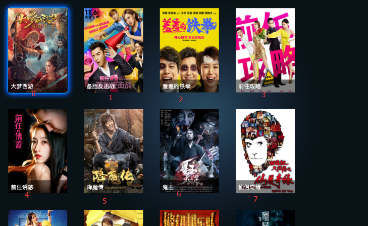

四列.png

- 4 列，RecyclerView 宽高为 match_parent 模式，item 设置具体宽高数值


四列2.png

简单点说，就是在 match_parent 模式下，如果指定了水平样式，那么在竖直方向上，GridLayoutManager 会保证让所有行都显示出来，如果 item 指定了具体宽高，全部显示出来还不足以铺满 RecyclerView，那么会自动将剩余空间平均分配到每个 item 之间的间隙。

如果 RecyclerView 高度不足以让所有行都显示出来，那么就会出现 item 重叠现象。这就是在 match_parent 下的表现，至于 wrap_content 则完全根据 item 设定的宽高来考虑了，不会再有自动分配剩余空间或者 Item 重叠之类的工作了。

所以，使用 GridLayoutManager 时，RecyclerView 的宽高模式需要注意一下。

- **setSpanCount()**

通过构造函数指定了 spanCount 后也还可以继续通过该方法进行修改

- **LinearLayoutManager 的方法**

由于是继承关系，所有 LinearLayoutManager 中的四个  **`findFirstCompletelyVisibleItemPosition()`** 方法一样可以使用，但在 LinearLayoutManager 一节中对这四个方法所讲的注意事项在这里就更加明显了，使用时需要注意一下。

- **setSpanSizeLookup()**

通常情况下，网格布局样式下，每个小格的大小基本都是一样的，但如果我们想实现如下的效果呢：


网格示例.png

区别于常见的网格布局，这里有的小格就占据了多个网格，这种效果就可以通过该方法来实现了。

上述布局是设定了 HORIZONTAL 水平方向的 GridLayoutManager，并且设定为 3 行，默认情况下每个 item 占据一个小格，按照竖直方向依次布局。

通过 `setSpanSizeLookup()` 方法就可以自定义为每个 item 指定它在竖直方向要占据多少个小格，最多不超过设定的行数，上述例子中每个 item 最多就只能占据 3 行的高度。如果在该列的剩余空间不足 item 设定占据的行数，那么会将该列剩余的空间空闲出来，将该 item 移到下列进行布局。

同样的道理，当设定为 VERTICAL 竖直方向的样式时，那么可以自定义为每个 item 设定要占据的列数，最多不超过指定的列数。

**示例**：

```java
GridLayoutManager gridLayoutManager = new GridLayoutManager(this, 3, LinearLayoutManager.HORIZONTAL, false);
//自定义item占据的小格大小时需要重写 getSpanSize()，返回值就是占据的小格数量
gridLayoutManager.setSpanSizeLookup(new GridLayoutManager.SpanSizeLookup() {
    @Override
    public int getSpanSize(int position) {    
        //以下代码仅为上图示例为写，具体场景中应该根据需求具体编写
        if (position == 3) {
            return 2;
        }
        if (position == 7) {
            return 3;
        }
         return 1;
    }
    
    //这个方法也很重要，但我还没搞清楚它的具体效果，从注释上来看，该方法是用于指定 item 在该行或该列上具体哪个位置，比如将GridLayoutManager设置为3行水平样式，那么第1个卡位就是在第一列的 0 位置，第2个卡位 1，一次类推。但该方法具体被调用的场景还没理清
    @Override
    public int getSpanIndex(int position, int spanCount) {
          return super.getSpanIndex(position, spanCount);
    }
});
//官方建议说，如果延用默认的 getSpanIndxe() 的实现逻辑的话，那么建议调用下述方法来进行优化，否则每次布局计算时会很耗性能。 
gridLayoutManager.getSpanSizeLookup().setSpanIndexCacheEnabled(true);
mRecyclerView.setLayoutManager(gridLayoutManager);
```

虽然提供了该方法让网格布局可以更加多样化布局，但仍然**无法满足一些场景**，比如当设定为多行的样式时，此时就只支持自定义每个 item 占据的行数，只有行数！也就是说，所有的卡位顶多只会在高度方面不一样，同一列的卡位的宽度都是一样的。那么，如果需求是五花八门的网格布局，每个卡位都有可能占据多行的情况下又占据多列，用这个就没法实现了。

#### 1.3 StaggeredGridLayoutManager

英文直译过来是：交错式的网格布局管理者，不过我还是喜欢网上大伙的说法：瀑布流。

首先，也还是来看看它的构造方法：

```java
public class StaggeredGridLayoutManager extends RecyclerView.LayoutManager implements RecyclerView.SmoothScroller.ScrollVectorProvider {  
    
    public StaggeredGridLayoutManager(Context context, AttributeSet attrs, int defStyleAttr, int defStyleRes) 		{
        ...
    }

    public StaggeredGridLayoutManager(int spanCount, int orientation) {
        ...
    }
}
```

只有两个构造方法，第一个跟 LinearLayoutManager 一样，用于在 xml 布局文件中直接指定 LayoutManager 时用的。

第二个构造方法才是我们经常使用它的入口，两个参数，说白点就是用来设置成多行的瀑布流或者多列的瀑布流样式。

这里顺便提一点不怎么重要的，注意到没有，这里的构造方法是不需要 Context，那么为啥另外两个 LayoutManager 却需要呢？它们之间有什么不同么？

哈哈哈，答案是没啥不同，LinearLayoutManager 实际上也是不需要 Context 的，看看它的源码就会发现它根本没使用这个参数，可能是早期版本有需要用到，然后新版不需要了，为了让开发者兼容旧代码，就一直留着的吧。

- **竖直方向瀑布流**

```cpp
StaggeredGridLayoutManager staggeredGridLayoutManager = new StaggeredGridLayoutManager(3, StaggeredGridLayoutManager.VERTICAL);
mRecyclerView.setLayoutManager(staggeredGridLayoutManager);
```


瀑布流.png

瀑布流的样式在手机应用上比较常见，尤其图片查看相关的应用，在 Tv 应用上这种瀑布流布局就比较少见了。

瀑布流的方向可以选择水平或者竖直，两者只是方向上的区别而已，水平方向的效果图就不贴了。

有点**细节需要注意**一下，瀑布流样式在布局 item 时，并不是说一定按照某个方向某个顺序来布局。当设定为竖直方向时，以水平方向为顺序，寻找水平方向上最靠近顶端的位置来布局 item，所以并不是说一定按照第 1 列、第 2 列、第 3 列这种顺序来布局。

- **瀑布流样式和网格样式的区别**

也许有人会疑惑，瀑布流就是设置下几行或者几列，然后设定下方向而已。网格样式时不也一样是设置下几行或几列，也一样是要再设置个方向。那么为什么瀑布流不可以直接用网格样式来实现呢？它们两者有什么区别么？

有去尝试过的就清楚了，这是两种完全不一样的布局样式。下面以两者都设置为竖直方向多列的样式来区分：

1. 网格样式每一行中的所有 item 高度是一致的，不同行可以不一样，但同行的都是一样的，因此它就实现不了瀑布流的样式了；瀑布流所有的 item 高度都允许不一样，所有能实现瀑布流样式。
2. 网格样式支持 item 占据多列的宽度；瀑布流支持 item 占据总列数的宽度，不支持只占据其中几列。
3. 当设置为水平方向样式时，以上结论中行列对调，宽度高度对调。

- **setFullSpan()**

该方法是 StaggeredGridLayoutManager 内部类 LayoutParams 的方法，用这个方法可以设置 item 是否要占据总宽度或总高度，当瀑布流中有某个 item 需要横穿的场景时，可以使用这个方法，效果如下：


瀑布流示例.png

- **setOrientation()**
- **setSpanCount()**

不解释，上面两个 LayoutManager 中介绍过了。

- **findFirstCompletelyVisibleItemPositions()**
- **findFirstVisibleItemPositions()**
- **findLastCompletelyVisibleItemPositions()**
- **findLastVisibleItemPositions()**

作用跟 LinearLayoutManager 的一样，但有些许区别，因为这里需要传入 int[] 类型的参数，返回的结果也是 int[] 类型的。

就以上上图的布局为例，来看下打出来的日志：


日志.png

得到的结果是个数组，数组的大小就是构造方法中传入的 spanCount。

简单点说，上面四个方法的作用，是以每行或每列为单位来寻找相对应的首个（末个）可见或完全可见的 item。

**为什么要这么做呢？**

我想了想，还是想不出比较合理的解释，大概硬套了下，感觉也许是因为瀑布流的布局下是没办法确定 item 的大小的，如果还像 LinearLayoutManager 只寻找首个或末个完全可见的 item 时，也许它并不是处于当前屏的最顶部或最底部，就像上图日志中的 position=7 的 item，它虽然是最后完全可见的 item，但并不是位于最底部，最底部是 6 的 item。

在这种场景下，如果我们的需求是要找到处于最底部的 item 时，如果还只是像 LinearLayoutManager 只寻找最后完全可见的 item 时，就没办法做到了。那么，如果你想说，那干脆将寻找最后一个完全可见 item 改成寻找位于最底部的完全可见的 item，不就好了。那如果这时我的需求是要寻找最后一个 item 而不是最底部的呢？

所以，瀑布流它直接以每行或每列为单位，将该行/列的首（末）个可见或完全可见的 item 信息都全部给我们，我们需要哪些数据，是最后一个，还是最底部一个，就自行去处理这些信息好了。

以上，纯属个人观点。

- ***setGapStrategy()\***
- ***invalidateSpanAssignments()\***

这两个方法还没理清它们是干嘛用的，网上有资料说是用于解决滑动时 item 自动变换位置以及顶部留白问题，但我不是很清楚，后续有时间再继续查证。

### 2. ViewHolder

ViewHolder 大伙也不陌生了，但没想到我会单独开个小节来讲吧，也是，平时使用时顶多就是继承它，然后重写一下构造方法而已，但其实，它本身携带着很多信息，利用得当的话，可以方便我们处理很多事情。

- **getAdapterPosition()**
- **getLayoutPosition()**

将这两个放在一起讲，因为这两个很类似，不理清它们之间的区别的话，很容易搞乱，源码中的注释其实已经说得很清楚了。

在大部分场景下，这两个的值都是一样的，但在涉及到刷新时，由于 Android 是每隔 16.6 ms 刷新一次屏幕，如果在某一帧开始时，adapter 关联的数据源发生的变化，item 被移除或者新增了，我们一般都会调用 `notifyDataSetChanged()` 或者 `notifyItem系列()` 方法来刷新，但 RecyclerView 会直到下个帧来的时候才会去刷新界面。

那么，从调用了 `notifyDataSetChanged()` 到界面刷新这之间就会存在一定的时间差，在这段时间内，数据源与界面呈现的 Item 就不是一致性的了，如果这时候有需要区分实际数据源的 Item 和界面呈现 Item 的需求，那么这两个方法就派上用场了。

`getLayoutPosition()`：返回的一直是界面上呈现的 Item 的位置信息，即使某个 Item 已经从数据源中被移除。

`getAdapterPosition()`：当数据源发生变化，且界面已经刷新过后即 `onBindViewHolder()` 已经被调用了后，返回的值跟 `getLayoutPosition()` 一致；但当数据源发生变化，且在 `onBindViewHolder()` 被调用之前，如果调用了 `notifyDataSetChanged()`, 那么将返回无效的位置标志 -1；如果调用了 `notifyItem系列()`，那么将返回 Item 在数据源中的位置信息。

**示例场景：**

```java
mDataList.remove(0);
//1. 场景1
mAdapter.notifyDataSetChanged();
logPosition();

//2. 场景2
mAdapter.notifyItemRemove(0);
logPosition();

//3. 场景3
mAdapter.notifyItemRemove(0);
mRecyclerView.post(new Runnable() {
    @Override
    public void run() {
        logPosition();
    }
})

private void logPosition() {
    for (int i = 0; i < mRecyclerView.getChildCount(); i++) {
        View view = mRecyclerView.getChildAt(i);
        int layPosi = mRecyclerView.findContainingViewHolder(view).getLayoutPosition();
        int adapterPosi = mRecyclerView.findContainingViewHolder(view).getAdapterPosition();
        int oldPosi = mRecyclerView.findContainingViewHolder(view).getOldPosition();
        LogUtils.d(TAG, "getLayoutPosition = " + layPosi);
        LogUtils.d(TAG, "getAdapterPosition = " + adapterPosi);
    }
}
```

**场景1：**由于数据源发生变化后，调用了 `notifyDataSetChanged()`，在这之后马上去遍历界面上的 Item 元素，分别输出 ViewHolder 的几个方法，那么打日志的时间点肯定是在界面刷新之前，所以可以看到这些方法的区别：

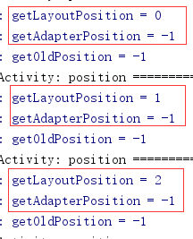

场景1日志.png

0 position 的 Item 明明已经从数据源中被移除掉了，但由于日志打印的时机是在界面刷新之前，因此可以看到通过 `getLayoutPosition()` 获取到的是界面上还未刷新之前的 Item 的信息，而由于是调用了 `notifyDataSetChanged()` 去通知，因此 `getAdapterPosition()` 对于所有 Item 都返回无效的位置标志 -1。

**场景2：**同理，这次也是在数据源发生变化，界面刷新之前就去打印日志了，但是是通过 `notifyItemRemove()` 通知，这个时候 `getAdapterPosition()` 方法返回的值跟上面就有所差别了：

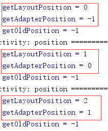

场景2日志.png

由于这次是通过 `notifyItemRemove()` 方法来通知的，因此，此时可以通过 `getAdapterPositon()` 来获取到界面还未刷新之前的 Item 的实际在数据源中的 position 信息。position = 0 的 Item 由于已经从数据源中移除，因此返回 -1，之后的所有 Item 位置自动向前移 1 位。

**场景3：**上面讲解时一直强调说，只有在数据源发生变化且界面刷新之前，这两个方法才会有所区别，所以场景 3 就来模拟一下，通过 `mRecyclerView.post()` 的工作由于消息队列的同步屏障机制会被延迟到下一帧的屏幕刷新之后才执行（详情翻看我的历史博客），所以可以来比较下两次日志的区别，你就清楚了：


场景3日志.png

左边的日志是场景 2 所打的日志，右边的日志是场景 3 下的日志。由于场景 3 将日志的执行时机延迟到下一帧的界面刷新之后，所有，可以看到，界面刷新之后，原本的第一个 Item 就被移除掉了。既然界面已经刷新了，那么数据源和界面的呈现其实就是一致的了，所以 `getLayoutPosition()` 返回的值就跟 `getAdapterPosition()` 是一致的了。

**小结：**说得白点，`getLayoutPosition()` 会返回 Item 在界面上呈现的位置信息，不管数据源有没有发生变化，界面是否已刷新，总之你在界面上看到的 Item 在哪个位置，这个方法就会返回那个位置信息，注释里也说了，我们大部分场景下，使用这个方法即可。

`getAdapterPosition()` 的使用场景是，当数据源发生变化，且界面刷新之前，你又需要获取 Item 在数据源中的实际位置时才需要考虑使用该方法。另外，使用该方法时，还要注意你是用哪种 notifyXXX 来通知刷新。这个方法的实际应用场景我还没遇到过，后续有用到再继续补充。

- ***getOldPosition()\***

这个看注释说是用于处理动画时用的，但还没找到相关的场景，也没理解具体有啥样，后续再继续研究。

- **getItemId()**

返回在 adapter 中通过 `getItemId(int position)` 为该 item 生成的 id，没有在 adapter 重写那个方法的话，就返回 RecyclerView.NO_ID。

用途在 adapter 一节讲解。

- **getItemViewType()**

返回在 adapter 中通过  `getItemViewType()` 为该 item 设定的 type，没有在 adapter 重写那个方法的话，默认就是单一类型的 item type。

item type 是用于实现不同 item 样式。

- **setIsRecyclable()**

RecyclerView 最大的特性就是它内部实现了一套高效的回收复用机制，而回收复用是以 ViewHolder 为单位进行管理的，每个 item 都会对应一个 ViewHolder，默认都是会参与进回收复用机制中。

但可以通过该方法来标志该 ViewHolder 不会被回收

### 3. LayoutParams

RecyclerView 自定义了 LayoutParams 内部类，在每个 Item 的 LayoutParams 携带了一些额外的信息，需要的话，我们也可以通过这里来获取这些信息。

```java
public static class LayoutParams extends android.view.ViewGroup.MarginLayoutParams {
    ...
    public boolean viewNeedsUpdate() {...}
    public boolean isViewInvalid() {...}
    public boolean isItemRemoved() {...}
    public boolean isItemChanged() {...}
    public int getViewLayoutPosition() {...}
    public int getViewAdapterPosition() {...}
}
```

公开的接口有以上几个，也就是说，我们可以通过 LayoutParams 获取到 item 的 position 信息、状态信息，是否需要刷新，是否被移除等等。

更多的应用场景留待后续补充。

### 4. Adapter

adapter 大伙肯定是最熟悉的了，写 RecyclerView 打交道最多的也就是 adapter 了，所以一些基本知识我就一笔带过了，本节着重介绍各种可选功能。

- **onCreateViewHolder()**
- **onBindViewHolder()**
- **getItemCount()**
- **RecyclerView.ViewHolder**

以上是写一个 adapter 时必须实现的四点，它们决定了 item 长啥样，填充啥数据，以及有多少个 item，有了这些信息，一个 RecyclerView 列表也就出来了。

- **notifyDataSetChanged()**
- **notifyItemChanged()**
- **notifyItemXXX() 系列**

以上是用于刷新 item，当数据源发生变化时，我们手动去刷新 item。官方说了， item 的更新分两种，一种是数据需要更新，这类刷新不涉及到 item 的位置变化；而另一种属于结构刷新，就是涉及到 item 的位置变化。

使用 **`notifyDataSetChanged()`** 时，它不管你分哪种形式的刷新，强制所有 item 重新绑定数据，重新布局操作。

以上都属于常用的基本功能，一句话带过，下面介绍一些可选功能：

- **onViewRecycled()**
- **onViewAttachedFromWindow()**
- **onViewDetachedFromWindow()**
- **onAttachedToRecyclerView()**
- **onDetachedFromRecyclerView()**

这些方法基本都是 item 或 adapter 的一些生命周期的回调，所以分别来看看每个方法都是什么时候会被回调的，可以用来处理什么场景，做些啥工作：

**`onViewRecycled()`**：当 ViewHolder 已经确认被回收，且要放进 RecyclerViewPool 中前，该方法会被回调。

首先需要明确，RecyclerView 的回收机制在工作时，会先将移出屏幕的 ViewHolder 放进一级缓存中，当一级缓存空间已满时，才会考虑将一级缓存中已有的 ViewHolder 移到 RecyclerViewPool 中去。所以，并不是所有刚被移出屏幕的 ViewHoder 都会回调该方法。

另外，注释中也说了，该方法的回调是在 ViewHolder 放进 RecyclerViewPool 中前，而 ViewHolder 在放进 Pool 中时会被 reset，因为上一节中也说过，其实 ViewHolder 本身携带着很多信息。那么，在该方法回调时，这些信息还没被重置掉，官方建议我们可以在这里释放一些耗内存资源的工作，如 bitmap 的释放。

**onViewAttachedFromWindow()**   

**onViewDetachedFromWindow()**：

RecyclerView 本质上也是一个 ViewGroup，那么它的 Item 要显示出来，自然要 `addView()` 进来，移出屏幕时，自然要 `removeView()` 出去，对应的就是这两个方法的回调。

所以，当 Item 移出屏幕时，`onViewRecycled()` 不一定会回调，但 `onViewDetachedFromWindow()` 肯定会回调。相反，当 Item 移进屏幕内时，另一个方法则会回调。

那么，其实，在一定场景下，可以通过这两个回调来处理一些 Item 移出屏幕，移进屏幕所需要的工作。为什么说一定场景下呢，因为如果调用了 `notifyDataSetChanged()` 的话，会触发所有 Item 的 detached 回调先触发再触发 onAttached 回调。

**onAttachedToRecyclerView()**  

**onDetachedFromRecyclerView()**：

这两个回调则是当 RecyclerView 调用了 `setAdapter()` 时会触发，旧的 adapter 回调 onDetached，新的 adapter 回调 onAttached。

我们同样可以在这里来做一些资源回收工作，更多其他应用场景留待后续补充。

- **registerAdapterDataObserver()**
- **unregisterAdapterDataObserver()**

用于注册监听 `notifyXXX()` 系列方法的事件，当调用了 `notifyXXX()` 系列的方法时，注册监听后就可以接收到回调。

- **setHasStableIds()**
- **getItemId()**

这两方法看注释是说用于回收复用机制中，给 ViewHoler 设置一个唯一的标识符，但具体的使用场景还不清楚，后续有用到，再补充。

另，`setHasStableIds()` 必须在 `setAdapter()` 方法之前调用，否则会抛异常。

### 5. RecyclerView

#### 5.1 addOnItemTouchListener()

咋一看到这个方法，我还以为 RecyclerView 也把 item 的点击事件封装好了，终于不用我们自己去写了呢。看了下源码注释才发现，这个方法的作用是用于根据情况是否拦截触屏事件的分发。先看一下它的参数类型：OnItemTouchListener

```java
public interface OnItemTouchListener {
    boolean onInterceptTouchEvent(RecyclerView rv, MotionEvent e);
    void onTouchEvent(RecyclerView rv, MotionEvent e);
    void onRequestDisallowInterceptTouchEvent(boolean disallowIntercept);
}
```

是不是感觉接口里的方法很熟悉，没错，就是触屏事件分发流程中的拦截和处理的两个方法。

通常我们都说在自定义 View 中重写这几个方法来将触屏事件拦截，交由自己处理。RecyclerView 也是一个 View，如果你有 RecyclerView 需要拦截触屏事件自己处理的需求，那么你可以选择继承 RecyclerView，也可以选择调用这个方法。

#### 5.2 addOnScrollListener()

RecyclerView 是一个列表控件，自然会涉及到滑动，所以它提供了滑动状态的监听接口，当我们需要在滑动状态变化时相对应的工作时，可以调用该方法注册滑动监听。来看看它的参数：OnScrollListener

```java
public abstract static class OnScrollListener {
    /**
    * Callback method to be invoked when RecyclerView's scroll state changes.
    *
    * @param recyclerView The RecyclerView whose scroll state has changed.
    * @param newState     The updated scroll state. One of {@link #SCROLL_STATE_IDLE},
    *                     {@link #SCROLL_STATE_DRAGGING} or {@link #SCROLL_STATE_SETTLING}.
    */
    public void onScrollStateChanged(RecyclerView recyclerView, int newState){}
    public void onScrolled(RecyclerView recyclerView, int dx, int dy){}
}
```

`onScrolled()`：滑动的实现本质上就是每一帧时要么通过动画，要么通过修改属性，一帧帧内处理一小段滑动，整个过程连起来就是一个流畅的滑动效果。这个方法就是每帧内处理的滑动距离，理想状态下，每帧都会回调一次，直到滑动结束。

如果想得到滑动的距离，方向的话，可以在这个方法里做。

`onScrollStateChanged()`：该方法则是滑动状态变化时的回调，一共设置了三种状态：

- SCROLL_STATE_IDLE：停止滑动时的状态
- SCROLL_STATE_DRAGGING：手指拖动时的状态
- SCROLL_STATE_SETTLING：惯性滑动时的状态（这是我的理解）

在手机应用上和 Tv 应用上，这些状态的回调还是有所区别的，所以分开来说一下：

- 手机应用：

手机上的 RecyclerView 列表控件，通常都是通常手指拖动来触发滑动的，因此在手指触摸并拖动的那个时刻，这个方法会被回调，参数传入 SCROLL_STATE_DRAGGING 表示进入拖动状态。

当手指放开的时候，分两种情况，一是手指放开后 RecyclerView 又根据惯性滑动了一段距离，只要有稍微滑动就算，那么这个时候进入惯性滑动时该方法会被回调，参数传入 SCROLL_STATE_SETTLING 表示进入了惯性滑动状态。当最终停止滑动后，该方法还会被回调，参数传入 SCROLL_STATE_IDLE。

另外一种情况是，手指放开后，RecyclerView 并没有任何滑动了，通常是手指很慢的拖动情况下放开，这时候该方法就会只回调一次，参数传入 SCROLL_STATE_IDLE，因为在手指还没放开前就已经停止滑动了，放开后更不会滑动，所以直接进入停止滑动状态。

所以，在手机应用上，ReyclerView 的滑动状态变化有两种，一是从 SCROLL_STATE_DRAGGING 到 SCROLL_STATE_SETTLING 再到 SCROLL_STATE_IDLE；另外一种是直接从 SCROLL_STATE_DRAGGING 到 SCROLL_STATE_IDLE。

- Tv 应用：

由于 Tv 应用没有触摸事件，只有遥控器事件，因此 RecyclerView 滑动的触发都是由遥控器方向键操作后由于焦点的变化来触发的，所以在 Tv 应用上不会有 SCROLL_STATE_DRAGGING 这个状态。

每次滑动都是从 SCROLL_STATE_SETTLING 到 SCROLL_STATE_IDLE。

两者有所区别，需要注意一下，如果从事 Tv 应用开发的话。

#### 5.3 setHasFixedSize()

看方法注释，它是说，当你能够确定后续通过 `notifyItemXXX()` 系列方法来刷新界面时，RecyclerView 控件的宽高不会因为 item 而发生变化，那么这时候可以通过该方法来让 ReyclerView 每次刷新界面时不用去重新计算它本身的宽高。

从代码层面上来看，也就是说，当调用该方法设置了后，之后通过 `notifyItemXXX()` 系列方法刷新界面时，RecyclerView 的 `onMeasure()`, `onLayout()` 就不会被调用了，而是直接调用 LayoutManager 的 `onMeasure()`。

但这样做具体有什么好处，提高性能一点，但其他的就不清楚了。想了想，当 ReyclerView 控件的宽高模式是 match_parent 时，其实这个方法可以使用，因为此时它的宽高就不会受到 item 的因素影响了。如果模式为 wrap_content，那这个方法就不要用了。

#### 5.4 setLayoutFrozen()

这方法可以禁掉 RecyclerView 的布局请求操作，而 RecyclerView 的滑动，item 的添加或移除本质上都会触发 RecyclerView 的重新测量、布局操作。

所以，调用该方法，其实等效于关闭了 ReyclerView 的刷新，不管数据源发生了何种变化，不管用户滑动了多长距离，都不会去刷新界面，看起来就像是不响应一样，但等到再次调用该方法参数传入 false 后，就会立马去根据变化后的数据源来刷新界面了。

使用场景还是有的，假如有些场景暂时不想让 RecyclerView 去刷新，比如此时有其他动画效果正在执行中，RecyclerView 刷新多少会有些耗时，万一导致了当前动画的卡顿，那么体验就不好了。所以，这个时候可以暂时将 ReyclerView 的刷新关闭掉，但后面记得要重新开启。

#### 5.5 *setPreserveFocusAfterLayout()*

这个还没搞清它的应用场景是什么，注释是说，当在进行布局工作时，有些时候，会由于 item 的状态发生改变，或者由于动画等原因，导致焦点丢失。通过该方法可以再这些工作之后，再继续保持之前 item 的焦点状态。这个方法默认就是开启的。

但我测试了下，不管有没有开启这个方法，`notifyDataSetChanged()` 时，焦点仍然会乱飘，后续再继续查证。

#### 5.6 findChildViewUnder()

方法参数是 (float x, float y)，作用是查找指定坐标点 (x, y) 落于 RecyclerView 的哪个子 View 上面，这里的坐标点是以 RecyclerView 控件作为坐标轴，并不是以屏幕左上角作为坐标原点。

具体应用场景，目前还没遇到过，后续补充。

#### 5.7 findContainingItemView()

该方法参数是 （View view），作用正如命名上的理解，查找含有指定 View 的 ItemView，而 ItemView 是指 RecyclerView 的直接子 View。

通常，RecyclerView 的 Item 布局都不会简单到直接就是一个具体的 TextView，往往都挺复杂的，比如：


Item布局.png

Item 布局的结构至少如下：

```xml
<RelativeLayout>
    <ImageView/>
    <TextView/>
</RelativeLayout>
```

这种 item 已经算是很简单的了，那么如果我们当前拿到的是 TextView 对象，通过该方法就可以找到这个 TextView 的根布局，即 RecyclerView 的直接子 View，这里是 RelativeLayout 对象。

**应用场景：**

我想到一种应用场景，通常我们点击事件都是作用于具体的某个 View，比如上面的 TextView，那我们在点击事件的回调中就只能拿到 TextView 对象而已。而通过这个方法，我们可以拿到这个 TextView 所属的 ItemView。拿到 ItemView 之后可以做些什么呢？

看需求场景，反正总有些场景是需要用到根布局的。还有一点就是，RecyclerView 内部其实自定义了一个 LayoutParams，作用于它的直接子 View。所以只要我们可以拿到 RecyclerView 的直接子 View，就可以拿到它对应的 LayoutParams，那么就可以通过 LayoutParams 拿到一些这个 item 的信息，比如 position 等等。

#### 5.8 findContainingViewHolder()

该方法参数是 （View view），作用跟上述方法类似，用于查找含有指定 View 的 ItemView 所对应的 ViewHolder。

这里就不展开介绍了，该方法跟上述的方法基本一模一样，区别就仅仅是一个用于查找 ItemView，一个用于查找 ItemView 对应的 ViewHoler。

至于应用场景，拿到 ViewHolder 能做的事就更多了，而是 LayoutParams 提供的信息其实内部也是去 ViewHolder 中拿的，所以实际上 Item 携带的各种信息基本都在 ViewHolder 上面了。

#### 5.9 findViewHolderXXX()

既然 ViewHolder 携带着大量 Item 的相关信息，RecyclerView 自然也就提供了各种方式来获取 ViewHolder，这个系列的方法如下：

- **findViewHolderForAdapterPosition()**
- **findViewHolderForLayoutPosition()**
- **findViewHolderForItemId()**
- **findContainingViewHolder()**

通过 position, id, view 都可以获取到对应的 ViewHolder 对象。

------

ps:以下内容留待下篇介绍~

[链接：关于RecyclerView你知道的不知道的都在这了（下）](https://www.jianshu.com/p/311df8be8633)

## RecyclerView基础（下）

[链接](https://www.cnblogs.com/dasusu/p/9255335.html)

**阅读须知：**

- 本篇力求列举 RecyclerView 所有功能的使用示例，由于篇幅原因，并不会将实现代码全部贴出，只贴出关键部分的代码。
- 本篇所使用的 RecyclerView 的版本是 26.0.0。
- 下列标题中，但凡是斜体字，表示该知识点目前暂时没理清楚，留待后续继续补充。
- 第 1 章至第 5 章节内容在上一篇中：[关于RecyclerView你知道的不知道的都在这了（上）](https://www.jianshu.com/p/aff499a5953c)

### 6. Recycler

Recycler 是 RecyclerView 的一个内部类，主要职责就是处理回收复用相关工作的。

回收复用的单位是 ViewHolder，至于 Item 移出屏幕是怎样回收，回收到哪里，Item 移进屏幕时是怎样复用，整个流程是先复用再回收，还是先回收再复用，还是两边同时进行等等一系列的工作都是交由 Recycler 来处理。

关于回收复用机制的部分原理，之前已经梳理过一篇文章了：[基于滑动场景解析RecyclerView的回收复用机制原理](https://www.jianshu.com/p/9306b365da57)，感兴趣的可以先去看看。

本篇侧重点是介绍各个接口的含义和使用场景，至于回收复用机制，后续肯定还会继续深入去分析，敬请期待。

#### 6.1 setItemViewCacheSize()

有看到上面链接那篇文章的应该就清楚，当 item 被移出屏幕外时，其实这个 item 的 ViewHolder 会被回收掉，而 Recycler 里有一种分级缓存的概念。

分级缓存，说得白点，就是不同的容器，容器之间有优先级，回收时先将 ViewHolder 缓存到高优先级的容器中，容器满了的话，那就将容器腾出个位置来，被腾出来的 ViewHolder 这时就可以放到优先级较低的容器中。分级缓存的概念就是这样。

移出屏幕的 ViewHolder 会被缓存到两个容器中，按优先级高到低分别是：**mCachedViews**  和 **mRecyclerPool**

该方法就是用于设置 **mCachedViews** 容器的大小，默认值为 2，可通过该方法随时改变缓存容器的大小。

**应用场景**：

要搞清楚应用场景，那得先明白 **mCachedViews** 这一级的缓存有什么作用，建议还是到上面给出的链接的那篇文章看一看，就明白了。

这里大概说一下，个人对于 **mCachedViews** 这一级缓存的理解：这一级的缓存仅仅就只是用来缓存而已，里面存储的 ViewHolder 并没有通用的能力。换句话说也就是，只有原来位置的 Item 可复用这级容器里的 ViewHolder，其他位置的 Item 没办法使用。效果就好像是 ViewPager 之类的缓存一样，所以我才说它仅仅只有缓存的功能。

这样能达到的效果就是：当某个 Item 刚被移出屏幕外，下一步又立马移进屏幕时，此时并不会去触发到 Adapter 的 onBindXXX 的调用，也就是说，这一级缓存里的 ViewHolder 可直接 addView 到 RecyclerView 上面，不需要重新去设置数据，因为它原本携带的数据都还处于正常状态，并没有被重置掉。

#### 6.2 setViewCacheExtension()

当 Item 要被移进屏幕时，Recycler 会先去那些不需要重新调用 onBindViewHolder() 的缓存容器中寻找是否有可直接复用的 Item，如果没找到，那么会接着调用开发者自定义扩展的复用工作，如果在这里也没找到，那么才会去 RecyclerViewPool 中根据 type 来寻找可复用的，再没找到最后就直接调用 onCreateViewHolder() 新建一个来使用。

先来看看开发者要怎么自定义扩展：

```java
/**
 * 我删了一些注释，留下一些困惑的点
 * 1. Note that, Recycler never sends Views to this method to be cached. It is developers
 * responsibility to decide whether they want to keep their Views in this custom cache
 * or let the default recycling policy handle it.
 */
public abstract static class ViewCacheExtension {
    /**
     * 2.This method should not create a new View. Instead, it is expected to return
     * an already created View that can be re-used for the given type and position.
     */
    public abstract View getViewForPositionAndType(Recycler recycler, int position, int type);
}
```

看着好像很简单是吧，就只需要实现一个方法，返回指定 position 和 type 下的 Item 的 View 即可，网上所有分析到回收复用机制时也全部都是这么一笔带过。

**但实际上，存在很多困惑点，这个到底该怎么用？**

注释 1 里说了，Recycler 永远也不会将 ItemView 发送到这个类里来缓存，然后还说由开发者自行决定是要自己维护这些缓存还说交由 Recycler 来处理。

**困惑1：**交由 Recycler 来处理我能理解，毕竟 Recycler 只在复用的过程中开了个接口给开发者扩展使用，但回收的过程并没有开任何接口给开发者扩展。也正是基于这点，我就不理解官方说的让开发者自行维护，怎么维护？

注释 2 中，官方告诉我们在这个方法中，不要去新建一个新的 ItemView，而是直接从旧的里面拿一个复用。

**困惑2：**我又不知道怎么自己去维护 ViewHolder，那不新建一个 ItemView 又该如何使用，直接借助 Recycler？但 Recycler 不是只开放了 getViewForPosition()？本来内部在复用时就是自己调了这个方法，我们在这个方法内部走到开发者扩展自定义扩展的流程时再重新调一下？那不是就陷入嵌套循环里了？有什么意义或者应用场景么？

最最困惑的一点，国内居然找不到任何一篇讲解如何使用这个自定义缓存的相关文章！？

不清楚是由于他们文章的标题太过抽象没加入我的关键词过滤中，还是我关键词提取太烂，总之就是找不到任何一篇相关文章。所以，这小节先埋个坑，我打算后续抽时间自己来研究一下，到底应该如何使用自定义 RecyclerView 的缓存策略，到底都有哪些应用场景。

#### 6.3 setRecycledViewPool()

最后一级缓存就是 RecyclerViewPool，这个容器有三个特性：

- 缓存到 RecyclerViewPool 中的 ViewHolder，携带的信息都会被重置，因此从这个容器中取 ViewHolder 去复用时，都会触发 `onBindViewHolder()` 重新绑定数据。
- 多个 RecyclerView 可共用同一个 RecyclerViewPool 容器。
- 该容器以 Item 的 type 区分缓存，每种 type 的默认存储容量为 5。

一般当我们需要修改这个缓存容器的大小，或者需要设置多个 RecyclerView 共用一个 RecyclerViewPool 时才需要调用到该方法。并且，官方在注释中也给出一种应用场景：使用 ViewPager 时各页面中的 RecyclerView 有相同的 Item 布局结构。

**应用场景：**

我们来举个例子，就不用官方给的例子了，我额外补充一种场景：界面上存在多行可分别左右滑动的列表控件，即每行是一个 RecyclerView，每行里的 Item 布局样式一致，这时候就可以让每一行的 RecyclerView 共用一个 RecyclerViewPool 缓存池了，如下：


多行可局部滑动.png

以上布局的实现是外层一个竖直方向的 RecyclerView，它的每一个 Item 都是占据一行的水平方向的 RecyclerView，也就是嵌套 RecyclerView 的方式，实现可上下滑动且每一行均可左右滑动的效果。

这里的每一行的 RecyclerView 里的每个 Item 项的样式均一致，那么这种场景下，可以让每一行的 RecyclerView 都共用同一个 RecyclerViewPool 缓存池。这样的好处是，当某一行被移出屏幕时，可以将这一行的每个卡位都回收起来，供其他行使用，而不至于每一行每次都是重新创建。

但有些**注意事项**：

- 外层 RecyclerView 缓存复用的应该仅仅是每一行的 RecyclerView 控件而已，不应该包括每一行 RecyclerView 内部的卡位控件，因为各行卡位的个数并不一定相同。
- 对于外层 RecyclerView 来说，它的 Item 是每一行的 RecyclerView 控件，所以当某一行被移出屏幕时，它仅仅是将这一行的 RecyclerView 控件从它本身 remove 掉，并回收起来。因此，此时这一行的 RecyclerView 还是携带着它的卡位子 View 的，所以需要我们手动去将这些卡位回收、并从父控件上 remove 掉。
- 这个操作可以在外层 RecyclerView 的 adapter 的 `onViewRecycled()` 回调中进行，也可以在内层每个 RecyclerView 的 adapter 的 `onViewDetachedFromWindow()` 回调中进行。
- 移除并回收卡位可通过 `setAdapter(null)` 配合 RecyclerView 本身的 `removeAllView()` 或者 LayoutManager 的 `removeAllView()` 实现 。或者直接使用 LinearLayoutManager 的 `setRecycleChildrenOnDetach()` 功能。

#### 6.4 setRecyclerListener()

```java
//RecyclerView$Recycler#
void dispatchViewRecycled(ViewHolder holder) {
    if (mRecyclerListener != null) {
        mRecyclerListener.onViewRecycled(holder);
    }
    if (mAdapter != null) {
        mAdapter.onViewRecycled(holder);
    }
    ...
}
```

所以，这个方法设置的监听 Item 的回收，回调的时机跟 adapter 的 onViewRecycled() 一模一样，都是在 mCachedViews 容器满了之后，放入 RecyclerViewPool 之前被回调。

### 7. ItemAnimator

RecyclerView 是支持对每个 item 做各种各样动画的，那么什么时候才该去执行这些 item 动画呢？说白了，也就是 adapter 数据源发生变化的时候，那么变化的方式无外乎就是四种：add, remove, change, move。相对应的，也就是这些状态时的 item 动画。

所以当要自定义实现 ItemAnimator 时，需要实现的方法如下：

```java
public abstract boolean animateAppearance(@NonNull ViewHolder viewHolder, @Nullable ItemHolderInfo preLayoutInfo, @NonNull ItemHolderInfo postLayoutInfo);  
public abstract boolean animateDisappearance(@NonNull ViewHolder viewHolder, @Nullable ItemHolderInfo preLayoutInfo, @NonNull ItemHolderInfo postLayoutInfo);
public abstract boolean animatePersistence(@NonNull ViewHolder viewHolder, @NonNull ItemHolderInfo preLayoutInfo, @NonNull ItemHolderInfo postLayoutInfo);
public abstract boolean animateChange(@NonNull ViewHolder oldHolder, @NonNull ViewHolder newHolder, @NonNull ItemHolderInfo preLayoutInfo, @NonNull ItemHolderInfo postLayoutInfo);
public abstract void runPendingAnimations();
public abstract void endAnimation(ViewHolder item);
public abstract void endAnimations();
public abstract boolean isRunning();
```

看起来，要实现一个自定义的 Item 好像很复杂，要实现这么多方法。网上这方面的文章已经非常多了，也都跟你说清了每个方法的含义是什么，在这里写些什么，甚至流程都帮你列出来了。

但大伙会不会好奇，这帮牛人是咋这么清楚的呢？

其实，Google 内部已经封装好了一个默认动画的实现，有时间大伙可以自己过一下源码，看看默认动画是怎么做的，理解清楚了后，举一反三下，其实也就懂了。

我目前也不懂，但我就是带着这么一种想法，也是打算这么去做的。虽然跟着大神的文章，最后确实能实现想要的效果，但其实掌握并不是很牢，并不大清楚为什么需要这么写，只是因为大神说这里这么写，然后就这么写了。

所以，有时间有精力，还是建议深入源码中去学习，自己梳理出来的知识终归是自己的。

#### 7.1 SimpleItemAnimator

当 adapter 数据源发生变化，通知了 RecyclerView 去刷新界面时，RecyclerView 会去通知 ItemAnimaotr 此时相应的动画行为。

比如 add 了一个 Item，那么就会去触发 ItemAnimator 的 `animateAppearance()` 方法，并将这个 ItemView 在刷新前后不同的信息，如默认携带的信息是 RecyclerView 内部类 ItemHolderInfo，这个类里有关于这个 Item 的坐标信息。

那么，开发者就可以在这些回调方法里自行判断刷新前后的 Item 的不同信息来决定是否需要进行相对应的动画。

**而 SimpleItemAnimator 其实就是帮忙处理这件事，也就是说，它在四个回调中，如 `animateAppearance()` 中，根据 Item 前后的坐标信息来判断该 Item 需要进行的动画类型**。

比如 `animateAppearance()`：

```java
@Override
public boolean animateAppearance(@NonNull ViewHolder viewHolder, @Nullable ItemHolderInfo preLayoutInfo, @NonNull ItemHolderInfo postLayoutInfo) {
    if (preLayoutInfo != null && (preLayoutInfo.left != postLayoutInfo.left
        || preLayoutInfo.top != postLayoutInfo.top)) {
         // slide items in if before/after locations differ
         return animateMove(viewHolder, preLayoutInfo.left, preLayoutInfo.top,
                postLayoutInfo.left, postLayoutInfo.top);
    } else {
         return animateAdd(viewHolder);
    }
}
```

对于 RecyclerView 回调了 `animateAppearance()` 方法后，SimpleItemAnimator 内部对其进行的分类，根据参数判断，最终是要执行 `animateMove()` 类型的动画，还是执行 `animateAdd()` 类型的动画。

同理，对于另外三个回调方法，SimpleItemAnimator 内部同样对其进行了封装处理，简单的通过刷新前后 Item 的坐标信息来进行动画类型的区分。

所以，这个类并没有实现任何动画的逻辑，它只是将动画的准备工作做好，简化开发者开发。所以，如果想要自定义 ItemAnimator，其实没必要从零开始继承自 ItemAnimator 自己写，是可以借助 SimpleItemAnimator 这个类的。

#### 7.2 DefaultItemAnimator

RecyclerView 默认有提供 Item 的动画，而 SimpleItemAnimator 只是处理跟动画无关的准备工作，那么具体的默认动画的实现就是在 DefaultItemAnimator 这个类中实现的了。

先看一下这个类的结构：

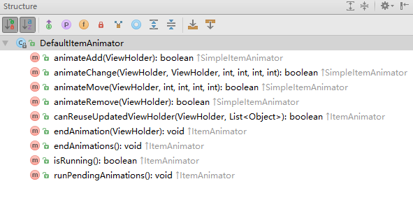

DefaultItemAnimagtor结构.png

它是继承自 SimpleItemAnimator 的，我们如果想要自定义实现一些 Item 动画，需要写的东西，大概就跟上图类似。

想要自定义 Item 动画，真的可以来参考、借鉴这个类的实现，能学到的东西很多。

我也还没深入去仔细学习，大概过了一眼，这里就大概说下：

这个类用了很多集合来维护各种不同类型的动画，在四个 `animateXXX()` 方法中通过集合记录相对应类型的动画和做了动画的初始化工作。

然后在 `runPendingAnimations()` 方法中，依次遍历这些集合，将记录的动画取出来执行，动画的实现方式是通过 `View.animate()` 方式实现，这种方式的动画本质上是借助了 ValueAnimator 机制，在每帧的回调过程中手动调用 `setXXX()` 来实现的动画效果。具体分析可参考我之前写的一篇文章：[View.animate()动画ViewPropertyAnimator原理解析](https://www.jianshu.com/p/b43cf452afc1)。

大体上的流程原理就是这样，当然，这个类做的事肯定不止这些，还包括了集合的清理维护工作，动画的维护等等，所以很值得去借鉴学习一番。但这里就只给出大概的流程，本篇重点不在这里。

下面就来列举下，默认实现的各类型的动画分别是什么：

**animateAdd** -> 透明度 0 ~ 1 的动画，默认动画时长 120 ms

**animateChange** -> 涉及两个 ItemView，旧的跟新的，默认动画时长 250ms

旧 ItemView：透明度从原有值 ~ 0，位置从原坐标移动到新 ItemView 坐标的动画组合

新 ItemView：透明度从 0 ~ 1，位置从旧 ItemView 坐标移动到新坐标的动画组合

**animateMove** -> 从原坐标位置移动到新坐标位置的移动动画，默认动画时长 250 ms

**animateRemove** -> 从原有透明度 ~ 0 的动画，默认动画时长 120 ms

所以，RecyclerView 默认的 Item 动画其实也就透明度和移动动画两种，而且大多数情况下都只是单一的动画，只有 change 类型时才会是组合动画。

**效果展示：**

首先，可通过下列方式修改动画时长，这里将动画时长延长，方便查看效果

```css
mRecyclerView.getItemAnimator().setAddDuration(1000);
```


20180702_162126.gif

可以看到，动画基本就只有透明度动画跟移动动画两种。

另外，只有通过 `notifyItemXXX()` 方式更新数据源时才会触发动画行为，如果是通过 `notifyDataSetChange()` 方式，则不会触发动画。

### 8. ItemDecoration

RecyclerView 支持为每个 Item 之间自定义间隔样式，是要空段距离，还是要以分割线隔开，还是要唯美唯幻的边框，想长啥样都行，自己写得出来就可以了，它给我们提供了这个接口。

本节就先介绍下系统内置的几种样式，内置里一共有三个类继承该类，分别是 DividerItemDecoration，ItemTouchHelper，FastScroller。前两个都是 public 权限，最后一个包权限，下面分别看看它们都有哪些效果，最后再来看看如何自定义。

#### 8.1 DividerItemDecoration

看一下这个类的注释：

```java
/**
 * DividerItemDecoration is a {@link RecyclerView.ItemDecoration} that can be used as a divider
 * between items of a {@link LinearLayoutManager}. It supports both {@link #HORIZONTAL} and
 * {@link #VERTICAL} orientations.
 * <pre>
 *     mDividerItemDecoration = new DividerItemDecoration(recyclerView.getContext(),
 *             mLayoutManager.getOrientation());
 *     recyclerView.addItemDecoration(mDividerItemDecoration);
 * </pre>
 */
public class DividerItemDecoration extends RecyclerView.ItemDecoration {
    /**
     * Sets the {@link Drawable} for this divider.
     *
     * @param drawable Drawable that should be used as a divider.
     */
    public void setDrawable(@NonNull Drawable drawable) {
        if (drawable == null) {
            throw new IllegalArgumentException("Drawable cannot be null.");
        }
        mDivider = drawable;
    }
    ...
}
```

怎么用，类注释也给我们示例了，有点可惜的是，它只能用于 LinearLayoutManager 这种布局，而 GridLayoutManager 继承自 LinearLayoutManager，所以它也可以用，但需要注意的是，它只有一个方向会生效。来看看如何使用和效果：


```java
DividerItemDecoration itemDecoration = new DividerItemDecoration(mContext, LinearLayoutManager.HORIZONTAL);
itemDecoration.setDrawable(getResources().getDrawable(R.drawable.divider_space));
mRecyclerView.addItemDecoration(itemDecoration);

//R.drawable.divider_space
<?xml version="1.0" encoding="utf-8"?>
<shape xmlns:android="http://schemas.android.com/apk/res/android">
    <size android:width="20dp" android:height="20dp"/>
</shape>
```

我们在 xml 中写宽度为 20dp 的空隙，然后调用 `setDrawable()` 应用，看看效果：


空隙示例.png

这样就可以达到将 item 隔离开的效果了，中间这个空隙的样式你可以自己通过 xml 写，也可以直接使用图片，都可以，只要是 Drawable 类型的即可。

虽然说，RecyclerView 不像 ListView 只要设置个属性就可以达到设置 Item 之间空隙的样式，但它也内置了基本的实现，其实也已经方便了我们的使用。

#### 8.2 *ItemTouchHelper*

这是一个工具类，也是 Google 为了方便开发人员实现 item 的拖拽和移动等等效果所提供的一个辅助工具类。借助这个类可以很容易实现 item 的侧滑删除、长按拖拽等功能。

由于这部分我没有研究过，日常也较少接触，所以暂时先从网上搜索一篇文章，以下的效果图来自大神的博客，会给出链接，侵权删。后续有接触相关需求时再自行来研究一番。

[推荐博客： ItemTouchHelper源码分析 ](https://blog.csdn.net/wuyuxing24/article/details/78985026)


20180105202851329.gif


20180105202823469.gif

#### 8.3 *FastScroller*

这个类也是继承自 ItemDecoration，但它的类权限只是包权限，不开放给外部使用，稍微看了下注释，说是用来处理动画以及快速滑动相关的支持，具体原理是什么，如何生效，留待后续深入研究时再来分析。

#### 8.4 自定义ItemDecoration

上面说过系统默认提供的 DividerItemDecoration 只支持用于 LinearLayoutManager，而如果用于 GridLayoutManager 时，只有一个方向会生效，那么下面我们就以 GridLayoutManager 为例，来看看，如何自定义写 ItemDecoration。

用 GridLayoutManager 实现一个四列的布局，然后让除了四个边的 Item 外，内部的每个 Item 之间相互间隔 20 dp 的空隙。为了能更明显看出，将 20dp 的空隙用红色绘制出来。

先来看下效果：

- 4 列布局 & 2 行布局


20180619_200035.gif

代码：

```java
public class MyItemDecoration extends RecyclerView.ItemDecoration {
    private int spanCount;//几行或几列
    private int orientation;//方向
    private int itemSpace;//空隙大小
    
    private Rect mBounds = new Rect();
    private Paint mPaint;//用来将空隙绘制成红色的画笔

    public MyItemDecoration(GridLayoutManager gridLayoutManager) {
        spanCount = gridLayoutManager.getSpanCount();
        orientation = gridLayoutManager.getOrientation();
        initPaint();
    }

    private void initPaint() {
        mPaint = new Paint();
        mPaint.setAntiAlias(true);
        mPaint.setColor(Color.RED);
    }

    public void setItemSpace(int space) {
        itemSpace = space;
    }

    @Override
    public void onDraw(Canvas c, RecyclerView parent, RecyclerView.State state) {
        c.save();
        final int childCount = parent.getChildCount();
        for (int i = 0; i < childCount; i++) {
            final View child = parent.getChildAt(i);
            parent.getLayoutManager().getDecoratedBoundsWithMargins(child, mBounds);
            c.drawRect(mBounds, mPaint);
        }
        c.restore();
    }

    @Override
    public void getItemOffsets(Rect outRect, View view, RecyclerView parent, RecyclerView.State state) {
        //获取当前view的layoutPosition
        int itemPosition = parent.getChildLayoutPosition(view);
        //计算该View位于哪一行哪一列
        int positionOfGroup = itemPosition % spanCount;
        int itemGroup = itemPosition / spanCount;
        
        //根据不同方向进行不同处理，最终效果都要实现除四周的View 外，内部的View之间横竖都以相同空隙间隔开
        //实现方式，以水平方向为例：
        //每个view的left和bottom都设置相同间隙
        //去掉第1列的left，和最后一行的bottom，也就实现了除四周外内部view都以相同间隙空隔开
        if (orientation == LinearLayoutManager.HORIZONTAL) {
            outRect.set(itemSpace, 0, 0, itemSpace);
            if (itemGroup == 0) {
                outRect.left = 0;
            }
            if (positionOfGroup == (spanCount - 1)) {
                outRect.bottom = 0;
            }
        } else if (orientation == LinearLayoutManager.VERTICAL) {
            outRect.set(0, itemSpace, itemSpace, 0);
            if (itemGroup == 0) {
                outRect.top = 0;
            }
            if (positionOfGroup == (spanCount - 1)) {
                outRect.right = 0;
            }
        }
    }
}
```

**注意事项**：由于 GridLayoutManager 会根据设置的 Orientation 方向，默认为 VERTICAL 数值方向，以及 RecyclerView 的宽高模式来决定是否自动将某一方向的空隙平均分配给各 Item，这点需要注意一下。

以上的例子想说明，如果要自定义写 Iiem 间的空隙，那么关键点在于重写两个方法：

- `getItemOffsets()`
- `onDraw()`

第 1 个方法会携带很多参数，最重要的是 outRect 这个参数，它是一个 Rect 类型的对象，重写这个方法并设置了这个 outRect 的 left, top, right, bottom，就相当于设置了对应这个 view 的四周分别有多大的空隙。

其他的参数是用来给我们辅助使用，如果不需要区分对待，每个 item 的四周都是同样的间隔空隙，那直接设置 outRect 即可。

如果需要像上述例子那样，要求四周的 Item 的间隙要区别于内部 item 的间隙，那么就需要判断出这个 View 的位置，因此可以通过其他参数辅助配合实现。

`onDraw()` 这个方法就是用于绘制，注意这个方法参数只给了 RecyclerView，而绘制 item 的 Decoration 是针对于每个 item 而言的，所以内部需要通过遍历子 View 来对每个 item 进行绘制操作。

当然，我这里写得很粗糙，考虑到性能优化方面，绘制过度方面等等因素，通常是需要使用到 canvas.clipRect()。这部分代码建议可以参考 DividerItemDecoration 内部的实现。

### 9. *OnFlingListener*

RecyclerView 是可滑动控件，在平常使用过程中，我们可能就是上滑，下滑，左边滑滑，右边滑滑，能够刷新更多列表即可，通常都没太过去注意到滑动的细节。

但其实，滑动策略也是支持多样化的。

比如，如果想要实现不管以多大的加速度滑动，滑多长距离，最终停下来时都系统有个 ItemView 是居中显示的效果。

再比如，只希望翻页滑动，当手指滑动距离小于翻页时，自动滑回原位进行翻页等等。

这些滑动策略其实就可以直接借助内置的两个类来实现：LinearSnapHelper 和 PagerSnapHelper

**ps：本来以为这种滑动策略也是支持由焦点触发的滑动行为的，最后测试时才发现，原来只支持手指触摸式的滑动行为。由于我是搞 Tv 应用开发的，Tv 应用没有触摸事件，只有遥控器事件，滑动是由于焦点的变化触发的滑动行为。而在 Tv 上，Item 居中的需求也非常常见，但利用这个是无法实现的。所以，我就先不打算深入了解这块了，后续有时间再来慢慢研究。附上鸿神公众号中的一篇文章，大伙看这篇就行了。**

[Android中使用RecyclerView + SnapHelper实现类似ViewPager效果](https://www.jianshu.com/p/ef3a3b8d0a77)

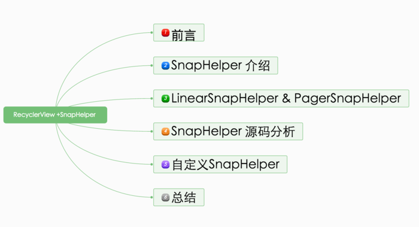

#### 9.1 *SnapHelper*

#### 9.2 *LinearSnapHelper*

#### 9.3 *PagerSnapHelper*


## 判断RecyclerView到达底部的方法

本篇转自 **19snow93** 的博客，主要研究了如何判断RecyclerView到达底部，对比了几种方案，希望对大家有所帮助。

本篇文章的原文地址：

> https://www.jianshu.com/p/c138055af5d2

之前文章

> **用事件分发的原理结合SwipeRefreshLayout写一个RecyclerView的上下拉**
>
> https://www.jianshu.com/p/4ef91430009c

里面有一个判断RecyclerView是否到达底部的方法 isBottom。我的同事用了这个上下拉之后发现有些小bug，没考虑周全，譬如各个子项高度不统一的时候，然后我找到原因是因为这个判断上下拉的问题。所以，我就去网上查到几种判断 RecyclerView 到达底部的方法，发现各有千秋。以下的分析都以上一篇文章的 SwipeRecyclerView 为例。

```java
1.lastVisibleItemPosition == totalItemCount - 1判断；
2.computeVerticalScrollRange()等三个方法判断；
3.canScrollVertically(1)判断；
4.利用RecyclerView的LinearLayoutManager几个方法判断。
```

其实，第2和第3种是属于同一种方法，在下面的分析会讲到。

一、首先，我们来介绍和分析一下第一种方法，也是网上最多人用的方法：

```java
public static boolean isVisBottom(RecyclerView recyclerView){  
  LinearLayoutManager layoutManager = (LinearLayoutManager) recyclerView.getLayoutManager();  
  //屏幕中最后一个可见子项的position
  int lastVisibleItemPosition = layoutManager.findLastVisibleItemPosition();  
  //当前屏幕所看到的子项个数
  int visibleItemCount = layoutManager.getChildCount();  
  //当前RecyclerView的所有子项个数
  int totalItemCount = layoutManager.getItemCount();  
  //RecyclerView的滑动状态
  int state = recyclerView.getScrollState();  
  if(visibleItemCount > 0 && lastVisibleItemPosition == totalItemCount - 1 && state == recyclerView.SCROLL_STATE_IDLE){   
     return true; 
  }else {   
     return false;  
  }
}
```

很明显，当屏幕中最后一个子项lastVisibleItemPosition等于所有子项个数totalItemCount - 1，那么RecyclerView就到达了底部。但是，我在这种方法中发现了极为极端的情况，就是当totalItemCount等于1，而这个子项的高度比屏幕还要高。

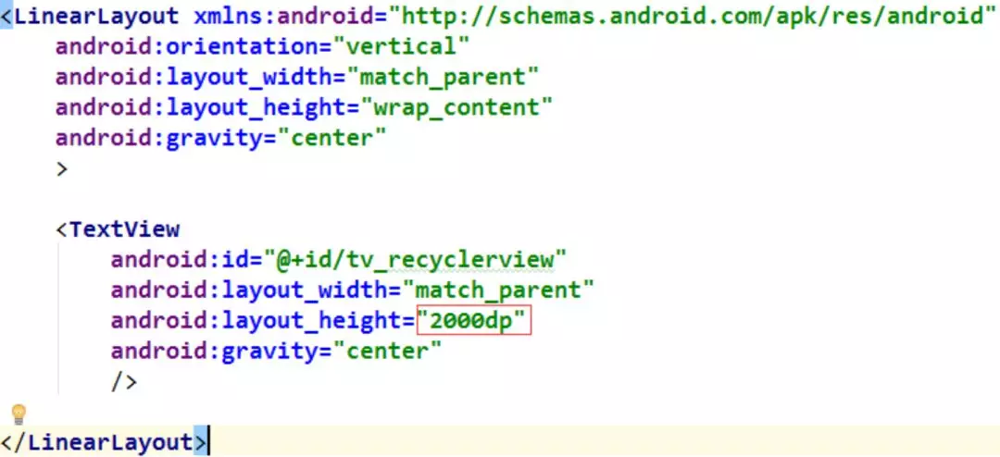

看看效果图：

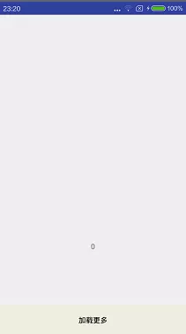

我们可以发现这个子项没完全显示出来就已经被判断为拉到底部。当然，这种方法一般情况下都能满足开发者的需求，只是遇到了强迫症的我~

二、下面我们介绍第二种方法：

```java
public static boolean isSlideToBottom(RecyclerView recyclerView) {    
   if (recyclerView == null) return false; 
   if (recyclerView.computeVerticalScrollExtent() + recyclerView.computeVerticalScrollOffset() 
        >= recyclerView.computeVerticalScrollRange())   
     return true;  
   return false;
}
```

这种方法原理其实很简单，而且也是View自带的方法。

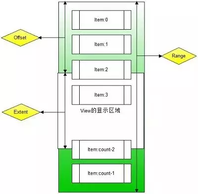

这样就很清晰明了，computeVerticalScrollExtent()是当前屏幕显示的区域高度，computeVerticalScrollOffset() 是当前屏幕之前滑过的距离，而computeVerticalScrollRange()是整个View控件的高度。
这种方法经过测试，暂时还没发现有bug，而且它用的是View自带的方法，所以个人觉得比较靠谱。

三、下面讲讲第三种方法：

```java
RecyclerView.canScrollVertically(1)的值表示是否能向上滚动，false表示已经滚动到底部
RecyclerView.canScrollVertically(-1)的值表示是否能向下滚动，false表示已经滚动到顶部
```

这种方法更简单，就通过简单的调用方法，就可以得到你想要的结果。我一讲过这种方法与第二种方法其实是同一种方法，那下面来分析一下，看看canScrollVertically的源码：

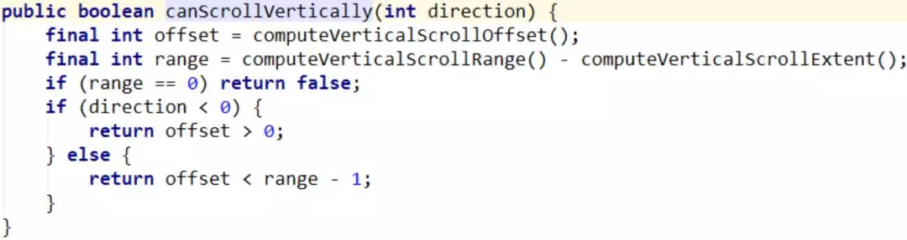

是不是一目了然了，canScrollVertically方法的实现实际上运用到的是方法二的三个函数，只是这个方法Android已经帮我们封装好了，原理一模一样的。本人现在也是运用了这种方法做判断的懒人工具类都省了~

四、最后一种方法其实是比较呆板的，就是利用LinearLayoutManager的几个方法，1.算出已经滑过的子项的距离，2.算出屏幕的高度，3.算出RecyclerView的总高度。然后用他们做比较，原理类似于方法二。

```java
public static int getItemHeight(RecyclerView recyclerView) {  
  int itemHeight = 0;  
  View child = null;  
  LinearLayoutManager layoutManager = (LinearLayoutManager) recyclerView.getLayoutManager();  
  int firstPos = layoutManager.findFirstCompletelyVisibleItemPosition(); 
  int lastPos = layoutManager.findLastCompletelyVisibleItemPosition();  
  child = layoutManager.findViewByPosition(lastPos);  
  if (child != null) {   
     RecyclerView.LayoutParams params = (RecyclerView.LayoutParams) child.getLayoutParams();   
     itemHeight = child.getHeight() + params.topMargin + params.bottomMargin;  
  }   
 return itemHeight;}
```

算出一个子项的高度

```java
public static int getLinearScrollY(RecyclerView recyclerView) {  
  int scrollY = 0;  
  LinearLayoutManager layoutManager = (LinearLayoutManager) recyclerView.getLayoutManager();  
  int headerCildHeight = getHeaderHeight(recyclerView);  
  int firstPos = layoutManager.findFirstVisibleItemPosition();  
  View child = layoutManager.findViewByPosition(firstPos);  
  int itemHeight = getItemHeight(recyclerView);  
  if (child != null) {   
     int firstItemBottom = layoutManager.getDecoratedBottom(child);   
     scrollY = headerCildHeight + itemHeight * firstPos - firstItemBottom;    
     if(scrollY < 0){    
         scrollY = 0;    
     }  
  }  
  return scrollY;
}
```

算出滑过的子项的总距离

```java
public static int getLinearTotalHeight(RecyclerView recyclerView) {    int totalHeight = 0;  
  LinearLayoutManager layoutManager = (LinearLayoutManager) recyclerView.getLayoutManager();  
  View child = layoutManager.findViewByPosition(layoutManager.findFirstVisibleItemPosition());  
  int headerCildHeight = getHeaderHeight(recyclerView);  
  if (child != null) {   
     int itemHeight = getItemHeight(recyclerView);    
     int childCount = layoutManager.getItemCount();    
     totalHeight = headerCildHeight + (childCount - 1) * itemHeight;  
  }  
  return totalHeight;
}
```

算出所有子项的总高度

```java
public static boolean isLinearBottom(RecyclerView recyclerView) {    
boolean isBottom = true;  
  int scrollY = getLinearScrollY(recyclerView);  
  int totalHeight = getLinearTotalHeight(recyclerView); 
  int height = recyclerView.getHeight();
 //    Log.e("height","scrollY  " + scrollY + "  totalHeight  " +  totalHeight + "  recyclerHeight  " + height);  
  if (scrollY + height < totalHeight) {    
    isBottom = false;  
  }  
  return isBottom;
}
```

高度作比较

虽然这种方法看上去比较呆板的同时考虑不很周全，但这种方法可以对RecylerView的LinearLayoutManager有深一步的理解，这也是我的师兄给我提供的一个借鉴的类，我非常感谢他！有兴趣的同学可以去下载源码的做进一步的研究，发现有更好玩的方法可以一起研究！源码地址：

> https://github.com/19snow93/SwipeRecyclerView

## 参考

