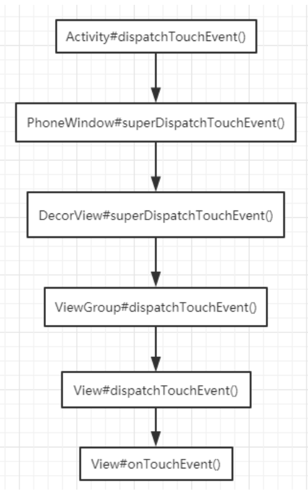
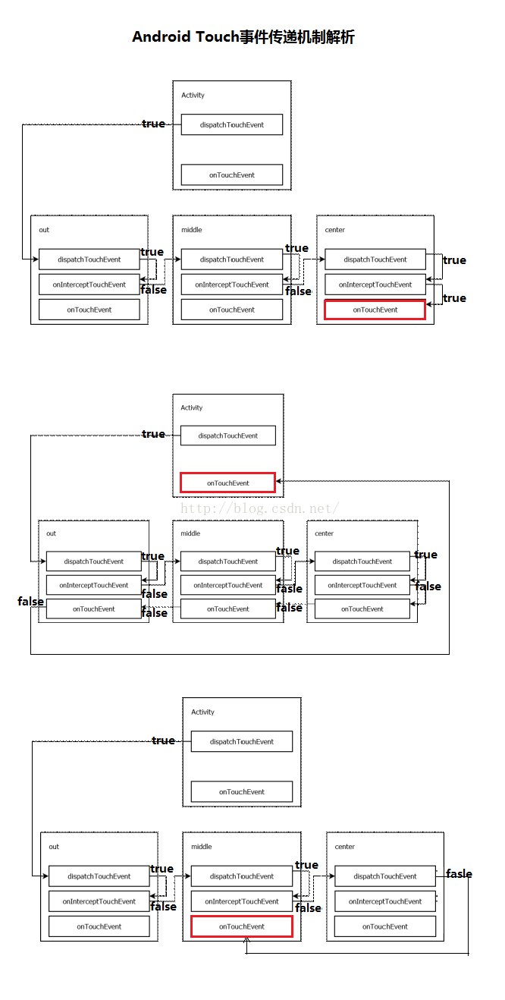
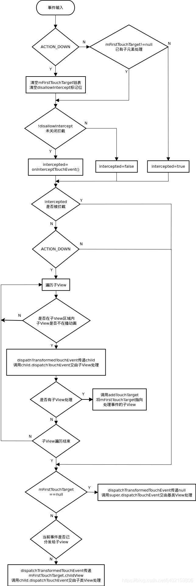
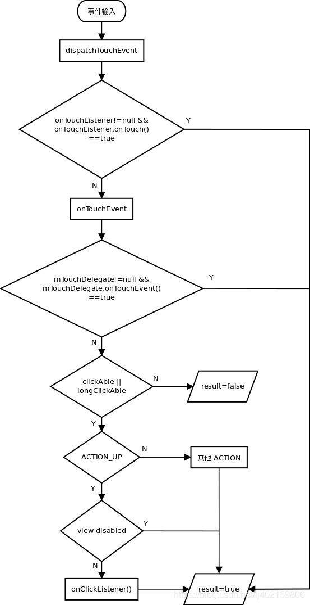

# TouchEventDispatch

## MotionEvent

| **事件**      | **简介**                            |
| ------------- | ----------------------------------- |
| ACTION_DOWN   | 手指 初次接触到屏幕 时触发          |
| ACTION_MOVE   | 手指 在屏幕上滑动时触发，会多次触发 |
| ACTION_UP     | 手指 离开屏幕 时触发                |
| ACTION_CANCEL | 事件 被上层拦截 时触发              |

## 事件分发、拦截与消费

| **类型** | **相关方法**          | **Activity** | **ViewGroup** | **View** |
| -------- | --------------------- | ------------ | ------------- | -------- |
| 事件分发 | dispatchTouchEvent    | √            | √             | √        |
| 事件拦截 | onInterceptTouchEvent | X            | √             | X        |
| 事件消费 | onTouchEvent          | √            | X             | √        |


上述三个方法之间的关系可用如下伪代码表示：

```java
public boolean dispatchTouchEvent(MotionEvent ev){
  boolean consume = false;
  if(onInterceptTouchEvent(ev)){
    consume =  onTouchEvent(ev);
  }else{
    if(child == null){
      consume = super.dispatchTouchEvent(ev)
    }else{
      consume = child.dispatchTouchEvent(ev){
        	boolean result = child.mOnTouchEventListener.OnTouch(this,ev);
          if(!result){
            child.mOnclickListener.OnClick(this);
            result = true;
          }
          return result;
    	};
    }
  }
  return consume ;
}
```


## 总流程




从这张表中我们可以看到 ViewGroup 及其子类对与 Touch 事件相关的三个方法均能响应，而 Activity 对 onInterceptTouchEvent(MotionEvent ev) 也就是事件拦截不进行响应。另外需要注意的是 View 对 dispatchTouchEvent(MotionEvent ev) 和 onInterceptTouchEvent(MotionEvent ev) 的响应的前提是可以向该 View 中添加子 View，如果当前的 View 已经是一个最小的单元 View（比如 TextView），那么就无法向这个最小 View 中添加子 View，也就无法向子 View 进行事件的分发和拦截，所以它没有 dispatchTouchEvent(MotionEvent ev) 和 onInterceptTouchEvent(MotionEvent ev)，只有 onTouchEvent(MotionEvent ev)。



 

## ViewGroup事件分发流程图




## View事件分发流程图




## Touch 事件分析

### 事件分发：public boolean dispatchTouchEvent(MotionEvent ev)

Touch 事件发生时 Activity 的 dispatchTouchEvent(MotionEvent ev) 方法会以隧道方式（从根元素依次往下传递直到最内层子元素或在中间某一元素中由于某一条件停止传递）将事件传递给最外层 View 的 dispatchTouchEvent(MotionEvent ev) 方法，并由该 View 的 dispatchTouchEvent(MotionEvent ev) 方法对事件进行分发。dispatchTouchEvent 的事件分发逻辑如下：

- 如果 **return true**，事件会分发给当前 View 并由 dispatchTouchEvent 方法进行消费，同时事件会停止向下传递；
- 如果**return false**，事件分发分为两种情况：

1. 如果当前 View 获取的事件直接来自 Activity，则会将事件返回给 Activity 的 onTouchEvent 进行消费；
2. 如果当前 View 获取的事件来自外层父控件，则会将事件返回给父 View 的 onTouchEvent 进行消费。

- 如果返回系统默认的 super.dispatchTouchEvent(ev)，事件会自动的分发给当前 View 的 onInterceptTouchEvent 方法。

### 事件拦截：public boolean onInterceptTouchEvent(MotionEvent ev) 

在外层 View 的 dispatchTouchEvent(MotionEvent ev) 方法返回系统默认的 super.dispatchTouchEvent(ev) 情况下，事件会自动的分发给当前 View 的 onInterceptTouchEvent 方法。onInterceptTouchEvent 的事件拦截逻辑如下：

- 如果 onInterceptTouchEvent 返回 true，则表示将事件进行拦截，并将拦截到的事件交由当前 View 的 onTouchEvent 进行处理；
- 如果 onInterceptTouchEvent 返回 false，则表示将事件放行，当前 View 上的事件会被传递到子 View 上，再由子 View 的 dispatchTouchEvent 来开始这个事件的分发；
- 如果 onInterceptTouchEvent 返回 super.onInterceptTouchEvent(ev)，事件默认会被拦截，并将拦截到的事件交由当前 View 的 onTouchEvent 进行处理。

### 事件响应：public boolean onTouchEvent(MotionEvent ev)

在 dispatchTouchEvent 返回 super.dispatchTouchEvent(ev) 并且 onInterceptTouchEvent 返回 true 或返回 super.onInterceptTouchEvent(ev) 的情况下 onTouchEvent 会被调用。onTouchEvent 的事件响应逻辑如下：

- 如果事件传递到当前 View 的 onTouchEvent 方法，而该方法返回了 false，那么这个事件会从当前 View 向上传递，并且都是由上层 View 的 onTouchEvent 来接收，如果传递到上面的 onTouchEvent 也返回 false，这个事件就会“消失”，而且接收不到下一次事件。
- 如果返回了 true 则会接收并消费该事件。
- 如果返回 super.onTouchEvent(ev) 默认处理事件的逻辑和返回 false 时相同。

## 源码分析

>点击事件响应优先级：
>
>View.OnTouchListener.onTouch( ) |-> View.OnClickListener.onClick( )

```java
Activity#dispatchTouchEvent(MotionEvent ev)
->PhoneWindow#superDispatchTouchEvent(MotionEvent event)
=>DecorView#superDispatchTouchEvent(MotionEvent event)
=>ViewGroup#dispatchTouchEvent(MotionEvent ev){
  final boolean intercepted = onInterceptTouchEvent(ev){...}
  Down:
  	//对childview根据indexZ进行排序
  	final ArrayList<View> preorderedList = buildTouchDispatchChildList();
  	for (int i = childrenCount - 1; i >= 0; i--) {
      final int childIndex = getAndVerifyPreorderedIndex( childrenCount, i, customOrder);
      //获取的是最上层的View
      final View child = getAndVerifyPreorderedView(preorderedList, children, childIndex);
      //判断是否点击在View的内部
      if (!child.canReceivePointerEvents() || !isTransformedTouchPointInView(x, y, child, null)) {
        ev.setTargetAccessibilityFocus(false);
        continue;
      }
      if (dispatchTransformedTouchEvent(ev, false, child, idBitsToAssign)) {...}
    }
}
-->#dispatchTransformedTouchEvent(ev, false, child, idBitsToAssign)
->View#dispatchTouchEvent(MotionEvent event){
  #onTouch(this, event)
  || #onTouchEvent(event)
    #performClickInternal()
    =>#performClick()
    #onClick(this)
}

```

View.java

```java
public boolean onTouchEvent(MotionEvent event) {
  if (clickable || (viewFlags & TOOLTIP) == TOOLTIP) {
    switch (action) {
      case MotionEvent.ACTION_UP:
        performClickInternal();
    }
  }
}

private boolean performClickInternal() {
  // Must notify autofill manager before performing the click actions to avoid scenarios where
  // the app has a click listener that changes the state of views the autofill service might
  // be interested on.
  notifyAutofillManagerOnClick();

  return performClick();
}

public boolean performClick() {
  // We still need to call this method to handle the cases where performClick() was called
  // externally, instead of through performClickInternal()
  notifyAutofillManagerOnClick();

  final boolean result;
  final ListenerInfo li = mListenerInfo;
  if (li != null && li.mOnClickListener != null) {
    //点击按键的声音
    playSoundEffect(SoundEffectConstants.CLICK);
    //回调Onclick（）方法
    li.mOnClickListener.onClick(this);
    result = true;
  } else {
    result = false;
  }

  sendAccessibilityEvent(AccessibilityEvent.TYPE_VIEW_CLICKED);

  notifyEnterOrExitForAutoFillIfNeeded(true);

  return result;
}

public boolean dispatchTouchEvent(MotionEvent event) {
   
    boolean result = false;

    if (mInputEventConsistencyVerifier != null) {
        mInputEventConsistencyVerifier.onTouchEvent(event, 0);
    }

    final int actionMasked = event.getActionMasked();
    if (actionMasked == MotionEvent.ACTION_DOWN) {
        // Defensive cleanup for new gesture
        stopNestedScroll();
    }

  	//安全过滤
    if (onFilterTouchEventForSecurity(event)) {
        if ((mViewFlags & ENABLED_MASK) == ENABLED && handleScrollBarDragging(event)) {
            result = true;
        }
        //noinspection SimplifiableIfStatement
        ListenerInfo li = mListenerInfo;
      	//如果View.onTouch()回调方法返回true会命中此处，Onclick()回调不会触发
        if (li != null && li.mOnTouchListener != null && (mViewFlags & ENABLED_MASK) == ENABLED
                && li.mOnTouchListener.onTouch(this, event)) {
            result = true;
        }

      	//如果View.onTouch()回调方法返回true,不会进入此处，Onclick（）方法不会触发
        if (!result && onTouchEvent(event)) {
            result = true;
        }
    }

    if (!result && mInputEventConsistencyVerifier != null) {
        mInputEventConsistencyVerifier.onUnhandledEvent(event, 0);
    }

    // Clean up after nested scrolls if this is the end of a gesture;
    // also cancel it if we tried an ACTION_DOWN but we didn't want the rest
    // of the gesture.
    if (actionMasked == MotionEvent.ACTION_UP || actionMasked == MotionEvent.ACTION_CANCEL ||
            (actionMasked == MotionEvent.ACTION_DOWN && !result)) {
        stopNestedScroll();
    }

    return result;
}
```

## 冲突的解决方法

### 内部拦截法

InnerView.java

```java
private int mLastX, mLastY;

//内部拦截法
@Override
public boolean dispatchTouchEvent(MotionEvent event) {
    int x = (int) event.getX();
    int y = (int) event.getY();

    switch (event.getAction()) {
        case MotionEvent.ACTION_DOWN: {
            getParent().requestDisallowInterceptTouchEvent(true);
            break;
        }
        case MotionEvent.ACTION_MOVE: {
            int deltaX = x - mLastX;
            int deltaY = y - mLastY;
            if (Math.abs(deltaX) > Math.abs(deltaY)) {
                getParent().requestDisallowInterceptTouchEvent(false);
            }
            break;
        }
        case MotionEvent.ACTION_UP: {
            break;
        }
        default:
            break;
    }

    mLastX = x;
    mLastY = y;
    return super.dispatchTouchEvent(event);
}
```

OutView.java

```java
 @Override
public boolean onInterceptTouchEvent(MotionEvent event) {
  //内部拦截法
  if (event.getAction() == MotionEvent.ACTION_DOWN) {
    super.onInterceptTouchEvent(event);
    return false;
  }
  return true;
}
```

### 外部拦截法

OutView.java

```java
private int mLastX, mLastY;

@Override
public boolean onInterceptTouchEvent(MotionEvent event) {
 
  // 外部拦截法
  int x = (int) event.getX();
  int y = (int) event.getY();

  switch (event.getAction()) {
    case MotionEvent.ACTION_DOWN: {
      mLastX = (int) event.getX();
      mLastY = (int) event.getY();
      break;
    }
    case MotionEvent.ACTION_MOVE: {
      int deltaX = x - mLastX;
      int deltaY = y - mLastY;
      if (Math.abs(deltaX) > Math.abs(deltaY)) {
        return true;
      }
      break;
    }
    case MotionEvent.ACTION_UP: {
      break;
    }
    default:
      break;
  }

  return super.onInterceptTouchEvent(event);
}
```

## 参考

[Android Touch 事件的分发和消费机制](https://blog.csdn.net/u010870955/article/details/52492647)

[android点击事件在activity中的传递流程](https://blog.csdn.net/thh159/article/details/97691477)

[Android View 事件分发机制](https://blog.csdn.net/lj402159806/article/details/98483214)


## 事件处理

View-->dispatchTouchEvent

onTouchEvent --->up.performClickInternal()

```
if (li != null && li.mOnClickListener != null) {
    playSoundEffect(SoundEffectConstants.CLICK);
    li.mOnClickListener.onClick(this);
    result = true;
} 
```

Down

```
buildTouchDispatchChildList()---对子view排序
```

```
dispatchTransformedTouchEvent()  --- 分发给谁来处理事件 
```

```
newTouchTarget = addTouchTarget(child, idBitsToAssign);
newTouchTarget == mFirstTouchTarget；
alreadyDispatchedToNewTouchTarget = true;

next = null；
```

Move

ListView ---被中断时  --- cancelChild = true

```
mFirstTouchTarget = null；
```

up

处理冲突

```
getParent().requestDisallowInterceptTouchEvent(true);

mGroupFlags |= FLAG_DISALLOW_INTERCEPT;

mGroupFlags | FLAG_DISALLOW_INTERCEPT  & FLAG_DISALLOW_INTERCEPT != 0

disallowIntercept = true
--> onInterceptTouchEvent()   不执行
```

```
// 拦截不成功的坑   mGroupFlags &= ~FLAG_DISALLOW_INTERCEPT;

if (actionMasked == MotionEvent.ACTION_DOWN) {
    // Throw away all previous state when starting a new touch gesture.
    // The framework may have dropped the up or cancel event for the previous gesture
    // due to an app switch, ANR, or some other state change.
    cancelAndClearTouchTargets(ev);
    resetTouchState();
}

在down 的情况下，onInterceptTouchEvent() 肯定会执行
```

