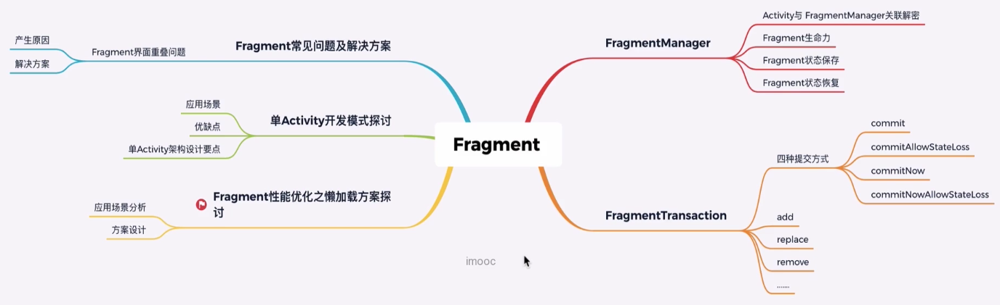

# Fragment使用

## Fragment核心知识点



### FragmentTransaction的4种提交方式 

[Fragment核心知识点](https://doc.devio.org/as/book/docs/Part1/AndroidUI核心组件剖析与实战/见微知著从源码到原理剖析Fragment核心知识点.html)

- commit()：如果在宿主执行了onSaveInstanceSate之后再执行该操作，会抛出异常。属于异步事务。 
- commitAllowingStateLoss():如果在宿主执行了onSaveInstanceSate之后再执行该操作，不会去检查宿主状态,不会抛出异常。但该操作不会被Activity记录，恢复时也就没办法恢复这些提交操作，所以该操作适用不重要的事务。同属于异步事务。 
- commitNow()：会立刻执行当前提交的transaction事务。属于同步事务。 
- commitNowAllowingStateLoss():具备以上两者的特性，即是同步执行，也不会检查宿主的状态,有可能该操作不会被正确恢复.

>官方更推荐使用commitNow（）和commitNowAllowingStateLoss()提交事务。 Fragmenttransaction中add(),remove(),replace()背后的实现 Fragment状态的保存和恢复发生的时机 页面重叠问题产生的原因与解决方案 androidx Fragment懒加载新方案.

## Fragment生命周期


[Fragment生命周期](https://developer.android.google.cn/guide/fragments/lifecycle?hl=zh_cn)


opStop()和onSaveInstanceState()的调用顺序


Fragment的一般生命周期如上图所示：

- onAttach()：Fragment和Activity相关联时调用。可以通过该方法获取Activity引用，还可以通过getArguments()获取参数。
- onCreate()：Fragment被创建时调用
- onActivityCreated()：当Activity完成onCreate()时调用
- onStart()：当Fragment可见时调用。
- onResume()：当Fragment可见且可交互时调用
- onPause()：当Fragment不可交互但可见时调用。
- onStop()：当Fragment不可见时调用。
- onDestroyView()：当Fragment的UI从视图结构中移除时调用。
- onDestroy()：销毁Fragment时调用。
- onDetach()：当Fragment和Activity解除关联时调用。

**Fragment生命周期会经历：运行、暂停、停止、销毁**。

- **运行状态**：碎片可见时，关联活动处于运行状态，其也为运行状态
- **暂停状态**：活动进入暂停状态，相关联可见碎片就会进入暂停状态
- **停止状态**：活动进入停止状态，相关联碎片就会进入停止状态，或者通过FragmentTransaction的remove()、replace()方法将碎片从从活动中移除，但如果在事务提交之前调用addToBackStack()方法，这时的碎片也会进入到停止状态。
- **销毁状态**：当活动被销毁，相关联碎片进入销毁状态。或者调用FragmentTransaction的remove()、replace()方法将碎片从活动中移除，但在事务提交之前并没有调用addToBackStack()方法，碎片也会进入到销毁状态。

在介绍Fragment的具体使用时，先介绍一下Fragment的几个**核心类**

- Fragment：Fragment的基类，任何创建的Fragment都需要继承该类
- FragmentManager：管理和维护Fragment。他是**抽象类**，具体的实现类是**FragmentManagerImpl**。
- FragmentTransaction：对Fragment的添加、删除等操作都需要通过事务方式进行。他是**抽象类**，具体的实现类是**BackStackRecord**

## 静态使用Fragment

``` xml
      <fragment
       android:id="@+id/fragment_left"
       android:name="com.example.fragmentdemo.basic.LeftFragment"
       android:layout_weight="1"
       android:layout_width="0dp"
       android:layout_height="match_parent"
       tools:ignore="Suspicious0dp" />
```
> 注意点： 
>  1. 嵌套了fragment  能
>  // 尝试下 fragment嵌套 静态使用fragment
>  2. 静态加载一旦添加就不能在运行时删除
>  3. 静态fragment  在哪儿初始化的？ 
>  4. fragment一定要有一个没有参数的构造函数

	 fragment 为什么需要一个空构造？ 看源码 

## 动态使用Fragment 90% 

获得FragmentManager对象，通过getSupportFragmentManager()
获得FragmentTransaction对象，通过fm.beginTransaction()
调用add()方法或者repalce()方法加载Fragment；
最后调用commit()方法提交事务

androidx jetpack下面的fragment 

v4包下的fragment 有bug 
< 24: fragment 重叠问题 onActivityResult分发结果（fragment嵌套） 出栈（popstack(tag,id) popstackimmdate ）
转场动画

>=  28 

## 注意点
### 1. getActivity == null  请求网络接口

> 解决方案： 不建议fragment使用宿主activity getActivity
> //TODO: [解决方案]在onAttach(Activity activity)里赋值，使用mActivity代替getActivity()，
> // 保证Fragment即使在onDetach后，仍持有Activity的引用（有引起内存泄露的风险，但是异步任务没停止的情况下，本身就可能已内存泄漏，相比Crash，这种做法“安全”些）
> @Override
> public void onAttach(Context context) {
>    super.onAttach(context);
>    Log.i("Zero", "onAttach : " + getActivity());
> }

bugly 

### 2. Can not perform this action after onSaveInstanceState
> 解决方案：
> 不能在onSaveInstanceState之后的生命周期里面commit fragment 
> 不要在子线程commit fragment  已经走完onSaveInstanceState

### 3. fragment 重叠
 1. 屏幕旋转 activity 生命周期
      竖屏 -》 横屏 1
      横屏 -》 竖屏 2
   ``` xml
   android:configChanges="orientation"
   ```
   sdk > 23 sdk < 23 
   走 onConfigurationChanged 

   原因： 
   onCreate add  fragment 
   onDestroy 
    屏幕旋转 onCreate 又会执行  又会重新add一次 fragment （系统自动恢复了一个 ）
	why? 
	fragment 自动有一个恢复机制 
	

	> 解决方案： 
	1. onSaveInstanceState activity失去自动存储的功能 super
	2. if(savedInstanceState == null){add fragment }
	
	内存重启： fragment 重叠 （ 接了个电话，系统内存不足，杀掉了你的activity ）
	打开手机上的“开发者选项”中的“不保留活动”选项，模拟内存重启

 


## Fragment 常见操作

 add(@NonNull Fragment fragment, @Nullable String tag)

 tag ： findFragmentByTag
 add(@IdRes int containerViewId, @NonNull Fragment fragment,
            @Nullable String tag)
			
 containerViewId： 指定fragment添加到那个viewgroup  findFragmentById

 fragment 传参问题：不要写有参数的构造函数，这是错误的写法
 内存重启 自动恢复：只会调用无参的构造函数 fragment 成员变量没有保存
  public void setArguments(@Nullable Bundle args)
  Bundle getArguments()

  添加到回退栈
   addToBackStack(@Nullable String name) 
   popBackStack()
   name: 
   popBackStack(@Nullable final String name, final int flags)

  ###  Fragment嵌套回退栈问题 （单activity + fragment ）

   > 解决方案：
   >  1. 自定义
   >  open class LifeCycleFragment : Fragment(), OnBackPressed  interface OnBackPressed{
   >         	fun onBackPressed()
   >       }
   >   2.  在activity 
   >       override fun onBackPressed() {
   >       	super.onBackPressed()
   >           	//自己管理回退
   >        }

### 使用navigation 

   多次add fragment 到同一个位置
   重叠问题
   fragment 根布局 设置背景
   调用hide隐藏上一个添加的

   add 与 replace的区别
   add 往containerViewId的容器里面添加fragment view 
   replace将containerViewId的容器里面之前添加的view全部清空
   add replace 千万不要混合使用  要么全部用add  要么全部用replace 

   remove 操作
   if (fragment != null && fragment.isAdded)

   fragment a 

   add  .....  remove  +1 + -1 = 0  show hide  show 

   


popBackStack() 按照栈 弹出的顺序回退 abcd   d c b a 
popBackStack(@Nullable final String name, final int flags)

abcd popBackStack(b,0) ab 
     popBackStack(b,0) a 
	 

```java
//保存数据
setRetainInstance(true)
```


add replace  hide show  -> commit 

## 简单API 背后隐藏了什么操作

FragmentActivity： AMS控制Activity的生命周期，FragmentActivity在一系列的dispatchXXX
调用FragmentController来控制Fragment的生命周期

FragmentController：是一个代理

FragmentHostCallback： 被FragmentController持有，有一个FragmentManagerImpl，真正的进行fragment操作

FragmentContainer： ：view容器

FragmentTransaction： 
 Fragment操作的事务，每个FragmentTransaction对象，代表着系列Fragment操作的事务。
 * 操作Fragment的添加，删除，隐藏，显示时，都要使用FragmentTransaction。
 * FragmentTransaction其实是个抽象类，真正的实现类为BackStackRecord

BackStackRecord： BackStackRecord实现了FragmentTransaction，每一个BackStackRecord对象，都代表了一次Fragment操作事务。

Op: Op对象，主要保存了FragmentTransaction操作事务中的单次操作，是相对于Fragment而言的。每个Op对象，保存了操作的Fragment对象，切换动画等对象
add -> new Op
把fragment 和操作的命令 OP_ADD 映射
	
vip  handler源码分析  post (runnable,msg)

commitNow 为什么不运行添加到回退栈
commit 
1237456 -> 654321

开启一个事务


。。。。。 N 个 Op 


commit 
	

事务操作
操作	     		command	  			    意义
add					  OP_ADD					添加fragment
remove	    		OP_REMOVE			删除fragment
replace				OP_REPLACE		   替换fragment
show				   OP_SHOW				显示fragment
hide					 OP_HIDE				   隐藏fragment
attach				 OP_ATTACH			   依附activity
detach				OP_DETACH			  从activity分离


cmd				firstOutFragments		lastInFragements
OP_ADD			-						被添加的fragment
OP_REPLACE		被替换的fragment		新的fragment
OP_REMOVE		被删除的fragment		-
OP_HIDE			被隐藏的fragment		-
OP_SHOW			-	被显示的fragment	
OP_DETACH		被detach的fragment		-
OP_ATTACH		-						被attach的fragment 


executeOps
cmd				调用FragmentManager方法
OP_ADD			addFragment
OP_REPLACE		removeFragment->addFragment
OP_REMOVE		removeFragment
OP_HIDE			hideFragment
OP_SHOW			showFragment
OP_DETACH		detachFragment
OP_ATTACH		attachFragment 


moveToState
状态表格
值		状态				意义										入口方法
0		INITIALIZING		Fragment尚未初始化或者已经被销毁			dispatchDestroy
1		CREATED				Fragment已被创建							dispatchDestoryView
2		ACTIVITY_CREATED	Fragemtn所在Activity已经创建成功			dispatchActivityCreated
3		STARTED				Fragment已经可见，但是还不可以接收点击事件	dispatchPause
4		RESUMED				Fragment已经可见并且可以接收点击事件		dispatchResume 
已经废弃
3		STOPPED				Fragment已经被创建，但是尚未不可见			dispatchStop 


fragment的state 与Activity 的生命周期不是等同

可见 与可交互

moveToState()                     Activity的生命周期

oncreate调用的时候，不管fragments 之前的状态 xxx -> CREATED Index

add <-> remove
attach <-> detach
show <-> hide
replace( remove x n + add x m) <-> replace ( remove x m + add x n) 