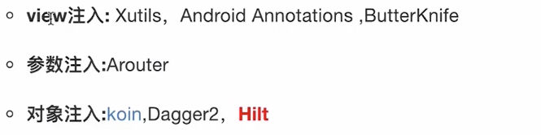
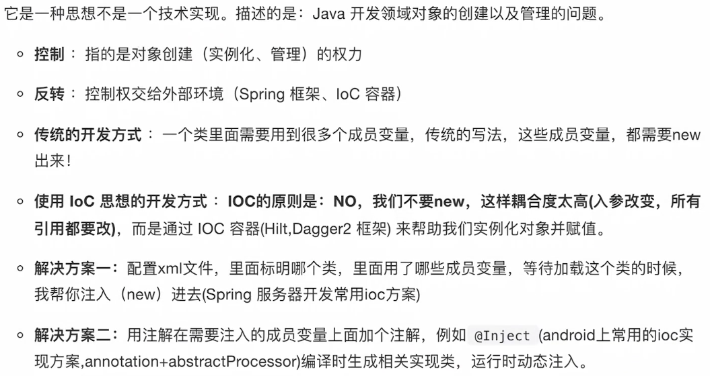
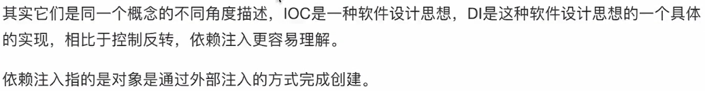
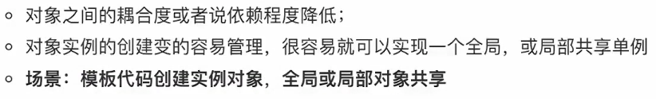
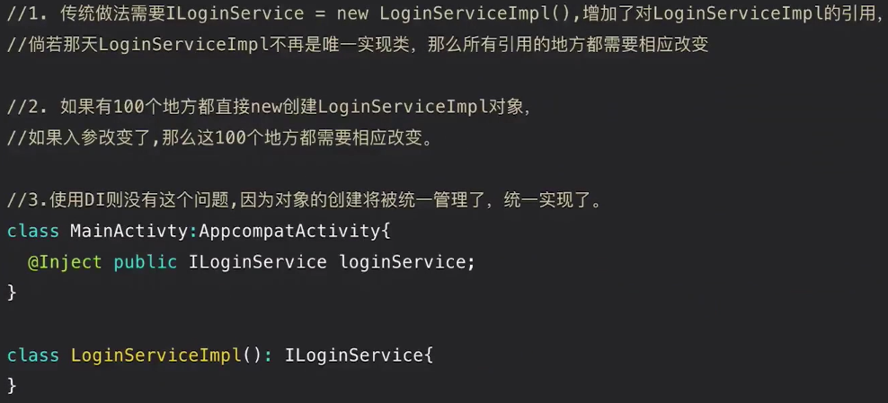
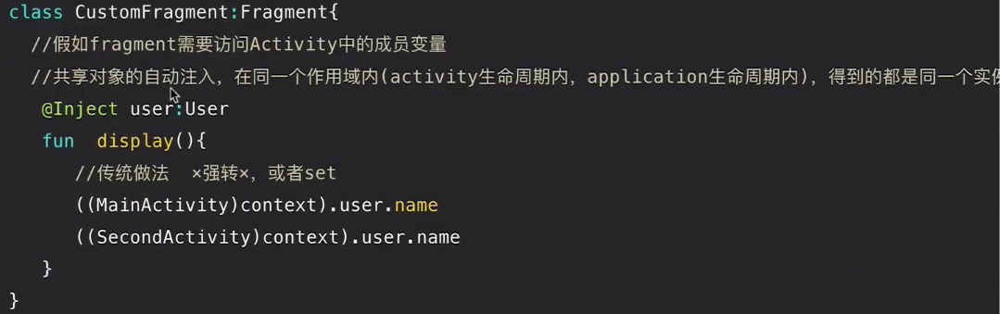
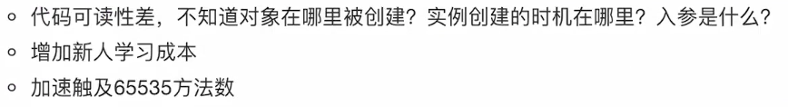
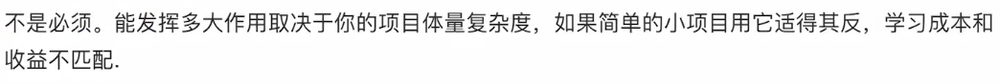
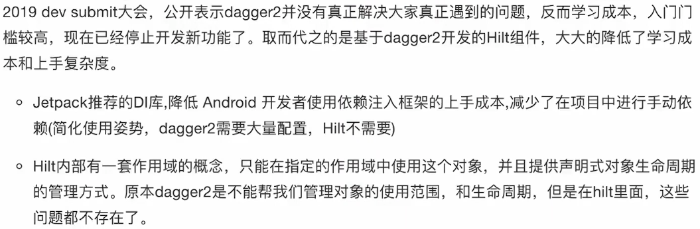

# IOC 

## 依赖注入框架的类型

> 1.运行时注入  xUtils、eventBus、springMVC
> 2.源码时注入  android studio插件
> 3.编译时注入  butterknife,dagger2

## 什么是IOC（Inversion of Control）控制反转

IOC是原来由程序代码中主动获取的资源，转变由第三方获取并使原来的代码被动接收的方式，以达到解耦的效果，称为控制反转。

## 什么是DI（Dependency Injection）依赖注入？

 

## IOC的优势

## IOC的缺点

## 是否有必要引入IOC？

## Hilt相较于Dagger2的优势

