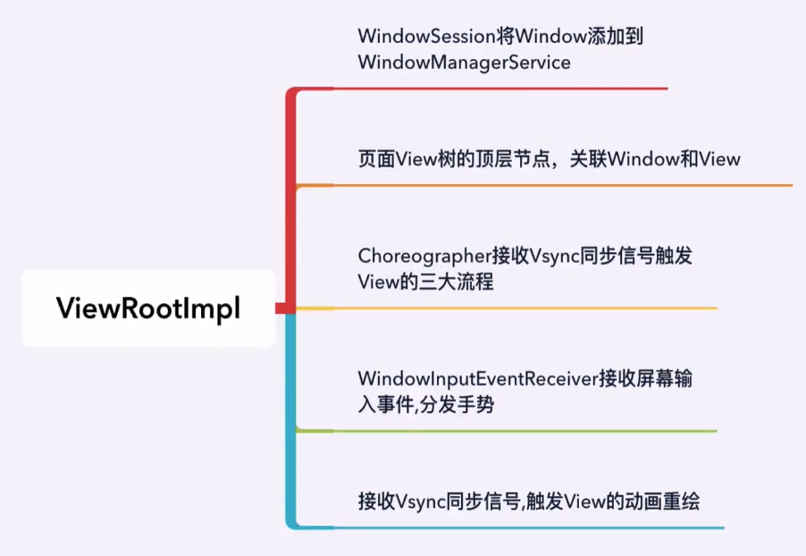
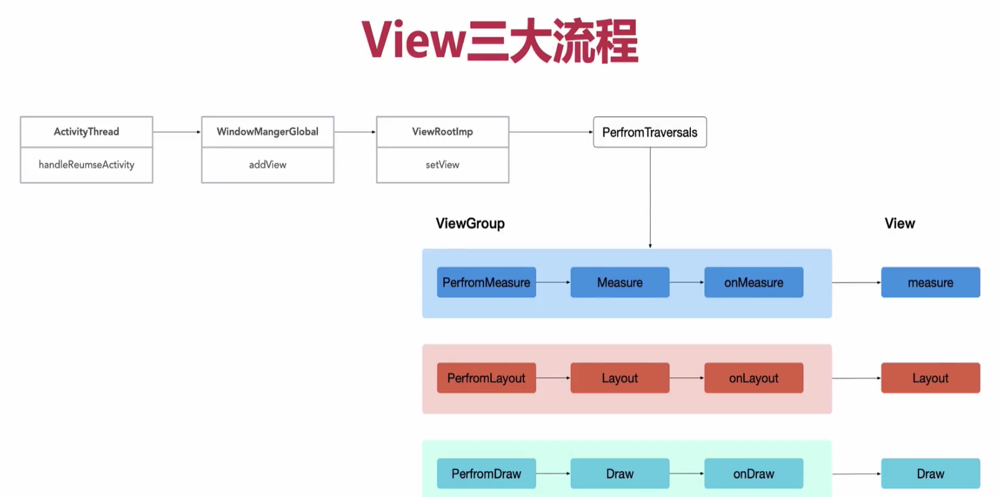
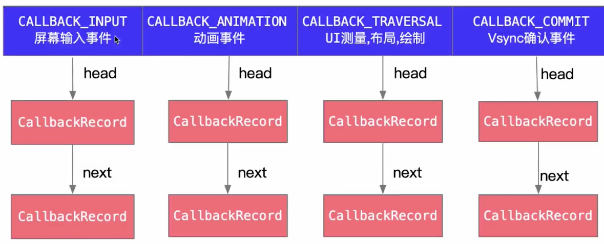
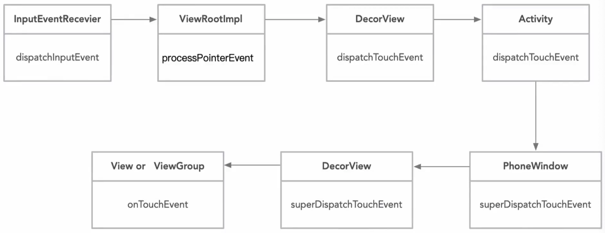

# View树的测绘流程

## Activity的核心知识点


[Activity 生命周期概念](https://developer.android.google.cn/guide/components/activities/activity-lifecycle?hl=zh_cn)

​	为了找到View测绘的地方，首先在Activity的生命周期中进行分析。Activity生命周期的第一个方法时attach()方法，第二个才是onCreate()方法。在这两个方法并没有找到View测绘相关的代码，于是我们从Activity的setContentView方法中进行分析。

```java
Activity.setContentView()
->AppCompatActivity.setContentView()
->AppCompatDelegateImpl.setContentView()
->ensureSubDecor()
->createSubDecor()
->PhoneWindow.setContentView(View view, ViewGroup.LayoutParams params)
```

​	经过分析Activity的setContentView仍然没有找到VIew测绘逻辑，在onStart方法中也没有。在onResume方法中获取不到View的宽高，所以View的测量是在Activity的onResume方法之后执行的。而Activity的onResume方法是在ActivityThread的handleResumeActivity()方法中调用的。具体分析如下。

## ViewRootImpl



```java
ViewRootImpl.requestLayout()
->scheduleTraversals()
->mChoreographer.postCallback(Choreographer.CALLBACK_TRAVERSAL, mTraversalRunnable, null);
(mTraversalRunnable执行测绘工作)
->performTraversals()
->performMeasure()
->mView.measure(childWidthMeasureSpec, childHeightMeasureSpec);
```

ViewRootImpl.java

```java
  @Override
  public void requestLayout() {
  	if (!mHandlingLayoutInLayoutRequest) {
      checkThread();
      mLayoutRequested = true;
      scheduleTraversals();
  	}
	}

  //线程检查
  void checkThread() {
    if (mThread != Thread.currentThread()) {
      throw new CalledFromWrongThreadException(
        "Only the original thread that created a view hierarchy can touch its views.");
    }
  }

  void scheduleTraversals() {
    if (!mTraversalScheduled) {
      mTraversalScheduled = true;
      //屏障消息
      mTraversalBarrier = mHandler.getLooper().getQueue().postSyncBarrier();
      mChoreographer.postCallback(Choreographer.CALLBACK_TRAVERSAL, mTraversalRunnable, null);
      if (!mUnbufferedInputDispatch) {
        scheduleConsumeBatchedInput();
      }
      notifyRendererOfFramePending();
      pokeDrawLockIfNeeded();
    }
  }
```

> 在Activity的onCreate( )方法中更新view是可以的。因为此时ViewRootImpl尚未创建，不会对更新View的线程进行检查。

## View的三大流程



```java
ActivityThread.java
  
@Override
public void handleResumeActivity(IBinder token, boolean finalStateRequest, boolean isForward,
            String reason) {
        // If we are getting ready to gc after going to the background, well
        // we are back active so skip it.
        unscheduleGcIdler();
        mSomeActivitiesChanged = true;

        // TODO Push resumeArgs into the activity for consideration
      	//开始执行Acitivty的onResume（）方法
        final ActivityClientRecord r = performResumeActivity(token, finalStateRequest, reason);
        if (r == null) {
            // We didn't actually resume the activity, so skipping any follow-up actions.
            return;
        }
        if (mActivitiesToBeDestroyed.containsKey(token)) {
            // Although the activity is resumed, it is going to be destroyed. So the following
            // UI operations are unnecessary and also prevents exception because its token may
            // be gone that window manager cannot recognize it. All necessary cleanup actions
            // performed below will be done while handling destruction.
            return;
        }

        final Activity a = r.activity;

        if (localLOGV) {
            Slog.v(TAG, "Resume " + r + " started activity: " + a.mStartedActivity
                    + ", hideForNow: " + r.hideForNow + ", finished: " + a.mFinished);
        }

        final int forwardBit = isForward
                ? WindowManager.LayoutParams.SOFT_INPUT_IS_FORWARD_NAVIGATION : 0;

        // If the window hasn't yet been added to the window manager,
        // and this guy didn't finish itself or start another activity,
        // then go ahead and add the window.
        boolean willBeVisible = !a.mStartedActivity;
        if (!willBeVisible) {
            try {
                willBeVisible = ActivityTaskManager.getService().willActivityBeVisible(
                        a.getActivityToken());
            } catch (RemoteException e) {
                throw e.rethrowFromSystemServer();
            }
        }
        if (r.window == null && !a.mFinished && willBeVisible) {
            r.window = r.activity.getWindow();
            View decor = r.window.getDecorView();
          	//将decorview设置为隐藏状态，是为了在测绘过程中软件盘弹起引起页面的闪动。
            decor.setVisibility(View.INVISIBLE);
            ViewManager wm = a.getWindowManager();
            WindowManager.LayoutParams l = r.window.getAttributes();
            a.mDecor = decor;
            l.type = WindowManager.LayoutParams.TYPE_BASE_APPLICATION;
            l.softInputMode |= forwardBit;
            if (r.mPreserveWindow) {
                a.mWindowAdded = true;
                r.mPreserveWindow = false;
                // Normally the ViewRoot sets up callbacks with the Activity
                // in addView->ViewRootImpl#setView. If we are instead reusing
                // the decor view we have to notify the view root that the
                // callbacks may have changed.
                ViewRootImpl impl = decor.getViewRootImpl();
                if (impl != null) {
                    impl.notifyChildRebuilt();
                }
            }
            if (a.mVisibleFromClient) {
                if (!a.mWindowAdded) {
                    a.mWindowAdded = true;
                  //从此处开始View的测绘工作的第一步，将decorView添加到windowManager上。
                    wm.addView(decor, l);
                } else {
                    // The activity will get a callback for this {@link LayoutParams} change
                    // earlier. However, at that time the decor will not be set (this is set
                    // in this method), so no action will be taken. This call ensures the
                    // callback occurs with the decor set.
                    a.onWindowAttributesChanged(l);
                }
            }

            // If the window has already been added, but during resume
            // we started another activity, then don't yet make the
            // window visible.
        } else if (!willBeVisible) {
            if (localLOGV) Slog.v(TAG, "Launch " + r + " mStartedActivity set");
            r.hideForNow = true;
        }

        // Get rid of anything left hanging around.
        cleanUpPendingRemoveWindows(r, false /* force */);

        // The window is now visible if it has been added, we are not
        // simply finishing, and we are not starting another activity.
        if (!r.activity.mFinished && willBeVisible && r.activity.mDecor != null && !r.hideForNow) {
            if (r.newConfig != null) {
                performConfigurationChangedForActivity(r, r.newConfig);
                if (DEBUG_CONFIGURATION) {
                    Slog.v(TAG, "Resuming activity " + r.activityInfo.name + " with newConfig "
                            + r.activity.mCurrentConfig);
                }
                r.newConfig = null;
            }
            if (localLOGV) Slog.v(TAG, "Resuming " + r + " with isForward=" + isForward);
            WindowManager.LayoutParams l = r.window.getAttributes();
            if ((l.softInputMode
                    & WindowManager.LayoutParams.SOFT_INPUT_IS_FORWARD_NAVIGATION)
                    != forwardBit) {
                l.softInputMode = (l.softInputMode
                        & (~WindowManager.LayoutParams.SOFT_INPUT_IS_FORWARD_NAVIGATION))
                        | forwardBit;
                if (r.activity.mVisibleFromClient) {
                    ViewManager wm = a.getWindowManager();
                    View decor = r.window.getDecorView();
                    wm.updateViewLayout(decor, l);
                }
            }

            r.activity.mVisibleFromServer = true;
            mNumVisibleActivities++;
            if (r.activity.mVisibleFromClient) {
              //恢复deorview的可见性
                r.activity.makeVisible();
            }
        }

        r.nextIdle = mNewActivities;
        mNewActivities = r;
        if (localLOGV) Slog.v(TAG, "Scheduling idle handler for " + r);
        Looper.myQueue().addIdleHandler(new Idler());
}
```

```java
WindowManagerGlobal.java

public void addView(View view, ViewGroup.LayoutParams params,
            Display display, Window parentWindow) {
        if (view == null) {
            throw new IllegalArgumentException("view must not be null");
        }
        if (display == null) {
            throw new IllegalArgumentException("display must not be null");
        }
        if (!(params instanceof WindowManager.LayoutParams)) {
            throw new IllegalArgumentException("Params must be WindowManager.LayoutParams");
        }

        final WindowManager.LayoutParams wparams = (WindowManager.LayoutParams) params;
        if (parentWindow != null) {
            parentWindow.adjustLayoutParamsForSubWindow(wparams);
        } else {
            // If there's no parent, then hardware acceleration for this view is
            // set from the application's hardware acceleration setting.
            final Context context = view.getContext();
            if (context != null
                    && (context.getApplicationInfo().flags
                            & ApplicationInfo.FLAG_HARDWARE_ACCELERATED) != 0) {
                wparams.flags |= WindowManager.LayoutParams.FLAG_HARDWARE_ACCELERATED;
            }
        }

        ViewRootImpl root;
        View panelParentView = null;

        synchronized (mLock) {
            // Start watching for system property changes.
            if (mSystemPropertyUpdater == null) {
                mSystemPropertyUpdater = new Runnable() {
                    @Override public void run() {
                        synchronized (mLock) {
                            for (int i = mRoots.size() - 1; i >= 0; --i) {
                                mRoots.get(i).loadSystemProperties();
                            }
                        }
                    }
                };
                SystemProperties.addChangeCallback(mSystemPropertyUpdater);
            }

            int index = findViewLocked(view, false);
            if (index >= 0) {
                if (mDyingViews.contains(view)) {
                    // Don't wait for MSG_DIE to make it's way through root's queue.
                    mRoots.get(index).doDie();
                } else {
                    throw new IllegalStateException("View " + view
                            + " has already been added to the window manager.");
                }
                // The previous removeView() had not completed executing. Now it has.
            }

            // If this is a panel window, then find the window it is being
            // attached to for future reference.
            if (wparams.type >= WindowManager.LayoutParams.FIRST_SUB_WINDOW &&
                    wparams.type <= WindowManager.LayoutParams.LAST_SUB_WINDOW) {
                final int count = mViews.size();
                for (int i = 0; i < count; i++) {
                    if (mRoots.get(i).mWindow.asBinder() == wparams.token) {
                        panelParentView = mViews.get(i);
                    }
                }
            }

          //实例化ViewRootImpl
            root = new ViewRootImpl(view.getContext(), display);

            view.setLayoutParams(wparams);

            mViews.add(view);
            mRoots.add(root);
            mParams.add(wparams);

            // do this last because it fires off messages to start doing things
            try {
                root.setView(view, wparams, panelParentView);
            } catch (RuntimeException e) {
                // BadTokenException or InvalidDisplayException, clean up.
                if (index >= 0) {
                    removeViewLocked(index, true);
                }
                throw e;
            }
        }
    }
```

## Vsync消息队列CallbackQueue模型



## 手势分发




## requestLayout和invalidate 区别

[Android View 深度分析requestLayout、invalidate与postInvalidate](https://blog.csdn.net/a553181867/article/details/51583060)

一般来说，如果View确定自身不再适合当前区域，比如说它的LayoutParams发生了改变，需要父布局对其进行重新测量、布局、绘制这三个流程，往往使用requestLayout。而invalidate则是刷新当前View，使当前View进行重绘，不会进行测量、布局流程，因此如果View只需要重绘而不需要测量，布局的时候，使用invalidate方法往往比requestLayout方法更高效。


