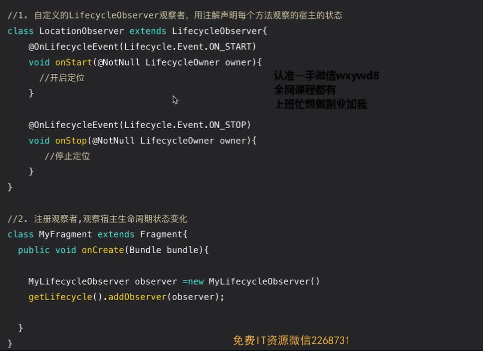
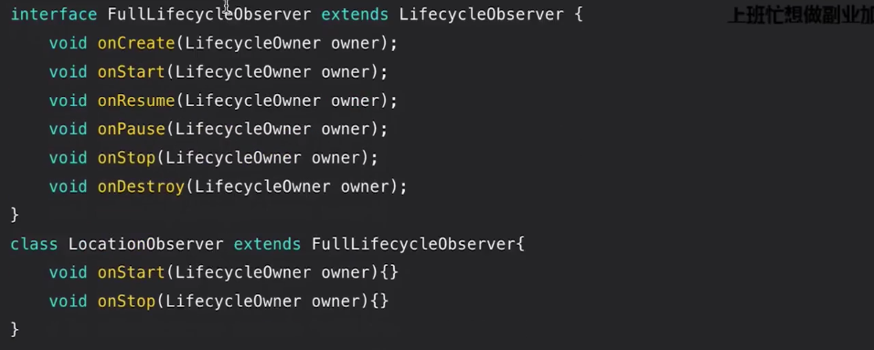
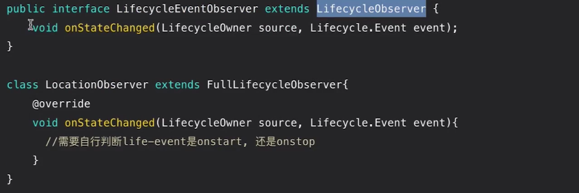
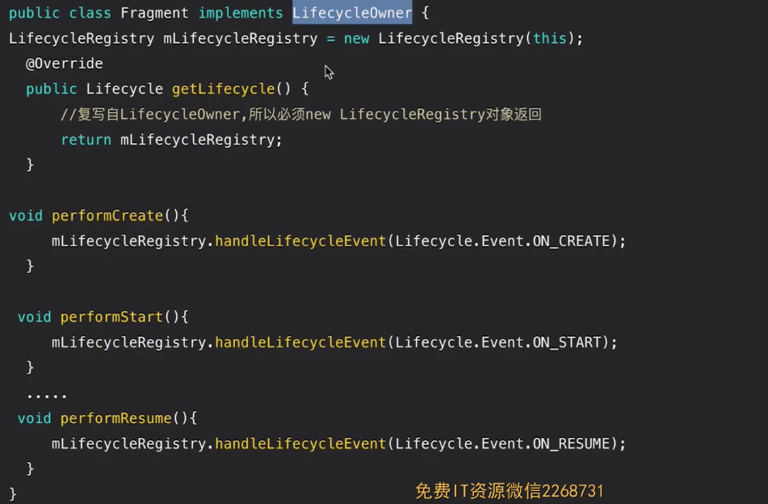
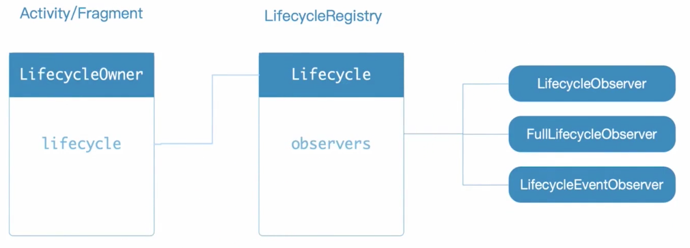
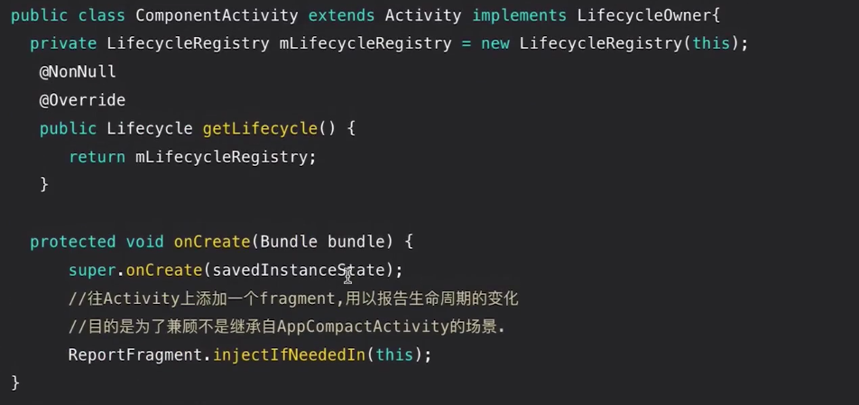
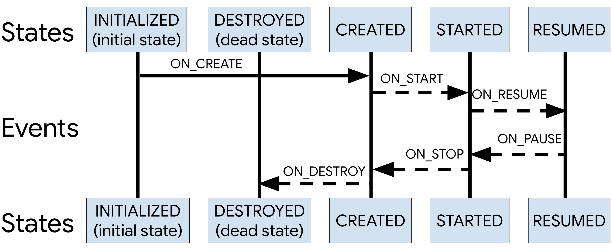
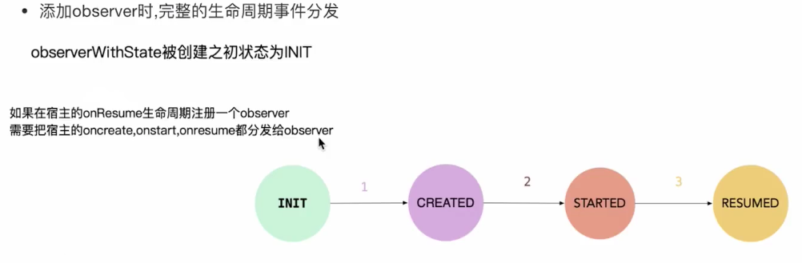

# Lifecycle架构组件原理解析

## 什么是Lifecycle

具备宿主生命周期感知能力的组件。它能持有组件（Activity或Fragment）生命周期状态的信息，并且允许其他观察者监听宿主的状态

## 使用方法

（1）



（2）



（3）



## Fragment实现Lifecyle



## LifecycleOwner、Lifecycle、LifecycleRegistry的关系



## Activity实现Lifecycle



ReportFragment.java

```java
public class ReportFragment extends Fragment {
    private static final String REPORT_FRAGMENT_TAG = "androidx.lifecycle"
            + ".LifecycleDispatcher.report_fragment_tag";

    public static void injectIfNeededIn(Activity activity) {
        // ProcessLifecycleOwner should always correctly work and some activities may not extend
        // FragmentActivity from support lib, so we use framework fragments for activities
        android.app.FragmentManager manager = activity.getFragmentManager();
        if (manager.findFragmentByTag(REPORT_FRAGMENT_TAG) == null) {
            manager.beginTransaction().add(new ReportFragment(), REPORT_FRAGMENT_TAG).commit();
            // Hopefully, we are the first to make a transaction.
            manager.executePendingTransactions();
        }
    }

    static ReportFragment get(Activity activity) {
        return (ReportFragment) activity.getFragmentManager().findFragmentByTag(
                REPORT_FRAGMENT_TAG);
    }

    private ActivityInitializationListener mProcessListener;

    private void dispatchCreate(ActivityInitializationListener listener) {
        if (listener != null) {
            listener.onCreate();
        }
    }

    private void dispatchStart(ActivityInitializationListener listener) {
        if (listener != null) {
            listener.onStart();
        }
    }

    private void dispatchResume(ActivityInitializationListener listener) {
        if (listener != null) {
            listener.onResume();
        }
    }

    @Override
    public void onActivityCreated(Bundle savedInstanceState) {
        super.onActivityCreated(savedInstanceState);
        dispatchCreate(mProcessListener);
        dispatch(Lifecycle.Event.ON_CREATE);
    }

    @Override
    public void onStart() {
        super.onStart();
        dispatchStart(mProcessListener);
        dispatch(Lifecycle.Event.ON_START);
    }

    @Override
    public void onResume() {
        super.onResume();
        dispatchResume(mProcessListener);
        dispatch(Lifecycle.Event.ON_RESUME);
    }

    @Override
    public void onPause() {
        super.onPause();
        dispatch(Lifecycle.Event.ON_PAUSE);
    }

    @Override
    public void onStop() {
        super.onStop();
        dispatch(Lifecycle.Event.ON_STOP);
    }

    @Override
    public void onDestroy() {
        super.onDestroy();
        dispatch(Lifecycle.Event.ON_DESTROY);
        // just want to be sure that we won't leak reference to an activity
        mProcessListener = null;
    }

    private void dispatch(Lifecycle.Event event) {
        Activity activity = getActivity();
        if (activity instanceof LifecycleRegistryOwner) {
            ((LifecycleRegistryOwner) activity).getLifecycle().handleLifecycleEvent(event);
            return;
        }

        if (activity instanceof LifecycleOwner) {
            Lifecycle lifecycle = ((LifecycleOwner) activity).getLifecycle();
            if (lifecycle instanceof LifecycleRegistry) {
                ((LifecycleRegistry) lifecycle).handleLifecycleEvent(event);
            }
        }
    }

    void setProcessListener(ActivityInitializationListener processListener) {
        mProcessListener = processListener;
    }

    interface ActivityInitializationListener {
        void onCreate();

        void onStart();

        void onResume();
    }
}
```

- 宿主生命周期与宿主状态模型图



```java
LifecycleRegistry.java

public void addObserver(@NonNull LifecycleObserver observer) {
        State initialState = mState == DESTROYED ? DESTROYED : INITIALIZED;
        ObserverWithState statefulObserver = new ObserverWithState(observer, initialState);
        ObserverWithState previous = mObserverMap.putIfAbsent(observer, statefulObserver);

        if (previous != null) {
            return;
        }
        LifecycleOwner lifecycleOwner = mLifecycleOwner.get();
        if (lifecycleOwner == null) {
            // it is null we should be destroyed. Fallback quickly
            return;
        }

        boolean isReentrance = mAddingObserverCounter != 0 || mHandlingEvent;
  			
  			//计算当前observer应该到达的状态
        State targetState = calculateTargetState(observer);
        mAddingObserverCounter++;
  
  			//宿主状态的前进
        while ((statefulObserver.mState.compareTo(targetState) < 0
                && mObserverMap.contains(observer))) {
            pushParentState(statefulObserver.mState);
            statefulObserver.dispatchEvent(lifecycleOwner, upEvent(statefulObserver.mState));
            popParentState();
            // mState / subling may have been changed recalculate
            targetState = calculateTargetState(observer);
        }

        if (!isReentrance) {
            // we do sync only on the top level.
            sync();
        }
        mAddingObserverCounter--;
    }
```



