# ViewModel

 ## 什么是ViewModel

- 具备宿主生命周期感知能力的数据存储组件

- ViewModel保存的数据，在页面因**配置变更导致页面销毁重建**之后依然也是存在的

  > 配置变更：横竖屏切换、分辨率调整、权限变更、系统字体样式变更

## ViewModel的用法

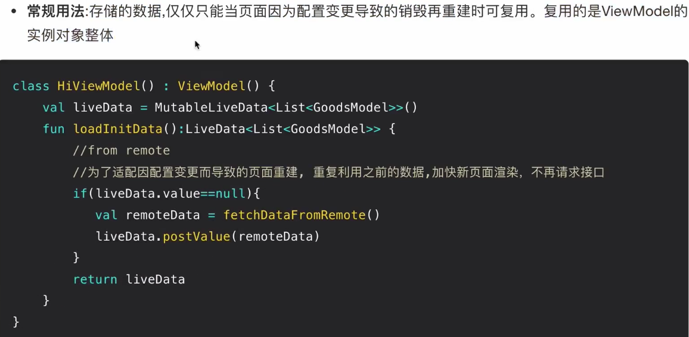

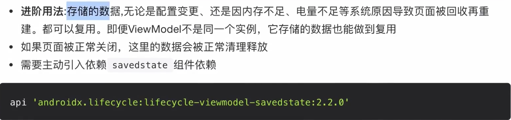

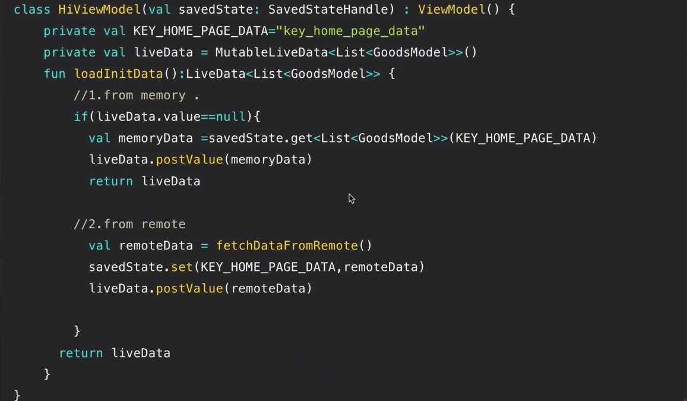

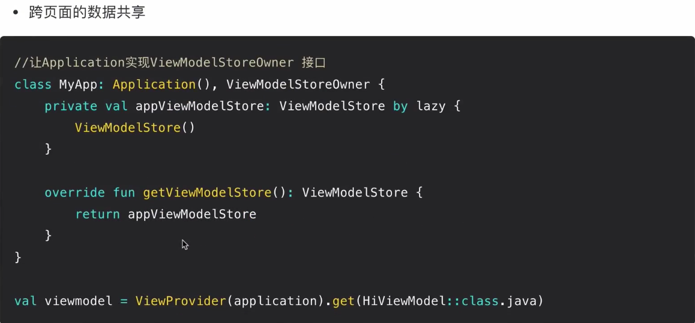

## 配置变更ViewModel复用实现原理

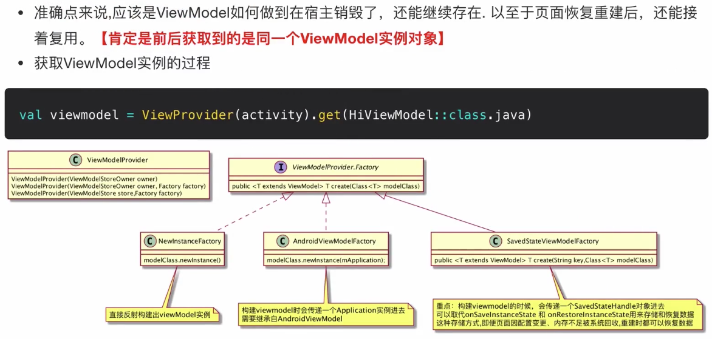

## SaveState
- SavedStatedHandle的数据存储与恢复。即便ViewModel不是同一个实例，它存储的数据也能做到复用
- SavedStateRegistryController：用于创建SaveStatedRegistry
- SavedStatedRegistry数据存储、恢复中心。
- SavedStateHandle:单个ViewModel数据存储、恢复

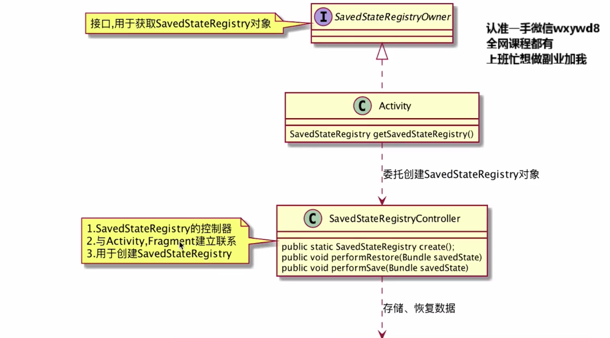

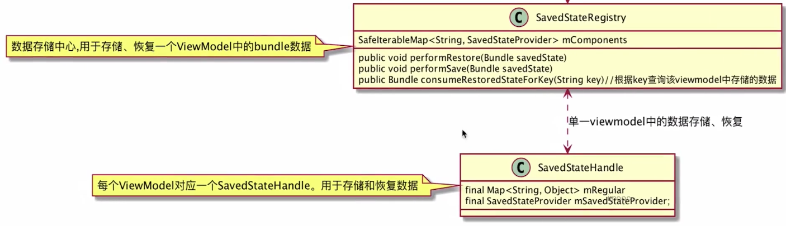

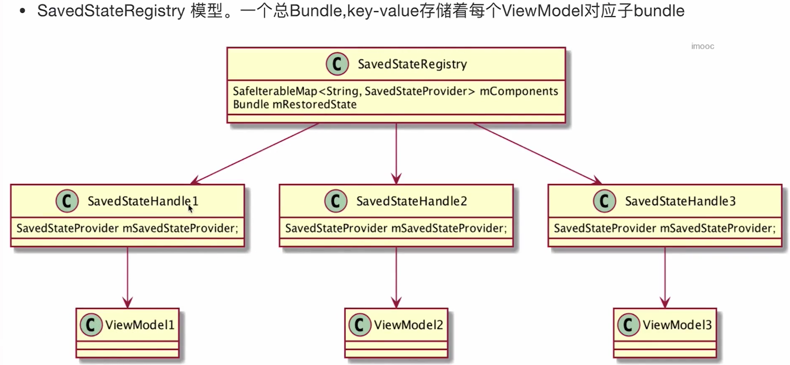

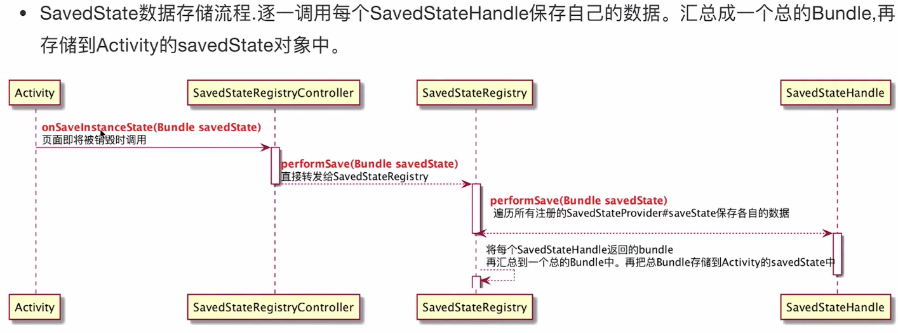

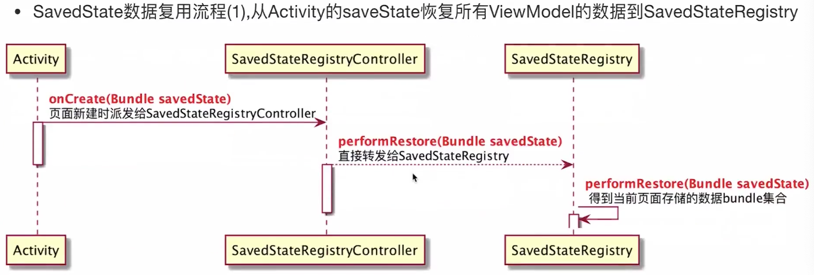

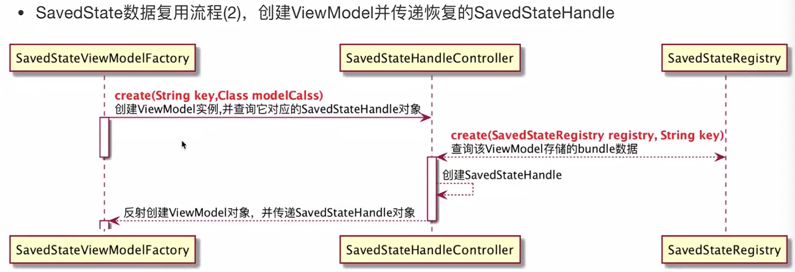

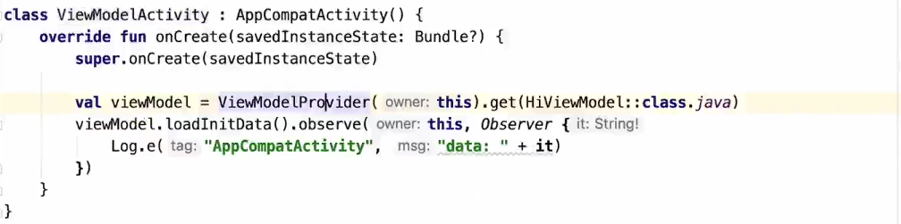

用法一

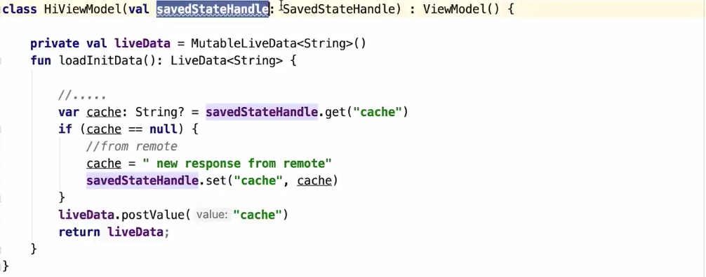

用法二

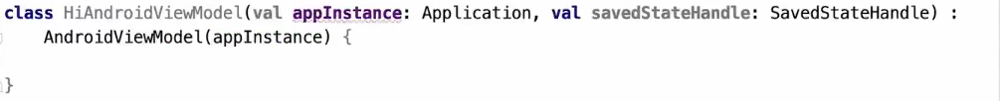

## 总结

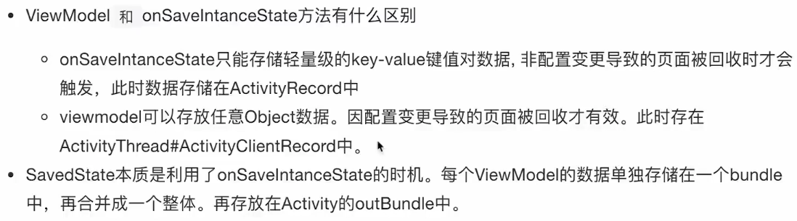

