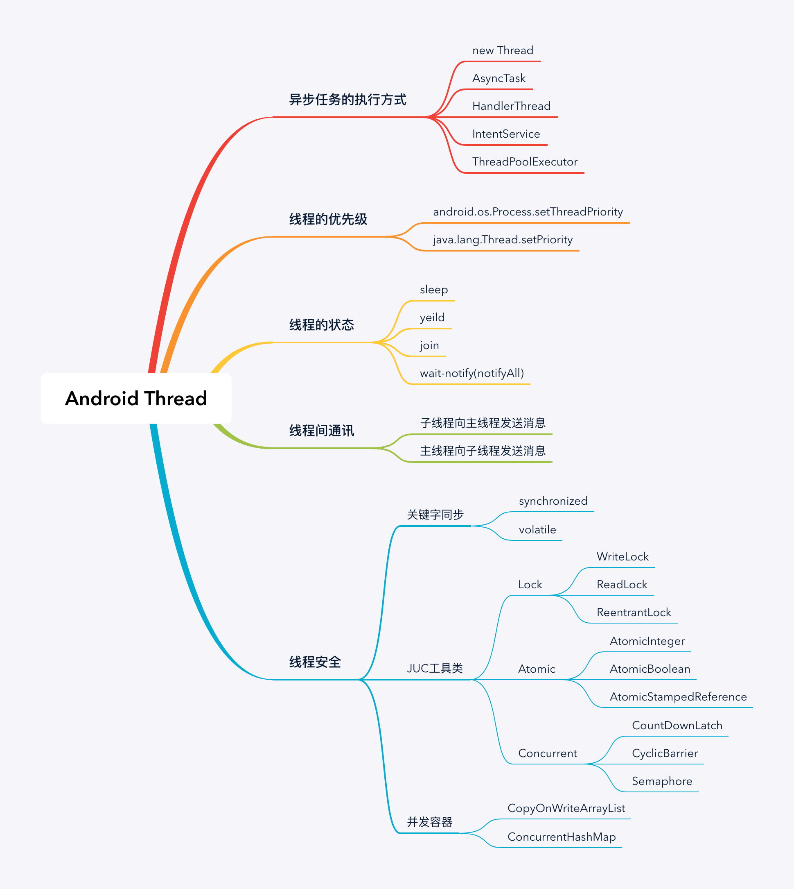
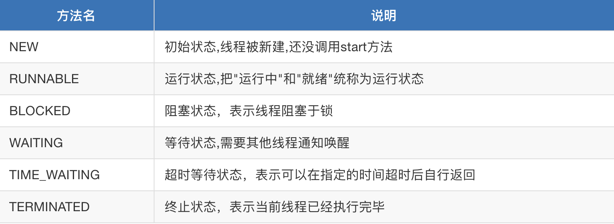
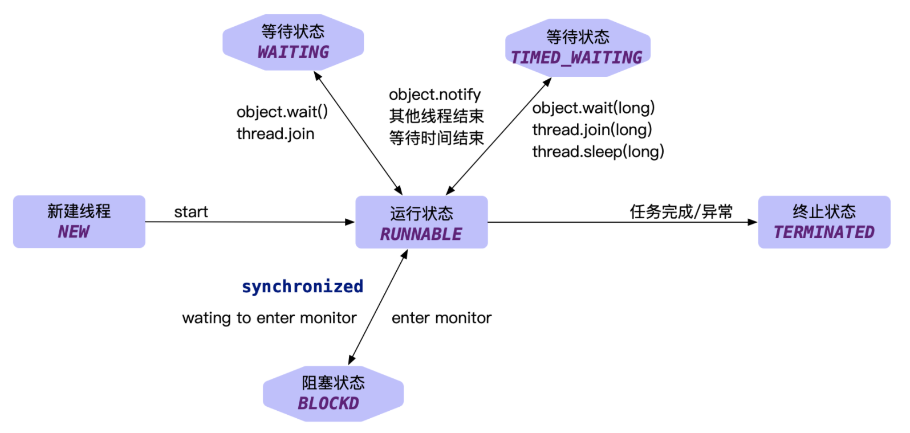
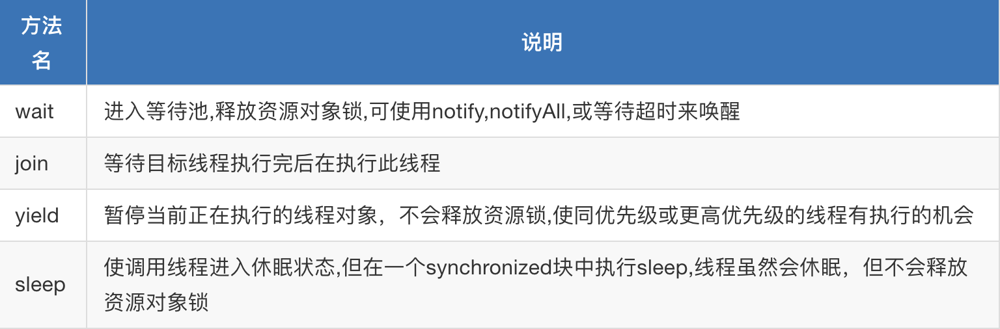
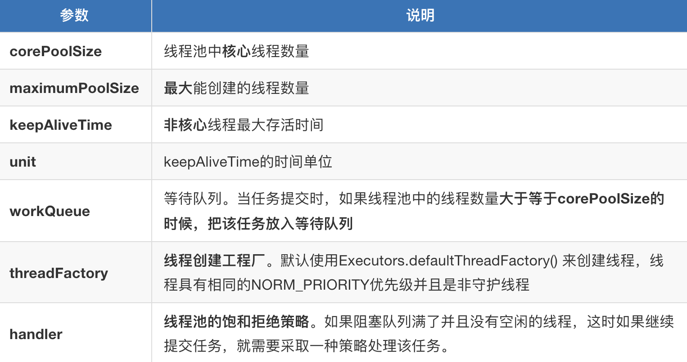
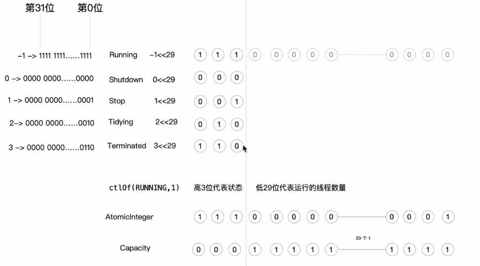

# 走进Android线程世界

[走进Android线程世界](https://doc.devio.org/as/book/docs/Part2/%E7%BA%BF%E7%A8%8B%E4%B8%8E%E7%BA%BF%E7%A8%8B%E6%B1%A0%E5%BC%80%E5%8F%91%E6%A0%B8%E5%BF%83%E6%8A%80%E6%9C%AF/1.thread_introduction.html)

[TOC]



## 线程与进程

-  一个进程至少一个线程

- 进程可以包含多个线程

-  进程在执行过程中拥有独立的内存空间，而线程运行在进程内

## 线程的几种创建方式

-  new Thread：可复写Thread#run方法。也可传递Runnable对象，更加灵活。 

  缺点:缺乏统一管理，可能无限制新建线程，相互之间竞争，及可能占用过多系统资源导致死机或oom

```java
//传递Runnable对象
1.
new Thread(new Runnable(){ ..... }).start() 
  
//复写Thread#run方法 
2.
class MyThread extends Thread{
  public void run(){ .... }
} 
new MyThread().start()
```

- AysncTask,轻量级的异步任务工具类,提供任务执行的进度回调给UI线程 

  场景：需要知晓任务执行的进度,多个任务串行执行 

  缺点：生命周期和宿主的生命周期不同步,有可能发生内存泄漏,默认情况所有任务串行执行

```java
class MyAsyncTask : AsyncTask<Any?, Any?, Any?>() {
  
  	private static final String TAG = "MyAsyncTask";
  
    //在线程池中运行，此方法用于执行异步任务
    protected fun doInBackground(vararg params: String?): String? {
        for (i in 0..9) {
            //此方法用于更新任务进度
            publishProgress(i * 10)
        }
      
        //返回任务结果给onPostExecute方法
        return params[0]
    }

    //在主线程中运行，在异步任务执行之后此方法会被调用
    protected fun onPostExecute(result: String) {
        Log.e(TAG, "result: $result")
    }

    //在主线程中运行，当后台任务的执行进度发生改变时此方法会被调用
    protected fun onProgressUpdate(vararg values: Int) {
        Log.e(TAG, "onProgressUpdate: " + values[0])
    }

    companion object {
        private const val TAG = "MyAsyncTask"
    }
}

// #1 子类复写方法 
AsyncTask asyncTask = new MyAsyncTask();

//AsyncTask所有任务默认串行执行 
asyncTask.execute("execute MyAsyncTask");
 or
 //并发执行
asyncTask.executeOnExecutor(AsyncTask.THREAD_POOL_EXECUTOR,"execute MyAsyncTask")
   
// #2 使用#execute方法，同样串行执行 
AsyncTask.execute(new Runnable() {
  @Override public void run() { ...... } 
});

// #3 使用内置THREAD_POOL_EXECUTOR线程池 并发执行 
AsyncTask.THREAD_POOL_EXECUTOR.execute(new Runnable() {
  @Override public void run() {
    
  }
})
```

- HandlerThread,适用于主线程需要和工作线程通信,适用于持续性任务,比如轮训的场景，所有任务串行执行 

  缺点:不会像普通线程一样主动销毁资源，会一直运行着，所以可能会造成内存泄漏

```java
HandlerThread thread = new HandlerThread("concurrent-thread"); 
thread.start();

ThreadHandler handler = new ThreadHandler(thread.getLooper()) {
    @Override public void handleMessage( @NonNull Message msg) {
        switch(msg.what) {
            case MSG_WHAT_FLAG_1 : 
            	break; 
        }
    }
};
handler.sendEmptyMessage(MSG_WHAT_FLAG_1);
thread.quitSafely();

//定义成静态,防止内存泄漏 
static class ThreadHandler extends Handler{
    public ThreadHandler (Looper looper){
        super(looper) 
    }
}
```

- IntentService,适用于我们的任务需要跨页面读取任务执行的进度，结果。比如后台上传图片，批量操作数据库等。任务执行完成功后，就会自我结束，所以不需要手动stopservice,这是他跟service的区分

```java
class MyIntentService extends IntentService{
    @Override protected void onHandleIntent(@Nullable Intent intent) {
        int command = intent.getInt ("command")
        ...... 
    }
}
context.startService(new Intent())
```

- ThreadPoolExecutor:适用快速处理大量耗时较短的任务场景

```java
Executors.newCachedThreadPool();//线程可复用线程池
Executors.newFixedThreadPool();//固定线程数量的线程池
Executors.newScheduledThreadPool();//可指定定时任务的线程池
Executors.newSingleThreadExecutor();//线程数量为1的线程池
```


## 线程的优先级

```java
public static void main(String[] args){
    Thread thread = new Thread();
    thread.start();
    int ui_proi = Process.getThreadPriority (0)
    int th_proi = thread.getPriority ();

    //输出结果
    ui_proi =5
    th_proi =5
}
```

- 线程的优先级具有继承性，在某线程中创建的线程会继承此线程的优先级。那么我们在UI线程中创建了线程，则线程优先级是和UI线程优先级一样，平等的和UI线程抢占CPU时间片资源。 
- JDK Api,限制了新设置的线程的优先级必须为[1~10],优先级priority的值越高，获取CPU时间片的概率越高。UI线程优先级为5

```java
java.lang.Thread.setPriority(int newPriority)
```

- Android Api, 可以为线程设置更加精细的优先级(-20~19).优先级priority的值越低，获取CPU时间片的概率越高。UI线程优先级为-10

```java
android.os.Process.setThreadPriority(int newPriority)
```

## 线程的几种状态与常用方法







## 线程间消息通讯

- 主线程向子线程发送消息

```java
class LooperThread extends Thread {
    private Looper looper;
    public Looper getLooper() {
        synchronized(this) {
            if (looper == null && isAlive()) {
                try {
                    wait();
                } catch (InterruptedException e) {
                    e.printStackTrace();
                }
            }
        }
        return looper;
    	}
  
      @Override 
      public void run() {
          Looper.prepare(); 
          synchronized(this) {
            looper = Looper.myLooper();
            notifyAll();
          }
          Looper.loop();
      }

      public void quit() {
          looper.quit();
      }
}

LooperThread looperThread = new LooperThread();
looperThread.start();
Handler handler = new Handler(looperThread.getLooper()) {
    @Override public void handleMessage(@NonNull Message msg) {
        Log.e(TAG, "handleMessage: " + msg.what);
    }
};
handler.sendEmptyMessage(MSG_WHAT_FLAG_1);
```

## 使用FutureTask获取子线程的执行结果

```java
//如果要拿到子线程的执行结果，可采用此方式
UserCallback userCallback = new UserCallback();
FutureTask<String> futureTask = new FutureTask<>(userCallback);
new Thread(futureTask).start();

try {
  //get() 获取任务执行结果，任务结束之前会阻塞。
  System.out.println(futureTask.get());
} catch (ExecutionException e) {
  e.printStackTrace();
}

public static class UserCallback implements Callable<String> {
  @Override
  public String call() throws Exception {
    return "CallResult";
  }
}
```

# 什么是线程并发安全

>演示买票场景
>
>线程安全的本质是 能够让并发线程，有序的运行（这个有序有可能是先来后到排队，有可能有人插队，但不管怎么着，同一时刻只能一个线程有权访问同步资源），线程执行的结果，能够对其他线程可见。

## 线程安全的几种分类

- synchronized关键字 
- ReentrantLock锁 
- AtomicInteger...原子类


- synchronized，ReentrantLock-锁


- 原子类-自旋


- 锁适合写操作多的场景，先加锁可以保证写操作时数据正确。
- 原子类适合读操作多的场景，不加锁的特点能够使其读操作的性能大幅提升。

## 如何保证线程安全

- AtomicInterger原子包装类，CAS（Compare-And-Swap）实现无锁数据更新。自旋的设计能够有效避免线程因阻塞-唤醒带来的系统资源开销

- 适用场景：多线程计数,原子操作,并发数量小的场景。

  ```java
  //# 1构建对象 
  AtomicInteger atomicInteger = new AtomicInteger(1);
  //#2 调用Api 
  atomicInteger.getAndIncrement();
  atomicInteger.getAndAdd(2); 
  atomicInteger.getAndDecrement() 
  atomicInteger.getAndAdd(-2);
  ```

  

- volatile可见性修饰 

  volatile修饰的成员变量在每次被线程访问时，都强迫从共享内存重新读取该成员的值，而且，当成员变量值发生变化时，强迫将变化的值重新写入共享内存， 不能解决非原子操作的线程安全性。性能不及原子类高

  ```java
  volatile int count 
  public void increment() { 
  	//其他线程可见
  	count =5 
  
    //非原子操作,其他线程不可见 
    count = count + 1; 
    count++; 
  }
  ```

- synchronized

   锁java对象，锁Class对象，锁代码块

  - 锁方法。加在方法上，未获取到对象锁的其他线程都不可以访问该方法

    ```java
    synchronized void printThreadName() { }
    ```

  - 锁Class对象。加在static 方法上相当于给Class对象加锁，哪怕是不同的java 对象实例，也需要排队执行

    ```java
    static synchronized void printThreadName() { }
    ```

  - 锁代码块。未获取到对象锁的其他线程可以执行同步块之外的代码

    ```java
    void printThreadNam() {
      String name = Thread.currentThread().getName(); 
      System.out.println("线程：" + name + " 准备好了..."); 
      synchronized (this) { } 
    }
    ```

  Synchronized的优势是什么呢？

- 哪怕我们一个同步方法中出现了异常，那么jvm也能够为我们自动释放锁，能主动从而规避死锁。不需要开发者手动释放锁。

  

  劣势是什么呢？

-  必须要等到获取锁对象的线程执行完成，或者出现异常，才能释放掉。不能中途释放锁，不能中断一个正在试图获得锁的线程 

- 另外咱们也不知道多个线程竞争锁的时候，获取锁成功与否，所以不够灵活 

- 每个锁仅有单一的条件(某个对象)不能设定超时


- ReentrantLock悲观锁 ，可重入锁，公平锁，非公平锁

  - 基本用法

    ```java
    ReentrantLock lock = new ReentrantLock(); 
    try{ 
      lock.lock() 
      ... 
    }finally{
      lock.unLock() 
    }
    
    void lock()//获取不到会阻塞 
    boolean tryLock()//尝试获取锁，成功返回true。 
    boolean tryLock(3000, TimeUnit.MILLISECONDS)//在一定时间内去不断尝试获取锁 
    void lockInterruptibly();//可使用Thread.interrupt()打断阻塞状态，退出竞争，让给其他线程
    ```

  - 可重入,避免死锁

    ```java
    ReentrantLock lock = new ReentrantLock(); 
    public void doWork(){
      try{
        lock.lock()
        doWork();//递归调用,使得同一线程多次获得锁 
      }finally{
        lock.unLock() 
      } 
    }
    ```

    - 公平锁与非公平锁， 公平锁

    - 所有进入阻塞的线程排队依次均有机会执行 

    - 默认非公平锁，允许线程插队，避免每一个线程都进入阻塞，再唤醒，性能高。因为线程可以插队，导致队列中可能会存在线程饿死的情况，一直得不到锁，一直得不到执行

      ```java
      ReentrantLock lock = new ReentrantLock(true/false);
      ```

  - ReentrantLock进阶用法 --Condition条件对象

    可使用它的await-signal 指定唤醒一个(组)线程。相比于wait-notify要么全部唤醒，要么只能唤醒一个，更加灵活可控

    ```java
    ReentrantLock lock = new ReentrantLock(); 
    Condition worker1 = lock.newCondition(); 
    Condition worker2 = lock.newCondition(); 
    
    class Worker1{ 
    	.....
    	worker1.await()//进入阻塞,等待唤醒 
    	..... 
    } 
    
    class Worker2{
    	..... 
    	worker2.await()//进入阻塞,等待唤醒 
    	..... 
    } 
    
    class Boss{
      if(...){
        worker1.signal()//指定唤醒线程1 
      }else{
        worker2.signal()//指定唤醒线程2 
      }
      
    }
    ```

  - ReentrantReadWriteLock共享锁，排他锁

    - 共享锁，所有线程均可同时获得，并发量高，比如在线文档查看
    - 排他锁，同一时刻只有一个线程有权修改资源，比如在线文档编辑

    ```java
    ReentrantReadWriteLock reentrantReadWriteLock; 
    ReentrantReadWriteLock.ReadLock readLock;
    ReentrantReadWriteLock.WriteLock writeLock;
    ```

## 如何正确的使用锁&原子类

- 减少持锁时间

  尽管锁在同一时间只能允许一个线程持有，其它想要占用锁的线程都得在临界区外等待锁的释放，这个等待的时间根据实际的应用及代码写法可长可短。

  ```java
  public void syncMethod(){ 
      noneLockedCode1();//2s 
    
      synchronized(this){ 
      	needLockedMethed();2s 
  		} 
    
  		noneLockedCode2();2s 
  }
  ```

- 锁分离

  读读，读写，写读，写写。只要有写锁进入才需要做同步处理，但是对于大多数应用来说，读的场景要远远大于写的场景，因此一旦使用读写锁，在读多写少的场景中，就可以很好的提高系统的性能，这就是锁分离

  

- 锁粗化

  多次加锁,

  ```java
  public void doSomethingMethod(){ 
    synchronized(lock){
    	//do some thing 
    } 
    ..... 
    //这是还有一些代码，做其它不需要同步的工作，但能很快执行完毕 
    ..... 
    synchronized(lock){
    	//do other thing 
    } 
  }
  
  
  public void doSomethingMethod(){
    //进行锁粗化：整合成一次锁请求、释放 
    synchronized(lock){ 
      //do some thing 
      //做其它不需要同步但能很快执行完的工作 
      //do other thing 
    } 
  }
  ```

- 原子类

  在并发量不大且读多写少的场景下使用较好，因为原子类再写入数据的 是通过do-while循环，不停的把当前内存的值和寄存器中的值 做比较来实现的，在并发量大的时候，相比原子类的自旋,加锁的性能会更高。

- 并发容器

  ConcurrentHashMap、CopyOnWriteArrayList

## 线程协作

- Object.wait--notify(notifyAll) 

  搭配Synchronized使用,简单易用,特别要注意wait先于notify调用,否则会出现死锁。 

- Condition.await--signal(signalAll) 

  搭配ReentrantLock,指定唤醒,按组唤醒。更加安全和高效。因此通常来说比较推荐使用Condition 

- CountDownLatch 

  是通过一个计数器来实现的，计数器的初始值是线程的数量。每当一个线程执行完毕后，计数器的值就-1，当计数器的值为0时，表示所有线程都执行完毕，然后在闭锁上等待的线程就可以恢复工作了 

  wait()：让调用者线程进入阻塞,谁调用谁阻塞 

  countDown():使得计数器的值-1,为0时，阻塞线程被唤醒

  ```java
  CountDownLatch latch = new CountDownLatch(5); 
  ExecutorService service = Executors.newFixedThreadPool(5); 
  for (int i = 0; i < 5; i++) { 
    final int no = i + 1; 
    Runnable runnable = new Runnable() { 
      @Override public void run() { 
        try { 
          	Thread.sleep((long) (Math.random() * 10000)); 
             System.out.println("No." + no + "准备好了。"); 
        } catch (InterruptedException e) { 
          e.printStackTrace(); 
        } finally {
          latch.countDown();
        } 
      }
    };
    service.submit(runnable);
  } 
  System.out.println("等待所有人准备完毕....."); 
  latch.await(); 
  System.out.println("所有人都准备好了，可以发车了");
  ```

- Semaphore

   信号量,常用于并发限流,基于“许可证”的并发控制 

  - void acquire(int permits)：阻塞获取许可证 
  - boolean tryAcquire(int permits):尝试获取许可证,立刻返回 
  - boolean tryAcquire(int permits, long timeout, TimeUnit unit) 
  - release(int permits):释放已获得许可数量

```JAVA
Semaphore semaphore = new Semaphore(3); 
for (int i=0;i<10;i++){ 
  int finalIndex =i+1; 
  new Thread(new Runnable(){
    @Override public void run() { 
      //获取许可证 
      semaphore.acquire(); 
      Thread.sleep(newRandom().nextInt(5000)); //模拟随机执行时长 
      System.out.println("working thread No:"+finalIndex) 
      //释放许可证 
      semaphore.release();
    } 
  }).start() }
```

## 协程

协程是一种解决方案，是一种解决嵌套,并发,弱化线程概念的方案。能让多个任务之间更好的协作,能够以同步的方式编排代码完成异步工作。将异步代码写的像同步代码一样直观。

```kotlin
GlobalScope.launch(Dispatchers.Main){
  	val value1 = request1() 
    val value2 = request2(value1) 
    val value3 = request2(value2） 
    updateUI(value3) 
 } 

suspend request1( ) 
suspend request2(..) 
suspend request3(..)
```

# 深入理解Android线程池实现原理

## 为什么要引入线程池

- 降低资源消耗。通过重复利用已创建的线程降低线程创建和销毁造成的消耗。 
- 提高响应速度。当任务到达时，任务可以不需要的等到线程创建就能立即执行。 
- 提高线程的可管理性。线程是稀缺资源，如果无限制的创建，不仅会消耗系统资源，还会降低系统的稳定性，使用线程池可以进行统一的分配，调优和监控。

## Java中几种默认的线程池

- 如何创建线程池

  ```JAVA
  ThreadPoolExecutor executor = new ThreadPoolExecutor(
    5, 
    100, 
    10, 
    TimeUnit.SECONDS,
    new PriorityBlockingQueue()
  ); 
  
  for(int index=0;index=100;index++){ 
  	executor.execute(new Runnable()); 
  }
  
  
  
  public ThreadPoolExecutor(
      int corePoolSize,
      int maximumPoolSize, 
      long keepAliveTime, 
      TimeUnit unit,
      BlockingQueue workQueue, 
      ThreadFactory threadFactory, 
      RejectedExecutionHandler handler
  )
  ```

  

- JUC包下Executors提供的几种线程池

  ```JAVA
  //单一线程数,同时只有一个线程存活,但线程等待队列无界 
  Executors.newSingleThreadExecutor(); 
  //线程可复用线程池,核心线程数为0，最大可创建的线程数为Interger.max,线程复用存活时间是60s. 
  Executors.newCachedThreadPool(); 
  //固定线程数量的线程池 
  Executors.newFixedThreadPool(int corePoolSize); 
  //可执行定时任务,延迟任务的线程池 
  Executors.newScheduledThreadPool(int corePoolSize);
  ```

  

- 线程池重要方法

  ```JAVA
  void execute(Runnable run)//提交任务,交由线程池调度 
  void shutdown()//关闭线程池,等待任务执行完成 
  void shutdownNow()//关闭线程池，不等待任务执行完成 
  int getTaskCount()//返回线程池中所有任务的数量 
  int getCompletedTaskCount()//返回线程池中已执行完成的任务数量 
  int getPoolSize()//返回线程池中已创建线程数量 
  int getActiveCount()//返回当前正在运行的线程数量
  ```

  

- 线程池状态流转

  

- execute提交任务流程

  

  > ThreadPoolExecutor.java 中的 int值位移操作实现状态标识
  >
  > ```java
  > private final AtomicInteger ctl = new AtomicInteger(ctlOf(RUNNING, 0));
  > private static final int COUNT_BITS = Integer.SIZE - 3; //32-3=29
  > private static final int CAPACITY   = (1 << COUNT_BITS) - 1;
  > 
  > // runState is stored in the high-order bits
  > private static final int RUNNING    = -1 << COUNT_BITS;//-1左移29位
  > private static final int SHUTDOWN   =  0 << COUNT_BITS;//0左移29位
  > private static final int STOP       =  1 << COUNT_BITS;
  > private static final int TIDYING    =  2 << COUNT_BITS;
  > private static final int TERMINATED =  3 << COUNT_BITS;
  > 
  > // Packing and unpacking ctl
  > private static int runStateOf(int c)     { return c & ~CAPACITY; }
  > private static int workerCountOf(int c)  { return c & CAPACITY; }
  > private static int ctlOf(int rs, int wc) { return rs | wc; }
  > ```



```java
public void execute(Runnable command) {
        if (command == null)
            throw new NullPointerException();
        /*
         * Proceed in 3 steps:
         *
         * 1. If fewer than corePoolSize threads are running, try to
         * start a new thread with the given command as its first
         * task.  The call to addWorker atomically checks runState and
         * workerCount, and so prevents false alarms that would add
         * threads when it shouldn't, by returning false.
         *
         * 2. If a task can be successfully queued, then we still need
         * to double-check whether we should have added a thread
         * (because existing ones died since last checking) or that
         * the pool shut down since entry into this method. So we
         * recheck state and if necessary roll back the enqueuing if
         * stopped, or start a new thread if there are none.
         *
         * 3. If we cannot queue task, then we try to add a new
         * thread.  If it fails, we know we are shut down or saturated
         * and so reject the task.
         */
        int c = ctl.get();
        if (workerCountOf(c) < corePoolSize) {
            if (addWorker(command, true))
                return;
            c = ctl.get();
        }
        if (isRunning(c) && workQueue.offer(command)) {
            int recheck = ctl.get();
            if (! isRunning(recheck) && remove(command))
                reject(command);
            else if (workerCountOf(recheck) == 0)
                addWorker(null, false);
        }
        else if (!addWorker(command, false))
            reject(command);
    }


private boolean addWorker(Runnable firstTask, boolean core) {
        retry:
        for (;;) {
            int c = ctl.get();
            int rs = runStateOf(c);

            // Check if queue empty only if necessary.
            if (rs >= SHUTDOWN && ! (rs == SHUTDOWN && firstTask == null &&
                   ! workQueue.isEmpty()))
                return false;

            for (;;) {
                int wc = workerCountOf(c);
                if (wc >= CAPACITY || wc >= (core ? corePoolSize : maximumPoolSize))
                    return false;
                if (compareAndIncrementWorkerCount(c))
                    break retry;//跳出双层for循环
                c = ctl.get();  // Re-read ctl
                if (runStateOf(c) != rs)
                    continue retry;
                // else CAS failed due to workerCount change; retry inner loop
            }
        }

        boolean workerStarted = false;
        boolean workerAdded = false;
        Worker w = null;
        try {
            w = new Worker(firstTask);
            final Thread t = w.thread;
            if (t != null) {
                final ReentrantLock mainLock = this.mainLock;
                mainLock.lock();
                try {
                    // Recheck while holding lock.
                    // Back out on ThreadFactory failure or if
                    // shut down before lock acquired.
                    int rs = runStateOf(ctl.get());

                    if (rs < SHUTDOWN || (rs == SHUTDOWN && firstTask == null)) {
                        if (t.isAlive()) // precheck that t is startable
                            throw new IllegalThreadStateException();
                        workers.add(w);
                        int s = workers.size();
                        if (s > largestPoolSize)
                            largestPoolSize = s;
                        workerAdded = true;
                    }
                } finally {
                    mainLock.unlock();
                }
                if (workerAdded) {
                    t.start();//启动任务
                    workerStarted = true;
                }
            }
        } finally {
            if (! workerStarted)
                addWorkerFailed(w);
        }
        return workerStarted;
    }


final void runWorker(Worker w) {
        Thread wt = Thread.currentThread();
        Runnable task = w.firstTask;
        w.firstTask = null;
        w.unlock(); // allow interrupts
        boolean completedAbruptly = true;
        try {
            while (task != null || (task = getTask()) != null) {
                w.lock();
                // If pool is stopping, ensure thread is interrupted;
                // if not, ensure thread is not interrupted.  This
                // requires a recheck in second case to deal with
                // shutdownNow race while clearing interrupt
                if ((runStateAtLeast(ctl.get(), STOP) || (Thread.interrupted() && runStateAtLeast(ctl.get(), STOP))) && !wt.isInterrupted())
                    wt.interrupt();
                try {
                    beforeExecute(wt, task);
                    Throwable thrown = null;
                    try {
                        task.run();
                    } catch (RuntimeException x) {
                        thrown = x; throw x;
                    } catch (Error x) {
                        thrown = x; throw x;
                    } catch (Throwable x) {
                        thrown = x;
                        throw new Error(x);
                    } finally {
                        afterExecute(task, thrown);
                    }
                } finally {
                    task = null;
                    w.completedTasks++;
                    w.unlock();
                }
            }
            completedAbruptly = false;
        } finally {
            processWorkerExit(w, completedAbruptly);
        }
    }
```


- 双层for循环流程控制

  ```JAVA
  public static void main(String[] args) { 
    int count = 0; 
    retry:
    for (int i = 0; i < 2; i++){ 
      for (int j = 0; j < 5; j++){
        count++; 
        if (count == 3){
          break; 
        } 
        if(count ==4){
          break retry; 
        } 
        System.out.print(count+" "); 
      } 
    } 
    System.out.print("双次for循环结束..."); 
  }
  ```

  

