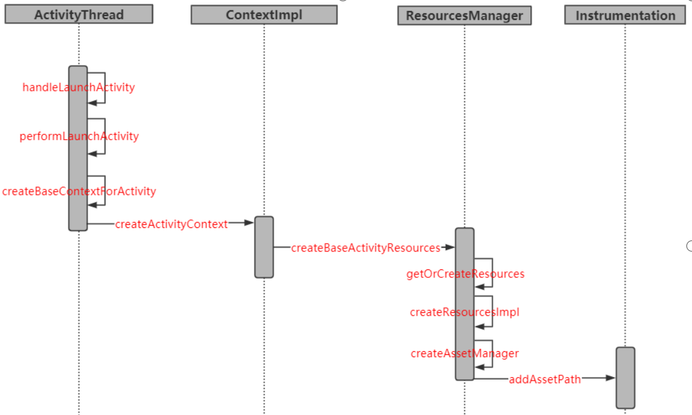

# 插件化

## 简述Activity的启动流程

Activity的启动过程，我们可以从Context的startActivity说起，其实现是ContextImpl的startActivity，然后内部会通过Instrumentation来尝试启动Activity，它会调用ams的startActivity方法，这是一个跨进程过程，当ams校验完activity的合法性后，会通过ApplicationThread回调到我们的进程，这也是一次跨进程过程，而applicationThread就是一个binder，回调逻辑是在binder线程池中完成的，所以需要通过Handler H将其切换到ui线程，第一个消息是LAUNCH_ACTIVITY，它对应handleLaunchActivity，在这个方法里完成了Activity的创建和启动。

MyApplication.java

```java
public class MyApplication extends Application {

//    private Resources resources;

    @Override
    public void onCreate() {
        super.onCreate();

        LoadUtil.loadClass(this);
//        resources = LoadUtil.loadResource(this);

        HookUtil.hookAMS();
        HookUtil.hookHandler();

    }

//    @Override
//    public Resources getResources() {
//        return resources == null ? super.getResources() : resources;
//    }
}
```


HookUtil.java

```java
package com.enjoy.leo_plugin;

import android.content.Intent;
import android.os.Build;
import android.os.Handler;
import android.os.Message;
import android.os.Parcelable;
import android.util.Log;

import androidx.annotation.NonNull;

import java.lang.reflect.Field;
import java.lang.reflect.InvocationHandler;
import java.lang.reflect.Method;
import java.lang.reflect.Proxy;
import java.util.List;

public class HookUtil {


    private static final String TARGET_INTENT = "target_intent";

    public static void hookAMS() {
        try {

            Object singleton = null;
            if (Build.VERSION.SDK_INT >= Build.VERSION_CODES.O) {
                // 获取Singleton对象
                Class<?> clazz = Class.forName("android.app.ActivityManager");
                Field singletonField = clazz.getDeclaredField("IActivityManagerSingleton");
                singletonField.setAccessible(true);
                singleton = singletonField.get(null);
            } else {
                Class<?> clazz = Class.forName("android.app.ActivityManagerNative");
                Field singletonField = clazz.getDeclaredField("gDefault");
                singletonField.setAccessible(true);
                singleton = singletonField.get(null);
            }

            // 获取IActivityManager 对象
            Class<?> singletonClass = Class.forName("android.util.Singleton");
            Field mInstanceField = singletonClass.getDeclaredField("mInstance");
            mInstanceField.setAccessible(true);
            final Object mInstance = mInstanceField.get(singleton);


            Class<?> iActivityManagerClass = Class.forName("android.app.IActivityManager");

            Object proxyInstance = Proxy.newProxyInstance(Thread.currentThread().getContextClassLoader(),
                    new Class[]{iActivityManagerClass}, new InvocationHandler() {

                        @Override
                        public Object invoke(Object proxy, Method method, Object[] args) throws Throwable {
                            // IActivityManager 的方法执行的时候，都会先跑这儿

                            if ("startActivity".equals(method.getName())) {
                                // 替换Intent
                                int index = 0;

                                for (int i = 0; i < args.length; i++) {
                                    if (args[i] instanceof Intent) {
                                        index = i;
                                        break;
                                    }
                                }
                                // 启动插件的intent
                                Intent intent = (Intent) args[index];

                                Intent proxyIntent = new Intent();

                                proxyIntent.setClassName("com.enjoy.leo_plugin",
                                        "com.enjoy.leo_plugin.ProxyActivity");

                                // 保存原来的
                                proxyIntent.putExtra(TARGET_INTENT, intent);

                                args[index] = proxyIntent;
                            }
                            return method.invoke(mInstance, args);
                        }

                    });

            // 替换系统的 IActivityManager对象
            mInstanceField.set(singleton, proxyInstance);

        } catch (Exception e) {
            e.printStackTrace();
        }


    }


    public static void hookHandler() {

        try {
            Class<?> clazz = Class.forName("android.app.ActivityThread");
            Field sCurrentActivityThreadField = clazz.getDeclaredField("sCurrentActivityThread");
            sCurrentActivityThreadField.setAccessible(true);
            Object activityThread = sCurrentActivityThreadField.get(null);

            Field mHField = clazz.getDeclaredField("mH");
            mHField.setAccessible(true);
            Object mH = mHField.get(activityThread);

            // new 一个 Callback 替换系统的 mCallback对象
            Class<?> handlerClass = Class.forName("android.os.Handler");
            Field mCallbackField = handlerClass.getDeclaredField("mCallback");
            mCallbackField.setAccessible(true);
            mCallbackField.set(mH, new Handler.Callback() {
                @Override
                public boolean handleMessage(@NonNull Message msg) {
                    // 将Intent换回来
                    switch (msg.what) {
                        case 100:
                            try {
                                // 获取ActivityClientRecord中的intent对象
                                Field intentField = msg.obj.getClass().getDeclaredField("intent");
                                Log.e("leo", "handleMessage: 1111111111111");
                                intentField.setAccessible(true);
                                Intent proxyIntent = (Intent) intentField.get(msg.obj);

                                // 拿到插件的Intent
                                Intent intent = proxyIntent.getParcelableExtra(TARGET_INTENT);
                                Log.e("leo", "handleMessage: " + intent.toString());

                                // 替换回来
//                                proxyIntent.setComponent(intent.getComponent());
                                intentField.set(msg.obj, intent);

                            } catch (Exception e) {
                                e.printStackTrace();
                            }
                            break;
                        case 159:
                            try {
                                Class<?> clazz = Class.forName("android.app.servertransaction.ClientTransaction");
                                Field mActivityCallbacksField = clazz.getDeclaredField("mActivityCallbacks");
                                mActivityCallbacksField.setAccessible(true);

                                List activityCallbacks = (List) mActivityCallbacksField.get(msg.obj);
                                for (int i = 0; i < activityCallbacks.size(); i++) {
                                    if (activityCallbacks.get(i).getClass().getName()
                                            .equals("android.app.servertransaction.LaunchActivityItem")) {
                                        Object launchActivityItem = activityCallbacks.get(i);
                                        Field mIntentField = launchActivityItem.getClass().getDeclaredField("mIntent");
                                        mIntentField.setAccessible(true);
                                        Intent proxyIntent = (Intent) mIntentField.get(launchActivityItem);

                                        //插件的intent
                                        Intent intent = proxyIntent.getParcelableExtra(TARGET_INTENT);

                                        if (intent != null) {
                                            mIntentField.set(launchActivityItem, intent);
                                        }
                                        break;
                                    }
                                }
                            } catch (Exception e) {
                                e.printStackTrace();
                            }
                            break;
                    }
                    return false;
                }
            });
        } catch (Exception e) {
            e.printStackTrace();
        }
    }
}
```

loadUtil.java

```java
package com.enjoy.leo_plugin;

import android.content.Context;
import android.content.res.AssetManager;
import android.content.res.Resources;

import java.lang.reflect.Array;
import java.lang.reflect.Field;
import java.lang.reflect.Method;

import dalvik.system.DexClassLoader;
import dalvik.system.PathClassLoader;

public class LoadUtil {

    private final static String apkPath = "/sdcard/plugin-debug.apk";


    public static void loadClass(Context context) {

        try {
            // private final DexPathList pathList;
            Class<?> baseDexClassLoaderClass = Class.forName("dalvik.system.BaseDexClassLoader");
            Field pathListField = baseDexClassLoaderClass.getDeclaredField("pathList");
            pathListField.setAccessible(true);

            // private Element[] dexElements;
            Class<?> dexPathListClass = Class.forName("dalvik.system.DexPathList");
            Field dexElementsField = dexPathListClass.getDeclaredField("dexElements");
            dexElementsField.setAccessible(true);

            /**
             * 插件
             */
            // 创建插件的 DexClassLoader 类加载器，然后通过反射获取插件的 dexElements 值
            // 插件的
            DexClassLoader dexClassLoader = new DexClassLoader(apkPath, context.getCacheDir().getAbsolutePath(),
                    null, context.getClassLoader());

            Object pluginPathList = pathListField.get(dexClassLoader);
            // 拿到了插件的 dexElements
            Object[] pluginDexElements = (Object[]) dexElementsField.get(pluginPathList);

            /**
             * 宿主
             */
            PathClassLoader pathClassLoader = (PathClassLoader) context.getClassLoader();

            Object hostPathList = pathListField.get(pathClassLoader);
            // 拿到了宿主的 dexElements
            Object[] hostDexElements = (Object[]) dexElementsField.get(hostPathList);


            /**
             * 创建数组
             */
            // Element[]
            Object[] dexElements = (Object[]) Array.newInstance(pluginDexElements.getClass().getComponentType(),
                    hostDexElements.length + pluginDexElements.length);

            System.arraycopy(hostDexElements, 0, dexElements, 0, hostDexElements.length);
            System.arraycopy(pluginDexElements, 0, dexElements, hostDexElements.length, pluginDexElements.length);

            // 将创建的 dexElements 放到宿主的 dexElements中
            // 宿主的dexElements = 新的dexElements
            dexElementsField.set(hostPathList, dexElements);
        } catch (Exception e) {
            e.printStackTrace();
        }

    }


    public static Resources loadResource(Context context) {
        try {
            AssetManager assetManager = AssetManager.class.newInstance();

            Method addAssetPathMethod = assetManager.getClass().getDeclaredMethod("addAssetPath", String.class);
            addAssetPathMethod.setAccessible(true);
            // 参数就是插件的资源路径
            addAssetPathMethod.invoke(assetManager, apkPath);

            Resources resources = context.getResources();

            return new Resources(assetManager, resources.getDisplayMetrics(), resources.getConfiguration());
        } catch (Exception e) {
            e.printStackTrace();
        }
        return null;
    }


}
```

## 资源加载

实际上，Resources 类也是通过 AssetManager 类来访问那些被编译过的应用程序资源文件的，不过在访问之前，它会先根据资源 ID 查找得到对应的资源文件名。 而 AssetManager 对象既可以通过文件名访问那些被编译过的，也可以访问没有被编译过的应用程序资源文件。

### raw文件夹和assets文件夹有什么区别

raw : Android会自动的为这目录中的所有资源文件生成一个ID,这意味着很容易就可以访问到这个资源，甚至在xml 中都是可以访问的，使用ID访问速度是最快的。

assets : 不会生成ID，只能通过AssetManager访问，xml中不能访问，访问速度会慢些，不过操作更加方便。



```java
package com.enjoy.plugin;

import android.content.Context;
import android.content.res.AssetManager;
import android.content.res.Resources;

import java.lang.reflect.Method;

public class LoadUtlis {

    private final static String apkPath = "/sdcard/plugin-debug.apk";

    private static Resources mResouces;

    public static Resources getResource(Context context) {
        if (mResouces == null) {
            mResouces = loadResource(context);
        }
        return mResouces;
    }

    private static Resources loadResource(Context context) {
        try {
            AssetManager assetManager = AssetManager.class.newInstance();

            Method addAssetPathMethod = assetManager.getClass().getDeclaredMethod("addAssetPath", String.class);
            addAssetPathMethod.setAccessible(true);
            // 参数就是插件的资源路径
            addAssetPathMethod.invoke(assetManager, apkPath);

            Resources resources = context.getResources();

            return new Resources(assetManager, resources.getDisplayMetrics(), resources.getConfiguration());
        } catch (Exception e) {
            e.printStackTrace();
        }
        return null;
    }

}

```

```java
public class BaseActivity extends AppCompatActivity {

    protected Context mContext;

    @Override
    protected void onCreate(@Nullable Bundle savedInstanceState) {
        super.onCreate(savedInstanceState);

        Resources resource = LoadUtlis.getResource(getApplication());

        // 替换这个 context 的resource 为我们自己写的 resource
        mContext = new ContextThemeWrapper(getBaseContext(), 0);

        Class<? extends Context> clazz = mContext.getClass();
        try {
            Field mResourcesField = clazz.getDeclaredField("mResources");
            mResourcesField.setAccessible(true);
            mResourcesField.set(mContext, resource);
        } catch (Exception e) {
            e.printStackTrace();
        }

    }


    //    @Override
//    public Resources getResources() {
//
//        if (getApplication() != null && getApplication().getResources() != null) {
//            //这个实际返回的是我们自己创建的 resources
//            return getApplication().getResources();
//        }
//
//        return super.getResources();
//    }
}
```

