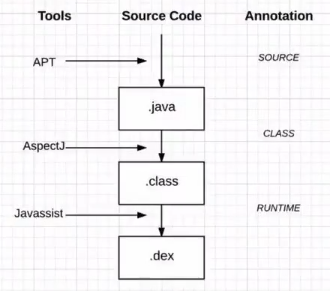
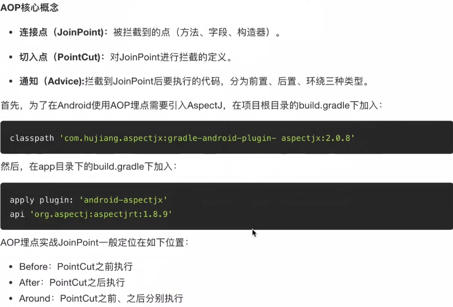
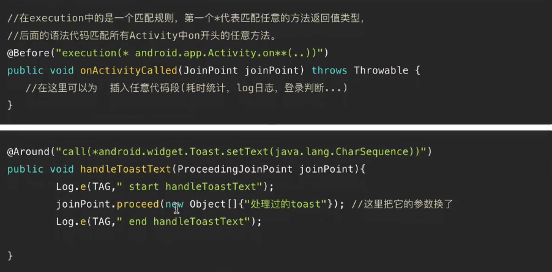
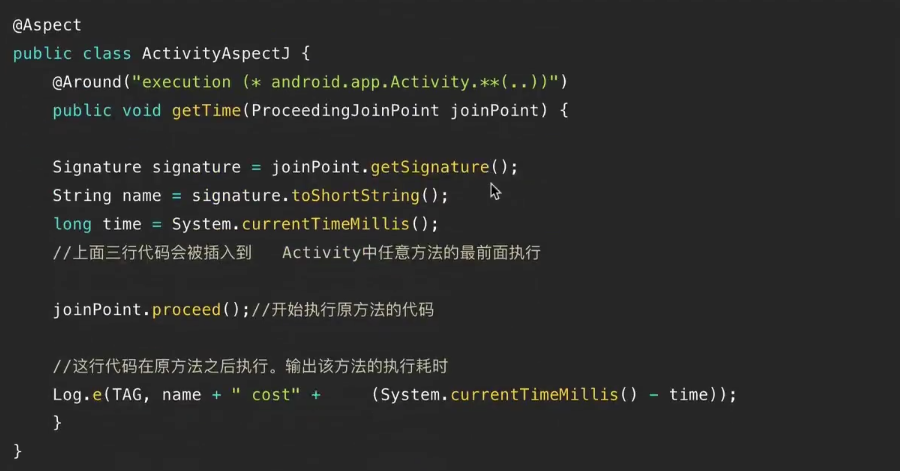
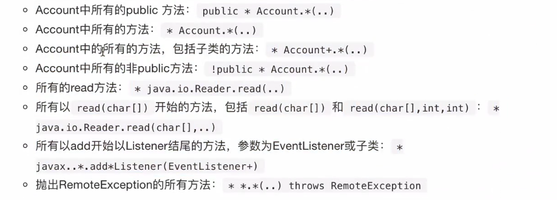
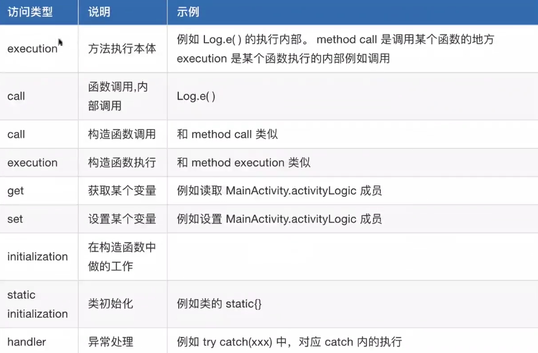

# AOP

## AspectJ Aop( Aspect Oriented Programming)切面编程

面向切面编程，通过编译期织入代码段和运行期动态代理实现程序功能的一种技术。

### 作用

利用AOP可以对业务逻辑的各个部分进行隔离，从而使得业务逻辑各个部分之间的耦合性降低，提高程序的可重用性，同时大大提高了开发效率。

## JoinPoint连接点

## AOP的场景有哪些？

