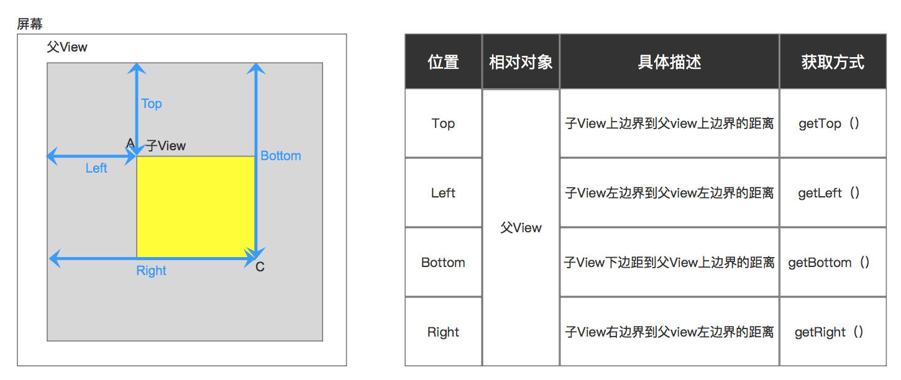
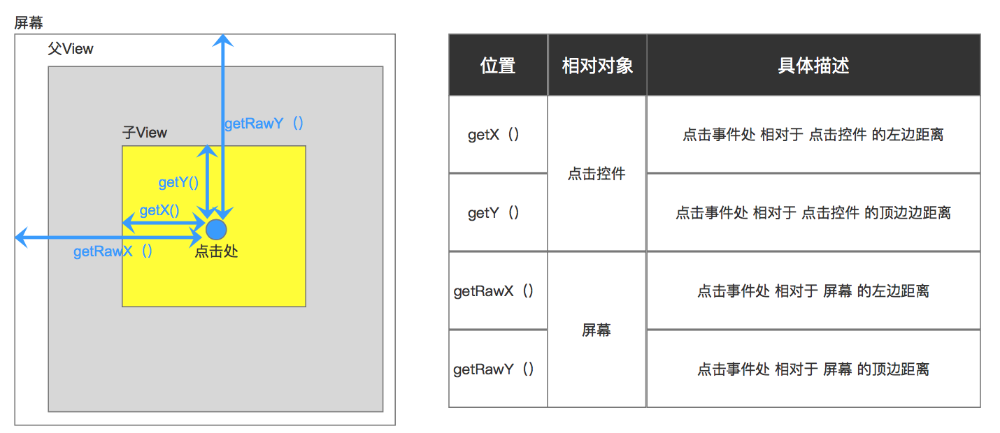
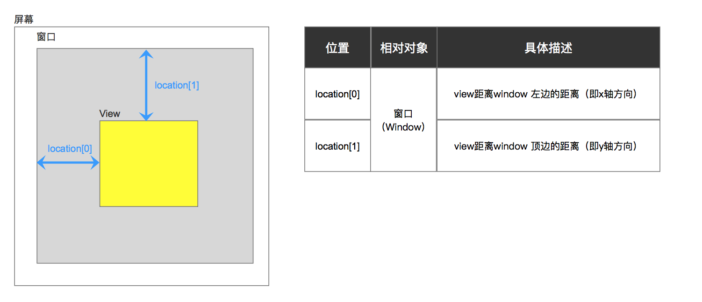
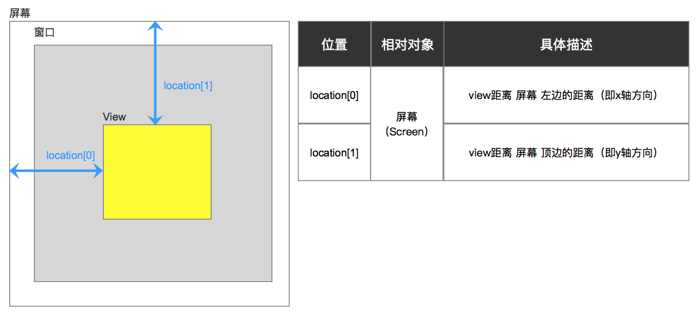
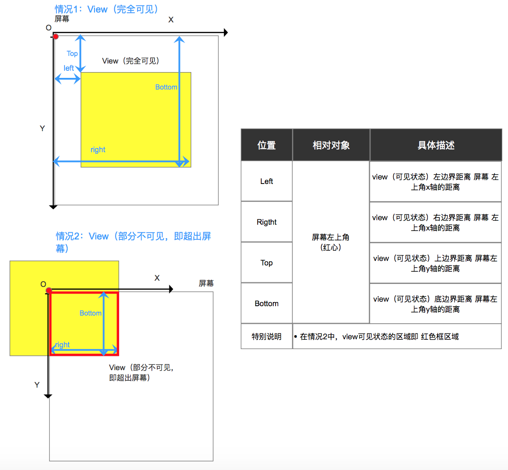
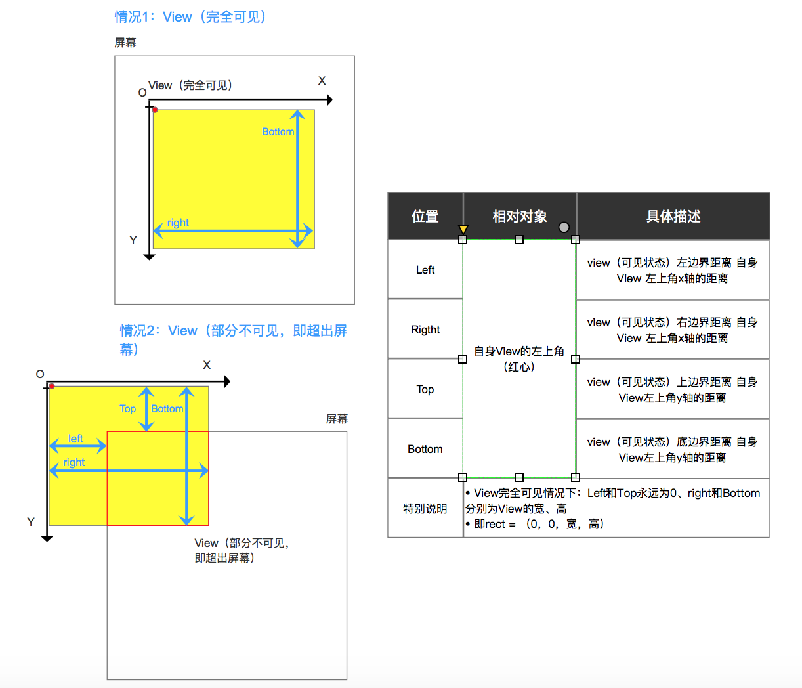

# 获取View坐标位置的方法

## 前言
获取 View 坐标在 Android 开发中非常常见。今天carson将详细给大家讲解 获取 View 坐标常用6种方式：

1. getLeft()、getTop()、getRight()、getBottom()
2. getX()、getY()、getRawX()、getRawY()
3. getLocationOnScreen（）
4. getLocationInWindow（）
5. getGlobalVisibleRect（）
6. getLocalVisibleRect（）

## 方式1：getLeft()、getTop()、getRight()、getBottom()

1. 应用场景
    获得 View 相对 父View 的坐标-

2. 使用

  ```java
  view.getLeft();
  view.getTop();
  view.getRight();
  view.getBottom();
  ```

3. 具体描述
    View的位置由4个顶点决定的（如下A、B、C、D）.4个顶点的位置描述分别由4个值决定：（请记住：View的位置是相对于父控件而言的）



## 方式2：getX()、getY()、getRawX()、getRawY()

1. 应用场景
获得点击事件处 相对点击控件 & 屏幕的坐标

2. 使用
该方式是通过motionEvent获取的

```java
motionEvent event;

event.getX();       
event.getY();

event.getRawX();    
event.getRawY();
```

3. 具体介绍

   

## 方式3：getLocationInWindow（）

1. 应用场景
获取控件 相对 窗口Window 的位置

2. 具体使用

  ```java
  int[] location = new int[2];
  view.getLocationInWindow(location);
  int x = location[0]; // view距离window 左边的距离（即x轴方向）
  int y = location[1]; // view距离window 顶边的距离（即y轴方向）
  // 注：要在onWindowFocusChanged（）里获取，即等window窗口发生变化后
  ```

3. 示意图

   

## 方式4：getLocationOnScreen（）

1. 应用场景
获得 View 相对 屏幕 的绝对坐标

2. 使用

  ```java
  1. int[] location = new int[2];
     view.getLocationOnScreen(location);
     int x = location[0]; // view距离 屏幕左边的距离（即x轴方向）
     int y = location[1]; // view距离 屏幕顶边的距离（即y轴方向）
  
  // 注：要在view.post（Runable）里获取，即等布局变化后
  ```

3. 示意图

   

## 方式5：getGlobalVisibleRect（）

1. 应用场景
View可见部分 相对于 屏幕的坐标。

2. 具体使用

  ```java
  Rect globalRect = new Rect();
  view.getGlobalVisibleRect(globalRect);
  
  globalRect.getLeft();
  globalRect.getRight();
  globalRect.getTop();
  globalRect.getBottom();
  ```

3. 示意图

   

## 方式6：getLocalVisibleRect（）

1. 应用场景
View可见部分 相对于 自身View位置左上角的坐标。

2. 具体使用

  ```java
  Rect localRect = new Rect();
  view.getLocalVisibleRect(localRect);
  
  localRect.getLeft();
  localRect.getRight();
  localRect.getTop();
  localRect.getBottom();
  ```

3. 示意图

   


原文链接：https://blog.csdn.net/carson_ho/article/details/103342511