# Launcher启动流程与ActivityThread分析

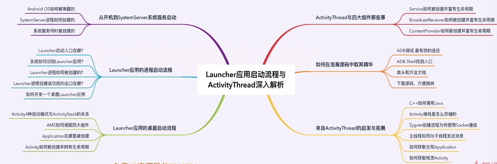

## 从开机到SystemServer系统服务启动

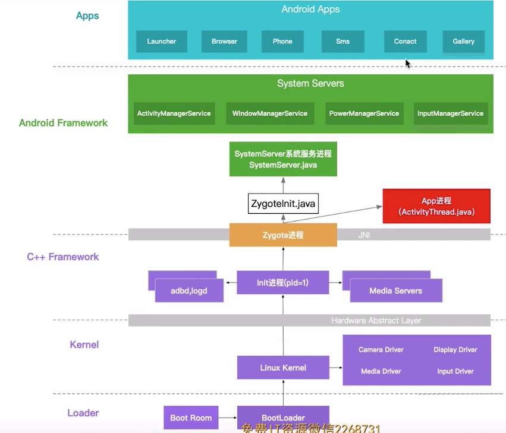

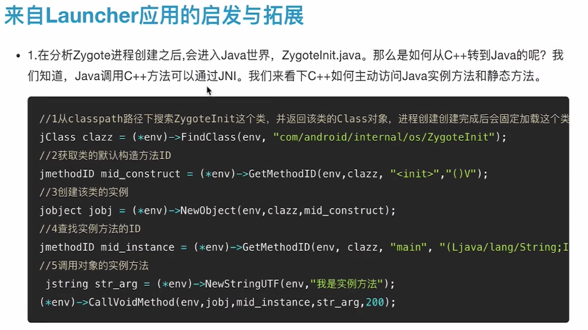

 ## SystemServer系统服务启动过程

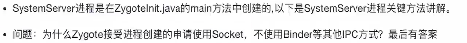

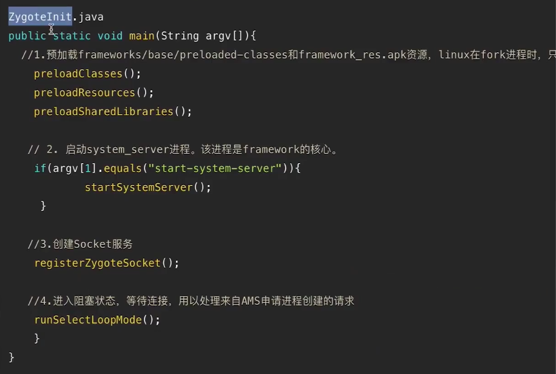

- SystemServer的main方法主要做了以下三件事情，即启动不同类型的系统服务

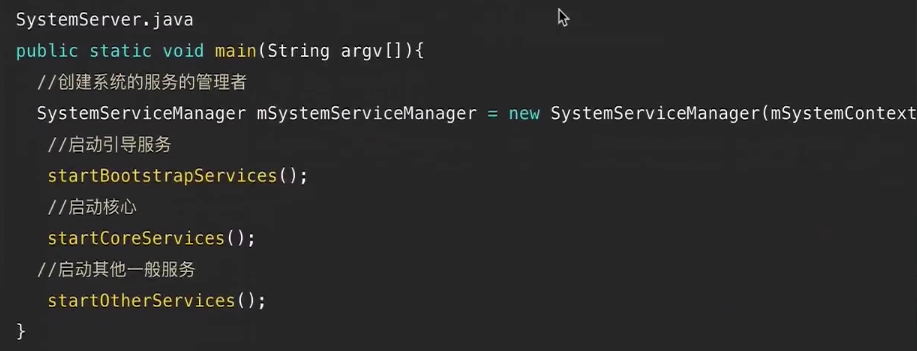

- 下图是SystemServer进程中启动的核心系统服务示意图

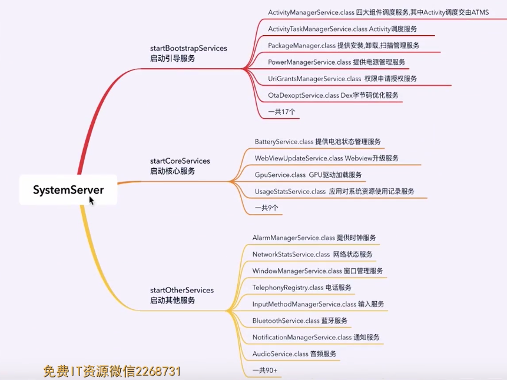

## Launcher应用的进程启动流程

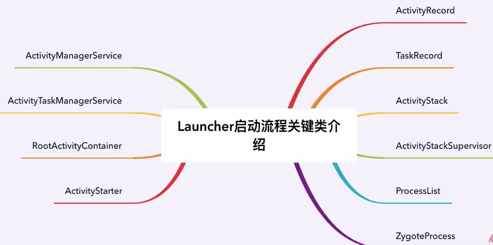

### Activity的任务栈模型

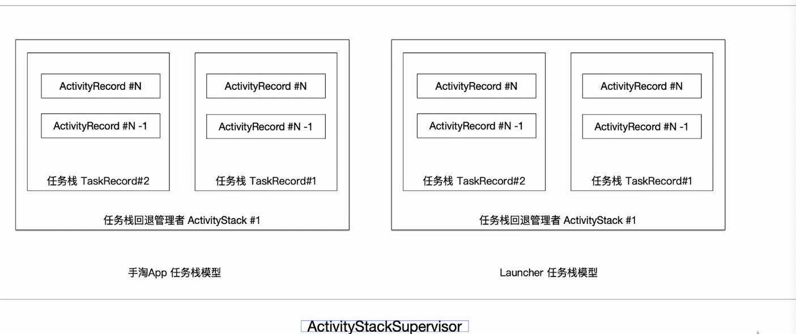

### Launcher进程启动流程图

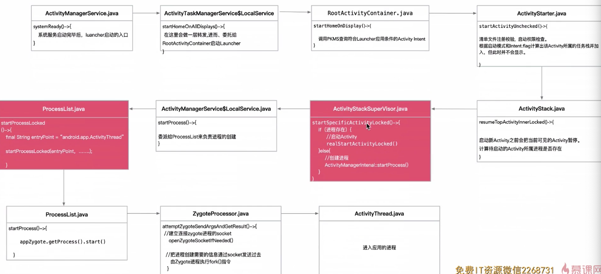

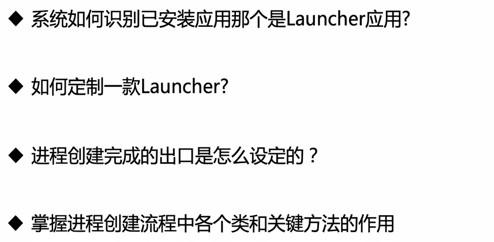

### Framework源码分析技巧

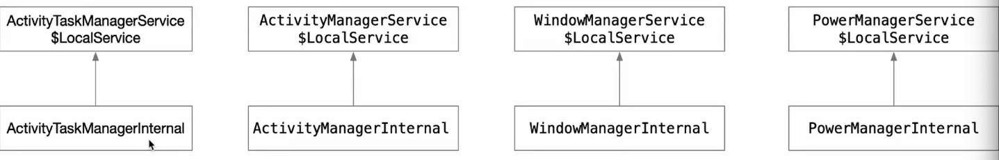

### 系统如何识别已安装的应用哪个是Launcher应用？

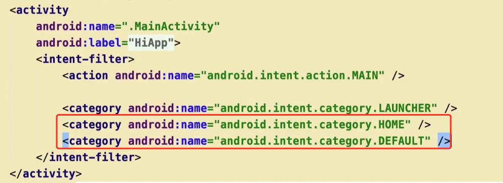

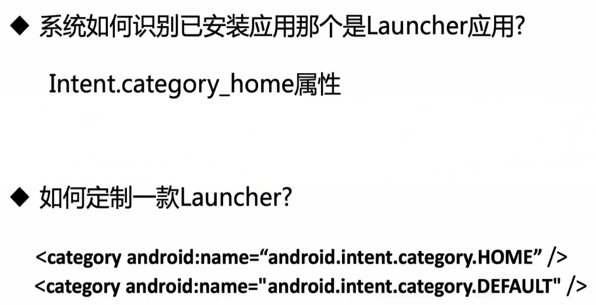

## Launcher应用的桌面启动流程

### ActivityThread结构图

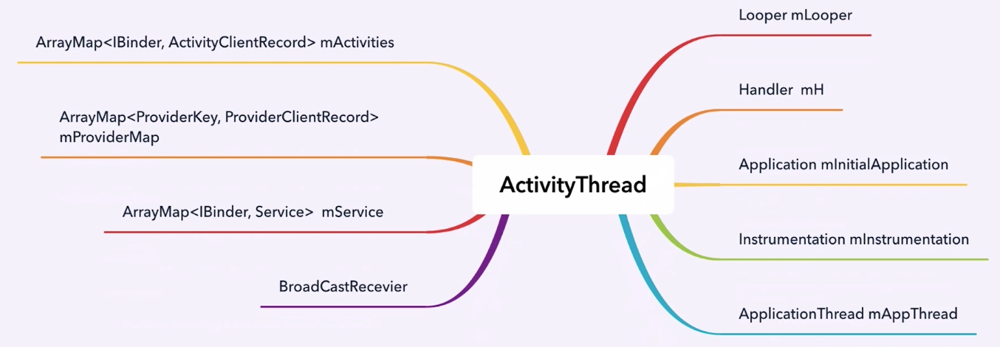

### 状态机设计模式

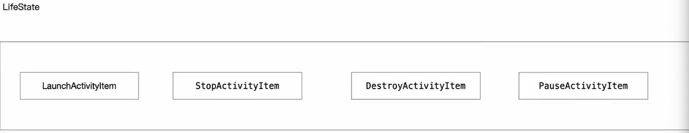

### HomeActivity创建流程

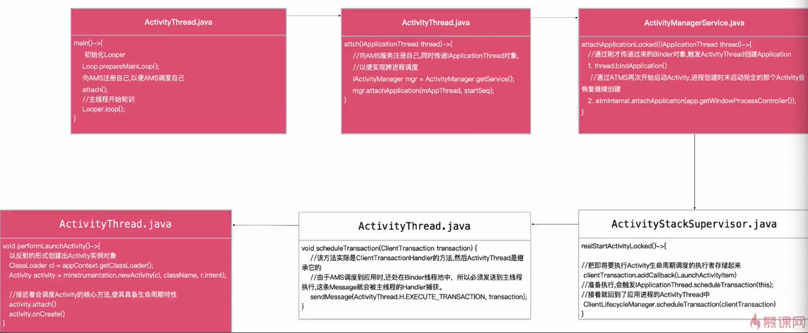

## Activity与四大组件那些事

## 如何在源码中取其精华

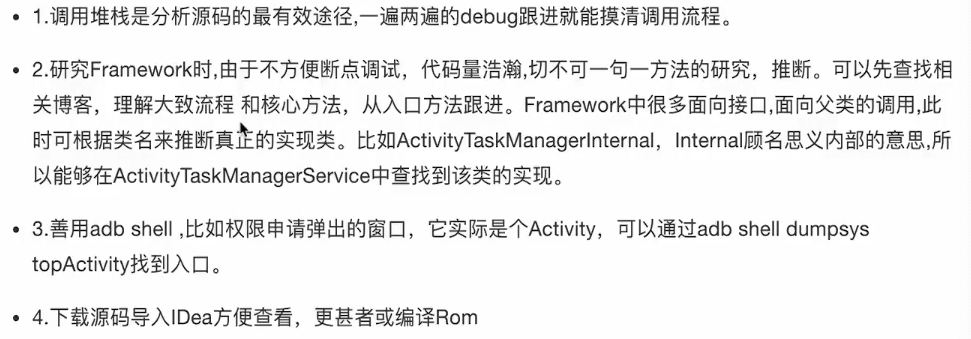

## 来自ActivityThread的启发与拓展

