# 内存泄漏排查手段

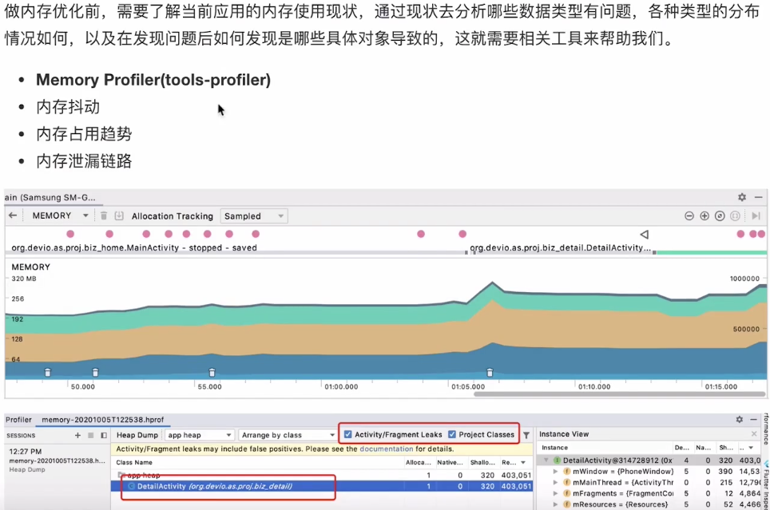

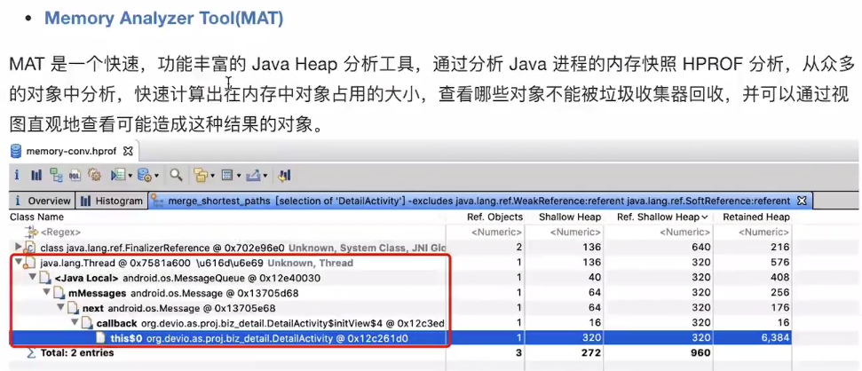

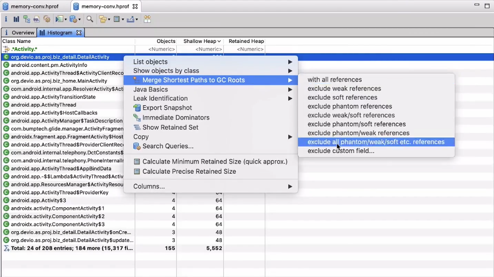

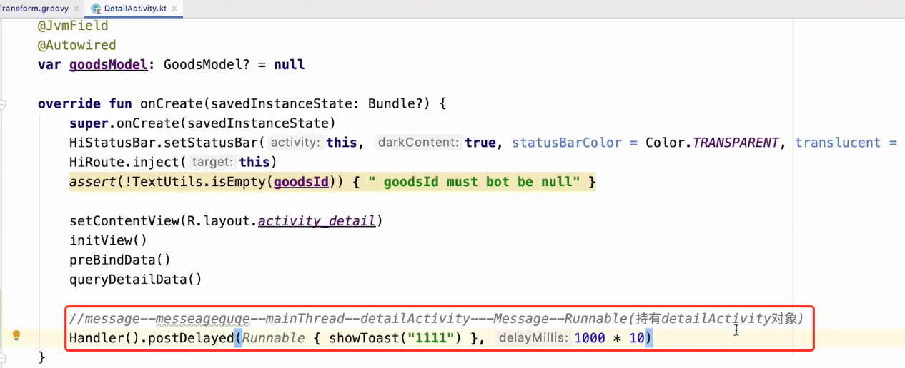

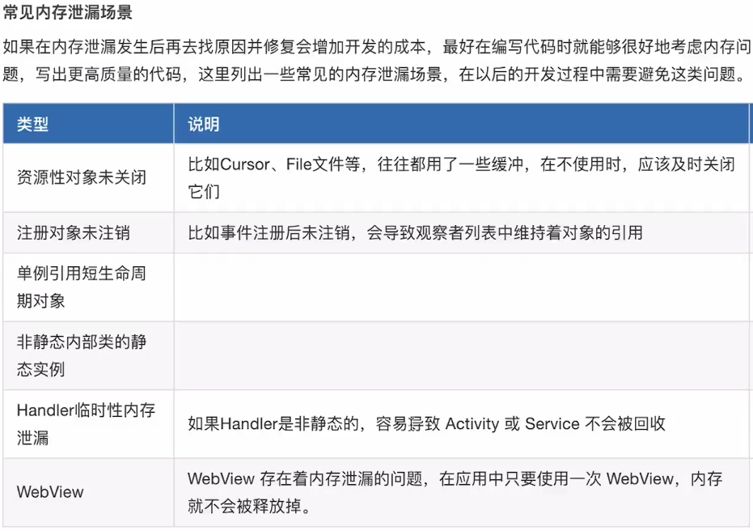

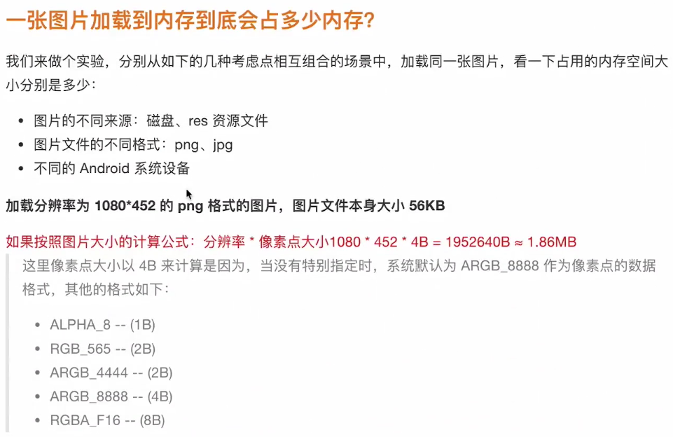

## 内存抖动

短时间内有大量对象创建销毁，它伴随着频繁的GC。

## 内存泄漏

程序中已经动态分配的堆内存由于某种原因程序未释放或者无法释放，造成徐彤内存的浪费。长生命周期对象持有短生命周期对象**强引用**，从而导致短生命周期对象无法被回收。

## 可达性分析法

通过一系列称为“GC Roots”的对象作为起始点，从这些节点乡下搜索，搜索所有的引用链，当一个对象到GC Roots没有任何引用链（即GC Roots到对象不可达）时，则证明此对象是不可用的。

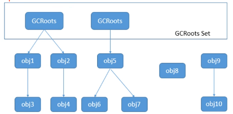

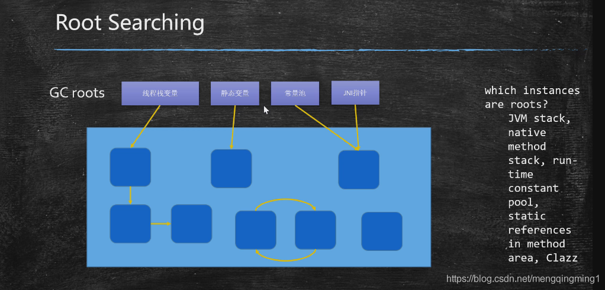

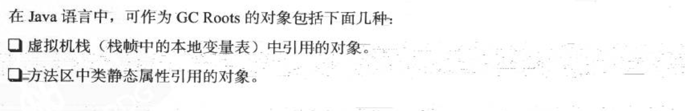

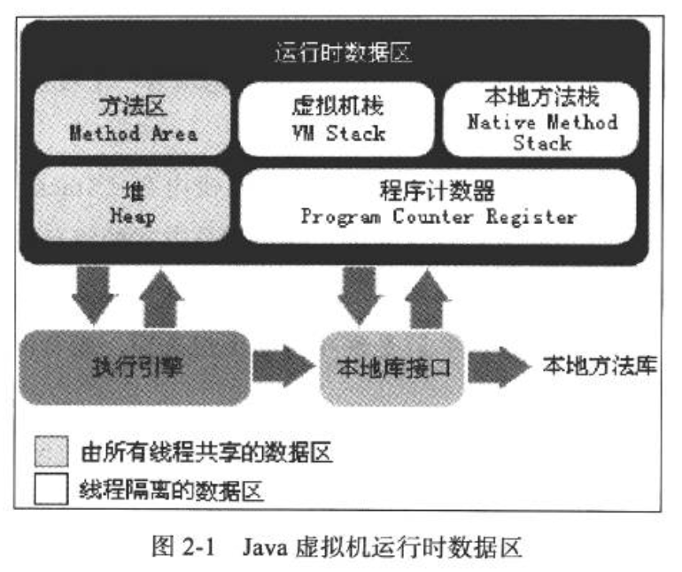

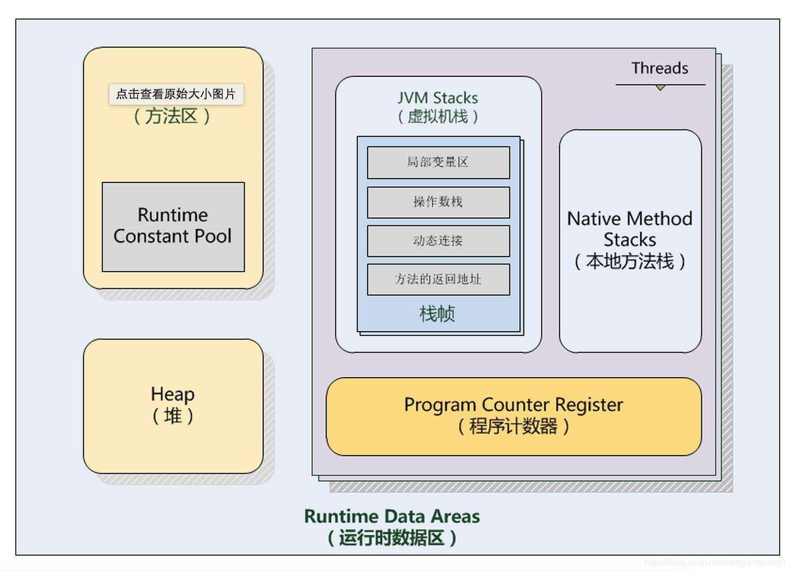

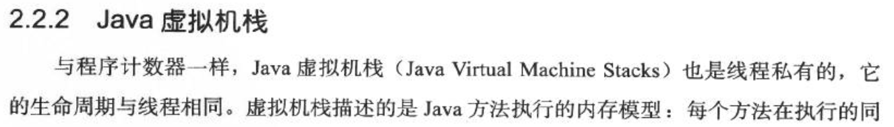

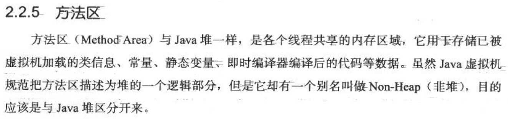

## 案例分析

### 问题代码

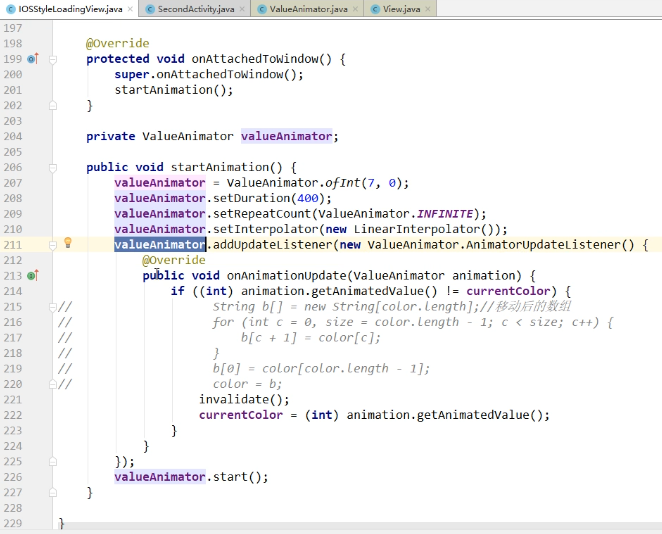

### MAT

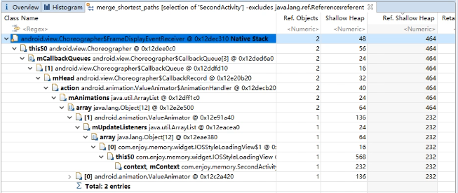

### 优化

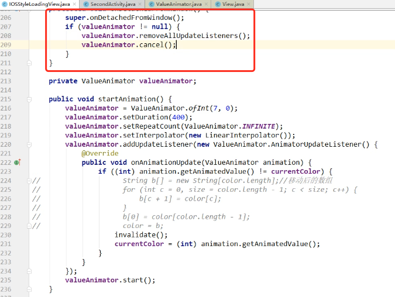

