## 协程是什么

协程并不是 Kotlin 提出来的新概念，其他的一些编程语言，例如：Go、Python 等都可以在语言层面上实现协程，甚至是 Java，也可以通过使用扩展库来间接地支持协程。

当在网上搜索协程时，我们会看到：

- Kotlin 官方文档说「本质上，协程是轻量级的线程」。
- 很多博客提到「不需要从用户态切换到内核态」、「是协作式的」等等。

作为 Kotlin 协程的初学者，这些概念并不是那么容易让人理解。这些往往是作者根据自己的经验总结出来的，只看结果，而**不管过程就不容易理解协程**。

「协程 Coroutines」源自 Simula 和 Modula-2 语言，这个术语早在 1958 年就被 [Melvin Edward Conway](https://rengwuxian.com/kotlin-coroutines-1/[https://zh.wikipedia.org/wiki/马尔文·康威](https://zh.wikipedia.org/wiki/马尔文·康威)) 发明并用于构建汇编程序，说明**协程是一种编程思想**，并不局限于特定的语言。

Go 语言也有协程，叫 Goroutines，从英文拼写就知道它和 Coroutines 还是有些差别的（设计思想上是有关系的），否则 Kotlin 的协程完全可以叫 Koroutines 了。

因此，对一个新术语，我们需要知道什么是「标准」术语，什么是变种。

当我们讨论协程和线程的关系时，很容易**陷入中文的误区**，两者都有一个「程」字，就觉得有关系，其实就英文而言，Coroutines 和 Threads 就是两个概念。

从 Android 开发者的角度去理解它们的关系：

- 我们所有的代码都是跑在线程中的，而线程是跑在进程中的。
- 协程没有直接和操作系统关联，但它不是空中楼阁，它也是跑在线程中的，可以是单线程，也可以是多线程。
- 单线程中的协程总的执行时间并不会比不用协程少。
- Android 系统上，如果在主线程进行网络请求，会抛出 `NetworkOnMainThreadException`，对于在主线程上的协程也不例外，这种场景使用协程还是要切线程的。

协程设计的初衷是为了解决并发问题，让 「协作式多任务」 实现起来更加方便。这里就先不展开「协作式多任务」的概念，等我们学会了怎么用再讲。

视频里讲到，协程就是 Kotlin 提供的一套线程封装的 API，但并不是说协程就是为线程而生的。

不过，我们学习 Kotlin 中的协程，一开始确实可以从线程控制的角度来切入。因为在 Kotlin 中，协程的一个典型的使用场景就是线程控制。就像 Java 中的 `Executor` 和 Android 中的 `AsyncTask`，Kotlin 中的协程也有对 Thread API 的封装，让我们可以在写代码时，不用关注多线程就能够很方便地写出并发操作。

在 Java 中要实现并发操作通常需要开启一个 `Thread` ：

```java
☕️
new Thread(new Runnable() {
    @Override
    public void run() {
        ...
    }
}).start();
```

这里仅仅只是开启了一个新线程，至于它何时结束、执行结果怎么样，我们在主线程中是无法直接知道的。

Kotlin 中同样可以通过线程的方式去写：

```kotlin
🏝️
Thread({
    ...
}).start()
```

可以看到，和 Java 一样也摆脱不了直接使用 `Thread` 的那些困难和不方便：

- 线程什么时候执行结束
- 线程间的相互通信
- 多个线程的管理

我们可以用 Java 的 `Executor` 线程池来进行线程管理：

```kotlin
🏝️
val executor = Executors.newCachedThreadPool()
executor.execute({
    ...
})
```

用 Android 的 `AsyncTask` 来解决线程间通信：

```kotlin
🏝️
object : AsyncTask&lt;T0, T1, T2&gt; { 
    override fun doInBackground(vararg args: T0): String { ... }
    override fun onProgressUpdate(vararg args: T1) { ... }
    override fun onPostExecute(t3: T3) { ... }
}
```

`AsyncTask` 是 Android 对线程池 `Executor` 的封装，但它的缺点也很明显：

- 需要处理很多回调，如果业务多则容易陷入「回调地狱」。
- 硬是把业务拆分成了前台、中间更新、后台三个函数。

看到这里你很自然想到使用 RxJava 解决回调地狱，它确实可以很方便地解决上面的问题。

RxJava，准确来讲是 ReactiveX 在 Java 上的实现，是一种响应式程序框架，我们通过它提供的「Observable」的编程范式进行链式调用，可以很好地消除回调。

使用协程，同样可以像 Rx 那样有效地消除回调地狱，不过无论是设计理念，还是代码风格，两者是有很大区别的，协程在写法上和普通的顺序代码类似。

> 这里并不会比较 RxJava 和协程哪个好，或者讨论谁取代谁的问题，我这里只给出一个建议，你最好都去了解下，因为协程和 Rx 的设计思想本来就不同。

下面的例子是使用协程进行网络请求获取用户信息并显示到 UI 控件上：

```kotlin
🏝️
launch({
    val user = api.getUser() // 👈 网络请求（IO 线程）
    nameTv.text = user.name  // 👈 更新 UI（主线程）
})
```

这里只是展示了一个代码片段，`launch` 并不是一个顶层函数，它必须在一个对象中使用，我们之后再讲，这里只关心它内部业务逻辑的写法。

`launch` 函数加上实现在 `{}` 中具体的逻辑，就构成了一个协程。

通常我们做网络请求，要不就传一个 callback，要不就是在 IO 线程里进行阻塞式的同步调用，而在这段代码中，上下两个语句分别工作在两个线程里，但写法上看起来和普通的单线程代码一样。

这里的 `api.getUser` 是一个**挂起函数**，所以能够保证 `nameTv.text` 的正确赋值，这就涉及到了协程中最著名的「非阻塞式挂起」。这个名词看起来不是那么容易理解，我们后续的文章会专门对这个概念进行讲解。现在先把这个概念放下，只需要记住协程就是这样写的就行了。

这种「用同步的方式写异步的代码」看起来很方便吧，那么我们来看看协程具体好在哪。

## 协程好在哪

### 开始之前

在讲之前，我们需要先了解一下「闭包」这个概念，调用 Kotlin 协程中的 API，经常会用到闭包写法。

其实闭包并不是 Kotlin 中的新概念，在 Java 8 中就已经支持。

我们先以 `Thread` 为例，来看看什么是闭包：

```kotlin
🏝️
// 创建一个 Thread 的完整写法
Thread(object : Runnable {
    override fun run() {
        ...
    }
})

// 满足 SAM，先简化为
Thread({
    ...
})

// 使用闭包，再简化为
Thread {
    ...
}
```

形如 `Thread {...}` 这样的结构中 `{}` 就是一个闭包。

在 Kotlin 中有这样一个语法糖：当函数的最后一个参数是 lambda 表达式时，可以将 lambda 写在括号外。这就是它的闭包原则。

在这里需要一个类型为 `Runnable` 的参数，而 `Runnable` 是一个接口，且只定义了一个函数 `run`，这种情况满足了 Kotlin 的 [SAM](https://medium.com/tompee/idiomatic-kotlin-lambdas-and-sam-constructors-fe2075965bfb)，可以转换成传递一个 lambda 表达式（第二段），因为是最后一个参数，根据闭包原则我们就可以直接写成 `Thread {...}`（第三段） 的形式。

对于上文所使用的 `launch` 函数，可以通过闭包来进行简化 ：

```kotlin
🏝️
launch {
    ...
}
```

### 基本使用

前面提到，`launch` 函数不是顶层函数，是不能直接用的，可以使用下面三种方法来创建协程：

```kotlin
🏝️
// 方法一，使用 runBlocking 顶层函数
runBlocking {
    getImage(imageId)
}

// 方法二，使用 GlobalScope 单例对象
//            👇 可以直接调用 launch 开启协程
GlobalScope.launch {
    getImage(imageId)
}

// 方法三，自行通过 CoroutineContext 创建一个 CoroutineScope 对象
//                                    👇 需要一个类型为 CoroutineContext 的参数
val coroutineScope = CoroutineScope(context)
coroutineScope.launch {
    getImage(imageId)
}
```

- 方法一通常适用于单元测试的场景，而业务开发中不会用到这种方法，因为它是线程阻塞的。
- 方法二和使用 `runBlocking` 的区别在于不会阻塞线程。但在 Android 开发中同样不推荐这种用法，因为它的生命周期会和 app 一致，且不能取消（什么是协程的取消后面的文章会讲）。
- 方法三是比较推荐的使用方法，我们可以通过 `context` 参数去管理和控制协程的生命周期（这里的 `context` 和 Android 里的不是一个东西，是一个更通用的概念，会有一个 Android 平台的封装来配合使用）。

关于 `CoroutineScope` 和 `CoroutineContext` 的更多内容后面的文章再讲。

协程最常用的功能是并发，而并发的典型场景就是多线程。可以使用 `Dispatchers.IO` 参数把任务切到 IO 线程执行：

```kotlin
🏝️
coroutineScope.launch(Dispatchers.IO) {
    ...
}
```

也可以使用 `Dispatchers.Main` 参数切换到主线程：

```kotlin
🏝️
coroutineScope.launch(Dispatchers.Main) {
    ...
}
```

所以在「协程是什么」一节中讲到的异步请求的例子完整写出来是这样的：

```kotlin
🏝️
coroutineScope.launch(Dispatchers.Main) {   // 在主线程开启协程
    val user = api.getUser() // IO 线程执行网络请求
    nameTv.text = user.name  // 主线程更新 UI
}
```

而通过 Java 实现以上逻辑，我们通常需要这样写：

```java
☕️
api.getUser(new Callback&lt;User&gt;() {
    @Override
    public void success(User user) {
        runOnUiThread(new Runnable() {
            @Override
            public void run() {
                nameTv.setText(user.name);
            }
        })
    }
    
    @Override
    public void failure(Exception e) {
        ...
    }
});
```

这种回调式的写法，打破了代码的顺序结构和完整性，读起来相当难受。

### 协程的「1 到 0」

对于回调式的写法，如果并发场景再复杂一些，代码的嵌套可能会更多，这样的话维护起来就非常麻烦。但如果你使用了 Kotlin 协程，多层网络请求只需要这么写：

```kotlin
🏝️
coroutineScope.launch(Dispatchers.Main) {       // 开始协程：主线程
    val token = api.getToken()                  // 网络请求：IO 线程
    val user = api.getUser(token)               // 网络请求：IO 线程
    nameTv.text = user.name                     // 更新 UI：主线程
}
```

如果遇到的场景是多个网络请求需要等待所有请求结束之后再对 UI 进行更新。比如以下两个请求：

```kotlin
🏝️
api.getAvatar(user, callback)
api.getCompanyLogo(user, callback)
```

如果使用回调式的写法，那么代码可能写起来既困难又别扭。于是我们可能会选择妥协，通过先后请求代替同时请求：

```kotlin
🏝️
api.getAvatar(user) { avatar ->
    api.getCompanyLogo(user) { logo ->
        show(merge(avatar, logo))
    }
}
```

在实际开发中如果这样写，本来能够并行处理的请求被强制通过串行的方式去实现，可能会导致等待时间长了一倍，也就是性能差了一倍。

而如果使用协程，可以直接把两个并行请求写成上下两行，最后再把结果进行合并即可：

```kotlin
🏝️
coroutineScope.launch(Dispatchers.Main) {
    //            👇  async 函数之后再讲
    val avatar = async { api.getAvatar(user) }    // 获取用户头像
    val logo = async { api.getCompanyLogo(user) } // 获取用户所在公司的 logo
    val merged = suspendingMerge(avatar, logo)    // 合并结果
    //                  👆
    show(merged) // 更新 UI
}
```

可以看到，即便是比较复杂的并行网络请求，也能够通过协程写出结构清晰的代码。需要注意的是 `suspendingMerge` 并不是协程 API 中提供的方法，而是我们自定义的一个可「挂起」的结果合并方法。至于挂起具体是什么，可以看下一篇文章。

让复杂的并发代码，写起来变得简单且清晰，是协程的优势。

这里，两个没有相关性的后台任务，因为用了协程，被安排得明明白白，互相之间配合得很好，也就是我们之前说的「协作式任务」。

本来需要回调，现在直接没有回调了，这种从 1 到 0 的设计思想真的妙哉。

在了解了协程的作用和优势之后，我们再来看看协程是怎么使用的。

## 协程怎么用

### 在项目中配置对 Kotlin 协程的支持

在使用协程之前，我们需要在 `build.gradle` 文件中增加对 Kotlin 协程的依赖：

- 项目根目录下的 `build.gradle` :

```groovy
buildscript {
    ...
    // 👇
    ext.kotlin_coroutines = '1.3.1'
    ...
}
```

- Module 下的 `build.gradle` :

```groovy
dependencies {
    ...
    //                                       👇 依赖协程核心库
    implementation "org.jetbrains.kotlinx:kotlinx-coroutines-core:$kotlin_coroutines"
    //                                       👇 依赖当前平台所对应的平台库
    implementation "org.jetbrains.kotlinx:kotlinx-coroutines-android:$kotlin_coroutines"
    ...
}
```

Kotlin 协程是以官方扩展库的形式进行支持的。而且，我们所使用的「核心库」和 「平台库」的版本应该保持一致。

- 核心库中包含的代码主要是协程的公共 API 部分。有了这一层公共代码，才使得协程在各个平台上的接口得到统一。
- 平台库中包含的代码主要是协程框架在具体平台的具体实现方式。因为多线程在各个平台的实现方式是有所差异的。

完成了以上的准备工作就可以开始使用协程了。

### 开始使用协程

协程最简单的使用方法，其实在前面章节就已经看到了。我们可以通过一个 `launch` 函数实现线程切换的功能：

```kotlin
🏝️
//               👇
coroutineScope.launch(Dispatchers.IO) {
    ...
}
```

这个 `launch` 函数，它具体的含义是：我要创建一个新的协程，并在指定的线程上运行它。这个被创建、被运行的所谓「协程」是谁？就是你传给 `launch` 的那些代码，这一段连续代码叫做一个「协程」。

所以，什么时候用协程？当你需要切线程或者指定线程的时候。你要在后台执行任务？切！

```kotlin
🏝️
launch(Dispatchers.IO) {
    val image = getImage(imageId)
}
```

然后需要在前台更新界面？再切！

```kotlin
🏝️
coroutineScope.launch(Dispatchers.IO) {
    val image = getImage(imageId)
    launch(Dispatchers.Main) {
        avatarIv.setImageBitmap(image)
    }
}
```

好像有点不对劲？这不还是有嵌套嘛。

如果只是使用 `launch` 函数，协程并不能比线程做更多的事。不过协程中却有一个很实用的函数：`withContext` 。这个函数可以切换到指定的线程，并在闭包内的逻辑执行结束之后，自动把线程切回去继续执行。那么可以将上面的代码写成这样：

```kotlin
🏝️
coroutineScope.launch(Dispatchers.Main) {      // 👈 在 UI 线程开始
    val image = withContext(Dispatchers.IO) {  // 👈 切换到 IO 线程，并在执行完成后切回 UI 线程
        getImage(imageId)                      // 👈 将会运行在 IO 线程
    }
    avatarIv.setImageBitmap(image)             // 👈 回到 UI 线程更新 UI
} 
```

这种写法看上去好像和刚才那种区别不大，但如果你需要频繁地进行线程切换，这种写法的优势就会体现出来。可以参考下面的对比：

```kotlin
🏝️
// 第一种写法
coroutineScope.launch(Dispatchers.IO) {
    ...
    launch(Dispatchers.Main){
        ...
        launch(Dispatchers.IO) {
            ...
            launch(Dispatchers.Main) {
                ...
            }
        }
    }
}

// 通过第二种写法来实现相同的逻辑
coroutineScope.launch(Dispatchers.Main) {
    ...
    withContext(Dispatchers.IO) {
        ...
    }
    ...
    withContext(Dispatchers.IO) {
        ...
    }
    ...
}
```

由于可以"自动切回来"，消除了并发代码在协作时的嵌套。由于消除了嵌套关系，我们甚至可以把 `withContext` 放进一个单独的函数里面：

```kotlin
🏝️
launch(Dispatchers.Main) {              // 👈 在 UI 线程开始
    val image = getImage(imageId)
    avatarIv.setImageBitmap(image)     // 👈 执行结束后，自动切换回 UI 线程
}
//                               👇
fun getImage(imageId: Int) = withContext(Dispatchers.IO) {
    ...
}
```

这就是之前说的「用同步的方式写异步的代码」了。

不过如果只是这样写，编译器是会报错的：

```kotlin
🏝️
fun getImage(imageId: Int) = withContext(Dispatchers.IO) {
    // IDE 报错 Suspend function'withContext' should be called only from a coroutine or another suspend funcion
}
```

意思是说，`withContext` 是一个 `suspend` 函数，它需要在协程或者是另一个 `suspend` 函数中调用。

## suspend

`suspend` 是 Kotlin 协程最核心的关键字，几乎所有介绍 Kotlin 协程的文章和演讲都会提到它。它的中文意思是「暂停」或者「可挂起」。如果你去看一些技术博客或官方文档的时候，大概可以了解到：「代码执行到 `suspend` 函数的时候会『挂起』，并且这个『挂起』是非阻塞式的，它不会阻塞你当前的线程。」

上面报错的代码，其实只需要在前面加一个 `suspend` 就能够编译通过：

```kotlin
🏝️
//👇
suspend fun getImage(imageId: Int) = withContext(Dispatchers.IO) {
    ...
}
```

本篇文章到此结束，而 `suspend` 具体是什么，「非阻塞式」又是怎么回事，函数怎么被挂起，这些疑问的答案，将在下一篇文章全部揭晓。


## 什么是协程

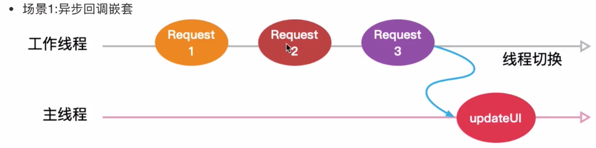

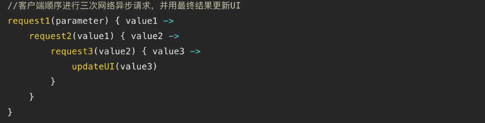

这种结构的代码无论是阅读起来还是维护起来都是极其糟糕的。*对多个回调组成的嵌套耦合，我亲切的称为回调地狱*

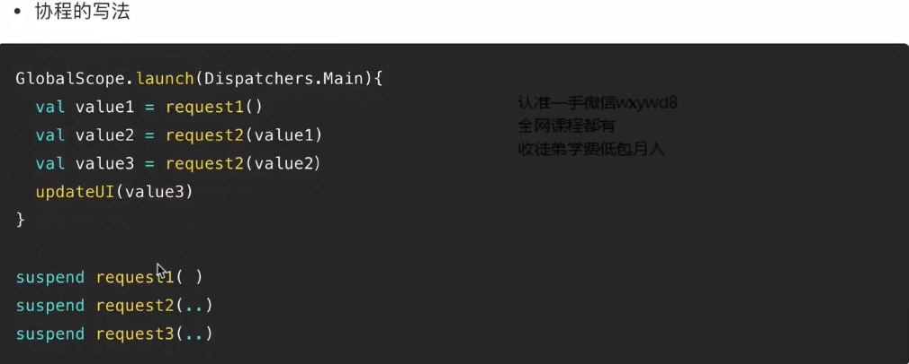

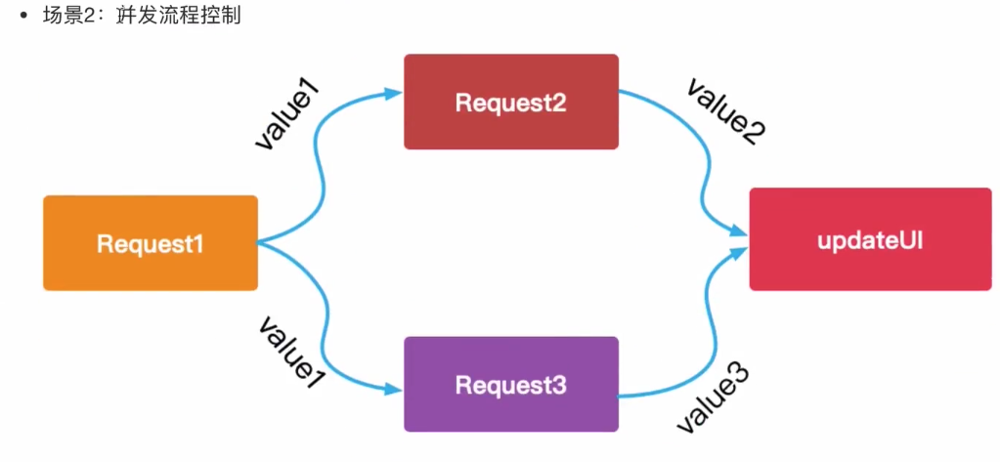

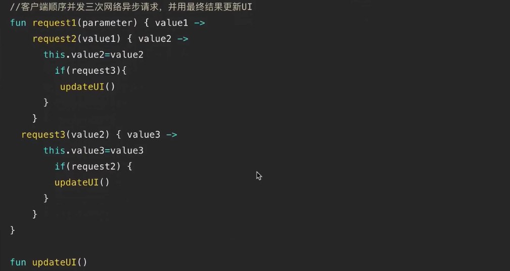

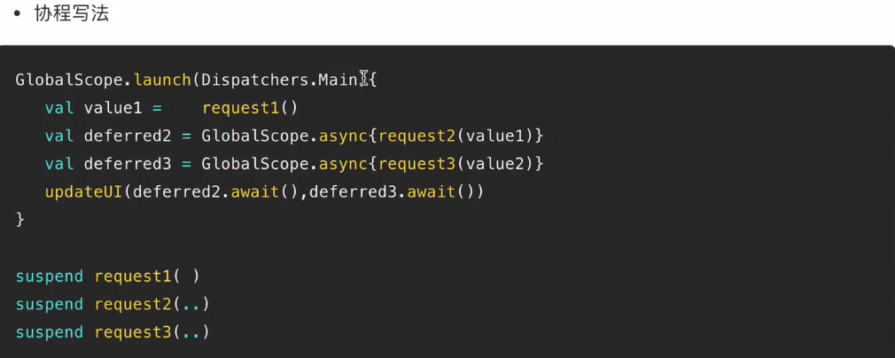


## 协程的用法

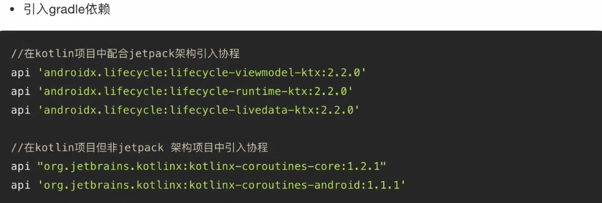

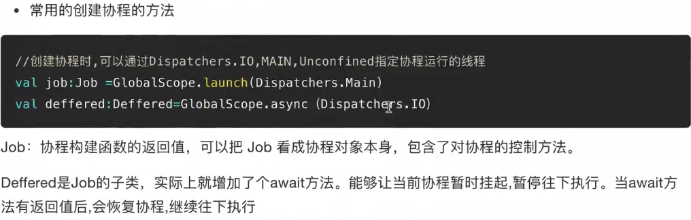

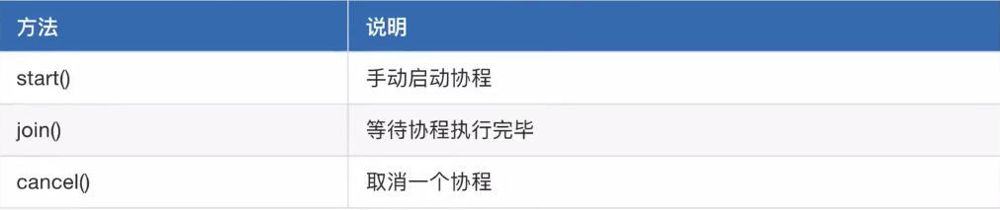

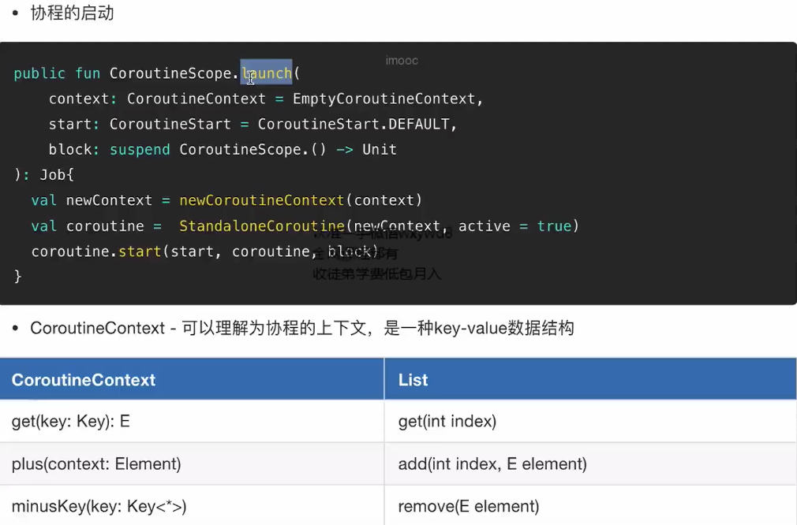

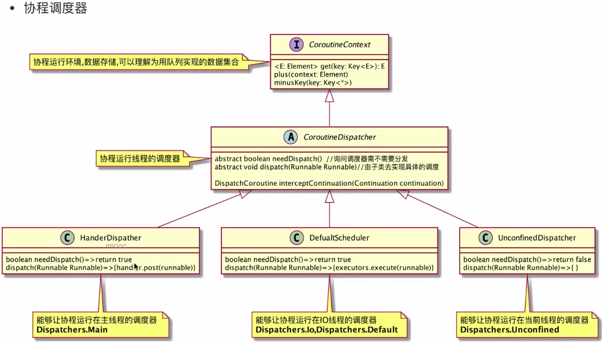

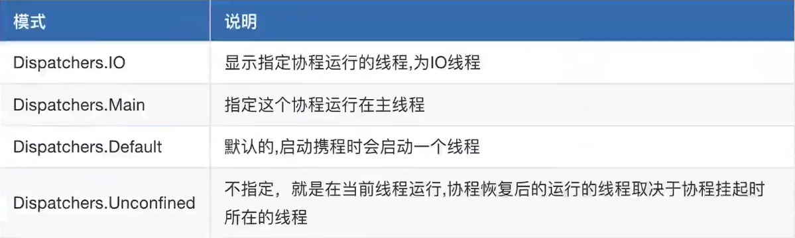

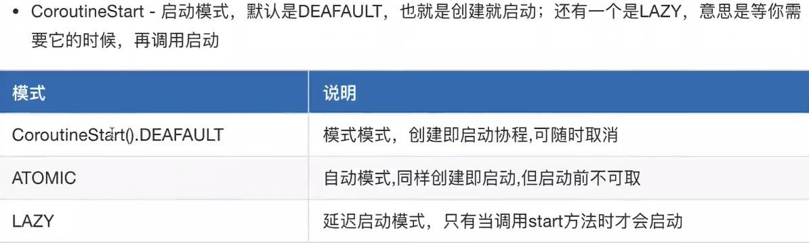

## 协程挂起、恢复原理逆向剖析


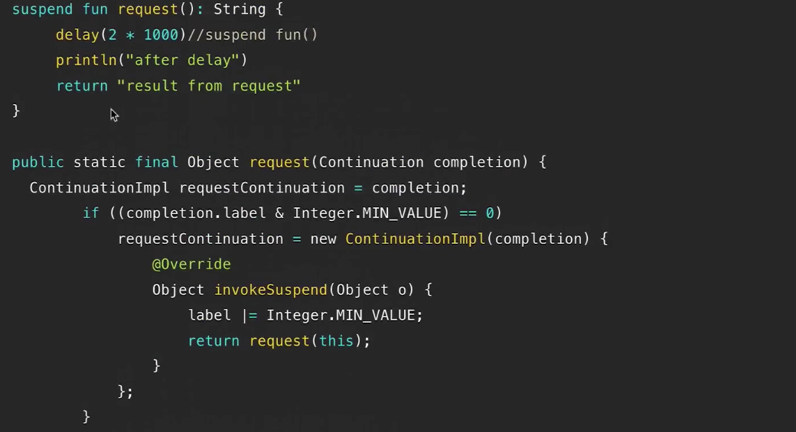

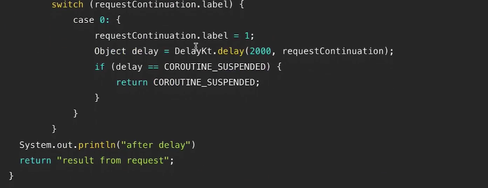

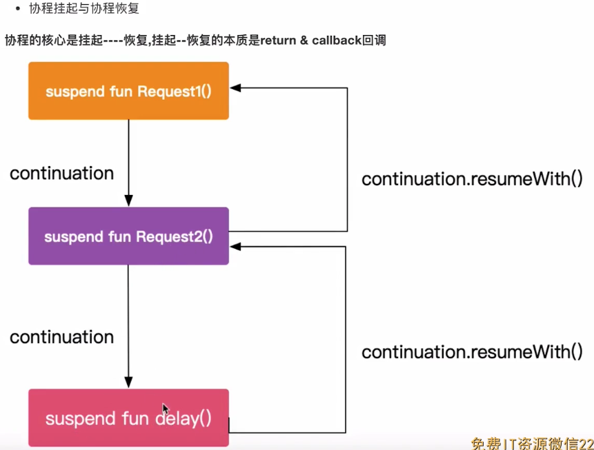

## 协程回顾

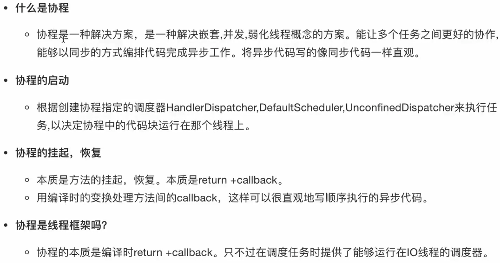

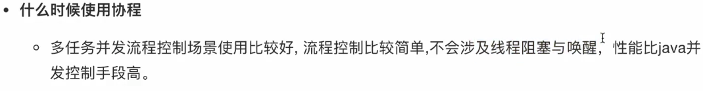

## 协程的应用

### 需求分析

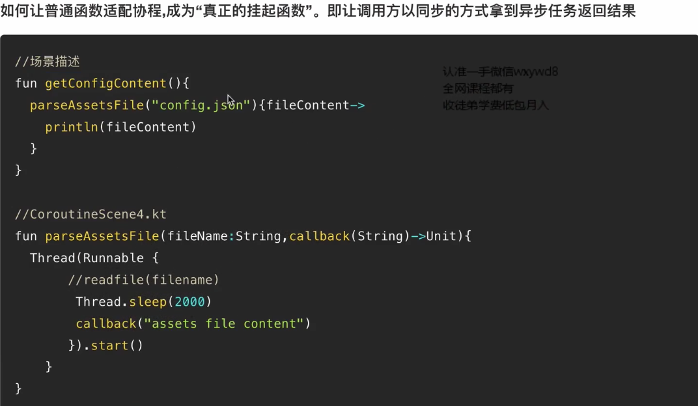

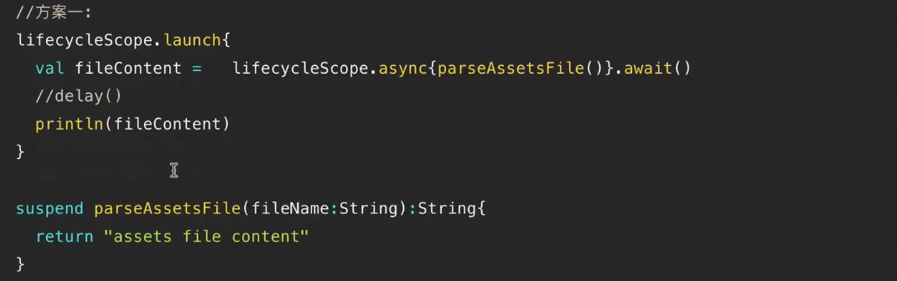

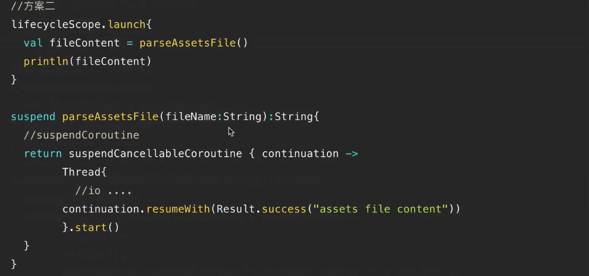

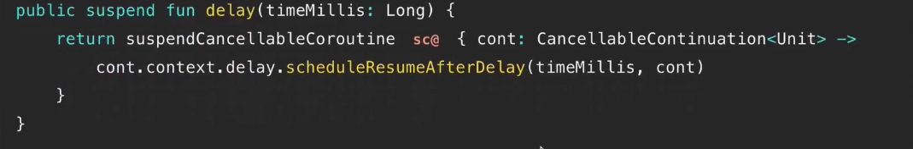

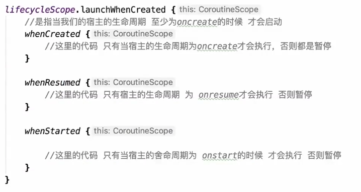


## 参考

1. [Android 上的 Kotlin 协程](https://developer.android.google.cn/kotlin/coroutines)
2. [利用 Kotlin 协程提升应用性能](https://developer.android.google.cn/kotlin/coroutines/coroutines-adv)
3.  https://github.com/android/architecture-components-samples.git


