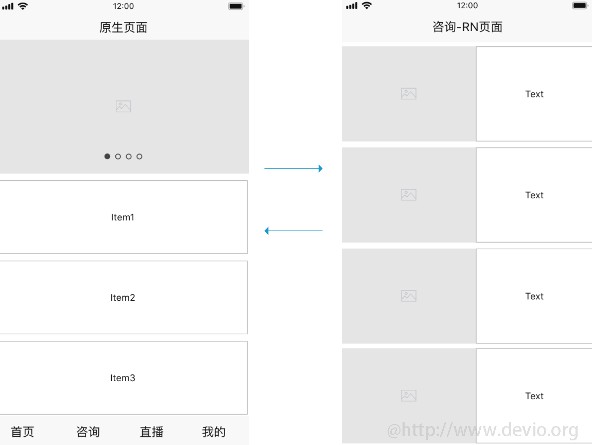
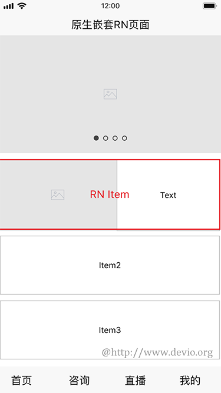
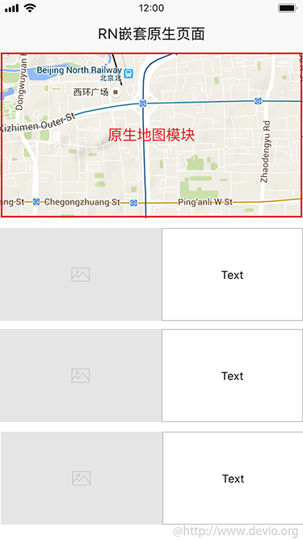
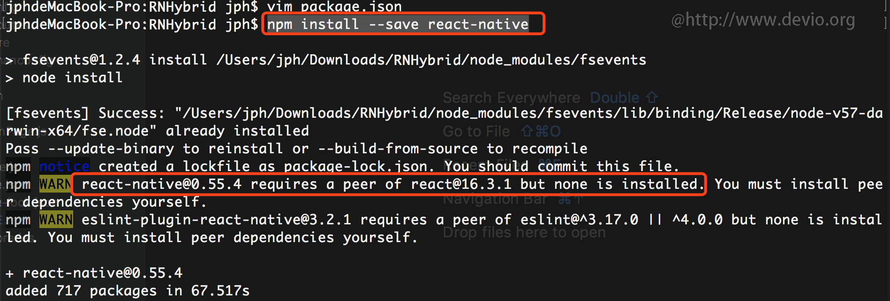
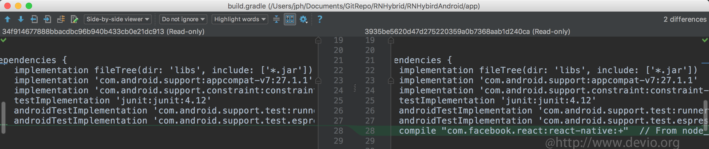
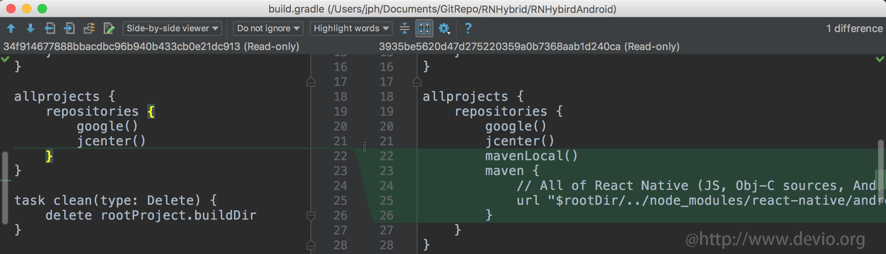
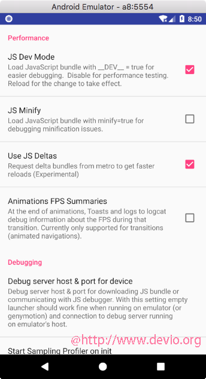
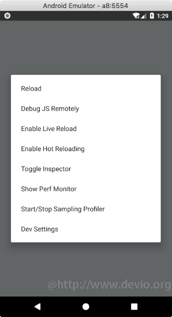
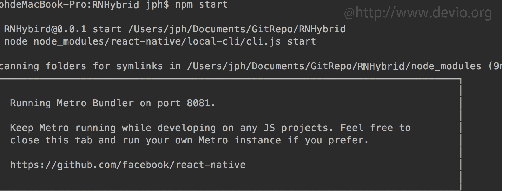
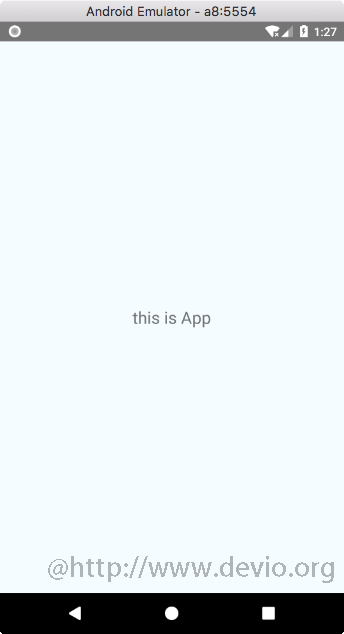

# React Native 混合开发(Android篇)

在React Native的应用场景中，有时候一个APP只有部分页面是由React Native实现的，比如：我们常用的携程App，它的首页下的很多模块都是由React Native实现的，这种开发模式被称为混合开发。

**混合开发的一些其他应用场景：**

> 在原有项目中加入RN页面，在RN项目中加入原生页面



> 原生页面中嵌入RN模块



> RN页面中嵌入原生模块



以上这些都属于React Native混合开发的范畴，那么如何进行React Native混合开发呢？

在这篇文章中我将向大家介绍React Native混合开发的流程，需要掌握的技术，以及一些经验技巧，**[与该文章配套的还有React Native与Android 混合开发讲解的视频教程](http://coding.imooc.com/class/chapter/304.html#Anchor)**。

React Native混合开发的教程我们分为上下两篇，上篇主要介绍**[如何在现有的Android应用上进行React Native混合开发](http://coding.imooc.com/class/chapter/304.html#Anchor)**，下篇主要介绍**[如何在现有的iOS应用上进行React Native混合开发](http://coding.imooc.com/class/chapter/304.html#Anchor)**。

> 将React Native集成到现有的Android应用中需要如下几个主要步骤：

- 首先，你需要有一个React Native项目；
- 为已存在的Android应用添加React Native所需要的依赖；
- 创建index.js并添加你的React Native代码；
- 创建一个Activity来承载React Native，在这个Activity中创建一个ReactRootView来作为React Native服务的容器；
- 启动React Native的Packager服务，运行应用；
- (可选)根据需要添加更多React Native的组件；
- 运行、调试、打包、发布应用；
- 升职加薪、迎娶白富美，走向人生巅峰！；

## 1. 创建一个React Native项目

在做混合开发之前我们首先需要创建一个没有Android和iOS模块的React Native项目。我们可以通过两种方式来创建一个这样的React Native项目：

- 通过`npm`安装react-native的方式添加一个React Native项目；
- 通过`react-native init`来初始化一个React Native项目；

### 通过`npm`安装react-native的方式添加一个React Native项目

第一步：创建一个名为`RNHybridApp`的目录，然后在该目录下添加一个包含如下信息的`package.json`：

```
{
  "name": "RNHybrid",
  "version": "0.0.1",
  "private": true,
  "scripts": {
    "start": "node node_modules/react-native/local-cli/cli.js start"
  }
}
```

第二步：在为package.json添加react-native

在该目录下执行：

```
npm install --save react-native
```

执行完上述命令之后，你会看到如下警告：



其中，有一条警告`npm WARN react-native@0.55.4 requires a peer of react@16.3.1 but none is installed`告诉我们需要安装`react@16.3.1`：

```
npm install --save react@16.3.1
```

至此，一个不含Android和iOS模块的React Native项目便创建好了。**[此过程所遇到的更多问题可查阅：React Native与Android 混合开发讲解的视频教程](http://coding.imooc.com/class/chapter/304.html#Anchor)**

> 提示：npm 会在你的目录下创建一个`node_modules`，`node_modules`体积很大且是动态生成了，建议将其添加到`.gitignore`文件中；

### 通过react-native init来初始化一个React Native项目

除了上述方式之外，我们也可以通过`react-native init`命令来初始化一个React Native项目。

```
react-native init RNHybrid
```

上述命令会初始化一个完成的名为RNHybrid的React Native项目，然后我们将里面的`android`和`ios`目录删除，替换成已存在Android和iOS项目。

## 2. 添加React Native所需要的依赖

在上文中我们已经创建了个一个React Native项目，接下来我们来看一下如何将这个React Native项目和我们已经存在的Native项目进行融合。

在进行融合之前我们需要将已经存在的Native项目放到我们创建的RNHybrid下，比如：我有一个名为`RNHybridAndroid`的Android项目，将其放到RNHybrid目录下：

```
RNHybrid
├── RNHybridAndroid
├── package.json
├── node_modules
└── .gitignore
```

### 第一步：配置maven

接下来我们需要为已经存在的RNHybridAndroid项目添加 React Native依赖，在`RNHybrid/RNHybridAndroid/app/build.gradle`文件中添加如下代码：

```
dependencies {
    compile 'com.android.support:appcompat-v7:23.0.1'
    ...
    compile "com.facebook.react:react-native:+" // From node_modules
}
```



然后，我们为RNHybridAndroid项目配置使用的本地React Native maven目录，在`RNHybrid/RNHybridAndroid/build.gradle`文件中添加如下代码：

```
allprojects {
    repositories {
        mavenLocal()
        maven {
            // All of React Native (JS, Obj-C sources, Android binaries) is installed from npm
            url "$rootDir/../node_modules/react-native/android"
        }
        ...
    }
    ...
}
```



> 提示：为确保你配置的目录正确，可以通过在Android Studio中运行Gradle sync 看是否有 “Failed to resolve: com.facebook.react:react-native:0.x.x” 的错误出现，没有错误则说明配置正确，否则说明配置路由有问题。 **[此过程所遇到的更多问题可查阅：React Native与Android 混合开发讲解的视频教程](http://coding.imooc.com/class/chapter/304.html#Anchor)**

### 第二步：配置权限

接下来我们为APP运行配置所需要的权限：检查你项目中的`AndroidManifest.xml`文件中看是否有如下权限：

```
<uses-permission android:name="android.permission.INTERNET" />
```

如果没有，则需要将上述权限添加到`AndroidManifest.xml`中。

> 另外，如果你需要用到RN的`Dev Settings`功能：



则需要在`AndroidManifest.xml`文件中添加如下代码：

```
<activity android:name="com.facebook.react.devsupport.DevSettingsActivity" />
```

> 提示：上述图片就是RN 开发调试弹框中的`Dev Settings`功能，打开该功能会弹出上图的一个界面，这个界面就是DevSettingsActivity。

### 第三步：指定要ndk需要兼容的架构(重要)

Android不能同时加载多种架构的so库，现在很多Android第三方sdks对abi的支持比较全，可能会包含armeabi, armeabi-v7a,x86, arm64-v8a,x86_64五种abi，如果不加限制直接引用会自动编译出支持5种abi的APK，而Android设备会从这些abi进行中优先选择某一个，比如：arm64-v8a，但如果其他sdk不支持这个架构的abi的话就会出现crash。如下图：


> 怎么解决呢：

在`app/gradle` 文件中添加如下代码：

```
defaultConfig {
....
    ndk {
        abiFilters "armeabi-v7a", "x86"
    }
}
```

上述代码的意思是，限制打包的so库只包含`armeabi-v7a`与`x86`。**[此过程所遇到的更多问题可查阅：React Native与Android 混合开发讲解的视频教程](http://coding.imooc.com/class/chapter/304.html#Anchor)**

可参考：[libgnustl_shared.so” is 32-bit instead of 64-bit](https://stackoverflow.com/questions/40694285/react-native-expection-java-lang-unsatisfiedlinkerror-dlopen-failed-data-dat)

## 3.创建index.js并添加你的React Native代码

通过上述两步，我们已经为RNHybridAndroid项目添加了React Native依赖，接下来我们来开发一些JS代码。

在RNHybrid目录下创建一个`index.js`文件并添加如下代码：

```
import { AppRegistry } from 'react-native';
import App from './App';

AppRegistry.registerComponent('App1', () => App);
```

上述代码，`AppRegistry.registerComponent('App1', () => App);`目的是向React Native注册一个名为`App1`的组件，然后我会在[第四步](https://www.devio.org/2018/08/26/React-Native-Hybrid-Android/#第四步)给大家介绍如何在Android中加载并显示出这个组件。

另外，在上述代码中我们引用了一个`App.js`文件：

```
import React, { Component } from 'react';
import {
  Platform,
  StyleSheet,
  Text,
  View
} from 'react-native';

type Props = {};
export default class App extends Component<Props> {
  render() {
    return (
      <View style={styles.container}>
        <Text style={styles.welcome}>
          this is App
        </Text>
      </View>
    );
  }
}

const styles = StyleSheet.create({
  container: {
    flex: 1,
    justifyContent: 'center',
    alignItems: 'center',
    backgroundColor: '#F5FCFF',
  },
  welcome: {
    fontSize: 20,
    textAlign: 'center',
    margin: 10,
  }
 });
```

这个`App.js`文件代表了我们React Native的一个页面，在这个页面中显示了`this is App`的文本内容。

> 以上就是为本次演示所添加的React Native代码，你也可以根据需要添加更多的React Native代码以及组件出来。

## 4. 为React Native创建一个Activity来作为容器

经过上述3、4步，我们已经为RNHybridAndroid项目添加了React Native依赖，并且创建一些React Native代码和注册了一个名为`App1`的组件，接下来我们来学习下如何在RNHybridAndroid项目中使用这个`App1`组件。

### 创建RNPageActivity

首先我们需要创建一个Activity来作为React Native的容器，

```java
public class RNPageActivity extends AppCompatActivity implements DefaultHardwareBackBtnHandler {
    private ReactRootView mReactRootView;
    private ReactInstanceManager mReactInstanceManager;
    @Override
    protected void onCreate(Bundle savedInstanceState) {
        super.onCreate(savedInstanceState);

        mReactRootView = new ReactRootView(this);
        mReactInstanceManager = ReactInstanceManager.builder()
            .setApplication(getApplication())
            .setBundleAssetName("index.android.bundle")
            .setJSMainModulePath("index")
            .addPackage(new MainReactPackage())
            .setUseDeveloperSupport(BuildConfig.DEBUG)
            .setInitialLifecycleState(LifecycleState.RESUMED)
            .build();
        // 这个"App1"名字一定要和我们在index.js中注册的名字保持一致AppRegistry.registerComponent()
        mReactRootView.startReactApplication(mReactInstanceManager, "App1", null);

        setContentView(mReactRootView);
    }

    @Override
    public void invokeDefaultOnBackPressed() {
        super.onBackPressed();
    }
}
```

**参数说明**

- `setBundleAssetName`：打包时放在`assets`目录下的JS bundle包的名字，App release之后会从该目录下加载JS bundle；
- `setJSMainModulePath`：JS bundle中主入口的文件名，也就是我们上文中创建的那个`index.js`文件；
- `addPackage`：向RN添加Native Moudle，在上述代码中我们添加了`new MainReactPackage()`这个是必须的，另外，如果我们创建一些其他的Native Moudle也需要通过`addPackage`的方式将其注册到RN中。需要指出的是RN除了这个方法外，也提供了一个`addPackages`方法用于批量向RN添加Native Moudle；
- `setUseDeveloperSupport`：设置RN是否开启开发者模式(debugging，reload，dev memu)，比如我们常用开发者弹框；
- `setInitialLifecycleState`：通过这个方法来设置RN初始化时所处的生命周期状态，一般设置成`LifecycleState.RESUMED`就行，和下文讲的Activity容器的生命周期状态关联；
- `mReactRootView.startReactApplication`：它的第一个参数是`mReactInstanceManager`，第二个参数是我们在`index.js`中注册的组件的名字，第三个参数接受一个`Bundle`来作为RN初始化时传递给JS的初始化数据，它的具体用法我会在**[React Android 混合开发讲解的视频教程](http://coding.imooc.com/class/chapter/304.html#Anchor)**中再具体的讲解；

### 在中`AndroidManifest.xml`注册一个RNPageActivity

Android系统要求，每一个要打开的Activity都要在`AndroidManifest.xml`中进行注册：

```
<activity
    android:name=".RNPageActivity"
    android:configChanges="keyboard|keyboardHidden|orientation|screenSize"
    android:windowSoftInputMode="adjustResize"
    android:theme="@style/Theme.AppCompat.Light.NoActionBar" />
```

> 上述代码中我们为`RNPageActivity`添加了一个`@style/Theme.AppCompat.Light.NoActionBar`类型的theme，这也是React Native UI组件所要求的主题。

### 为ReactInstanceManager添加Activity的生命周期回调

一个 ReactInstanceManager可以被多个activities或fragments共享，所以我们需要在Activity的生命周期中回调ReactInstanceManager的对于的方法。

```
 @Override
protected void onPause() {
    super.onPause();

    if (mReactInstanceManager != null) {
        mReactInstanceManager.onHostPause(this);
    }
}

@Override
protected void onResume() {
    super.onResume();

    if (mReactInstanceManager != null) {
        mReactInstanceManager.onHostResume(this, this);
    }
}

@Override
public void onBackPressed() {
    if (mReactInstanceManager != null) {
        mReactInstanceManager.onBackPressed();
    } else {
        super.onBackPressed();
    }
}

@Override
protected void onDestroy() {
    super.onDestroy();

    if (mReactInstanceManager != null) {
        mReactInstanceManager.onHostDestroy(this);
    }
    if (mReactRootView != null) {
        mReactRootView.unmountReactApplication();
    }
}
```

从上述代码中你会发现有个不属于Activity生命周期中的方法`onBackPressed`，添加它的目的主要是为了当用户单击手机的返回键之后将事件传递给JS，如果JS消费了这个事件，Native就不再消费了，如果JS没有消费这个事件那么RN会回调`invokeDefaultOnBackPressed`代码。

```
@Override
public void invokeDefaultOnBackPressed() {
    super.onBackPressed();
}
```

**[此过程更细致的讲解可查阅：React Native与Android 混合开发讲解的视频教程](http://coding.imooc.com/class/chapter/304.html#Anchor)**

### 添加开发者菜单

在RN中有个很好用的工具开发者菜单，我们平时调试RN应用时对它的使用频率很高，接下来我们来为RNHybridAndroid添加开着菜单。

```
 public boolean onKeyUp(int keyCode, KeyEvent event) {
    if (getUseDeveloperSupport()) {
        if (keyCode == KeyEvent.KEYCODE_MENU) {//Ctrl + M 打开RN开发者菜单
            mReactInstanceManager.showDevOptionsDialog();
            return true;
        }
	}
    return super.onKeyUp(keyCode, event);
}
```

通过上代码即可监听`Ctrl + M`来打开RN开发者菜单。



另外，RN也提供了双击R来快速加载JS的功能，通过如下代码即可打开该功能：

```
public boolean onKeyUp(int keyCode, KeyEvent event) {
    if (getUseDeveloperSupport()) {
        if (keyCode == KeyEvent.KEYCODE_MENU) {//Ctrl + M 打开RN开发者菜单
            mReactInstanceManager.showDevOptionsDialog();
            return true;
        }
        boolean didDoubleTapR = Assertions.assertNotNull(mDoubleTapReloadRecognizer).didDoubleTapR(keyCode, getCurrentFocus());
        if (didDoubleTapR) {//双击R 重新加载JS
            mReactInstanceManager.getDevSupportManager().handleReloadJS();
            return true;
        }
    }
    return super.onKeyUp(keyCode, event);
}
```

**[此过程更细致的讲解可查阅：React Native与Android 混合开发讲解的视频教程](http://coding.imooc.com/class/chapter/304.html#Anchor)**

### 使用ReactActivity来作为RN容器

在上述的代码中我们都是通过`ReactInstanceManager`来创建和加载JS的，然后重写了Activity的生命周期来对`ReactInstanceManager`进行回调，另外，重写了`onKeyUp`来启用开发者菜单等功能。

另外，查看RN的源码你会发现在RN sdk中有个叫`ReactActivity`的Activity，该Activity是RN官方封装的一个RN容器。另外，在通过`react-native init`命令初始化的一个项目中你会发现有个`MainActivity`是继承`ReactActivity`的，接下来我们就来继承`ReactActivity`来封装一个RN容器。

```
public class ReactPageActivity extends ReactActivity implements IJSBridge{
    /**
     * Returns the name of the main component registered from JavaScript.
     * This is used to schedule rendering of the component.
     */
    @Override
    protected String getMainComponentName() {
        return "App1";
    }
}
```

另外，我们需要实现一个`MainApplication`并添加如下代码：

```
public class MainApplication extends Application implements ReactApplication {

  private final ReactNativeHost mReactNativeHost = new ReactNativeHost(this) {
    @Override
    public boolean getUseDeveloperSupport() {
      return BuildConfig.DEBUG;
    }

    @Override
    protected List<ReactPackage> getPackages() {
      return Arrays.<ReactPackage>asList(
          new MainReactPackage()
      );
    }

    @Override
    protected String getJSMainModuleName() {
      return "index";
    }
  };

  @Override
  public ReactNativeHost getReactNativeHost() {
    return mReactNativeHost;
  }

  @Override
  public void onCreate() {
    super.onCreate();
    SoLoader.init(this, /* native exopackage */ false);
  }
}
```

上述代码的主要作用是为`ReactActivity`提供`ReactNativeHost`，查看源码你会发现在`ReactActivity`中使用了`ReactActivityDelegate`，在`ReactActivityDelegate`中会用到`MainApplication`中提供的`ReactNativeHost`：

```
 protected ReactNativeHost getReactNativeHost() {
    return ((ReactApplication) getPlainActivity().getApplication()).getReactNativeHost();
}
```

> 另外实现了`MainApplication`之后需要在`AndroidManifest.xml`中添加`MainApplication`：

```
 <application
        android:name=".MainApplication"
        android:allowBackup="true"
        android:icon="@mipmap/ic_launcher"
        android:label="@string/app_name"
        android:roundIcon="@mipmap/ic_launcher_round"
        android:supportsRtl="true"
        android:theme="@style/AppTheme">
        ...
```

以上就是通过继承`ReactActivity`的方式来作为RN容器的。

那么这两种方式各有什么特点：

- 通过`ReactInstanceManager`的方式：灵活，可定制性强；
- 通过继承`ReactActivity`的方式：简单，可定制性差；

**[此过程更细致的讲解可查阅：React Native与Android 混合开发讲解的视频教程](http://coding.imooc.com/class/chapter/304.html#Anchor)**

## 5. 运行React Native

经过上述的步骤，我们已经完成了对一个现有Android项目RNHybridAndroid添加了RN，并且通过两种方式分别创建了一个`RNPageActivity`与`ReactPageActivity`的Activity来加载我们在JS中注册的名为`App1`的RN 组件。

接下来我们来启动RN服务器，运行RNHybridAndroid项目打开`RNPageActivity`或`ReactPageActivity`来查看效果：

```
npm start
```

在`RNHybrid`的根目录运行上述命令，来启动一个RN本地服务：



然后我们打开AndroidStudio，点击运行按钮或者通过快捷键`Ctrl+R`来将`RNHybridAndroid`安装到模拟器上：



## 6. 添加更多React Native的组件

我们可以根据需要添加更多的React Native的组件：

```
import { AppRegistry } from 'react-native';
import App from './App';
import App2 from './App2';

AppRegistry.registerComponent('App1', () => App);
AppRegistry.registerComponent('App2', () => App);
```

然后，在Native中根据需要加载指定名字的RN组件即可。

## 7. 调试、打包、发布应用

### 调试

调试这种混合的RN应用和调试一个纯RN应用时一样的，都是通过上文中说讲到的`RN 开发者菜单`，另外搭建也可以通过学习[最新版React Native+Redux打造高质量上线App](http://coding.imooc.com/class/304.html)课程来掌握更多RN调试的技巧。

### 打包

虽让，通过上述步骤，我们将RN和我们的RNHybridAndroid项目做了融合，但打包RNHybridAndroid你会发现里面并不包含JS部分的代码，如果要将JS代码打包进Android Apk包中，可以通过如下命令：

```
react-native bundle --platform android --dev false --entry-file index.js --bundle-output RNHybridAndroid/app/src/main/assets/index.android.bundle --assets-dest RNHybridAndroid/app/src/main/res/
```

**参数说明**

- `--platform android`：代表打包导出的平台为Android；
- `--dev false`：代表关闭JS的开发者模式；
- `-entry-file index.js`：代表js的入口文件为`index.js`；
- `--bundle-output`：后面跟的是打包后将JS bundle包导出到的位置；
- `--assets-dest`：后面跟的是打包后的一些资源文件导出到的位置；

> 提示：JS bundle一定要正确放到你的Android言语的assets目录下这个和我们上文中配置的`setBundleAssetName("index.android.bundle")`进行对应。

### 发布应用

通过上述步骤我们完成了将RN代码打包并生成JS bundle，并放到了assets目录下，接下来我们就可以来通过Android Studio或者命令的方式来release我们的RN混合Android应用了。


