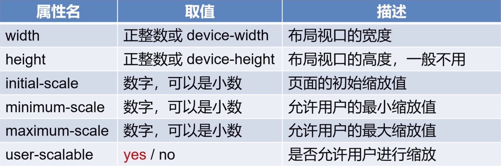
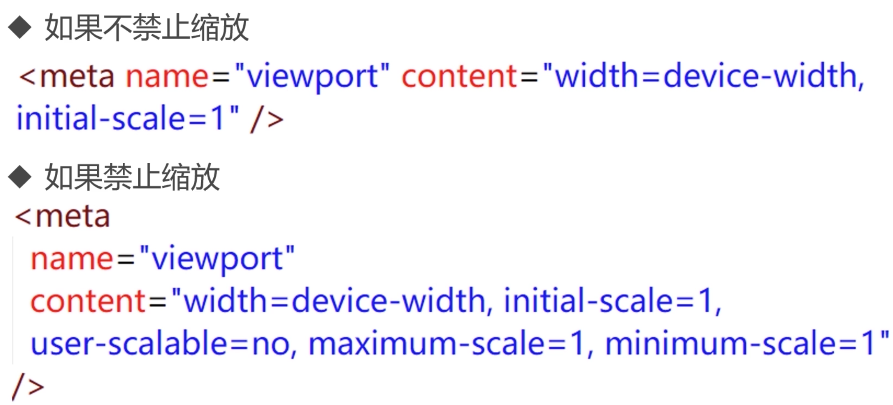
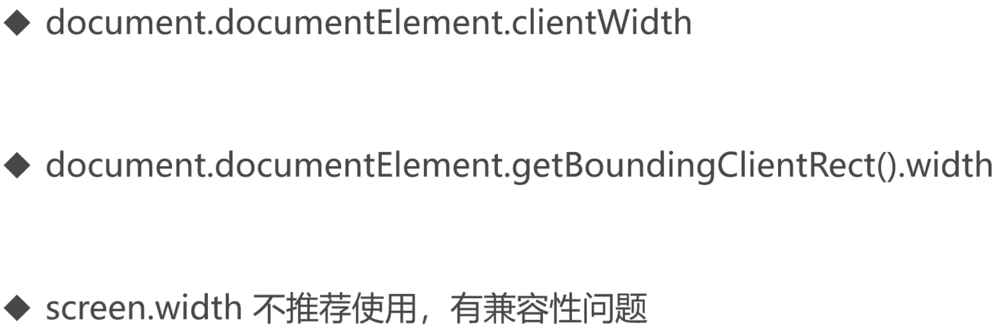
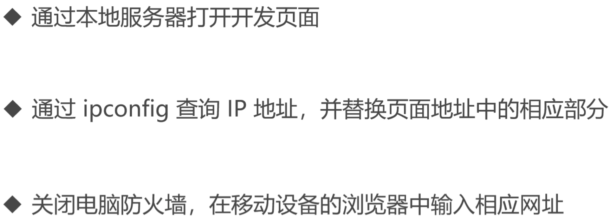
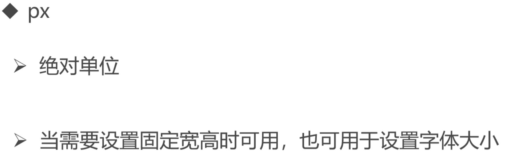
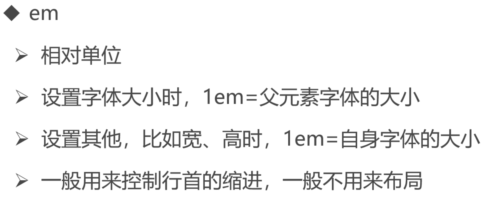
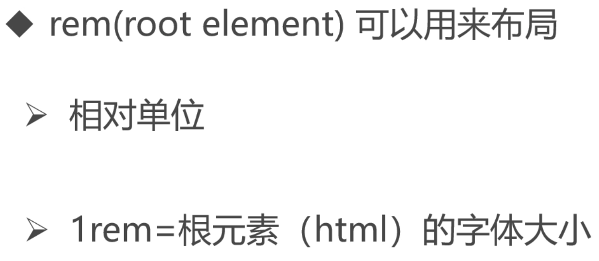
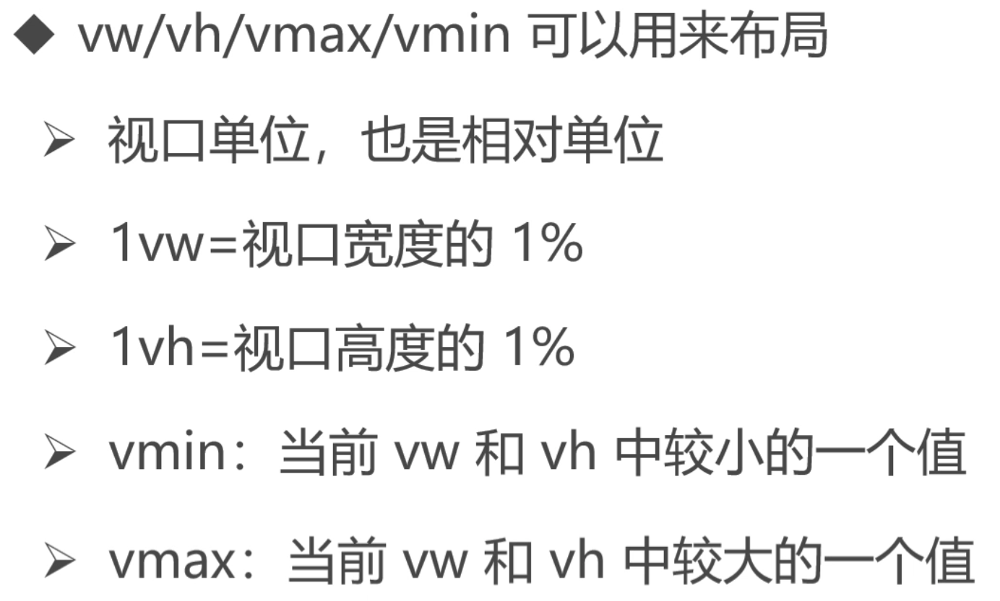

# 移动Web开发基础知识

## 布局视口与视觉视口

设置布局视口等于视觉视口

```html
<meta name="viewport" content="width=device-width"/>
```

初始缩放比例

```html
<meta name="viewport" content="initial-scale=1"/>
```

因为上面两个属性各有一些兼容问题，所以一起写

```html
<meta name="viewport" content="width=device-width,initial-scale=1"/>
```

## 视口






## 如何获取布局视口



## 真机查看



## 移动开发中常用单位











