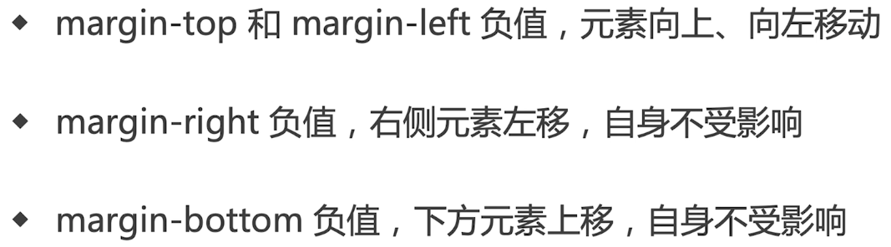
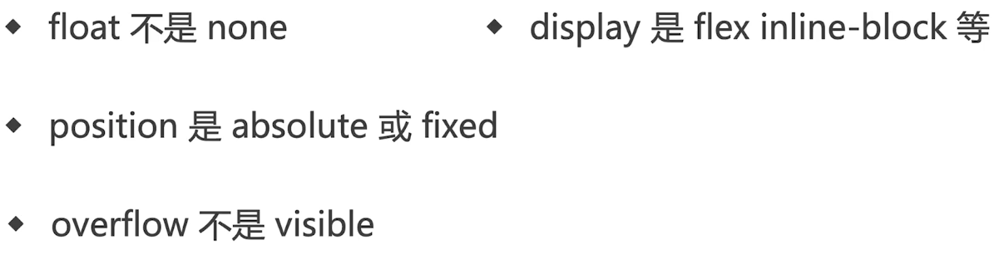
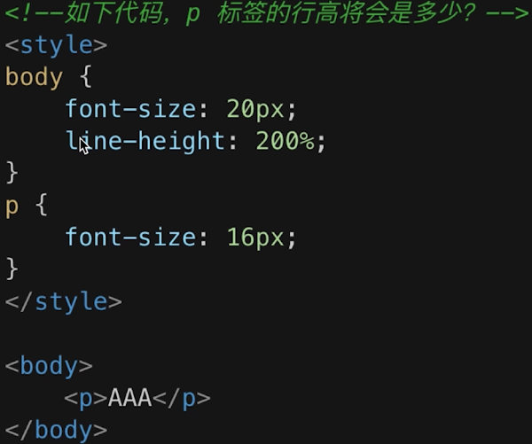
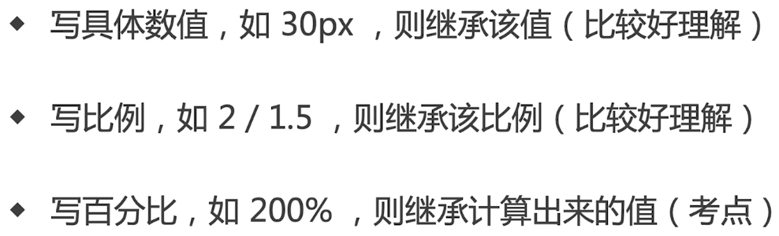
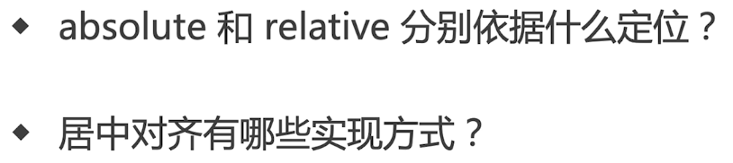
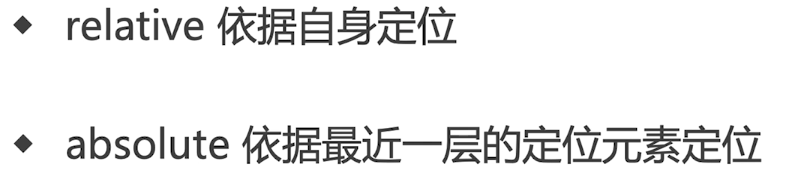
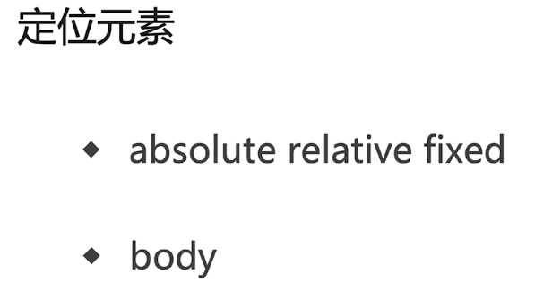
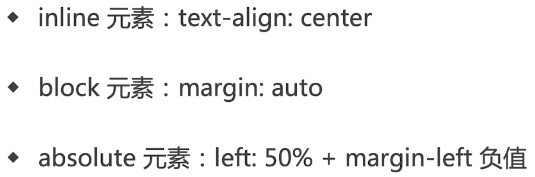
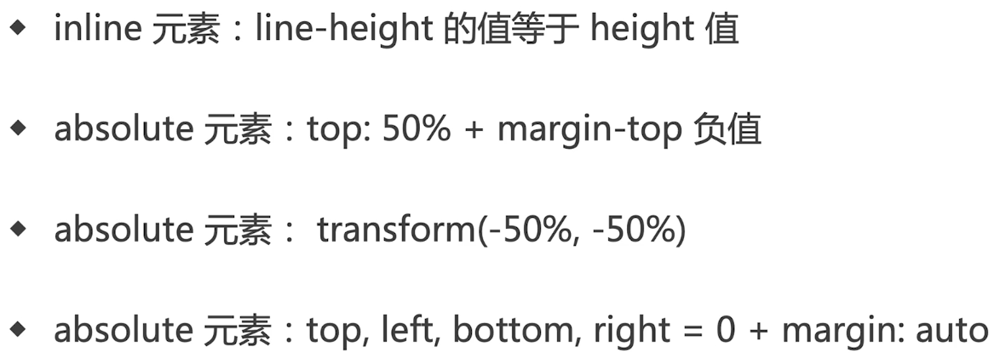
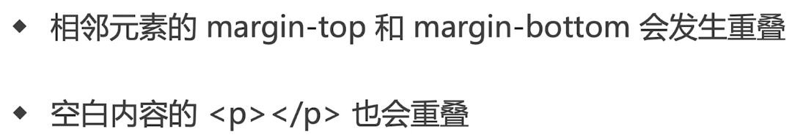

# CSS知识点

## margin负值的问题

## BFC（Block Format Context）理解与应用

> BFC: 一块独立渲染区域，内部元素的渲染不会影响边界以外的元素

### 形成BFC的条件

### BFC的常见应用

- 清除浮动

## CSS响应式

## CSS-图文样式

### line-height如何继承

 

答案： 40px

## CSS-定位

### 居中对齐实现方式

#### 水平居中

#### 垂直居中

> 第二种必须要知道子元素的宽和高

## margin纵向重叠问题

