# 函数

## 函数优先提升

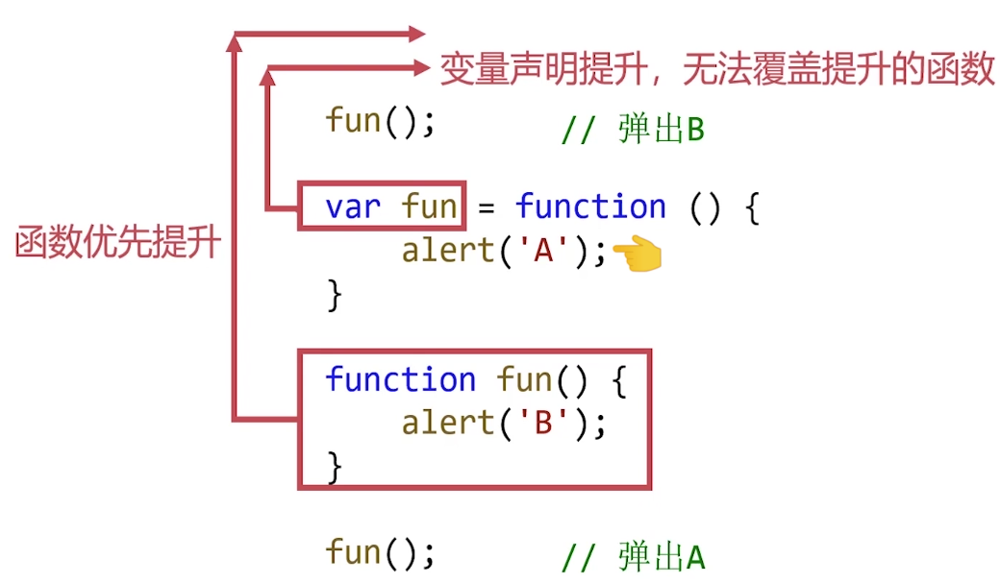

## arguments

- 函数内arguments表示它接收到的实参列表，它是一个类数组对象
- 类数组对象：所有属性均为从0开始的自然序列，并且有length属性，和数组类似可以用方括号写下标访问对象的某个属性值，但是不能调用数组的方法

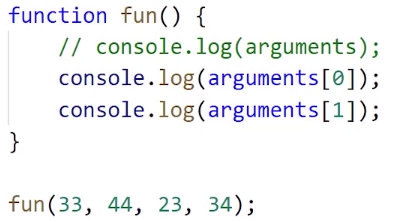

## 遮蔽效应

- 如果函数中也定义了和全局同名的变量，则函数内的变量会将全局的变量遮蔽

  

## 变量声明提升

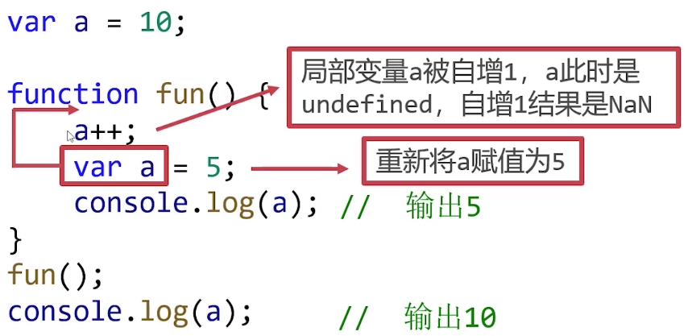

## 形参是局部变量

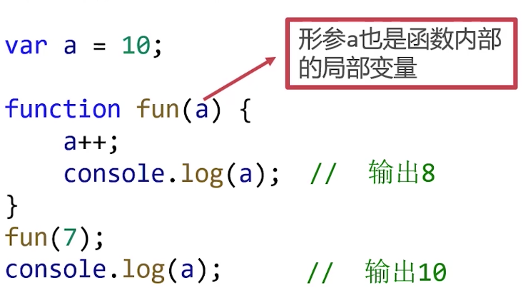

## 作用域链

- 在函数嵌套中，变量会从内岛外逐层寻找它的定义。

## 不加var将定义全局变量

- 在初次给变量赋值时，如果没有加var，则将定义全局变量

# 闭包

- 闭包是函数本身和该函数声明时所处的环境状态的组合
- 函数能够‘记忆住’其定义时所处的环境，即函数不在其定义的环境中被调用，也能访问定义时所处环境的变量
- 闭包很有用，因为它允许我们将数据与操作该数据的函数关联起来
- 闭包的功能：记忆性、模拟私有变量

### 记忆性

- 当闭包产生时，函数所处环境的状态会始终保持在内存中，不会在外层函数调用后被自动清除

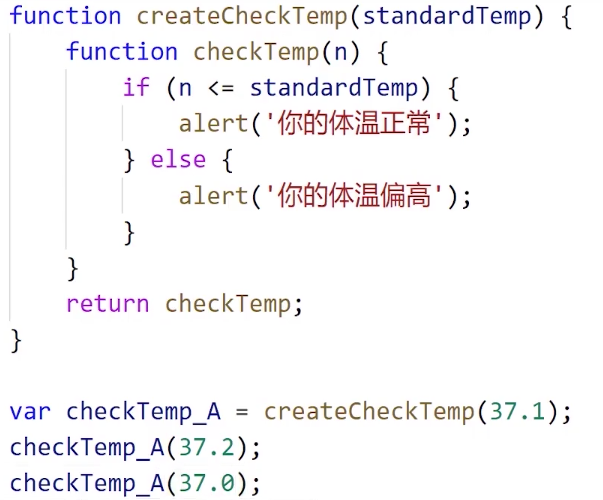

### 模拟私有变量

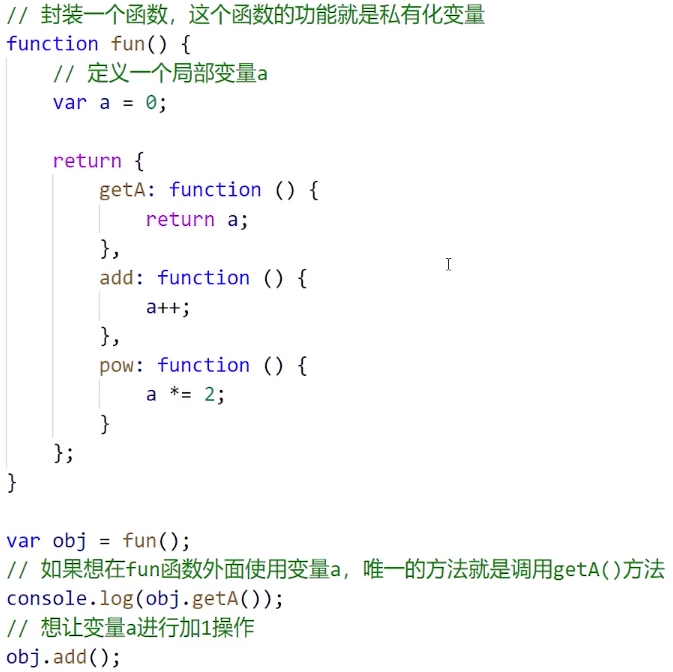

### 使用闭包的注意点

- 不能滥用闭包，否则会造成网页的性能问题，严重时可能导致内存泄漏。

## IIFE

- IIFE（Immediately Invoked Function Expression），立即调用函数表达式，是一种特殊的JavaScript函数写法，一旦被定义就立即被调用

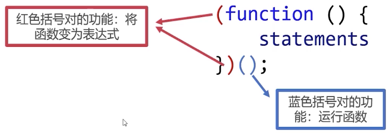

- 函数不能直接加圆括号被调用

- 函数必须转为“函数表达式”才能被调用

  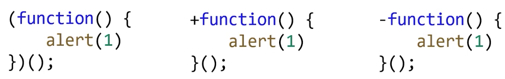

### IIFE的作用

- 为变量赋值：当给变量赋值需要一些较为复杂的计算时（如if语句），使用IIFE显得语法更紧凑

  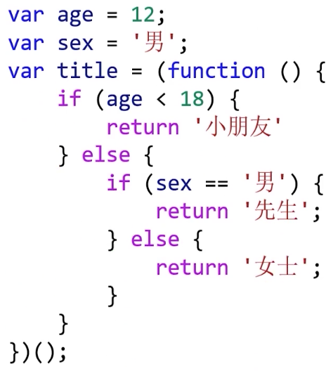

- IIFE可以再一些场合（如for循环中）将全局变量变为局部变量，语法显得紧凑

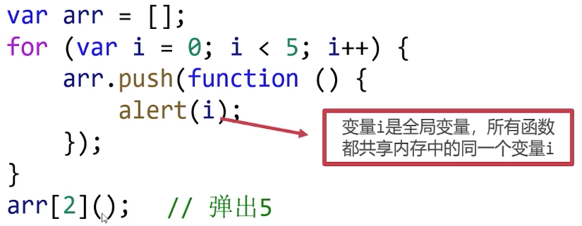

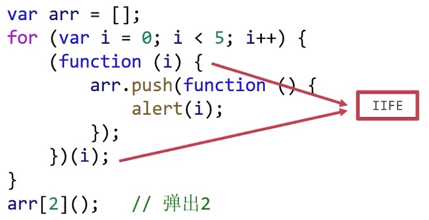

# DOM

- DOM是JS操作HTML和CSS的桥梁

## 改变元素节点中的内容

- 改变元素节点中的内容可以使用两个相关属性： 1. innerHTML	2. innerText
- innerHTML属性能以HTML语法设置节点中的内容
- innerText属性只能以纯文本的形式设置节点中的内容

## 节点的创建

- document.createElement()方法用于创建一个制定tagname的HTML元素

- 必须继续使用appendChild()或insertBefore()方法将孤儿节点插入到DOM树上

- 任何已经在DOM树上的节点，都可以调用appendChild()方法，他可以将孤儿节点挂载到它的内部，成为他的最后一个子节点

  ```
  父节点.appendChild(孤儿节点)
  ```

  

- 任何已经在DOM树上的节点，都可以调用insertBefore()方法，他可以将孤儿节点挂载到它的内部，成为他的”标杆子节点“之前的节点

  ```
  父节点.insertBefore(孤儿节点，标杆节点)
  ```

## 移动节点

- 如果将已经挂载到DOM树上的节点成为appendChild()或者insertBefore()的参数，这个节点将会被移动

  ```
  新父节点.appendChild(已经有父亲的节点)
  新父节点.insertBefore(已经有父亲的节点,标杆子节点)
  ```

- 这意味着一个节点不能同时位于DOM树的两个位置

## 删除节点

- removeChild()方法从DOM中删除一个子节点

  ```
  父节点.removeChild(要删除子节点)
  ```

- 节点不能主动删除自己，必须由父节点删除它

## 克隆节点

- cloneNode()方法可以克隆节点，克隆出的节点是“孤儿节点”

  ```
  var 孤儿节点 = 老节点.cloneNode();
  var 孤儿节点 = 老节点.cloneNode(true);
  ```

- 参数是一个布尔值，表示的是否采用深度克隆：如果为true，则该节点的所有后代节点也都会被克隆，如果为false，则只克隆该节点本身

## 改变节点的CSS样式

- 改变元素节点的CSS样式需要使用这样的语句：

  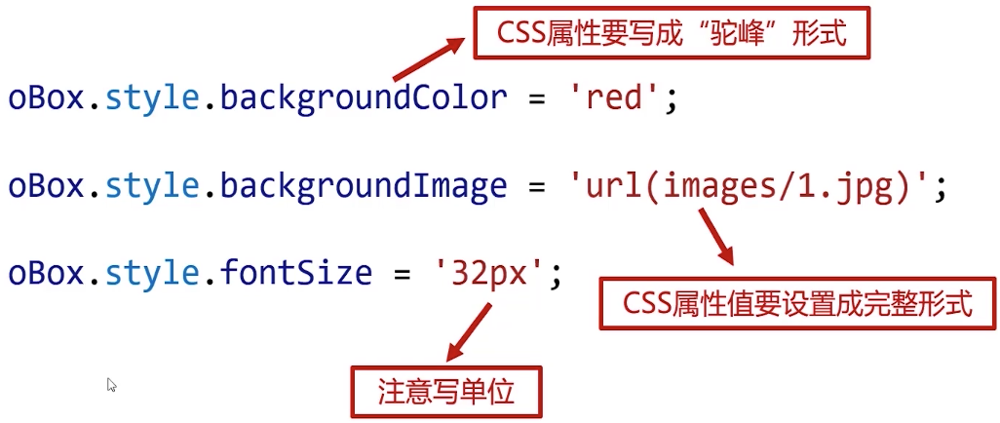

## 改变节点的HTML属性

- 标准W3C属性，如src、href等等，只需要直接打点进行更改即可

  ```
  oImg.src = 'images/2.jpg';
  ```

- 不符合W3C标准的属性，要使用setAttribute()和getAttribute()来设置、读取

  ```
  oBox.setAttribute('data-n',10);
  var n = oBox.getAttribute('data-n');
  alert(n);
  ```

## nodeType常用属性值

- 节点的nodeType属性可以显示这个节点具体的类型

  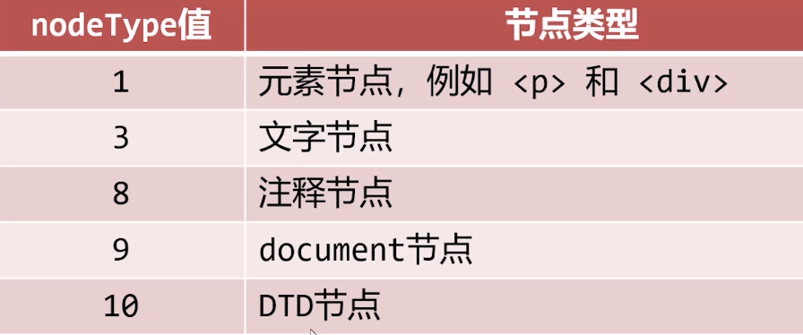

## 访问元素节点

### document

- document对象是DOM中最重要的东西，几乎所有DOM的功能都封装在了document对象中
- document对象表示整个HTML文档，它是DOM节点树的根
- document对象的nodeType属性值是9

### 访问元素节点的常用方法


- 如果页面上有相同id的元素，则只能获取第一个
- var ps = oBox.getElementsByTagName('p')
- var the_p = document.querySelector( '#box1 .spec');

## 延迟运行

- 通常JS代码一定要写到HTML节点的后面，否则JS无法找到相应HTML节点
- 可以使用 window.onload = function(){} 事件，使页面加载完毕后，再执行指定的代码

## 节点的关系

- DOM中，文本节点也属于节点，在使用节点的关系时一定要注意
- 在标准的W3C规范中，空白文本节点也应该算作节点，但是在IE8及以前的浏览器中会有一定的兼容问题，他们不把空文本节点当做节点

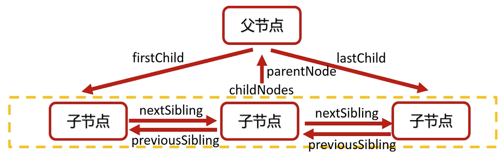

### 排除文本节点的干扰

- 从IE9开始支持一些“只考虑元素节点”的属性

  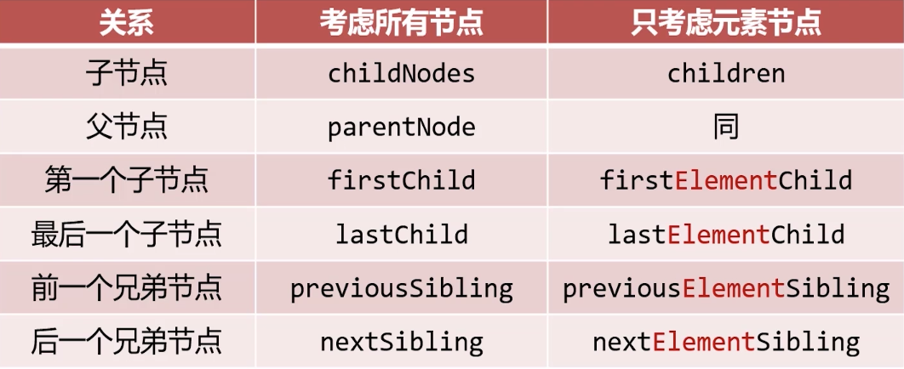

# Event

## 事件对象

### 鼠标位置

```
oBox.onmousemove = function(e){
	
}
```

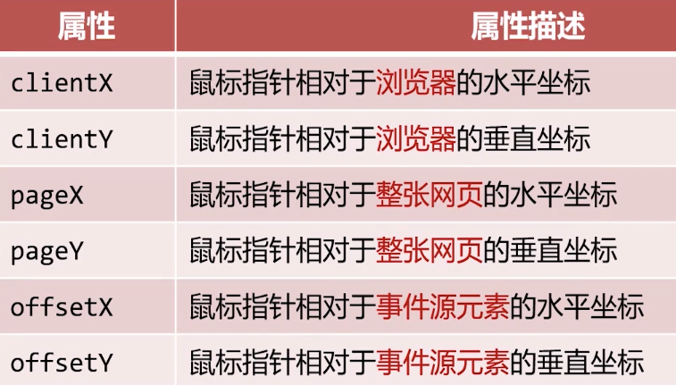

## 事件监听

### 常见的鼠标事件监听

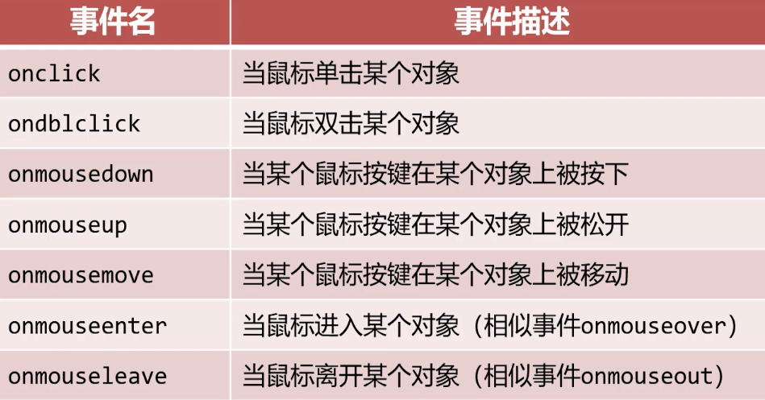

### 常见的键盘事件监听

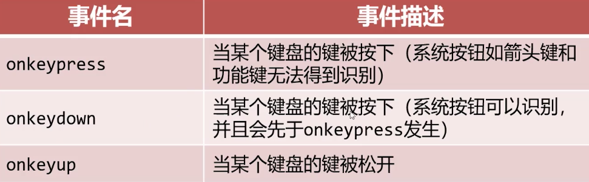

### 常见的表单事件监听

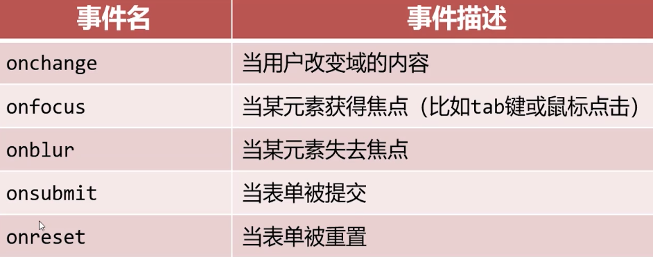

### 常见的页面事件监听

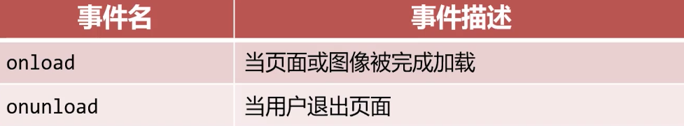

## 事件传播

- 事件的传播是从外到内，然后再从内到外

  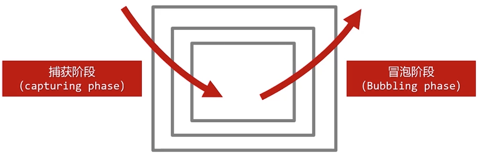

- onxxx这样的写法只能监听冒泡阶段，DOM0级事件监听

  ```
  oBox.onclick = function(){
  	
  }
  ```

- addEventListener()，DOM2级事件监听

  ```
  oBox.addEventListener('click', function(){
  	//这是事件处理函数
  },true)；
  ```

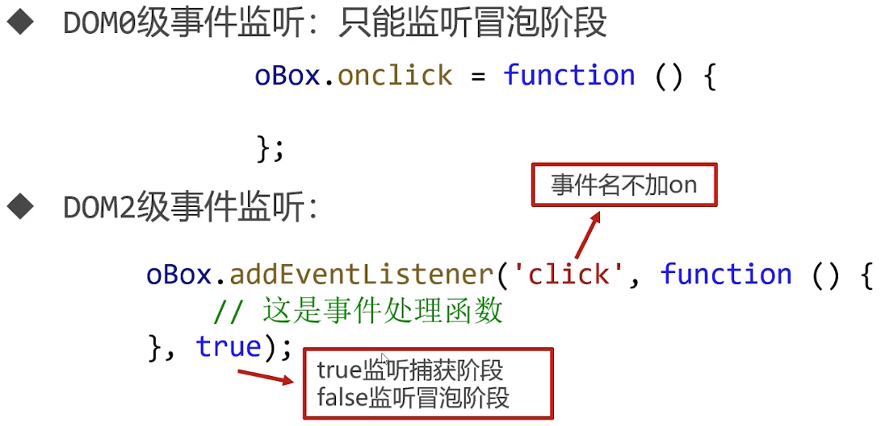

### 注意事项

- 最内部元素不再区分捕获和冒泡节点，会先执行写在前面的监听，然后执行后写的监听
- 如果给元素设置相同的两个或多个同名事件，则DOM0级写法后面写的会覆盖先写的；而DOM2级会按顺序执行

## e.charCode & e.keyCode

- e.cahrCode属性通常用于onkeypress事件中，表示用户输入的字符的“字符码”
- e.keyCode属性通常用于onkeydown事件和onkeyup中，表示用户按下的按键的“键码”

### charCode

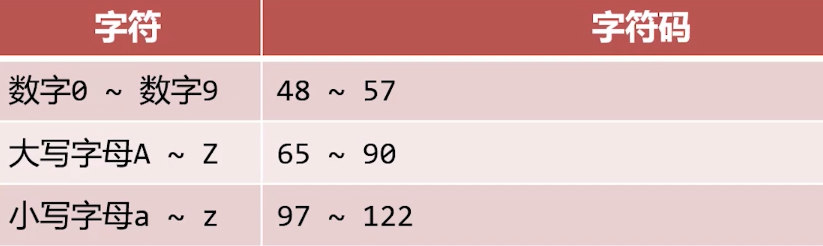

### keyCode

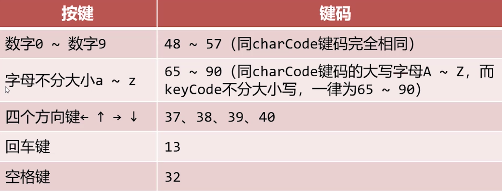

## e.preventDefault

- e.preventDefault()方法用来阻止事件产生的“默认动作”

## e.stopPropagation()

- e.stoppropagation()方法用来阻止事件继续传播

## 事件委托

- 利用事件的冒泡机制，将后代元素事件委托给祖先元素

  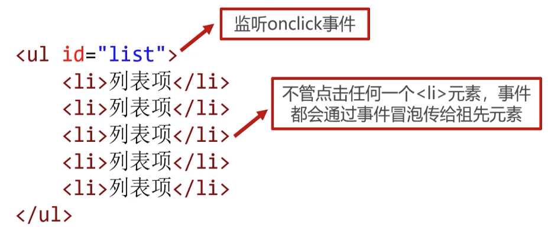

### e.target & e.currentTarget

- 事件委托通常需要结合使用e.target属性

  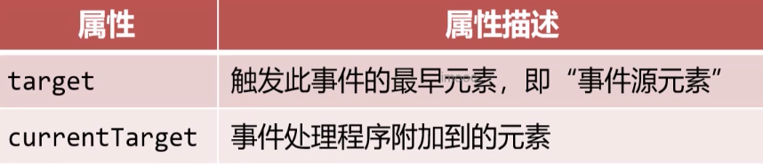

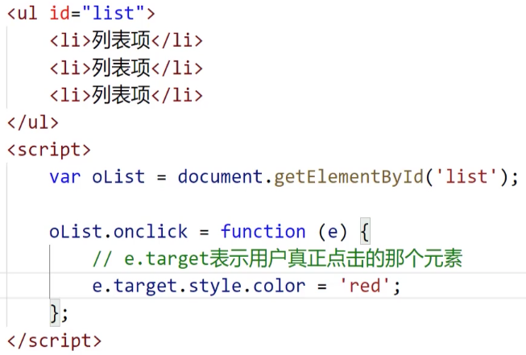

- 当有大量蕾丝元素需要批量添加事件监听时，使用事件委托可以减少内存开销
- 当有动态元素节点上树时，使用事件委托可以让新上树的元素具有事件监听

### 注意事项

- onmouseenter和onmouseover都表示“鼠标进入”，它们有什么区别呢？

  答：onmouseenter不冒泡，onmouseover冒泡

- 使用事件委托时要注意：不能委托不冒泡的事件给祖先元素
- 使用事件委托时要注意：最内层的元素不能再有额外的内层元素了

# 定时器

- setInterval()函数可以重复调用一个函数，在每次调用之间具有固定的时间间隔

  ```
  setInterval(function(){
  	//这个函数将自动被以固定间隔事件调用
  },2000)
  ```

## 函数的参数

- setInterval()函数可以接收第3、4...个参数，它们将按顺序传入函数

  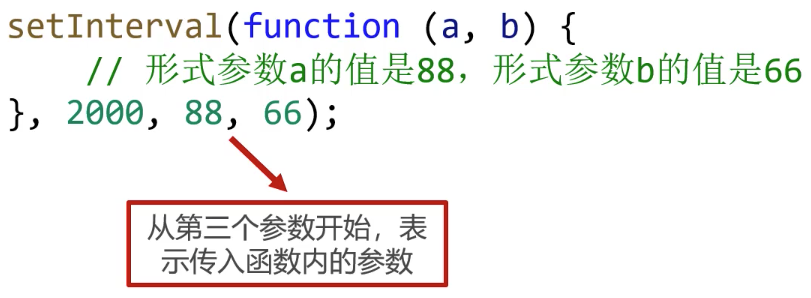

- 具名函数也可以传入setInterval()

  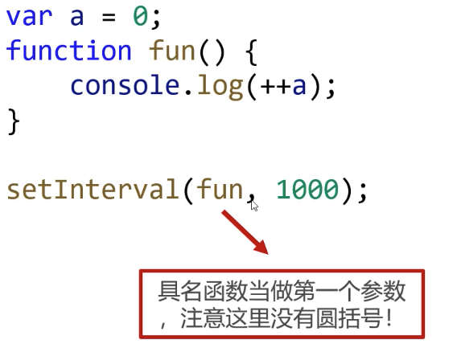

## 清除定时器

- clearInterval()函数可以清除一个定时器

  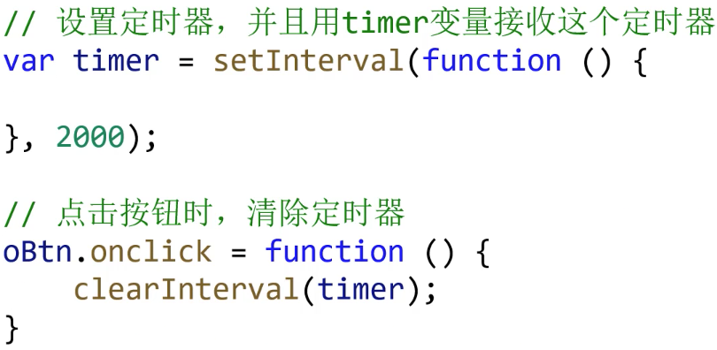

# 延时器

- setTimeout()函数可以设置一个延时器，当指定时间到了之后，会执行函数一次，不再重复执行

  ```
  setTimeout(function(){
  	//这个函数会在2秒后执行一次
  },2000)
  ```

## 清除延时器

- clearTimeout()函数可以清除延时器，和clearInterval()非常类似
- setInterval() 和 setTimeout()是两个异步语句

## 使用定时器实现动画

# JS和CSS3结合实现动画

```jsx
btn.onclick = function(){
	//加上过度
	box.style.transition = 'all 2s linear 0s';
	//瞬间移动，但是由于有过度，所以是动画
	box.style.left = '1100px';
}
```

## 函数节流


## 无缝滚动动画

```html
<!DOCTYPE html>
<html lang="en">

<head>
    <meta charset="UTF-8">
    <meta name="viewport" content="width=device-width, initial-scale=1.0">
    <title>Document</title>
    <style>
        * {
            margin: 0;
            padding: 0;
        }

        .box {
            width: 1000px;
            height: 130px;
            border: 1px solid #000;
            margin: 50px auto;
            overflow: hidden;
        }

        .box ul {
            list-style: none;
            /* 设置大一点，这样li才能浮动 */
            width: 5000px;
            position: relative;
        }

        .box ul li {
            float: left;
            margin-right: 10px;
        }
    </style>
</head>

<body>
    <div id="box" class="box">
        <ul id="list">
            <li></li>
            <li></li>
            <li></li>
            <li></li>
            <li></li>
            <li></li>
        </ul>
    </div>
    <script>
        var box = document.getElementById('box');
        var list = document.getElementById('list');

        // 复制多一遍所有的li
        list.innerHTML += list.innerHTML;

        // 全局变量，表示当前list的left值
        var left = 0;

        // 定时器，全局变量
        var timer;

        move();

        // 动画封装成函数
        function move() {
            // 设表先关，防止动画积累
            clearInterval(timer);

            timer = setInterval(function () {
                left -= 4;
                // 验收
                if (left <= - 1260) {
                    left = 0;
                }
                list.style.left = left + 'px';
            }, 20);
        }

        // 鼠标进入停止定时器
        box.onmouseenter = function () {
            clearInterval(timer);
        };

        // 鼠标离开继续定时器
        box.onmouseleave = function () {
            move();
        };
    </script>
</body>

</html>
```

## 跑马灯动画

```html
<!DOCTYPE html>
<html lang="en">
<head>
    <meta charset="UTF-8">
    <meta name="viewport" content="width=device-width, initial-scale=1.0">
    <title>Document</title>
    <style>
        *{
            margin: 0;
            padding: 0;
        }
        .carousel {
            width: 650px;
            height: 360px;
            border: 1px solid #000;
            margin: 50px auto;
            position: relative;
            overflow: hidden;
        }
        .carousel ul {
            list-style: none;
            width: 6000px;
            position: relative;
            left: 0px;
            transition: left .5s ease 0s;
        }
        .carousel ul li {
            float: left;
        }
        .carousel .leftbtn {
            position: absolute;
            left: 20px;
            top: 50%;
            margin-top: -25px;
            width: 50px;
            height: 50px;
            background-color: rgb(28, 180, 226);
            border-radius: 50%;
        }
        .carousel .rightbtn {
            position: absolute;//子绝对布局，父相对布局（子绝父相）
            right: 20px;
            top: 50%;
            margin-top: -25px;
            width: 50px;
            height: 50px;
            background-color: rgb(28, 180, 226);
            border-radius: 50%;
        }
    </style>
</head>
<body>
    <div class="carousel">
        <ul id="list">
            <li></li>
            <li></li>
            <li></li>
            <li></li>
            <li></li>
        </ul>
        <a href="javascript:;" class="leftbtn" id="leftbtn"></a>
        <a href="javascript:;" class="rightbtn" id="rightbtn"></a>
    </div>
    <script>
        // 得到按钮和ul，ul整体进行运动
        var leftbtn = document.getElementById('leftbtn');
        var rightbtn = document.getElementById('rightbtn');
        var list = document.getElementById('list');

        // 克隆第一张图片
        var cloneli = list.firstElementChild.cloneNode(true);
        list.appendChild(cloneli);

        // 当前ul显示到第几张了，从0开始数
        var idx = 0;

        // 节流锁
        var lock = true;

        // 右边按钮监听
        rightbtn.onclick = function () {
            // 判断锁的状态
            if (!lock) return; 

            lock = false;

            // 给list加过渡，为什么要加？？css中不是已经加了么？？这是因为最后一张图片会把过渡去掉
            list.style.transition = 'left .5s ease 0s';
            idx ++;
            if (idx > 4) {
                // 设置一个延时器，延时器的功能就是将ul瞬间拉回0的位置，延时器的目的就是让过渡动画结束之后
                setTimeout(function() {
                    // 取消掉过渡，因为要的是瞬间移动，不是“咕噜”回去
                    list.style.transition = 'none';
                    list.style.left = 0;
                    idx = 0;
                }, 500);
            }
            list.style.left = -idx * 650 + 'px';

            // 函数节流
            setTimeout(function() {
                lock = true; 
            }, 500);
        }

        // 左边按钮监听
        leftbtn.onclick = function () {
            if (!lock) return;

            lock = false;

            // 判断是不是第0张，如果是，就要瞬间用假的替换真的
            if (idx == 0) {
                // 取消掉过渡，因为要的是瞬间移动，不是“咕噜”过去
                list.style.transition = 'none';
                // 直接瞬间移动到最后的假图片上
                list.style.left = -5 * 650 + 'px';
                // 设置一个延时器，这个延时器的延时时间可以是0毫秒，虽然是0毫秒，但是可以让我们过渡先是瞬间取消，然后再加上
                setTimeout(function() {
                    // 加过渡
                    list.style.transition = 'left .5s ease 0s';
                    // idx改为真正的最后一张
                    idx = 4;
                    list.style.left = -idx * 650 + 'px';
                }, 0);
            } else {
                idx --;
                list.style.left = -idx * 650 + 'px';
            }
            
            // 函数节流
            setTimeout(function() {
                lock = true; 
            }, 500);
        }
    </script>
</body>
</html>
```

## 呼吸轮播图

```html
<!DOCTYPE html>
<html lang="en">

<head>
    <meta charset="UTF-8">
    <meta name="viewport" content="width=device-width, initial-scale=1.0">
    <title>Document</title>
    <style>
        * {
            margin: 0;
            padding: 0;
        }

        .carousel {
            width: 650px;
            height: 360px;
            border: 1px solid #000;
            margin: 50px auto;
            position: relative;

        }

        .carousel ul {
            list-style: none;
        }

        .carousel ul li {
            position: absolute;
            top: 0;
            left: 0;
            /* 透明度都是0 */
            opacity: 0;
            transition: opacity 1s ease 0s;
        }

        /* 只有第一张透明度是1 */
        .carousel ul li:first-child {
            opacity: 1;
        }

        .carousel .leftbtn {
            position: absolute;
            left: 20px;
            top: 50%;
            margin-top: -25px;
            width: 50px;
            height: 50px;
            background-color: rgb(28, 180, 226);
            border-radius: 50%;
        }

        .carousel .rightbtn {
            position: absolute;
            right: 20px;
            top: 50%;
            margin-top: -25px;
            width: 50px;
            height: 50px;
            background-color: rgb(28, 180, 226);
            border-radius: 50%;
        }
    </style>
</head>

<body>
    <div class="carousel">
        <ul id="list">
            <li></li>
            <li></li>
            <li></li>
            <li></li>
            <li></li>
        </ul>
        <a href="javascript:;" class="leftbtn" id="leftbtn"></a>
        <a href="javascript:;" class="rightbtn" id="rightbtn"></a>
    </div>
    <script>
        // 得到按钮和ul，ul整体进行运动
        var leftbtn = document.getElementById('leftbtn');
        var rightbtn = document.getElementById('rightbtn');
        var list = document.getElementById('list');
        var lis = list.getElementsByTagName('li');

        // 当前是第几张图显示
        var idx = 0;

        // 节流
        var lock = true;

        // 右按钮
        rightbtn.onclick = function () {
            // 判断节流
            if (!lock) return;

            lock = false;

            // 还没有改idx，此时的idx这个图片就是老图，老图淡出
            lis[idx].style.opacity = 0;
            idx++;
            if (idx > 4) idx = 0;
            // 改了idx，此时的idx这个图片就是新图，新图淡入
            lis[idx].style.opacity = 1;

            // 动画结束之后，开锁
            setTimeout(function () {
                lock = true;
            }, 1000);
        }

        // 左按钮
        leftbtn.onclick = function () {
            // 判断节流
            if (!lock) return;

            lock = false;

            // 还没有改idx，此时的idx这个图片就是老图，老图淡出
            lis[idx].style.opacity = 0;
            idx--;
            if (idx < 0) idx = 4;
            // 改了idx，此时的idx这个图片就是新图，新图淡入
            lis[idx].style.opacity = 1;

            // 动画结束之后，开锁
            setTimeout(function () {
                lock = true;
            }, 1000);
        }
    </script>
</body>

</html>
```

# BOM

## Window

- window对象是当前JS脚本运行所处的窗口，而这个窗口中包含DOM结构，window.document属性就是document对象

- 在有标签页功能的浏览器中，每个标签都拥有自己的window对象；同一个窗口的标签页之间不会共享一个window对象

- 全局变量会成为window对象的属性，多个js文件之间是共享全局作用域的，即js文件没有作用域隔离功能

  ```
  var a = 10 ;
  console.log( window.a == a); //true
  ```

- 如setInterval() 、alert()等内置函数，普遍都是window的方法

### 窗口尺寸相关属性

- 获得不包含滚动条的窗口宽度，要用 document.documentElement.clientWidth

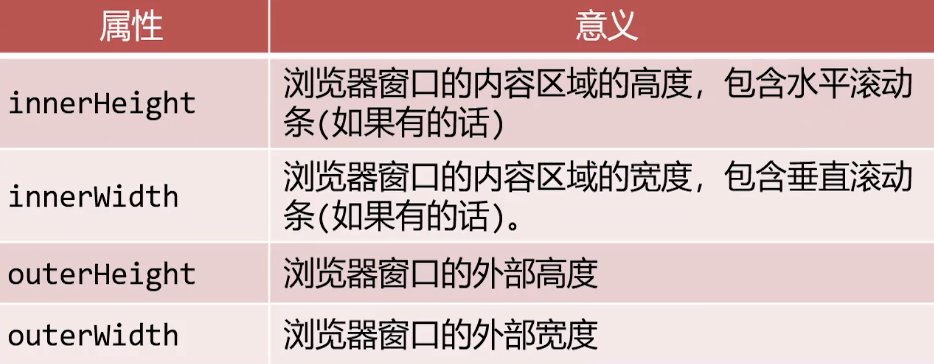

### resize事件

- 在窗口大小改变之后，就会触发resize事件，可以使用window.onresize或者window.addEventListener(’resize‘)来绑定事件处理函数

### 已滚动高度

- window.scrollY属性表示在垂直方向已滚动的像素值
- document.documentElement.scrollTop属性也表示窗口滚动的高度
- document.documentElement.scrollTop不是只读的，而window.scrollY是只读的

```
var scrollTop = window.scrollY || document.document.documentElement.scrollTop;
```

- 返回页面顶部可使用document.documentElement.scrollTop = 0

### scroll事件

- 在窗口被卷动之后，就会触发scroll事件，可以使用window.onscroll或者window.addEventListener('scroll')来绑定事件处理函数

## Navigator

- window.navigator属性可以检索navigator对象，它内部含有用户此次活动的**浏览器**的相关属性和标识

  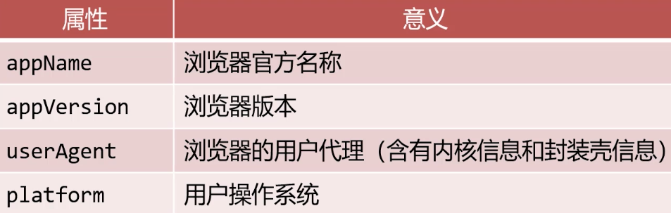

## History

- window.history对象提供了来操作浏览器会话历史的接口

- 常用操作就是模拟浏览器回退按钮

  ```
  history.back() //等同于点击浏览器的回退按钮
  history.go(-1) //等同于history.back()；
  <a href="javascript:history.back();">回退</a>
  ```

## Location

- window.location标识当前所在的网址，可以通过给这个属性赋值命令浏览器进行页面跳转

  ```
  window.location = 'http://www.xxx.com';
  window.location.href = 'http://xxx.com';
  ```

### 刷新页面

- 可以调用location的reload方法以重新加载当前页面，参数true表示强制从服务器强制加载

  ```
  window.location.reload(true);
  ```

### get请求查询参数

- window.location.search属性即为当前浏览器的GET请求查询参数

## BOM特效

### 一键置顶

- 返回顶部的原理：改变document.documentElement.scrollTop属性，通过定时器逐步改变此值，则将用动画形式返回顶部

### 锚点导航

- DOM元素都有officeTop属性，表示此元素到定位祖先元素的垂直距离
- 定位祖先元素：在祖先中，离自己最近的且拥有定位属性的元素

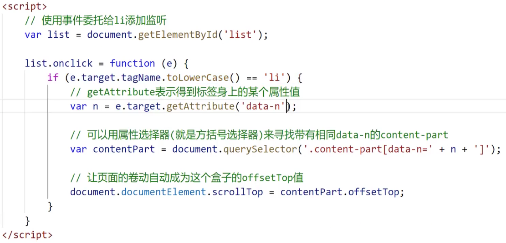

# 对象

## 认识对象

- 对象（object）是“键值对”的集合，表示属性和值的映射关系

- 如果对象的属性键名不符合JS标识符命名规范，则这个键名必须用引号包裹

- 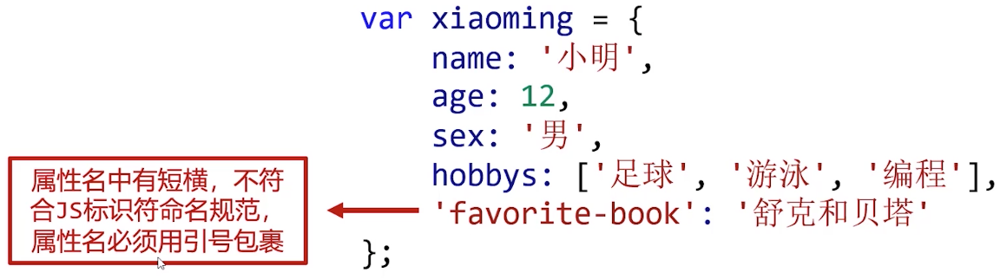

- 如果属性名不符合JS标识符命名规范，则必须用方括号的写法来访问

  ```
  xiaoming['favorite-book']
  ```

- 如果属性名以变量形式存储，则必须使用方括号形式

  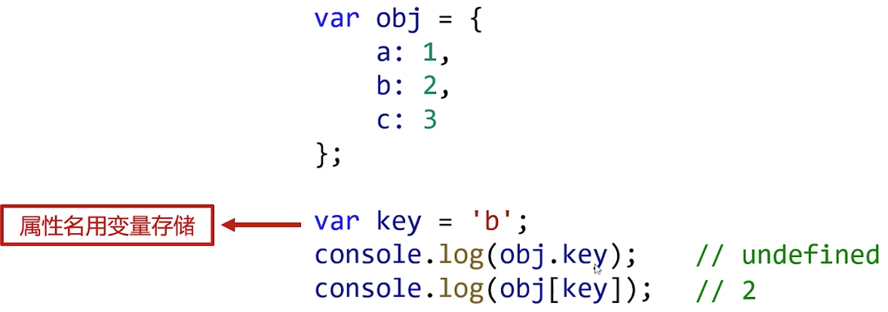

- 如果要删除某个对象的属性，需要使用delete操作符

  ```
  var obj = {
  	a : 1,
  	b : 2
  };
  delete obj.a;
  ```

## 对象的方法

- 如果对象的某个属性是函数，则它也被称为对象的“方法”

## 对象的遍历

- 和遍历数组类似，对象也可以遍历，遍历对象需要使用 for...in... 循环

- 使用 for...in... 循环可以遍历对象的每个键

  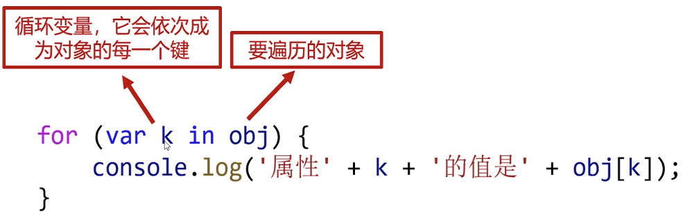

## 对象的深浅克隆

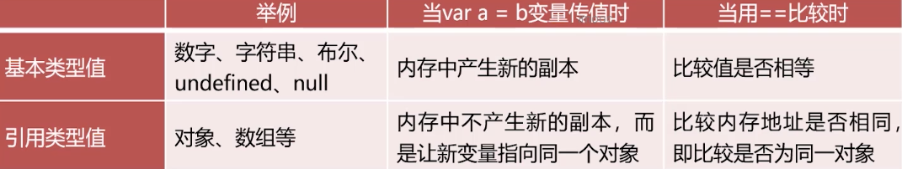

## 函数上下文

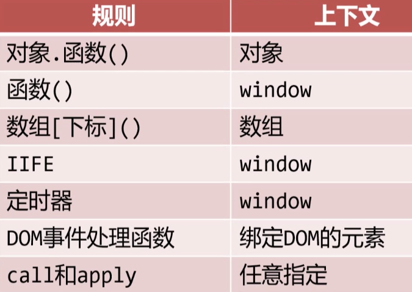

### 函数中的this

- 函数的上下文由调用方式决定

- 同一个函数，用不同的形式调用它，则函数的上下文不同

  - 情形一：对象打点调用函数，函数中的this指代这个打点的对象

    ```
    xiaoming.sayHello();
    ```

  - 情形二：圆括号直接调用函数，函数中的this指代window对象

    ```
    var sayHello = xioaming.sayHello;
    sayHello();
    ```


### 上下文规则

1. 对象打点调用它的方法函数，则函数的上下文是这个打点的对象；

   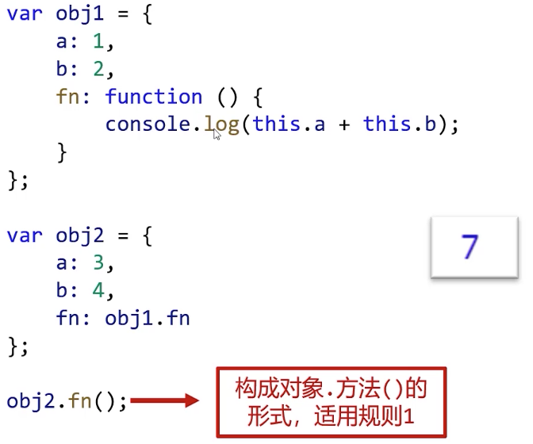

   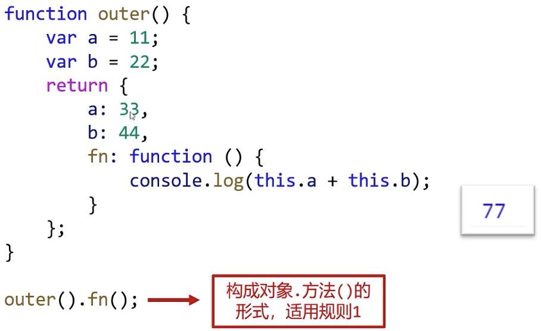

2. 圆括号直接调用函数，则函数的上下文是window对象；

   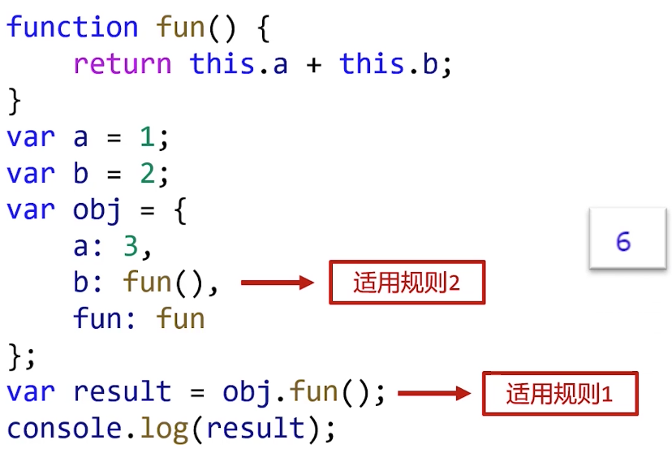

3. 数组（类数组对象）枚举出函数进行调用，上下文是这个数组（类数组对象）；

   ```
   数组[下标]()
   ```

   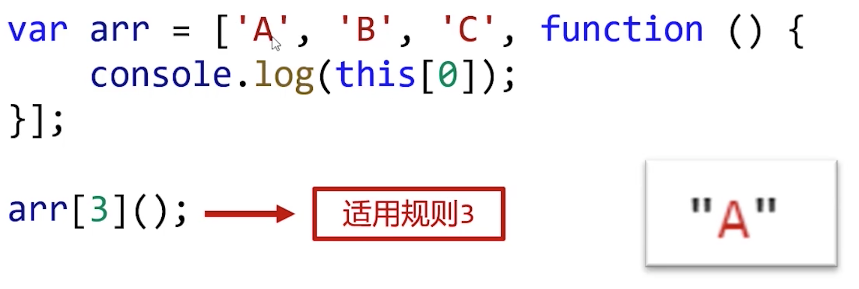

> 类数组对象
>
> - 所有键名为自然数序列（从0开始）且有length属性的对象为类数组对象
>
> - arguments对象是最常见的类数组对象，它是函数的是参列表
>
>   

4. IFFE中的函数，上下文是window对象；

   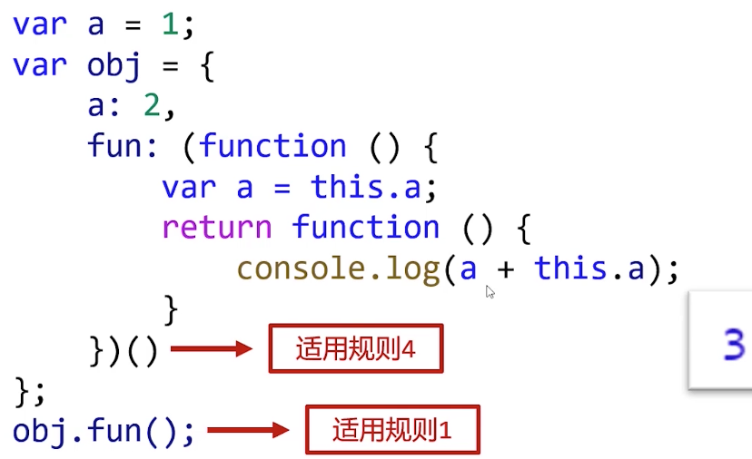

5. 使用定时器、延时器调用函数，上下文是window对象；

   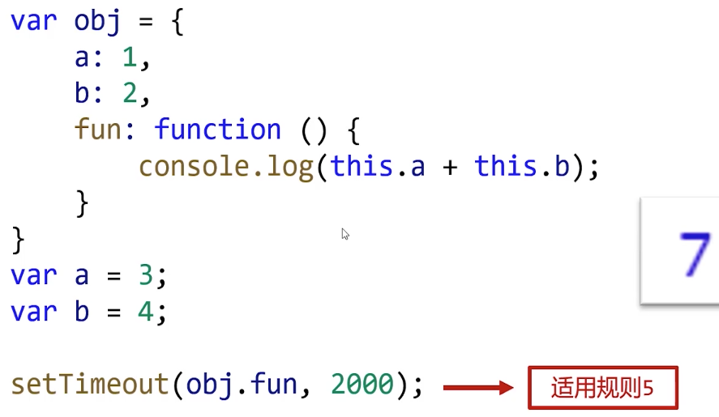

   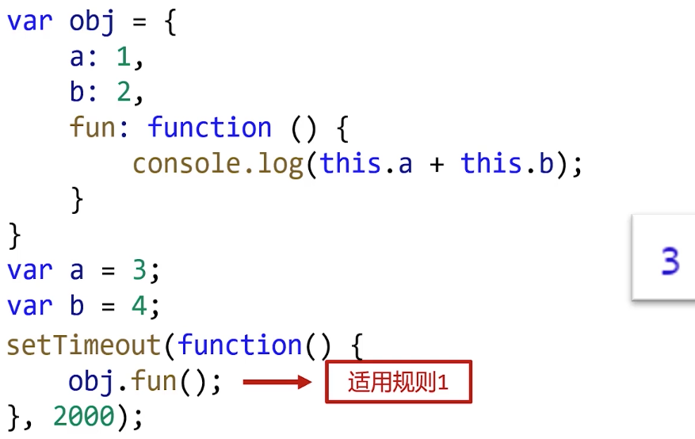

6. 事件处理函数的上下文是绑定事件的DOM元素；

   ```
   DOM元素.onclick = function(){
   
   }
   ```

### call & apply

- call和apply能指定函数的上下文

  ```
  函数.call(上下文);
  函数.apply(上下文);
  ```

  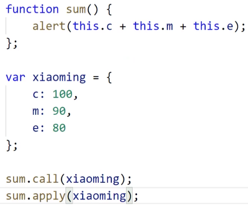

#### call & apply的区别

- 在有参数时有所区别

  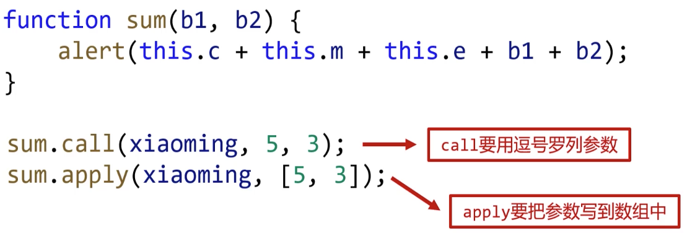

#### 到底用使用call还是apply？

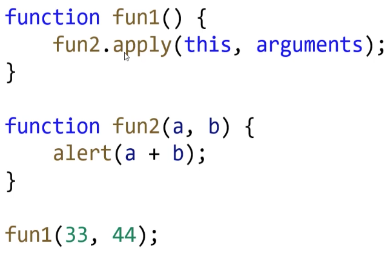

## 构造函数

### 用new操作符调用函数

```
new 函数()
```

- JS规定，使用new操作符调用函数会进行“四步走”

  1. 函数体内会自动创建出一个空白对象
  2. 函数的上下文(this)会指向这个对象
  3. 函数体内的语句会执行
  4. 函数会自动返回上下文对象，即使函数没有return语句

  

  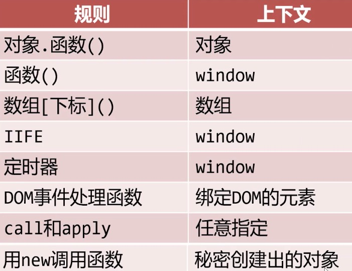

## 原型和原型链

### prototype

- 任何函数都有prototype属性，prototype是“原型”的意思

- prototype属性值是个对象，它默认拥有constructor属性指回函数

  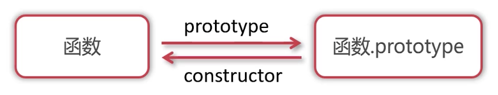

- 普通函数的prototype没有任何用处，而构造函数的prototype的属性非常有用

- 构造函数的prototype属性是它的实例的原型

  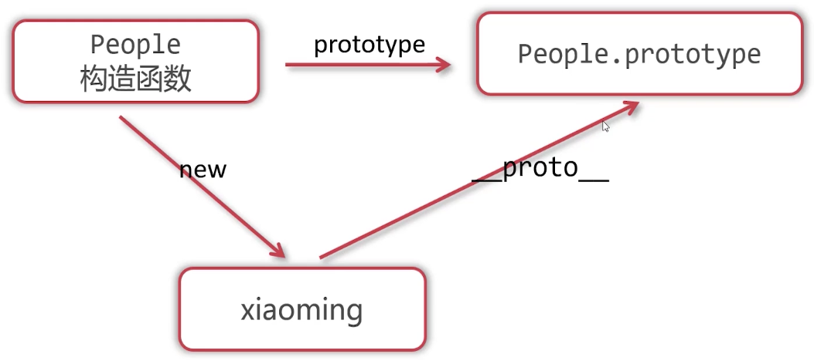

### 原型链查找

- JS规定：实例可以打点访问它的原型的属性和方法，这被称为“原型链查找”

  

  

#### hasOwnProperty

- hasOwnProperty方法可以检查对象是否真正“自己拥有”某属性或者方法

  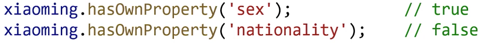

#### in

- in运算符只能检查某个属性或方法是否可以被对象访问，不能检查是否是自己的属性或方法

  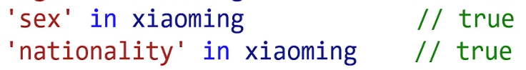

  

### 在prototype上添加方法

- 把方法直接添加到实例身上的缺点：每个实例和每个实例的方法函数都是内存中不同的函数，造成内存的浪费

- 解决办法：将方法写到prototype上

  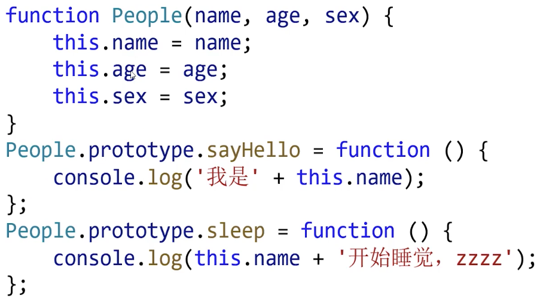

### 原型链的终点

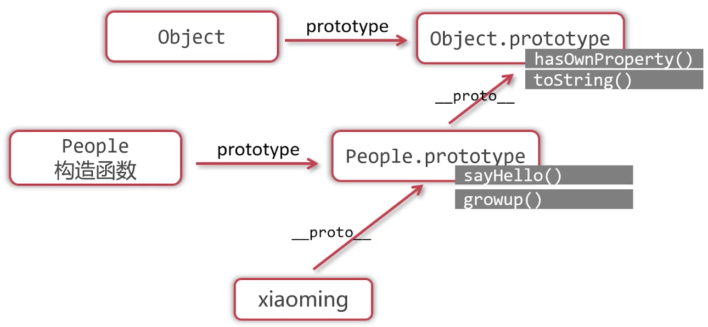

### 数组的原型链

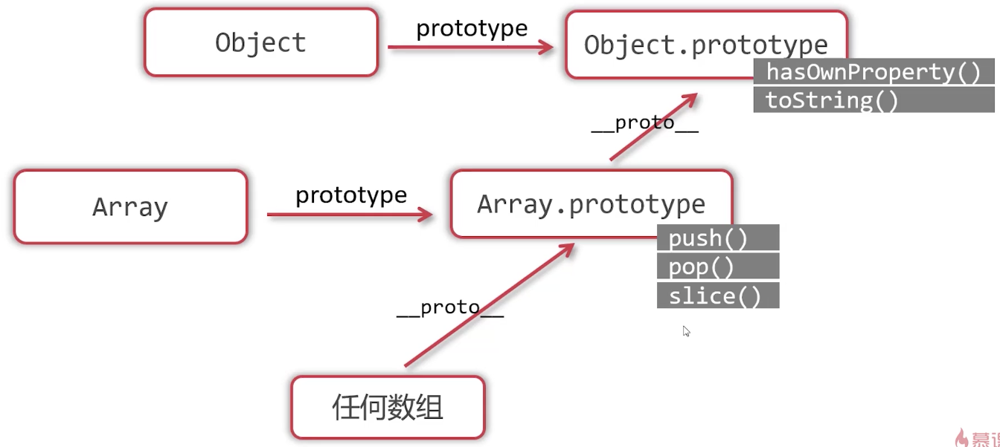

### 继承

- 实现继承的关键在于：子类必须拥有弗雷德全部属性和方法，同时子类还应该能定义自己特有的属性和方法
- 使用JS特有的原型链特性来实现继承是普遍的做法
- 子类可以重写父类的重名方法

#### 通过原型链实现继承

- 让子类构造函数的prototype指向父类的一个实例

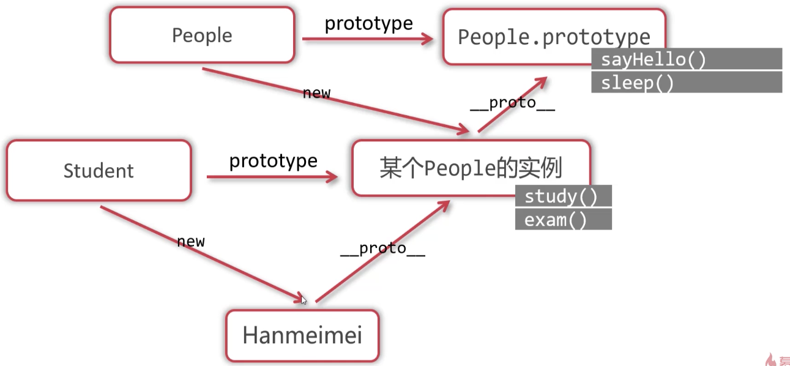

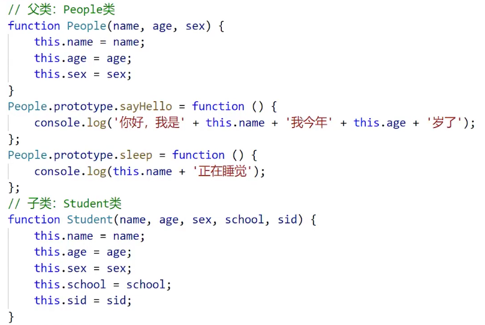

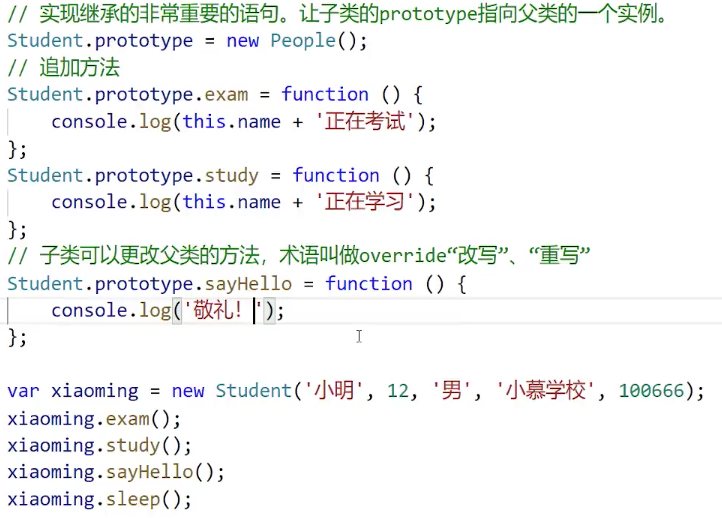

- 存在的问题

  > 1. 如果父类的属性中有引用类型值，则这个属性会被所有子类的实例共享；
  > 2. 子类的构造函数中，往往需要重复定义很多超类定义过的属性；

#### 借用构造函数

- 为了解决原型中包含引用类型值所带来的问题和子类构造函数不够优雅的问题，开发人员通常使用一种叫做“借助构造函数”的技术，也被称为“伪造对象”或者“经典继承”

- 借用构造函数的思想：在子类构造函数的内部调用超类的构造函数，但是要注意使用call()绑定上下文

  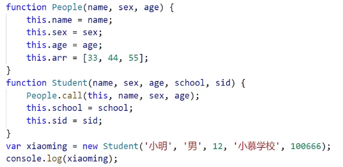

#### 组合继承

- 将借用原型链和借用构造函数的技术组合到一起，叫做组合继承，也叫做伪经典继承
- 组合继承是JavaScript中最常用的继承模式
- 组合继承最大的问题就是无论什么情况下，都会调用两次超类的构造函数：一次是在创建子类原型的时候，另一次是在子类构造函数的内部

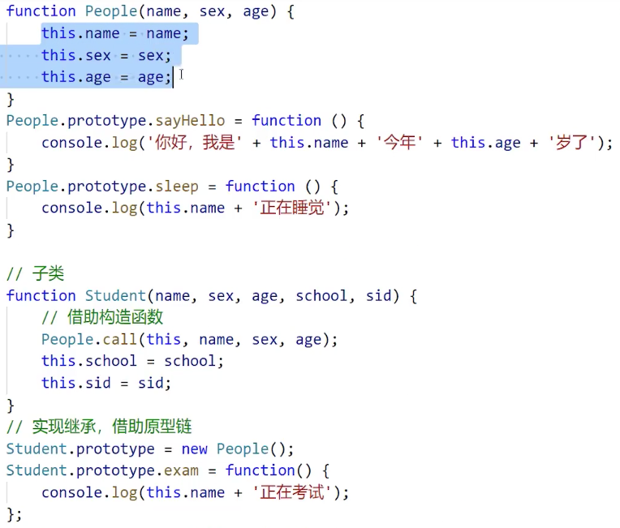

#### 原型式继承

- 在没有必要“兴师动众”地创建构造函数，而只是想让新对象与现有对象“类似”的情况下，使用Object.create()即可胜任，成为原型式继承

##### Object.create()

- IE 9+开始支持Object.create()方法，可以根据指定的对象为原型创建出新对象

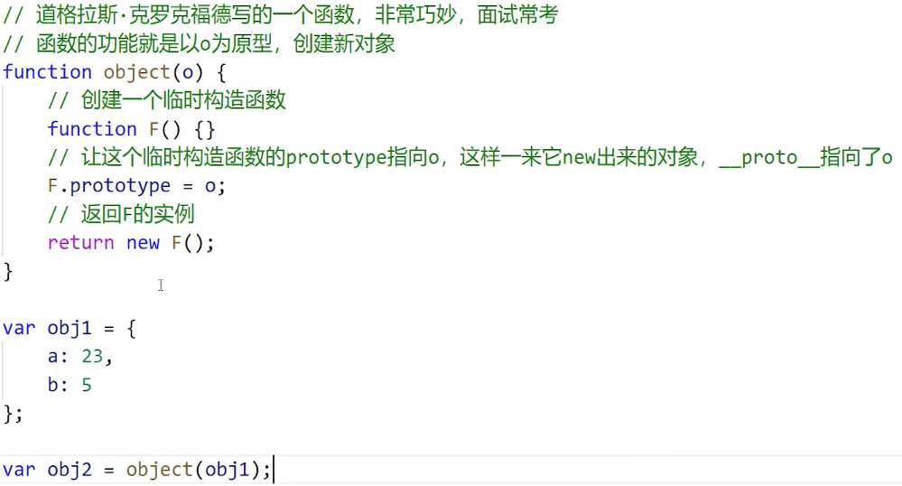

#### 寄生式继承

- 编写一个函数，它接收一个参数o，返回以o为原型的新对象p，同时给p上添加预置的新方法

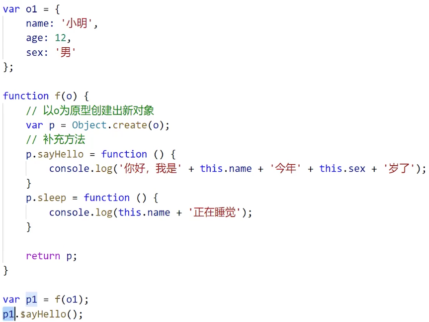

#### 寄生组合式继承

### instanceof运算符

- instanceof运算符用来检测“某对象是不是某个类的实例”

  ```
  xiaoming instanceof Student
  ```

- 底层机理：检查Student.prototype属性是否在xiaoming的原型链上


## 面向对象

### 红绿灯动画

```html
<!DOCTYPE html>
<html lang="en">
<head>
    <meta charset="UTF-8">
    <meta name="viewport" content="width=device-width, initial-scale=1.0">
    <title>Document</title>
    <style>
        #box img{
            width: 80px;
        }
    </style>
</head>
<body>
    <div id="box"></div>

    <script>
        // 定义红绿灯类
        function TrafficLight() {
            // 颜色属性，一开始都是红色
            // 红色1、黄色2、绿色3
            this.color = 1;
            // 调用自己的初始化方法
            this.init();
            // 绑定监听
            this.bindEvent();
        }
        // 初始化方法
        TrafficLight.prototype.init = function() {
            // 创建自己的DOM
            this.dom = document.createElement('img');
            // 设置src属性
            this.dom.src = 'images/' + this.color + '.jpg';
            box.appendChild(this.dom);
        };
        // 绑定监听
        TrafficLight.prototype.bindEvent = function() {
            // 备份上下文，这里的this指的是JS的实例
            var self = this;
            // 当自己的dom被点击的时候
            this.dom.onclick = function () {
                // 当被点击的时候，调用自己的changeColor方法
                self.changeColor();
            };
        }
        // 改变颜色
        TrafficLight.prototype.changeColor = function () {
            // 改变自己的color属性，从而有一种“自治”的感觉，自己管理自己，不干扰别的红绿灯
            this.color ++;
            if (this.color == 4) {
                this.color = 1;
            }
            // 光color属性变化没有用，还要更改自己的dom的src属性
            this.dom.src = 'images/' + this.color + '.jpg';
        };

        // 得到盒子
        var box = document.getElementById('box');


        // 实例化100个
        var count = 100;

        while(count--){
            new TrafficLight();
        }
         
    </script>

</body>
</html>
```

### 炫彩小球动画

```html
<!DOCTYPE html>
<html lang="en">

<head>
    <meta charset="UTF-8">
    <meta name="viewport" content="width=device-width, initial-scale=1.0">
    <title>Document</title>
    <style>
        body {
            background-color: black;
        }

        .ball {
            position: absolute;
            border-radius: 50%;
        }
    </style>
</head>

<body>
    <script>
        // 小球类
        function Ball(x, y) {
            // 属性x、y表示的是圆心的坐标
            this.x = x;
            this.y = y;
            // 半径属性
            this.r = 20;
            // 透明度
            this.opacity = 1;
            // 小球背景颜色，从颜色数组中随机选择一个颜色
            this.color = colorArr[parseInt(Math.random() * colorArr.length)];
            // 这个小球的x增量和y的增量，使用do while语句，可以防止dX和dY都是零
            do {
                this.dX = parseInt(Math.random() * 20) - 10;
                this.dY = parseInt(Math.random() * 20) - 10;
            } while (this.dX == 0 && this.dY == 0)

            // 初始化
            this.init();
            // 把自己推入数组，注意，这里的this不是类本身，而是实例
            ballArr.push(this);
        }
        // 初始化方法
        Ball.prototype.init = function () {
            // 创建自己的dom
            this.dom = document.createElement('div');
            this.dom.className = 'ball';
            this.dom.style.width = this.r * 2 + 'px';
            this.dom.style.height = this.r * 2 + 'px';
            this.dom.style.left = this.x - this.r + 'px';
            this.dom.style.top = this.y - this.r + 'px';
            this.dom.style.backgroundColor = this.color;
            // 上树
            document.body.appendChild(this.dom);
        };
        // 更新
        Ball.prototype.update = function () {
            // 位置改变
            this.x += this.dX;
            this.y -= this.dY;
            // 半径改变
            this.r += 0.2;
            // 透明度改变
            this.opacity -= 0.01;
            this.dom.style.width = this.r * 2 + 'px';
            this.dom.style.height = this.r * 2 + 'px';
            this.dom.style.left = this.x - this.r + 'px';
            this.dom.style.top = this.y - this.r + 'px';
            this.dom.style.opacity = this.opacity;

            // 当透明度小于0的时候，就需要从数组中删除自己，DOM元素也要删掉自己
            if (this.opacity < 0) {
                // 从数组中删除自己
                for (var i = 0; i < ballArr.length; i++) {
                    if (ballArr[i] == this) {
                        ballArr.splice(i, 1);
                    }
                }
                // 还要删除自己的dom
                document.body.removeChild(this.dom);
            }
        };


        // 把所有的小球实例都放到一个数组中
        var ballArr = [];

        // 初始颜色数组
        var colorArr = ['#66CCCC', '#CCFF66', '#FF99CC', '#FF6666', 
    '#CC3399', '#FF6600'];

        // 定时器，负责更新所有的小球实例
        setInterval(function () {
            // 遍历数组，调用调用的update方法
            for (var i = 0; i < ballArr.length; i++) {
                ballArr[i].update();
            }
        }, 20);

        // 鼠标指针的监听
        document.onmousemove = function (e) {
            // 得到鼠标指针的位置
            var x = e.clientX;
            var y = e.clientY;

            new Ball(x, y);
        };
    </script>
</body>

</html>
```


## JS的内置对象

### 包装类

- Number() ,String() , Boolean() 分别是数字、字符串、布尔值的“包装类”，它们的实例都是object类型，它们的PrimitiveValue属性存储它们的本身值
- new出来的基本类型值可以正常参与运算
- 包装类的目的就是为了让基本类型值可以从他们的构造函数的prototype上获得方法

### Math

- 幂和开方：Math.pow() , Math.sqrt()

- 向上取整和向下取整：Math.ceil() , Math.floor()

- 四舍五入：Math.round()

- 四舍五入到小数点后某位：Math.round(3.6482*100)/100

  

- 参数列表的最大和最小值：Math.max() ,Math.min()

- 求数组最大值

  ```
  var arr = [3,6,9,2];
  var max = Math.max.apply(null,arr);
  ```

- 随机数：Math.random()可以得到0~1之间的小数

  ```
  //得到[a,b]区间内的整数，可以使用这个公式：
  parstInt(Math.random()*(b-a+1))+a
  ```

### Date

- 使用new Date()即可得到当前事件的日期对象，它是object类型值；
- 使用new Date(2020,11,1) 即可得到指定日期的日期对象，注意第二个参数表示月份，从0开始算，11表示12月；
- 也可以使用new Date('2020-12-01')这样的写法，从1开始算；

#### 时间戳

- 通过getTime() （精确到毫秒）方法或者Date.parse()函数（精确到秒，也是毫秒数，最后三位是000）可以将日期对象变为时间戳
- 通过new Date(时间戳)的写法，可以将时间戳变为日期对象

# 内置构造函数

- Array是数组类型的构造函数，Function是函数类型的构造函数，Object是对象类型的构造函数

- 内置构造函数的方法都是定义在它的内置构造函数的prototype上的，我们可以给这个对象添加新的方法，从而扩展某类型的功能

  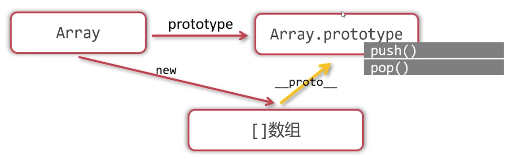

  ```js
  Array.prototype.qiuhe = function(){
  	//this表示调用qiuhe()方法的数组
  	var arr = this;
  	//累加器
  	var sum = 0;
  	for(var i=0; i<arr.length ; i++){
  		sum += arrp[i];
  	}
  	//返回结果
  	return sum;
  }
  
  var result = [3,5,3,7].qiuhe(); 
  ```

## 内置构造函数的关系

- Object.prototype是万物原型链的终点。以数组为例：

  

- 任何函数都可以看做是Function “new 出来的”，Object也是函数，它也是Function“new出来的”

  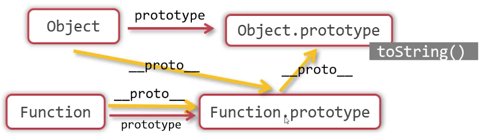


