# JS基础知识

## 变量类型和计算

## typeof运算符


## 深拷贝

```javascript
/**
 * 深拷贝
 */

const obj1 = {
    age: 20,
    name: 'xxx',
    address: {
        city: 'beijing'
    },
    arr: ['a', 'b', 'c']
}

const obj2 = deepClone(obj1)
obj2.address.city = 'shanghai'
obj2.arr[0] = 'a1'
console.log(obj1.address.city)
console.log(obj1.arr[0])

/**
 * 深拷贝
 * @param {Object} obj 要拷贝的对象
 */
function deepClone(obj = {}) {
    if (typeof obj !== 'object' || obj == null) {
        // obj 是 null ，或者不是对象和数组，直接返回
        return obj
    }

    // 初始化返回结果
    let result
    if (obj instanceof Array) {
        result = []
    } else {
        result = {}
    }

    for (let key in obj) {
        // 保证 key 不是原型的属性
        if (obj.hasOwnProperty(key)) {
            // 递归调用！！！
            result[key] = deepClone(obj[key])
        }
    }

    // 返回结果
    return result
}
 
```

## 类型转换

### 字符串拼接

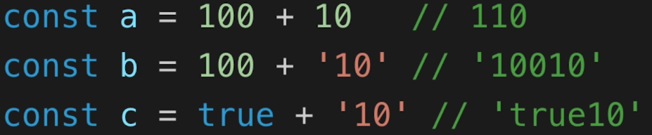

### ==

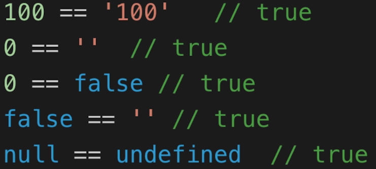

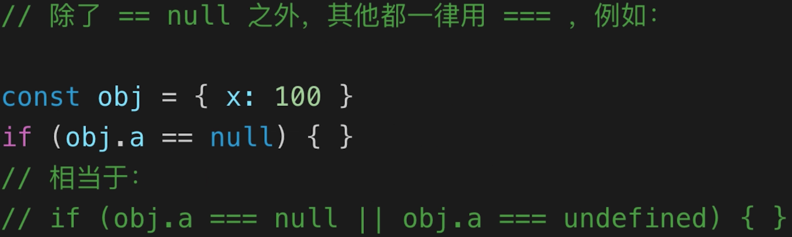

### if语句

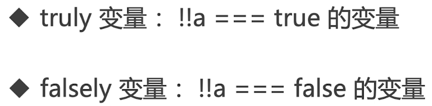

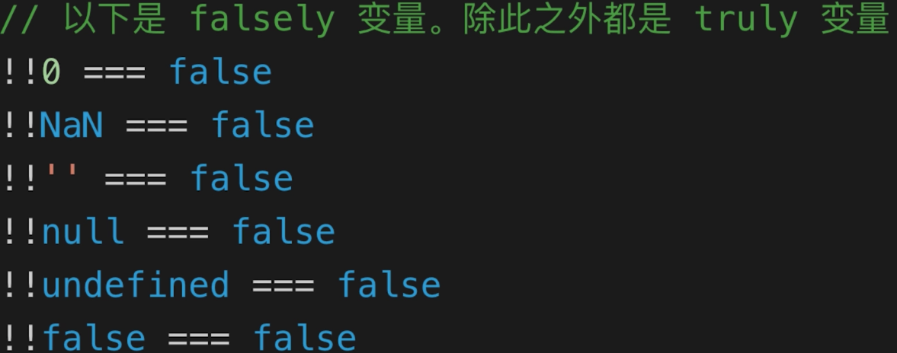

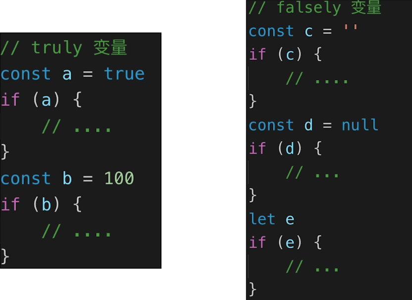

### 逻辑判断

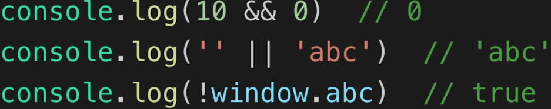

## 类型判断- instanceof

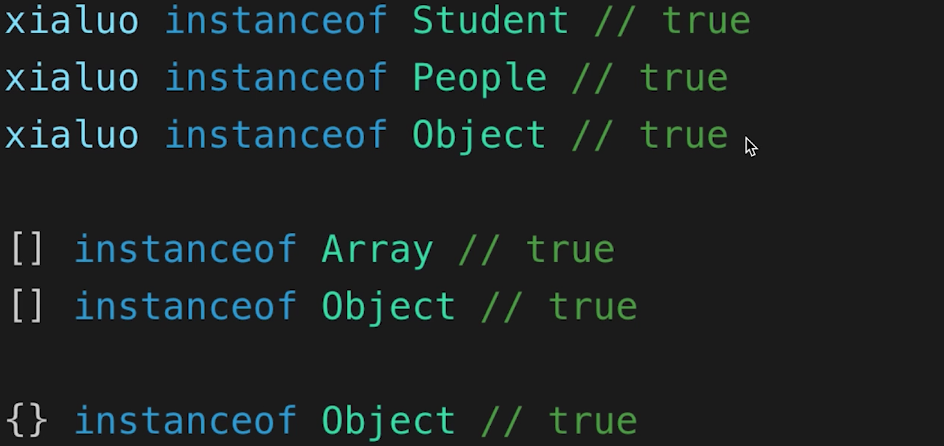

## 原型

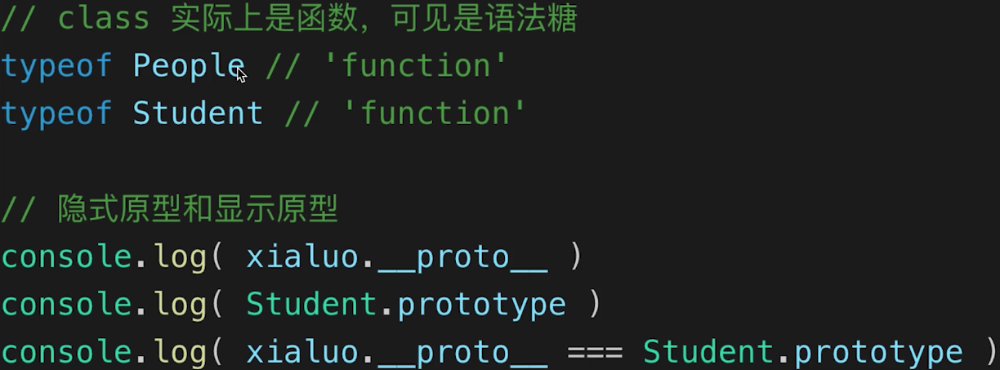

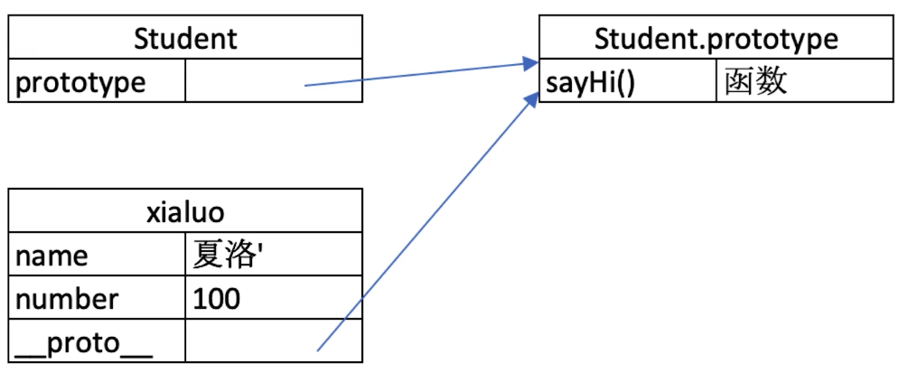

### 原型关系

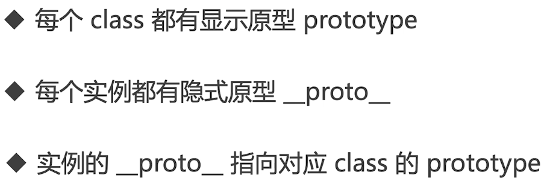

### 基于原型的执行规则


### 问题

- 如何判断一个变量是不是数组？


- class的原型本质


- 简易jQuery考虑插件和扩展性

  ```javascript
  class jQuery {
      constructor(selector) {
          const result = document.querySelectorAll(selector)
          const length = result.length
          for (let i = 0; i < length; i++) {
              this[i] = result[i]
          }
          this.length = length
          this.selector = selector
      }
      get(index) {
          return this[index]
      }
      each(fn) {
          for (let i = 0; i < this.length; i++) {
              const elem = this[i]
              fn(elem)
          }
      }
      on(type, fn) {
          return this.each(elem => {
              elem.addEventListener(type, fn, false)
          })
      }
      // 扩展很多 DOM API
  }
  
  // 插件
  jQuery.prototype.dialog = function (info) {
      alert(info)
  }
  
  // “造轮子”
  class myJQuery extends jQuery {
      constructor(selector) {
          super(selector)
      }
      // 扩展自己的方法
      addClass(className) {
  
      }
      style(data) {
          
      }
  }
  
  // const $p = new jQuery('p')
  // $p.get(1)
  // $p.each((elem) => console.log(elem.nodeName))
  // $p.on('click', () => alert('clicked'))
  
  ```

  