# JS基础知识

## 变量类型和计算

## typeof运算符


## 深拷贝

```javascript
/**
 * 深拷贝
 */

const obj1 = {
    age: 20,
    name: 'xxx',
    address: {
        city: 'beijing'
    },
    arr: ['a', 'b', 'c']
}

const obj2 = deepClone(obj1)
obj2.address.city = 'shanghai'
obj2.arr[0] = 'a1'
console.log(obj1.address.city)
console.log(obj1.arr[0])

/**
 * 深拷贝
 * @param {Object} obj 要拷贝的对象
 */
function deepClone(obj = {}) {
    if (typeof obj !== 'object' || obj == null) {
        // obj 是 null ，或者不是对象和数组，直接返回
        return obj
    }

    // 初始化返回结果
    let result
    if (obj instanceof Array) {
        result = []
    } else {
        result = {}
    }

    for (let key in obj) {
        // 保证 key 不是原型的属性
        if (obj.hasOwnProperty(key)) {
            // 递归调用！！！
            result[key] = deepClone(obj[key])
        }
    }

    // 返回结果
    return result
}
 
```

## 类型转换

### 字符串拼接


### ==


### if语句


### 逻辑判断


## 类型判断- instanceof


## 原型


### 原型关系


### 基于原型的执行规则


### 问题

- 如何判断一个变量是不是数组？


- class的原型本质


- 简易jQuery考虑插件和扩展性

  ```javascript
  class jQuery {
      constructor(selector) {
          const result = document.querySelectorAll(selector)
          const length = result.length
          for (let i = 0; i < length; i++) {
              this[i] = result[i]
          }
          this.length = length
          this.selector = selector
      }
      get(index) {
          return this[index]
      }
      each(fn) {
          for (let i = 0; i < this.length; i++) {
              const elem = this[i]
              fn(elem)
          }
      }
      on(type, fn) {
          return this.each(elem => {
              elem.addEventListener(type, fn, false)
          })
      }
      // 扩展很多 DOM API
  }
  
  // 插件
  jQuery.prototype.dialog = function (info) {
      alert(info)
  }
  
  // “造轮子”
  class myJQuery extends jQuery {
      constructor(selector) {
          super(selector)
      }
      // 扩展自己的方法
      addClass(className) {
  
      }
      style(data) {
          
      }
  }
  
  // const $p = new jQuery('p')
  // $p.get(1)
  // $p.each((elem) => console.log(elem.nodeName))
  // $p.on('click', () => alert('clicked'))
  
  ```

  ## 原型链

  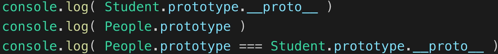

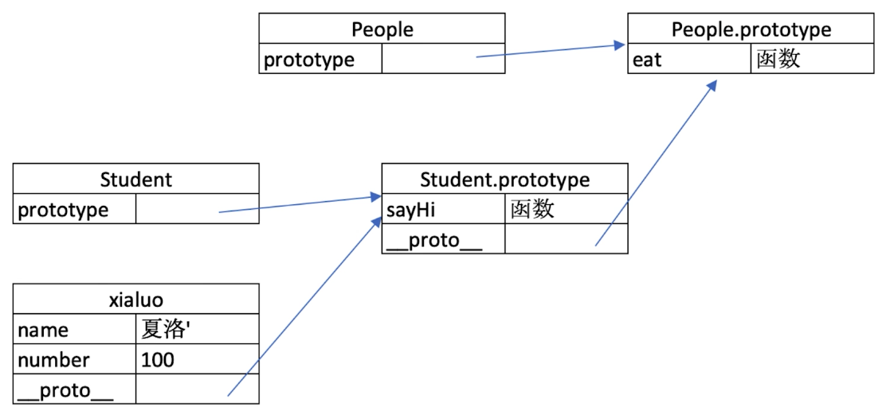


## 作用域

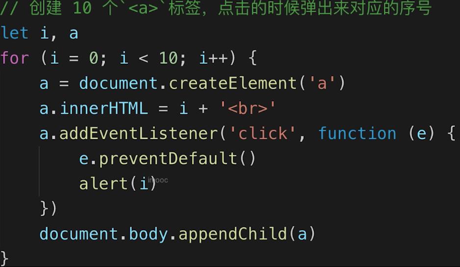

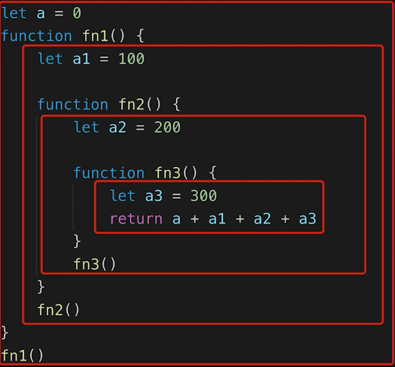

### 全局作用域

### 函数作用域

### 块级作用域

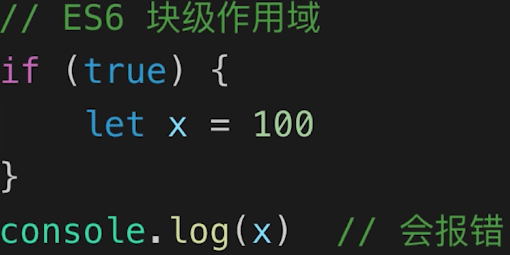

## 自由变量

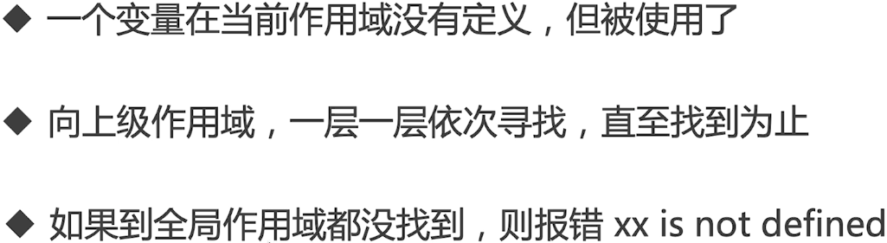

## 闭包

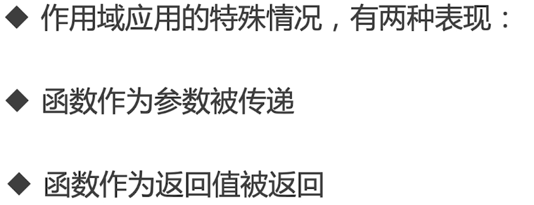



```javascript
// 函数作为返回值
// function create() {
//     const a = 100
//     return function () {
//         console.log(a)
//     }
// }

// const fn = create()
// const a = 200
// fn() // 100

// 函数作为参数被传递
function print(fn) {
    const a = 200
    fn()
}
const a = 100
function fn() {
    console.log(a)
}
print(fn) // 100

// 所有的自由变量的查找，是在函数定义的地方，向上级作用域查找
// 不是在执行的地方！！！
```

## this

this的值是在执行的时候确定的，不是在定义的时候确定的！！！

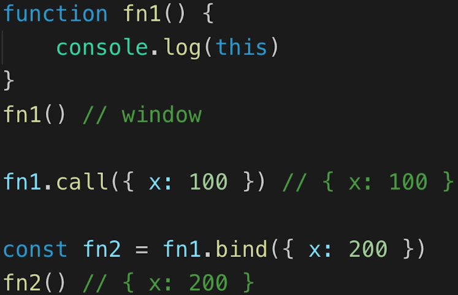

箭头函数中的this取的是上级作用域的this！！！

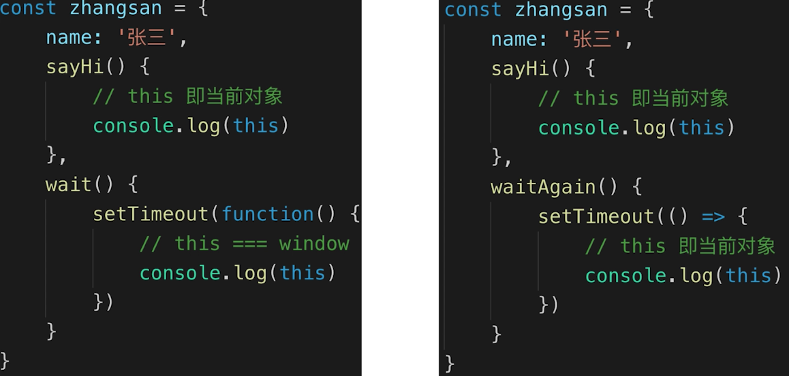

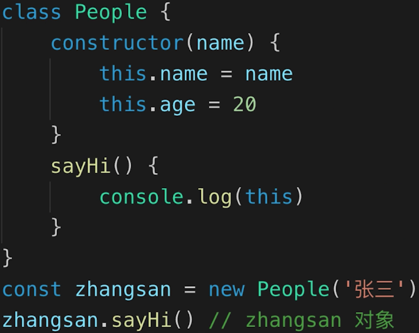

## 手写bind函数

```javascript
// 模拟 bind
Function.prototype.bind1 = function () {
    // 将参数拆解为数组
    const args = Array.prototype.slice.call(arguments)

    // 获取 this（数组第一项）
    const t = args.shift()

    // fn1.bind(...) 中的 fn1
    const self = this

    // 返回一个函数
    return function () {
        return self.apply(t, args)
    }
}

function fn1(a, b, c) {
    console.log('this', this)
    console.log(a, b, c)
    return 'this is fn1'
}

const fn2 = fn1.bind1({x: 100}, 10, 20, 30)
const res = fn2()
console.log(res)

```

## 闭包真实使用

### 闭包隐藏数据，只提供 API

```javascript
// 闭包隐藏数据，只提供 API
function createCache() {
    const data = {} // 闭包中的数据，被隐藏，不被外界访问
    return {
        set: function (key, val) {
            data[key] = val
        },
        get: function (key) {
            return data[key]
        }
    }
}

const c = createCache()
c.set('a', 100)
console.log( c.get('a') )
```

```javascript
let a
for (let i = 0; i < 10; i++) {
    a = document.createElement('a')
    a.innerHTML = i + '<br>'
    a.addEventListener('click', function (e) {
        e.preventDefault()
        alert(i)
    })
    document.body.appendChild(a)
}
```

## 单线程和异步


## Promise

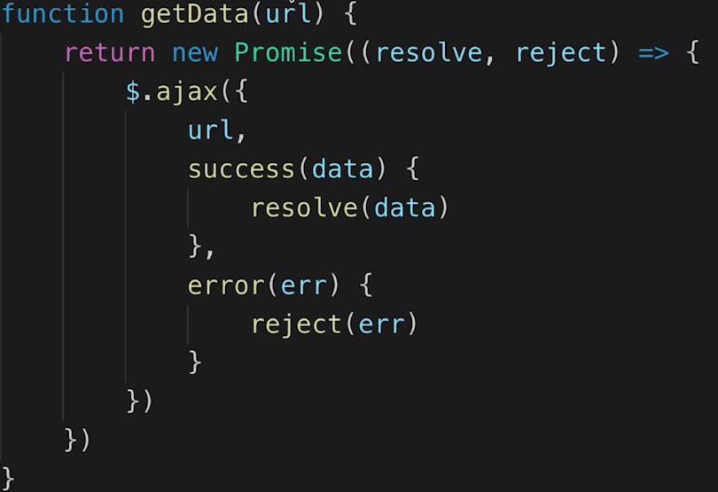

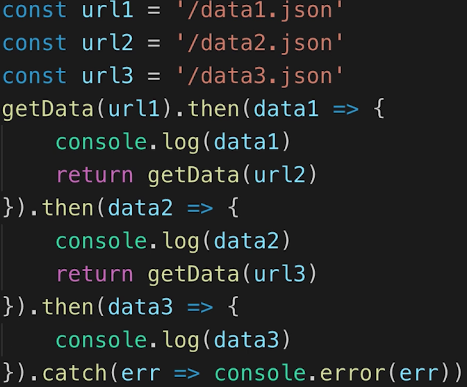

### 手写Promise加载图片

```javascript
function loadImg(src) {
    const p = new Promise(
        (resolve, reject) => {
            const img = document.createElement('img')
            img.onload = () => {
                resolve(img)
            }
            img.onerror = () => {
                const err = new Error(`图片加载失败 ${src}`)
                reject(err)
            }
            img.src = src
        }
    )
    return p
}

// const url = 'https://img.mukewang.com/5a9fc8070001a82402060220-140-140.jpg'
// loadImg(url).then(img => {
//     console.log(img.width)
//     return img
// }).then(img => {
//     console.log(img.height)
// }).catch(ex => console.error(ex))

const url1 = 'https://img.mukewang.com/5a9fc8070001a82402060220-140-140.jpg'
const url2 = 'https://img3.mukewang.com/5a9fc8070001a82402060220-100-100.jpg'

loadImg(url1).then(img1 => {
    console.log(img1.width)
    return img1 // 普通对象
}).then(img1 => {
    console.log(img1.height)
    return loadImg(url2) // promise 实例
}).then(img2 => {
    console.log(img2.width)
    return img2
}).then(img2 => {
    console.log(img2.height)
}).catch(ex => console.error(ex))

```


