# DOM

## DOM节点操作

### 获取DOM节点

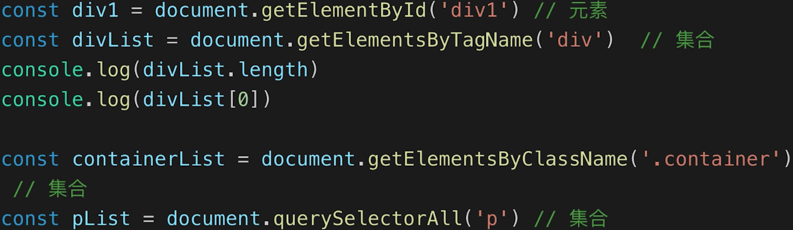

### DOM节点的property

- 修改的是DOM元素的js变量的属性，不会对节点标签产生影响，不会体现到html中，可能会引起DOM重新渲染

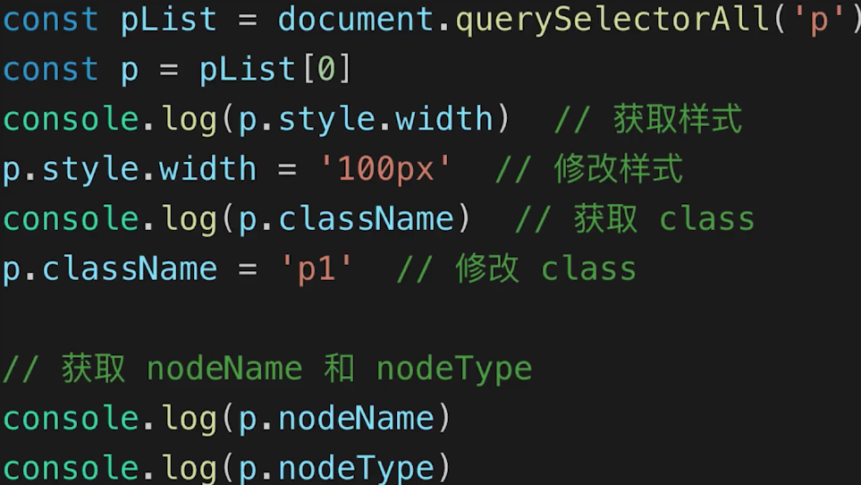

### DOM节点的attribute

- 修改的标签的属性，会改变html属性，可能会引起DOM重新渲染

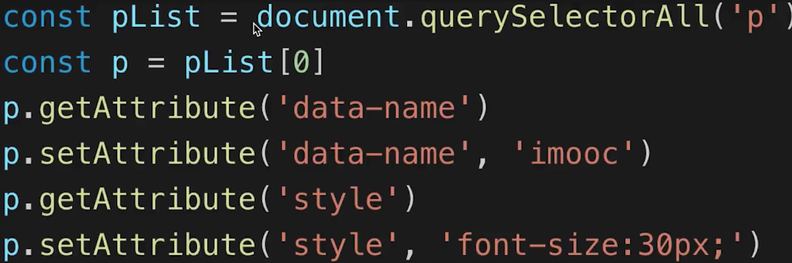


## DOM结构操作

### 新增/插入节点

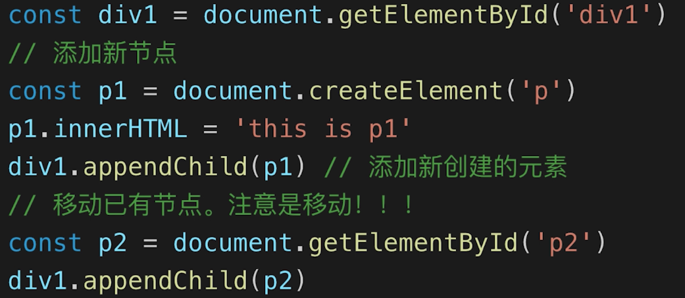

### 获取子元素列表&获取父元素

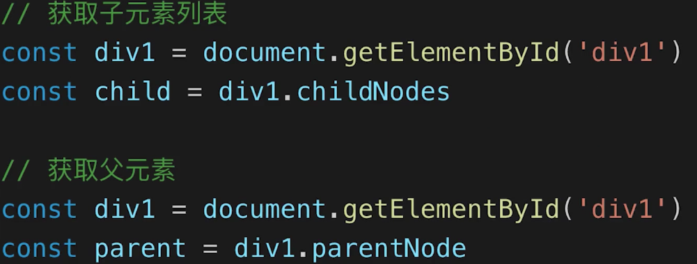

### 删除节点

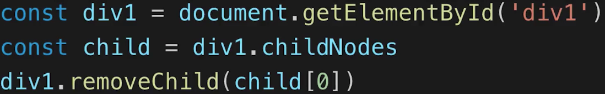


## DOM性能

- DOM操作非常‘昂贵’，避免频繁的DOM操作

- 对DOM查询做缓存

  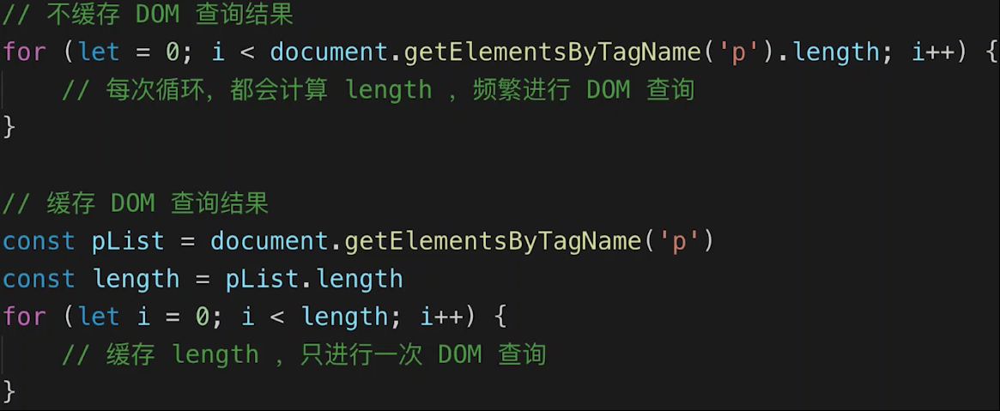

- 将频繁操作改为一次性操作

  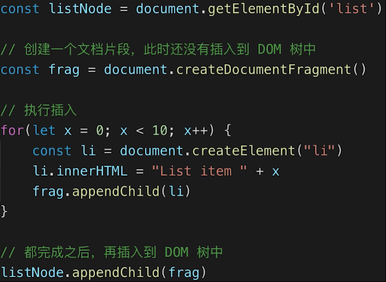

# BOM（Browser Object Model）

## navigator

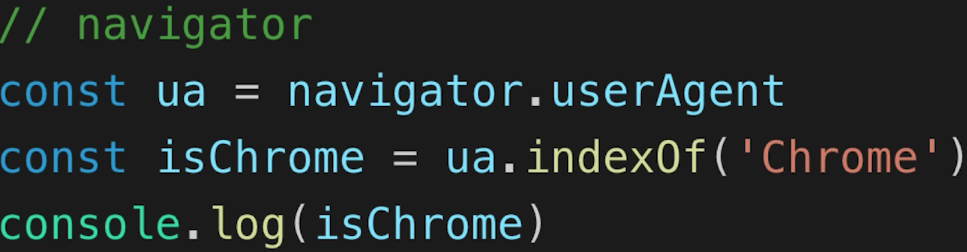

## screen

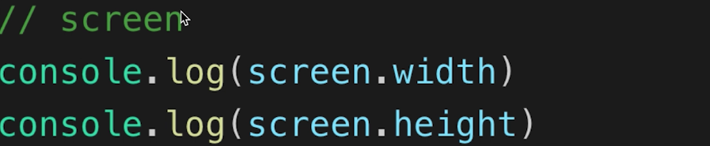

## location

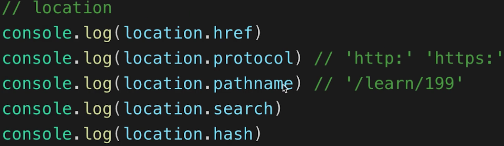

## history


# Event

## 事件绑定

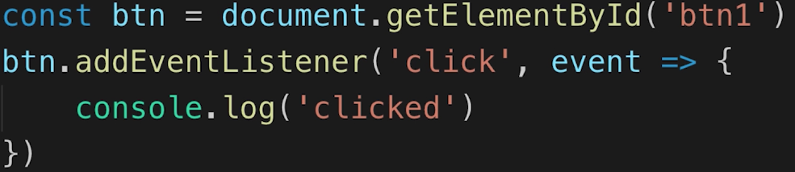

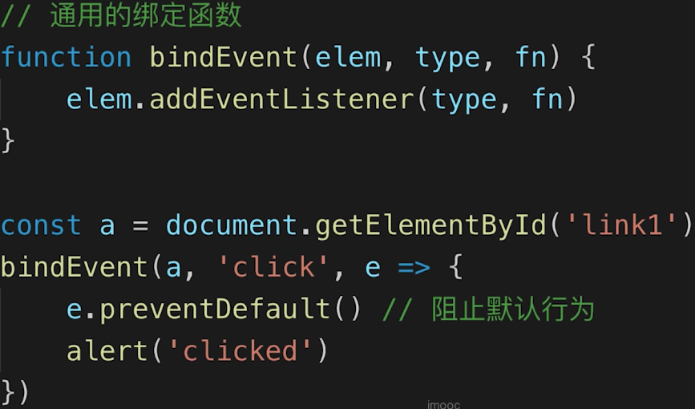

## 事件冒泡

- 基于DOM树形结构，事件会顺着触发元素往上冒泡
- 应用场景： 代理

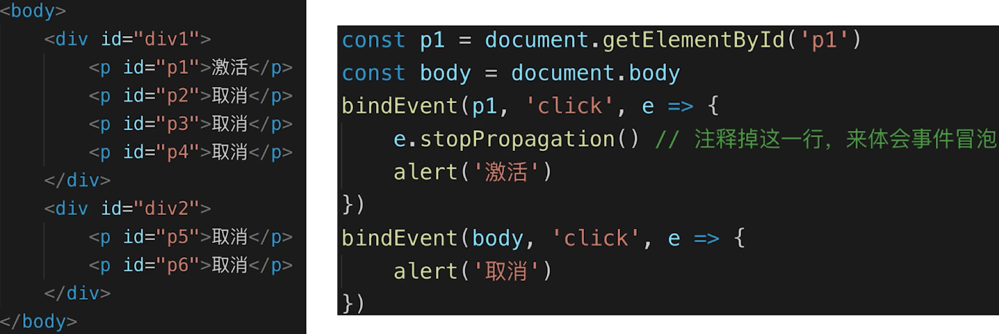

## 事件代理

- 代码简洁
- 减少浏览器内存占用
- 不要滥用

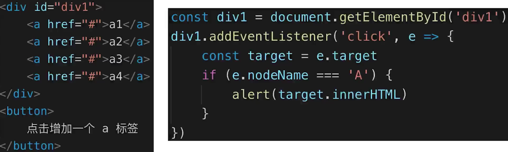

## 通用的事件绑定函数

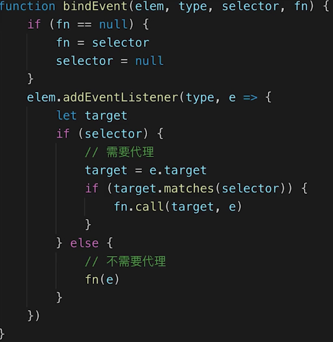

# Ajax

## XMLHttpRequest

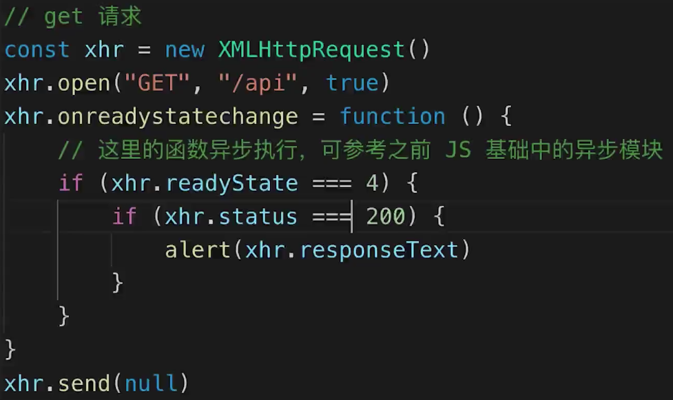

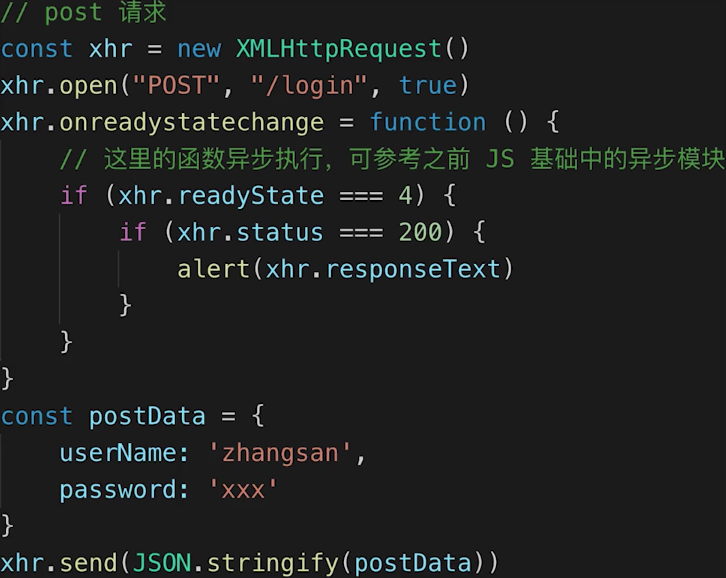

## 状态码

### xhr.readyState

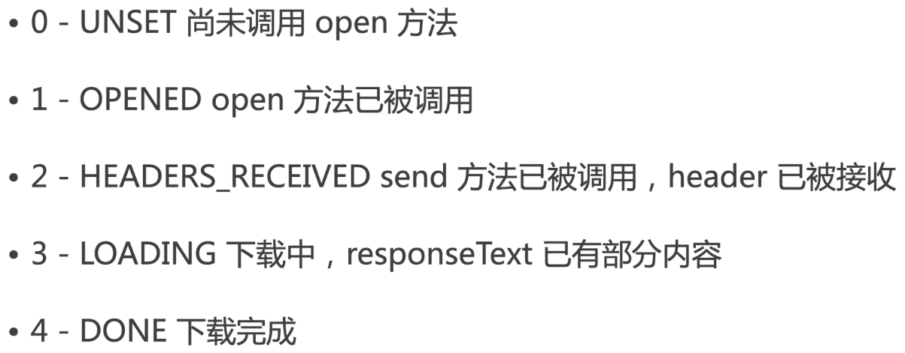

### xhr.status

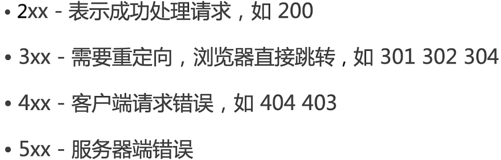

## 手写ajax

```javascript
function ajax(url) {
    const p = new Promise((resolve, reject) => {
        const xhr = new XMLHttpRequest()
        xhr.open('GET', url, true)
        xhr.onreadystatechange = function () {
            if (xhr.readyState === 4) {
                if (xhr.status === 200) {
                    resolve(
                        JSON.parse(xhr.responseText)
                    )
                } else if (xhr.status === 404 || xhr.status === 500) {
                    reject(new Error('404 not found'))
                }
            }
        }
        xhr.send(null)
    })
    return p
}

const url = '/data/test.json'
ajax(url)
.then(res => console.log(res))
.catch(err => console.error(err))
```

# 跨域

## 同源策略


## 加载图片、css、js可无视同源策略

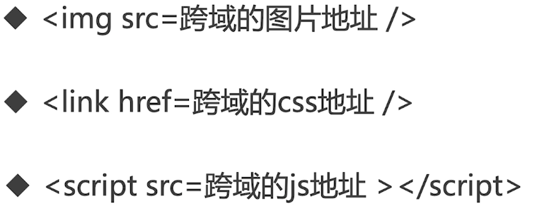


## 跨域

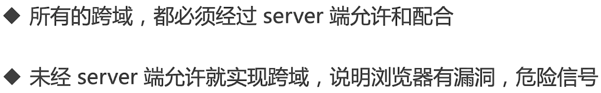

## JSONP

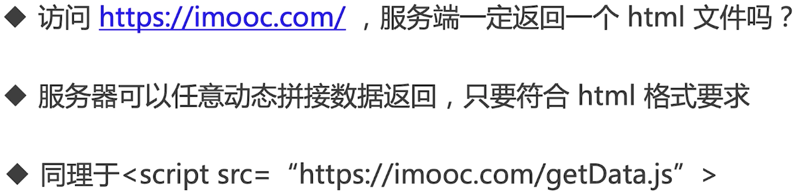

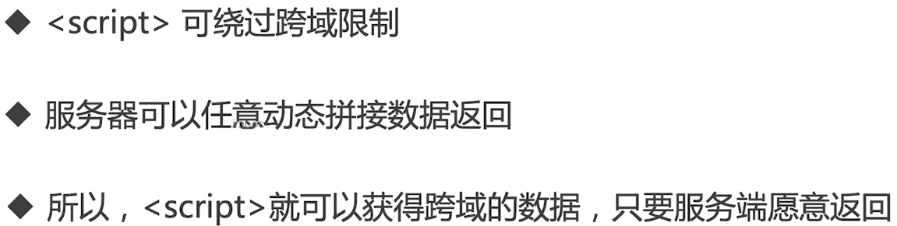

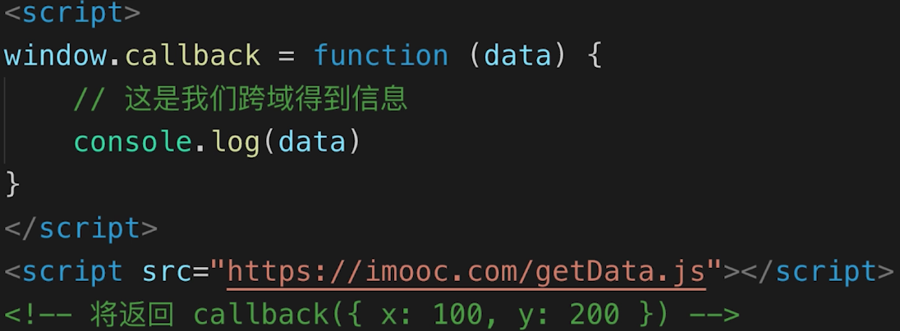

### jQuery实现jsonp

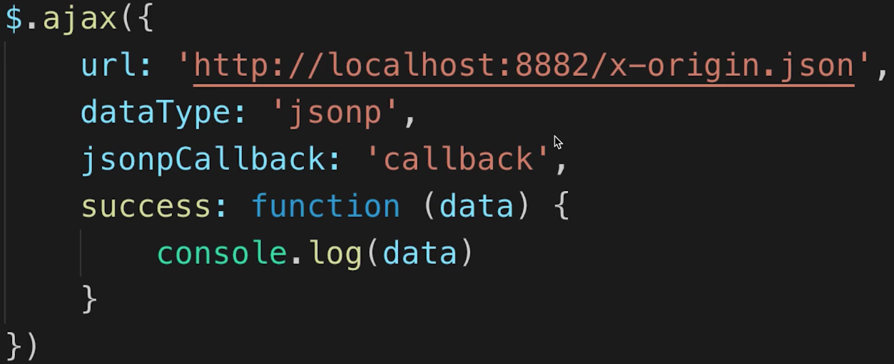

## CORS-服务器设置http header

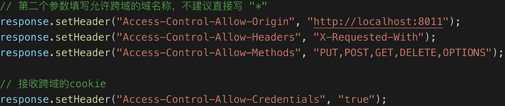

# 存储

## cookie

- 本身用于浏览器和server通讯
- 被“借用”到本地存储来
- 可用document.cookie='a=100;b=200'来修改，不同key是追加不是覆盖
- 存储大小，最大4KB
- http请求时需要发送到服务端，增加请求数据量

## localStorage和sessionStorage

- 最大可存储5M
- api简单易用 setItem、getItem
- 不会随着http请求被发送出去
- localStorage数据会永久存储，除非代码或者手动删除
- sessionStorage数据只存在于当前会话，浏览器关闭则清空
- 一般用localStorage会更多一些

# 防抖 debounce

- 监听一个输入框，文字变化后触发change事件
- 直接用keyup事件，则会频繁触发change事件
- 防抖：用户输入结束或者暂停时，才会触发change事件

```javascript
const input1 = document.getElementById('input1')

// let timer = null
// input1.addEventListener('keyup', function () {
//     if (timer) {
//         clearTimeout(timer)
//     }
//     timer = setTimeout(() => {
//         // 模拟触发 change 事件
//         console.log(input1.value)

//         // 清空定时器
//         timer = null
//     }, 500)
// })

// 防抖
function debounce(fn, delay = 500) {
    // timer 是闭包中的
    let timer = null

    return function () {
        if (timer) {
            clearTimeout(timer)
        }
        timer = setTimeout(() => {
            fn.apply(this, arguments)
            timer = null
        }, delay)
    }
}

input1.addEventListener('keyup', debounce(function (e) {
    console.log(e.target)
    console.log(input1.value)
}, 600))
```

# 节流 throttle

- 拖拽一个元素时，要随时拿到该元素被拖拽的位置
- 直接用drag事件，组会频繁触发，很容易导致卡顿
- 节流：无论拖拽速度多快，都会每个100ms触发一次

```javascript
const div1 = document.getElementById('div1')

// let timer = null
// div1.addEventListener('drag', function (e) {
//     if (timer) {
//         return
//     }
//     timer = setTimeout(() => {
//         console.log(e.offsetX, e.offsetY)

//         timer = null
//     }, 100)
// })

// 节流
function throttle(fn, delay = 100) {
    let timer = null

    return function () {
        if (timer) {
            return
        }
        timer = setTimeout(() => {
            fn.apply(this, arguments)
            timer = null
        }, delay)
    }
}

div1.addEventListener('drag', throttle(function (e) {
    console.log(e.offsetX, e.offsetY)
}))

div1.addEventListener('drag', function(event) {

})
```


、


