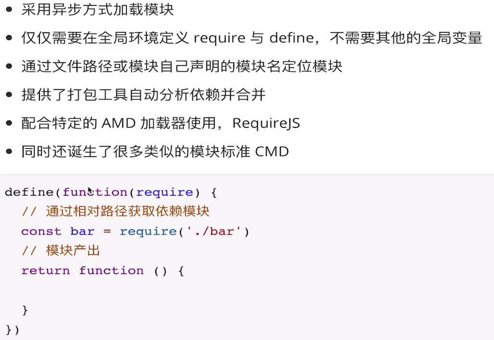
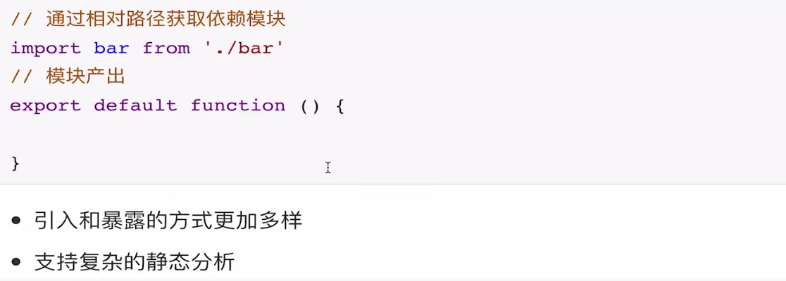
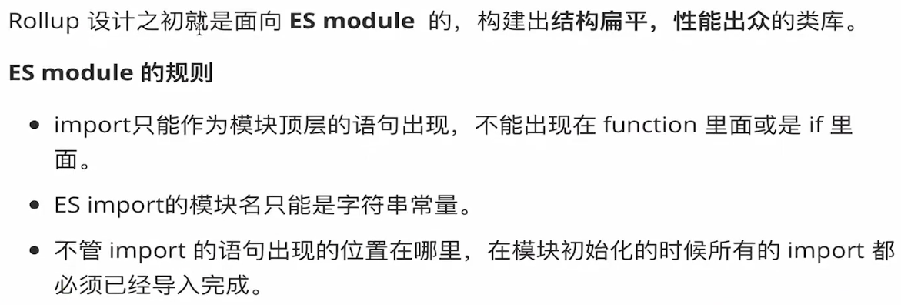
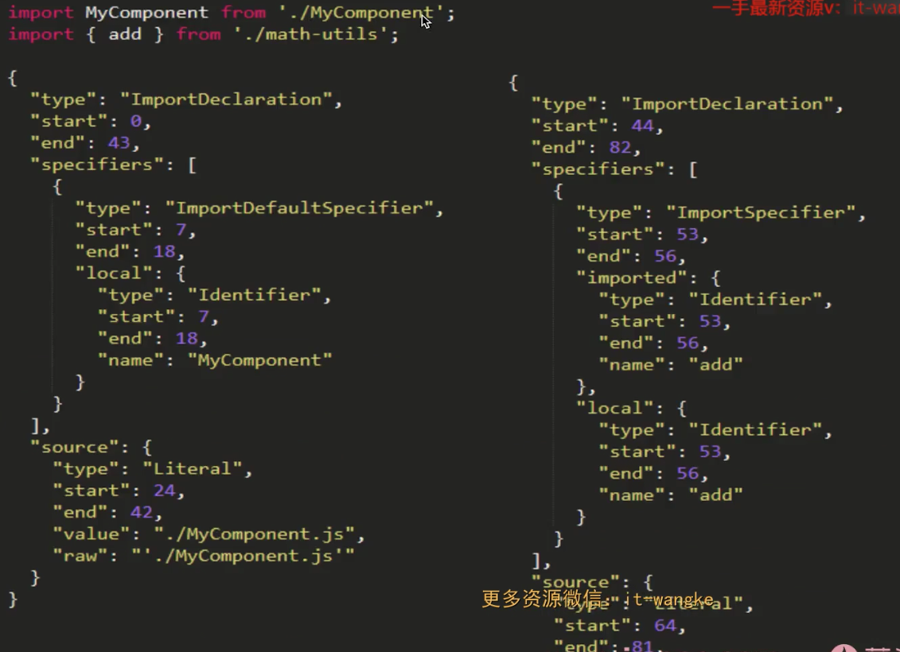
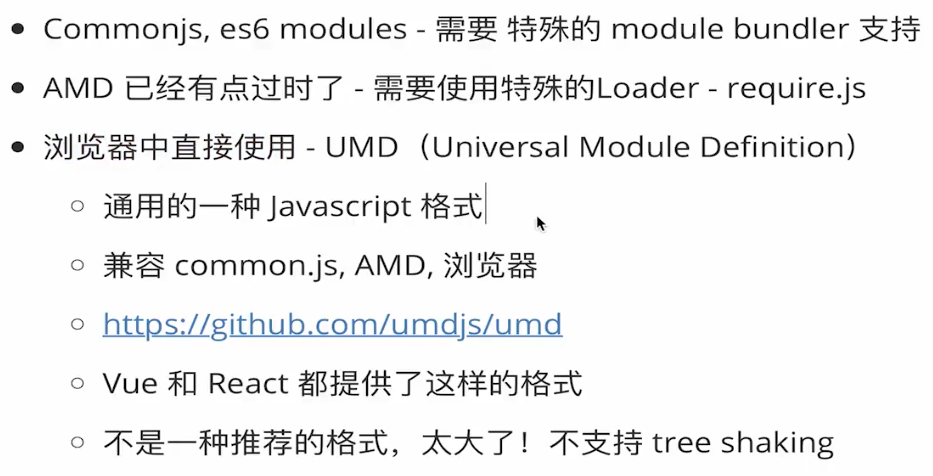
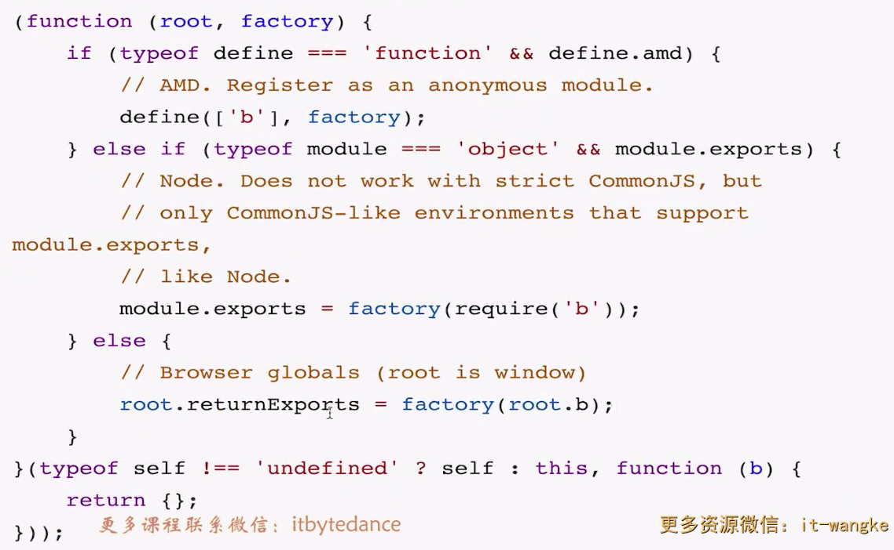
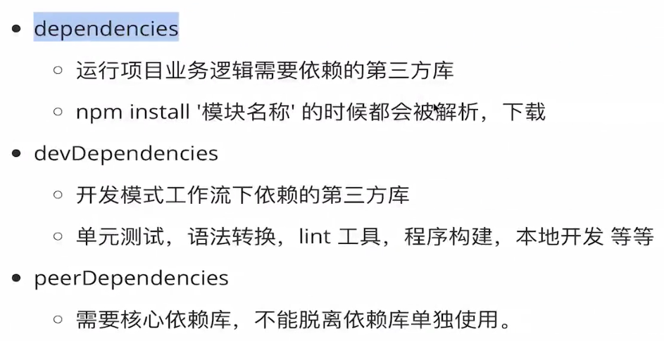

# Common.js

在node环境下运行，无法在浏览器中直接运行

```js
const bar = require('./bar')

module.exports = function(){

}
```

# AMD

Asynchronous module definition



# ES6 modules




# Bundler

## Webpack


## [Rollup](https://www.rollupjs.com/)



### 使用工具静态分析的过程




## Webpack  vs Rollup


### webpack的优势


### Rollup的优势


# 打包什么类型的文件？





## 结论


# npm依赖分类




# [Rollup-Plugin](Rollup-Plugin)


