# 基本用法

## JSX

### 变量、表达式

### class style

### 子元素和组件

## 条件

- if else
- 三元表达式
- 逻辑运算符&& ||

## 列表渲染

- map：数组重组，返回一个新的数组
- key：必填， 不能是index或randonm

```jsx
import React from 'react'

class ListDemo extends React.Component {
    constructor(props) {
        super(props)
        this.state = {
            list: [
                {
                    id: 'id-1',
                    title: '标题1'
                },
                {
                    id: 'id-2',
                    title: '标题2'
                },
                {
                    id: 'id-3',
                    title: '标题3'
                }
            ]
        }
    }
    render() {
        return <ul>
            { /* vue v-for */
                this.state.list.map(
                    (item, index) => {
                        // 这里的 key 和 Vue 的 key 类似，必填，不能是 index 或 random
                        return <li key={item.id}>
                            index {index}; id {item.id}; title {item.title}
                        </li>
                    }
                )
            }
        </ul>
    }
}

export default ListDemo
```

## 事件

### bind this

### 关于event参数

### 传递自定义参数

```jsx
import React from 'react'

class EventDemo extends React.Component {
    constructor(props) {
        super(props)
        this.state = {
            name: 'zhangsan',
            list: [
                {
                    id: 'id-1',
                    title: '标题1'
                },
                {
                    id: 'id-2',
                    title: '标题2'
                },
                {
                    id: 'id-3',
                    title: '标题3'
                }
            ]
        }

        // 修改方法的 this 指向，写在这里只执行一次，写在语句中会多次执行每次都会返回一个新的函数
        this.clickHandler1 = this.clickHandler1.bind(this)
    }
    render() {
        // // this - 使用 bind
        // return <p onClick={this.clickHandler1}>
        //     {this.state.name}
        // </p>

        // // this - 使用静态方法
        // return <p onClick={this.clickHandler2}>
        //     clickHandler2 {this.state.name}
        // </p>

        // // event
        // return <a href="https://imooc.com/" onClick={this.clickHandler3}>
        //     click me
        // </a>

        // 传递参数 - 用 bind(this, a, b)
        return <ul>{this.state.list.map((item, index) => {
            return <li key={item.id} onClick={this.clickHandler4.bind(this, item.id, item.title)}>
                index {index}; title {item.title}
            </li>
        })}</ul>
    }
    clickHandler1() {
        // console.log('this....', this) // this 默认是 undefined
        this.setState({
            name: 'lisi'
        })
    }
    // 静态方法，this 指向当前实例
    clickHandler2 = () => {
        this.setState({
            name: 'lisi'
        })
    }
    // 获取 event
    clickHandler3 = (event) => {
        event.preventDefault() // 阻止默认行为
        event.stopPropagation() // 阻止冒泡
        console.log('target', event.target) // 指向当前元素，即当前元素触发
        console.log('current target', event.currentTarget) // 指向当前元素，假象！！！

        // 注意，event 其实是 React 封装的。可以看 __proto__.constructor 是 SyntheticEvent 组合事件
        console.log('event', event) // 不是原生的 Event ，原生的 MouseEvent
        console.log('event.__proto__.constructor', event.__proto__.constructor)

        // 原生 event 如下。其 __proto__.constructor 是 MouseEvent
        console.log('nativeEvent', event.nativeEvent)
        console.log('nativeEvent target', event.nativeEvent.target)  // 指向当前元素，即当前元素触发
        console.log('nativeEvent current target', event.nativeEvent.currentTarget) // 指向 document ！！！

        // 1. event 是 SyntheticEvent ，模拟出来 DOM 事件所有能力
        // 2. event.nativeEvent 是原生事件对象
        // 3. 所有的事件，都被挂载到 document 上
        // 4. 和 DOM 事件不一样，和 Vue 事件也不一样
    }
    // 传递参数
    clickHandler4(id, title, event) {
        console.log(id, title)
        console.log('event', event) // 最后追加一个参数，即可接收 event
    }
}

export default EventDemo
```

- event 是 SyntheticEvent ，模拟出来 DOM 事件所有能力
- event.nativeEvent 是原生事件对象
- 所有的事件，都被挂载到 document 上
-  和 DOM 事件不一样，和 Vue 事件也不一样

## 组件和props

```jsx
/**
 * @description 演示 props 和事件
 * @author 双越老师
 */

import React from 'react'
import PropTypes from 'prop-types'

class Input extends React.Component {
    constructor(props) {
        super(props)
        this.state = {
            title: ''
        }
    }
    render() {
        return <div>
            <input value={this.state.title} onChange={this.onTitleChange}/>
            <button onClick={this.onSubmit}>提交</button>
        </div>
    }
    onTitleChange = (e) => {
        this.setState({
            title: e.target.value
        })
    }
    onSubmit = () => {
        const { submitTitle } = this.props
        submitTitle(this.state.title) // 'abc'

        this.setState({
            title: ''
        })
    }
}
// props 类型检查
Input.propTypes = {
    submitTitle: PropTypes.func.isRequired
}

class List extends React.Component {
    constructor(props) {
        super(props)
    }
    render() {
        const { list } = this.props

        return <ul>{list.map((item, index) => {
            return <li key={item.id}>
                <span>{item.title}</span>
            </li>
        })}</ul>
    }
}
// props 类型检查
List.propTypes = {
    list: PropTypes.arrayOf(PropTypes.object).isRequired
}

class Footer extends React.Component {
    constructor(props) {
        super(props)
    }
    render() {
        return <p>
            {this.props.text}
            {this.props.length}
        </p>
    }
    componentDidUpdate() {
        console.log('footer did update')
    }
    shouldComponentUpdate(nextProps, nextState) {
        if (nextProps.text !== this.props.text
            || nextProps.length !== this.props.length) {
            return true // 可以渲染
        }
        return false // 不重复渲染
    }

    // React 默认：父组件有更新，子组件则无条件也更新！！！
    // 性能优化对于 React 更加重要！
    // SCU 一定要每次都用吗？—— 需要的时候才优化
}

class TodoListDemo extends React.Component {
    constructor(props) {
        super(props)
        // 状态（数据）提升
        this.state = {
            list: [
                {
                    id: 'id-1',
                    title: '标题1'
                },
                {
                    id: 'id-2',
                    title: '标题2'
                },
                {
                    id: 'id-3',
                    title: '标题3'
                }
            ],
            footerInfo: '底部文字'
        }
    }
    render() {
        return <div>
            <Input submitTitle={this.onSubmitTitle}/>
            <List list={this.state.list}/>
            <Footer text={this.state.footerInfo} length={this.state.list.length}/>
        </div>
    }
    onSubmitTitle = (title) => {
        this.setState({
            list: this.state.list.concat({
                id: `id-${Date.now()}`,
                title
            })
        })
    }
}

export default TodoListDemo

```

### props传递数据

### props传递函数

### props类型检查

## state和setState

```jsx
import React from 'react'

// 函数组件（后面会讲），默认没有 state
class StateDemo extends React.Component {
    constructor(props) {
        super(props)

        // 第一，state 要在构造函数中定义
        this.state = {
            count: 0
        }
    }
    render() {
        return <div>
            <p>{this.state.count}</p>
            <button onClick={this.increase}>累加</button>
        </div>
    }
    increase = () => {
        // // 第二，不要直接修改 state ，使用不可变值 ----------------------------
        // // this.state.count++ // 错误
        // this.setState({
        //     count: this.state.count + 1 // SCU
        // })
        // 操作数组、对象的的常用形式

        // 第三，setState 可能是异步更新（有可能是同步更新） ----------------------------
        
        // this.setState({
        //     count: this.state.count + 1
        // }, () => {
        //     // 联想 Vue $nextTick - DOM
        //     console.log('count by callback', this.state.count) // 回调函数中可以拿到最新的 state
        // })
        // console.log('count', this.state.count) // 异步的，拿不到最新值

        // // setTimeout 中 setState 是同步的
        // setTimeout(() => {
        //     this.setState({
        //         count: this.state.count + 1
        //     })
        //     console.log('count in setTimeout', this.state.count)
        // }, 0)

        // 自己定义的 DOM 事件，setState 是同步的。再 componentDidMount 中

        // 第四，state 异步更新的话，更新前会被合并 ----------------------------
        
        // // 传入对象，会被合并（类似 Object.assign ）。执行结果只一次 +1
        // this.setState({
        //     count: this.state.count + 1
        // })
        // this.setState({
        //     count: this.state.count + 1
        // })
        // this.setState({
        //     count: this.state.count + 1
        // })
        
        // 传入函数，不会被合并。执行结果是 +3
        this.setState((prevState, props) => {
            return {
                count: prevState.count + 1
            }
        })
        this.setState((prevState, props) => {
            return {
                count: prevState.count + 1
            }
        })
        this.setState((prevState, props) => {
            return {
                count: prevState.count + 1
            }
        })
    }
    // bodyClickHandler = () => {
    //     this.setState({
    //         count: this.state.count + 1
    //     })
    //     console.log('count in body event', this.state.count)
    // }
    // componentDidMount() {
    //     // 自己定义的 DOM 事件，setState 是同步的
    //     document.body.addEventListener('click', this.bodyClickHandler)
    // }
    // componentWillUnmount() {
    //     // 及时销毁自定义 DOM 事件
    //     document.body.removeEventListener('click', this.bodyClickHandler)
    //     // clearTimeout
    // }
}

export default StateDemo

// -------------------------- 我是分割线 -----------------------------

// // 不可变值（函数式编程，纯函数） - 数组
// const list5Copy = this.state.list5.slice()
// list5Copy.splice(2, 0, 'a') // 中间插入/删除
// this.setState({
//     list1: this.state.list1.concat(100), // 追加
//     list2: [...this.state.list2, 100], // 追加
//     list3: this.state.list3.slice(0, 3), // 截取
//     list4: this.state.list4.filter(item => item > 100), // 筛选
//     list5: list5Copy // 其他操作
// })
// // 注意，不能直接对 this.state.list 进行 push pop splice 等，这样违反不可变值

// // 不可变值 - 对象
// this.setState({
//     obj1: Object.assign({}, this.state.obj1, {a: 100}),
//     obj2: {...this.state.obj2, a: 100}
// })
// // 注意，不能直接对 this.state.obj 进行属性设置，这样违反不可变值

```

### 不可变值

### 可能是异步更新

### 可能会被合并

## 组件生命周期

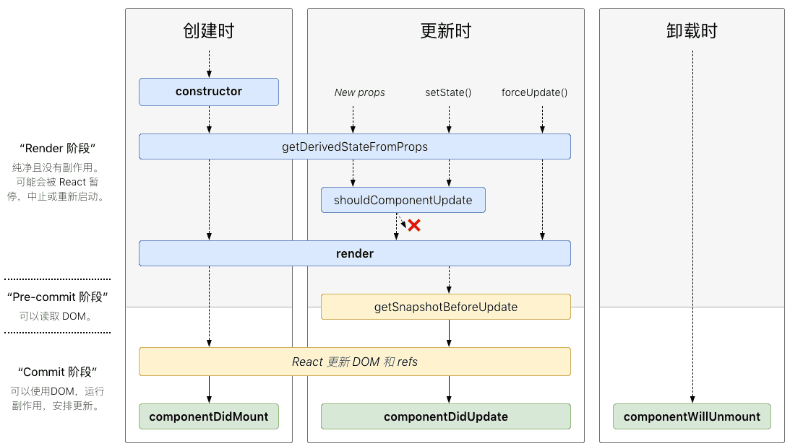

# 高级特性

## 函数组件

- 纯函数，输入props，输出JSX
- 没有实例，没有生命周期，没有state
- 不能扩展其他方法

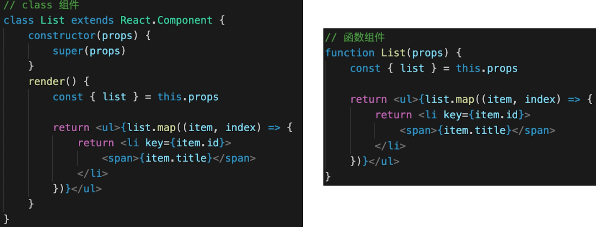

## 受控组件

## 非受控组件

- ref
- defaultValue defaultChecked
- 手动操作DOM元素

> 使用场景：
>
> 1. 必须手动操作DOM元素，setState实现不了
>
> 2. 文件上传<input type=file>
>
> 3. 某些富文本编辑器，需要传入DOM元素
>
>    
>
> 受控组件 vs 非受控组件:
>
> 1. 优先使用受控组件，符合React设计原则
> 2. 必须操作DOM时，在使用非受控组件

```jsx
import React from 'react'

class App extends React.Component {
    constructor(props) {
        super(props)
        this.state = {
            name: '双越',
            flag: true,
        }
        this.nameInputRef = React.createRef() // 创建 ref
        this.fileInputRef = React.createRef()
    }
    render() {
        // // input defaultValue
        // return <div>
        //     {/* 使用 defaultValue 而不是 value ，使用 ref */}
        //     <input defaultValue={this.state.name} ref={this.nameInputRef}/>
        //     {/* state 并不会随着改变 */}
        //     <span>state.name: {this.state.name}</span>
        //     <br/>
        //     <button onClick={this.alertName}>alert name</button>
        // </div>

        // // checkbox defaultChecked
        // return <div>
        //     <input
        //         type="checkbox"
        //         defaultChecked={this.state.flag}
        //     />
        // </div>

        // file
        return <div>
            <input type="file" ref={this.fileInputRef}/>
            <button onClick={this.alertFile}>alert file</button>
        </div>
    }
    alertName = () => {
        const elem = this.nameInputRef.current // 通过 ref 获取 DOM 节点
        alert(elem.value) // 不是 this.state.name
    }
    alertFile = () => {
        const elem = this.fileInputRef.current // 通过 ref 获取 DOM 节点
        alert(elem.files[0].name)
    }
}

export default App
```


## Protals

- 组件默认会按照既定层次嵌套渲染
- 如何让组件渲染到父组件以外？

> 使用场景：
>
> - overflow:hidden
> - 父组件 z-index值太小
> - fixed需要放在body第一层级

```jsx
import React from 'react'
import ReactDOM from 'react-dom'
import './style.css'

class App extends React.Component {
    constructor(props) {
        super(props)
        this.state = {
        }
    }
    render() {
        // // 正常渲染
        // return <div className="modal">
        //     {this.props.children} {/* vue slot */}
        // </div>

        // 使用 Portals 渲染到 body 上。
        // fixed 元素要放在 body 上，有更好的浏览器兼容性。
        return ReactDOM.createPortal(
            <div className="modal">{this.props.children}</div>,
            document.body // DOM 节点
        )
    }
}

export default App


.modal {
    position: fixed;
    width: 300px;
    height: 100px;
    top: 100px;
    left: 50%;
    margin-left: -150px;
    background-color: #000;
    /* opacity: .2; */
    color: #fff;
    text-align: center;
}

```


## context

- 公共信息传递
- 用props太繁琐
- 用redux小题大做


```jsx
import React from 'react'

// 创建 Context 填入默认值（任何一个 js 变量）
const ThemeContext = React.createContext('light')

// 底层组件 - 函数是组件
function ThemeLink (props) {
    // const theme = this.context // 会报错。函数式组件没有实例，即没有 this

    // 函数式组件可以使用 Consumer
    return <ThemeContext.Consumer>
        { value => <p>link's theme is {value}</p> }
    </ThemeContext.Consumer>
}

// 底层组件 - class 组件
class ThemedButton extends React.Component {
    // 指定 contextType 读取当前的 theme context。
    // static contextType = ThemeContext // 也可以用 ThemedButton.contextType = ThemeContext
    render() {
        const theme = this.context // React 会往上找到最近的 theme Provider，然后使用它的值。
        return <div>
            <p>button's theme is {theme}</p>
        </div>
    }
}
ThemedButton.contextType = ThemeContext // 指定 contextType 读取当前的 theme context。

// 中间的组件再也不必指明往下传递 theme 了。
function Toolbar(props) {
    return (
        <div>
            <ThemedButton />
            <ThemeLink />
        </div>
    )
}

class App extends React.Component {
    constructor(props) {
        super(props)
        this.state = {
            theme: 'light'
        }
    }
    render() {
        return <ThemeContext.Provider value={this.state.theme}>
            <Toolbar />
            <hr/>
            <button onClick={this.changeTheme}>change theme</button>
        </ThemeContext.Provider>
    }
    changeTheme = () => {
        this.setState({
            theme: this.state.theme === 'light' ? 'dark' : 'light'
        })
    }
}

export default App
```

## 异步组件

- import（）
- React.lazy
- React.Suspence

```jsx
import React from 'react'

const ContextDemo = React.lazy(() => import('./ContextDemo'))

class App extends React.Component {
    constructor(props) {
        super(props)
    }
    render() {
        return <div>
            <p>引入一个动态组件</p>
            <hr />
            <React.Suspense fallback={<div>Loading...</div>}>
                <ContextDemo/>
            </React.Suspense>
        </div>

        // 1. 强制刷新，可看到 loading （看不到就限制一下 chrome 网速）
        // 2. 看 network 的 js 加载
    }
}

export default App

```


## 性能优化

### shouldComponentUpdate

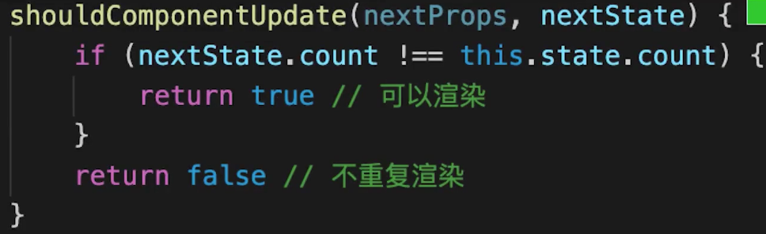

- SCU默认返回true，即React默认重新渲染所有子组件
- 必须配合“不可变值”一起使用
- 可先不用SCU，有性能问题时再考虑使用

### PureComponent & memo

- PureComponent在SCU中实现了浅比较
- memo，函数组件中的PureComponent
- 浅比较已经适用大部分情况（尽量不要做深度比较）

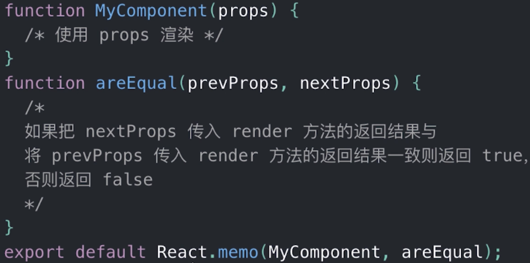

### immutable.js

- 彻底拥抱“不可变值”
- 基于共享数据（不是深拷贝），速度快
- 有一定的学习和迁移成本，按需使用

### 按需使用 & state 层级

## 公共逻辑抽离

### 高阶组件HOC（High Order Components）

- 模式简单，但会增加组件层级

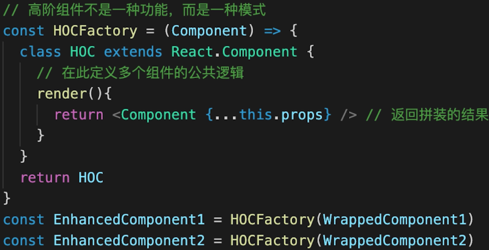

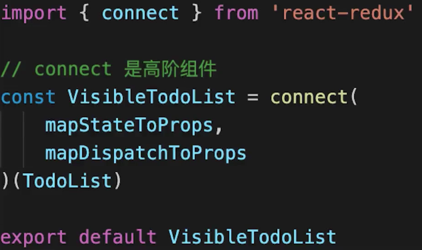


```jsx
import React from 'react'

// 高阶组件
const withMouse = (Component) => {
    class withMouseComponent extends React.Component {
        constructor(props) {
            super(props)
            this.state = { x: 0, y: 0 }
        }
  
        handleMouseMove = (event) => {
            this.setState({
                x: event.clientX,
                y: event.clientY
            })
        }
  
        render() {
            return (
                <div style={{ height: '500px' }} onMouseMove={this.handleMouseMove}>
                    {/* 1. 透传所有 props 2. 增加 mouse 属性 */}
                    <Component {...this.props} mouse={this.state}/>
                </div>
            )
        }
    }
    return withMouseComponent
}

const App = (props) => {
    const a = props.a
    const { x, y } = props.mouse // 接收 mouse 属性
    return (
        <div style={{ height: '500px' }}>
            <h1>The mouse position is ({x}, {y})</h1>
            <p>{a}</p>
        </div>
    )
}

export default withMouse(App) // 返回高阶函数
```


### Render Props

- 代码简洁，学习成本高

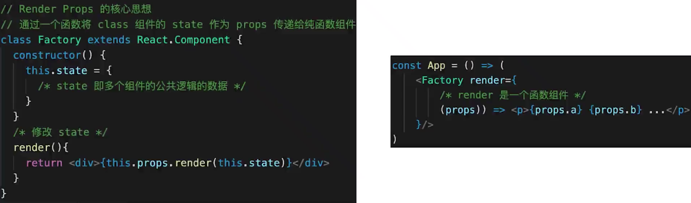

```jsx
import React from 'react'
import PropTypes from 'prop-types'

class Mouse extends React.Component {
    constructor(props) {
        super(props)
        this.state = { x: 0, y: 0 }
    }
  
    handleMouseMove = (event) => {
      this.setState({
        x: event.clientX,
        y: event.clientY
      })
    }
  
    render() {
      return (
        <div style={{ height: '500px' }} onMouseMove={this.handleMouseMove}>
            {/* 将当前 state 作为 props ，传递给 render （render 是一个函数组件） */}
            {this.props.render(this.state)}
        </div>
      )
    }
}
Mouse.propTypes = {
    render: PropTypes.func.isRequired // 必须接收一个 render 属性，而且是函数
}

const App = (props) => (
    <div style={{ height: '500px' }}>
        <p>{props.a}</p>
        <Mouse render={
            /* render 是一个函数组件 */
            ({ x, y }) => <h1>The mouse position is ({x}, {y})</h1>
        }/>
        
    </div>
)

/**
 * 即，定义了 Mouse 组件，只有获取 x y 的能力。
 * 至于 Mouse 组件如何渲染，App 说了算，通过 render prop 的方式告诉 Mouse 。
 */

export default App
```


# 周边工具

## [redux](https://cn.redux.js.org/introduction/getting-started/)

### store

### reducer

### action

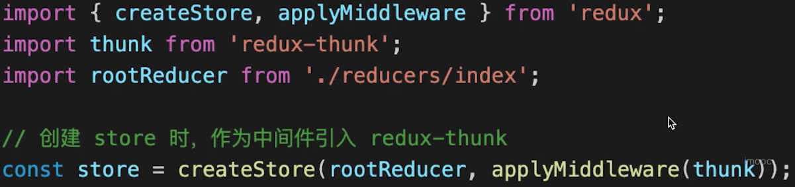

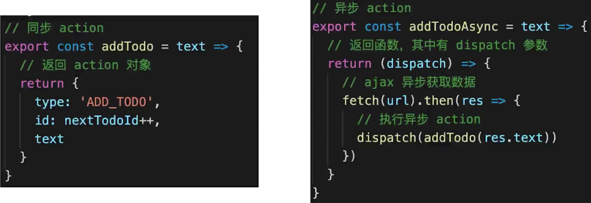

### dispatch

### 单项数据流模型

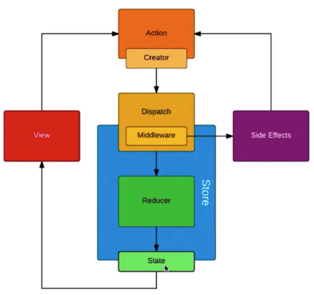

### 中间件

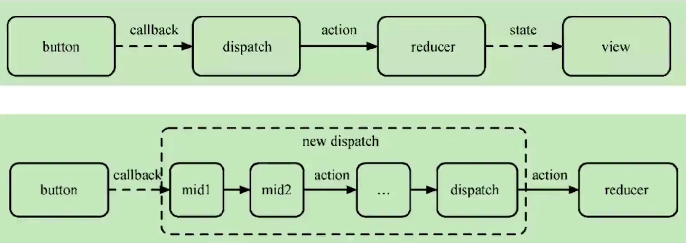

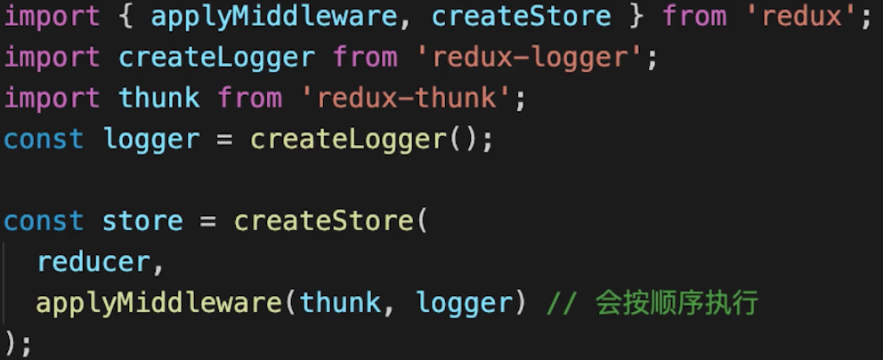

#### logger

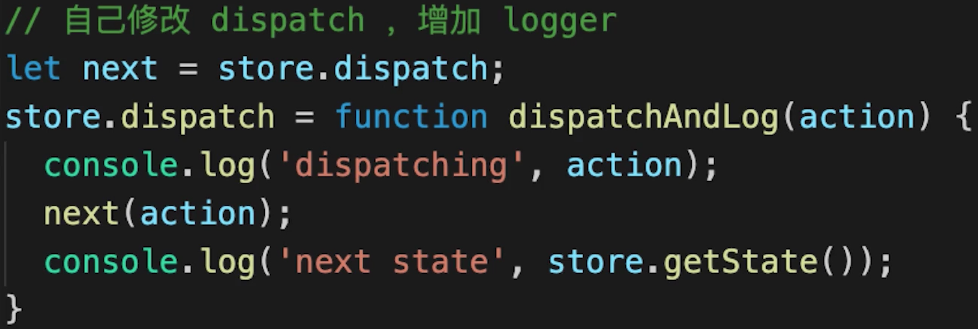

#### redux-thunk

#### [redux-saga](https://neighborhood999.github.io/redux-saga/docs/api/)

#### redux-promise

## react-redux

### provider

### connect

### mapStateToProps

### mapDispatchToProps

## react-router

### 路由模式（hash、H5 history）

- hash模式（默认），如http://abc.com/#user/20	（to B）
- H5 history模式，如http://abc.com/user/20   （to C）
- 后者需要server端支持，因此无特殊需求可选择前者

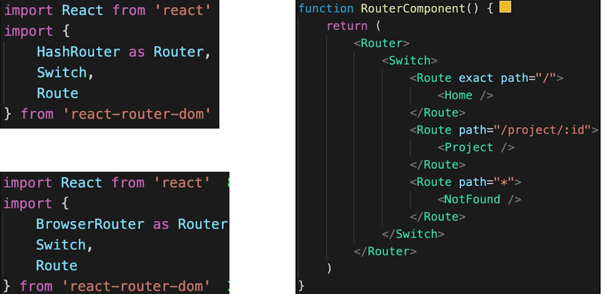

### 路由配置（动态路由）

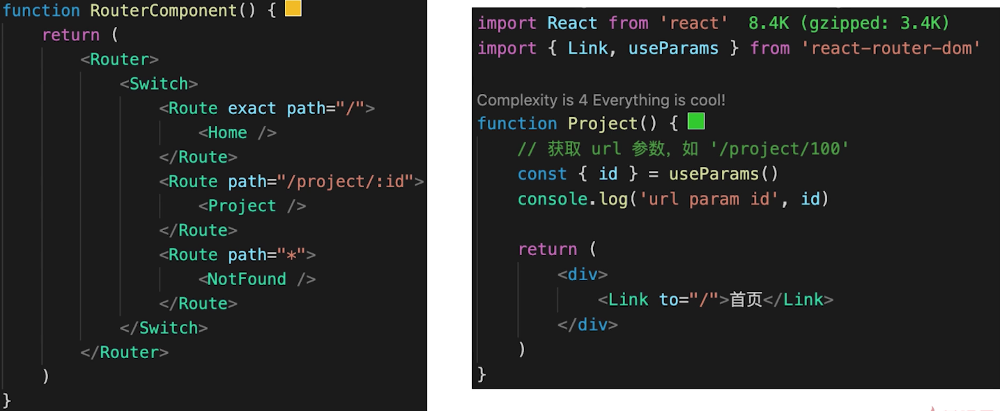


### 懒加载

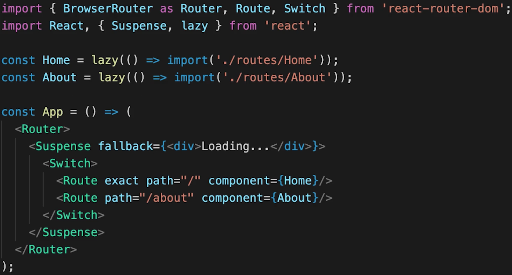

# 原理

## 函数式编程

- 一种编程范式，概念较多
- 纯函数
- 不可变值

## vdom和diff算法

### vdom

- h函数
- vnode数据结构
- patch函数

### diff

- 只比较同一层级，不跨级比较
- tag不相同，则直接删掉重建，不再深度比较
- tag和key，两者都相同，则认为是相同节点，不再深度比较

## JSX本质

- JSX等同于Vue模板

- JSX不是JS

- JSX即React.createElement()，即h函数，返回vnode

  - 第一个参数，可能是组件，也可能是html tag
  - 组件名，首字母必须大写（React规定）

  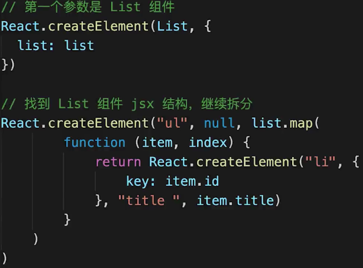

### JSX的编译

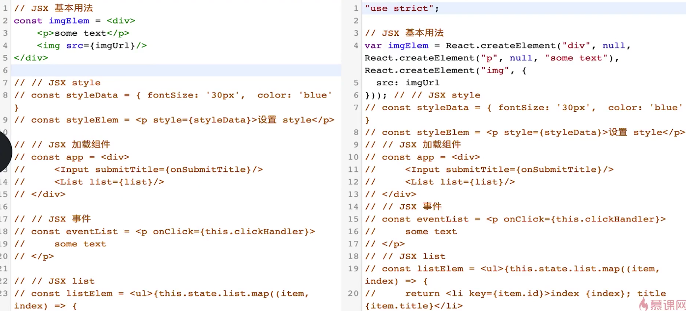

## 合成事件

- 所有事件挂载到document上
- event不是原生的，是SyntheticEvent合成事件对象
- 和vue事件不同，和DOM事件也不同

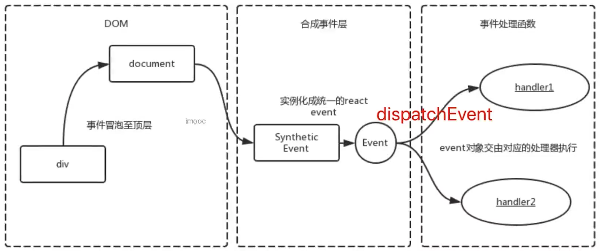

#### 为何要合成事件机制？

- 更好的兼容性和跨平台
- 挂载到document，减少内存消耗，避免频繁解绑
- 方便事件的统一管理（如事务机制）

## setState和batchUpdate

### setState主流程

- 有时异步（普通使用），有时同步（setTimeout、Dom事件）
- 有时合并（对象形式），有时不合并（函数形式）（像Object.assign）

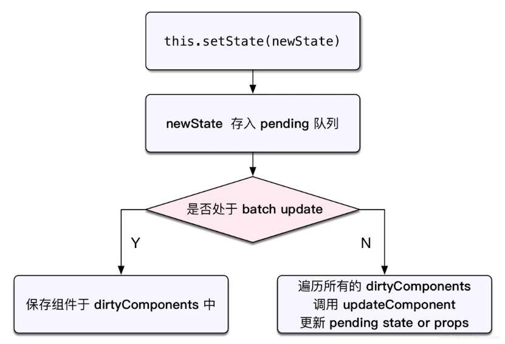

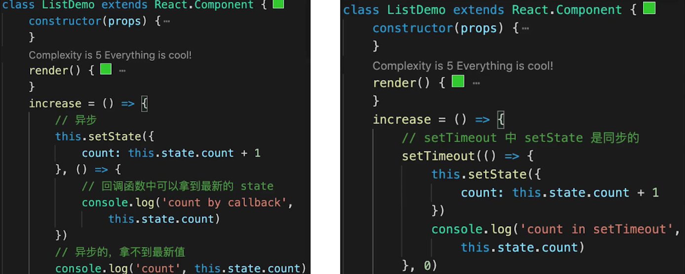

#### isBatchingUpdates

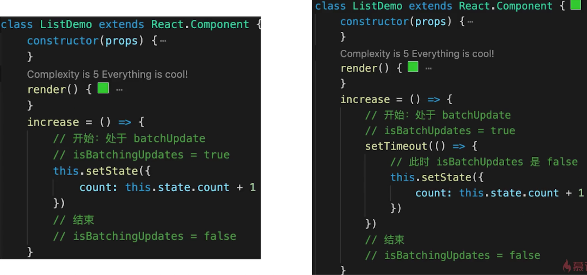

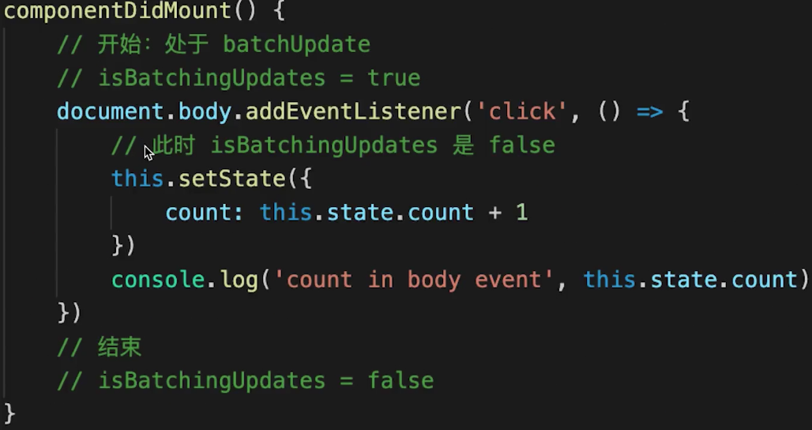

#### 哪些能命中batchUpdate机制

- 生命周期（和它调用的函数）

- React中注册的事件（和它调用的函数）

- ###### React可以“管理”的入口

#### 哪些不能命中batchUpdate机制

- setTimeout setInterval等（和它调用的函数）
- 自定义的DOM事件（和它调用的函数）
- React“管不到”的入口

### transaction事务机制

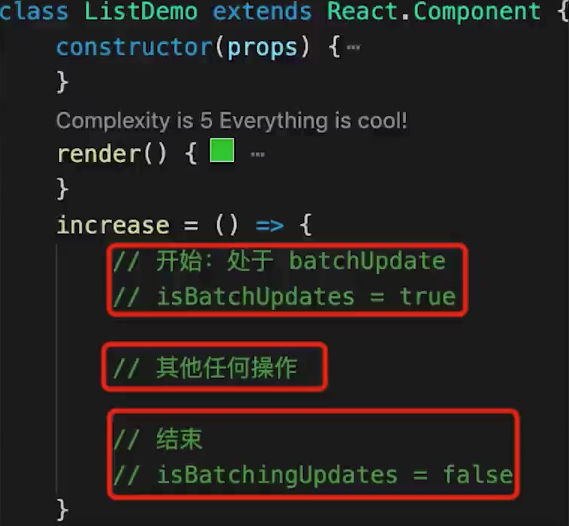

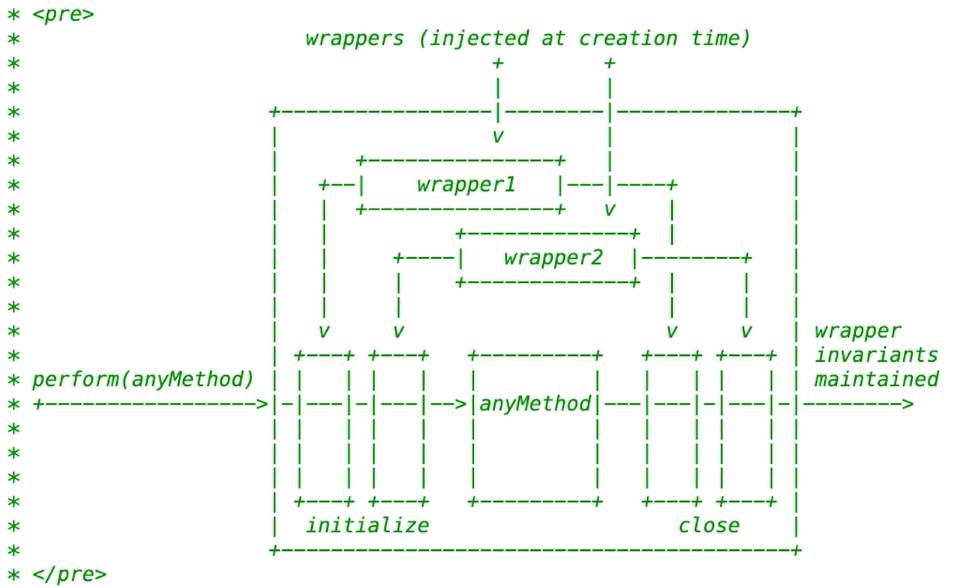

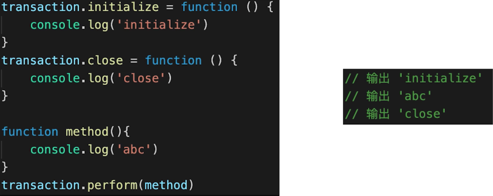

## 组件渲染过程

- props state
- render()生成vnode
- path（elem，vnode）

## 组件更新过程

- setState（newState）--> dirtyComponents（可能有子组件）
- render()生成newVnode
- path（Vnode，newVnode）

### 更新的两个阶段

- reconciliation阶段-执行diff算法，纯JS计算
- commit阶段- 将diff结果渲染DOM

##### 不分为两个阶段可能会有性能问题

- JS是单线程，且和DOM渲染共用一个线程
- 当组件足够复杂，阻击爱你更新计算和渲染都压力大
- 同时再有DOM操作需求（动画、鼠标拖拽等），将卡顿

##### 解决方案fiber

- 将reconciliation阶段进行任务拆分（commit无法拆分）
- DOM需要渲染时暂停，空闲时恢复
- window.requestIdleCallback

##### 关于fiber

- React内部运行机制，开发者体会不到

## 前端路由

