# Webpack

webpack是静态模块打包器，当webpack处理应用程序时，会将所有这些模块打包成一个或多个文件。

## module chunk bundle的区别

- module - 各个源码文件，webpack中一切皆模块
- chunk - 多模块合并成的，如 entry import() splitChunk
- bundle -  最终的输出文件

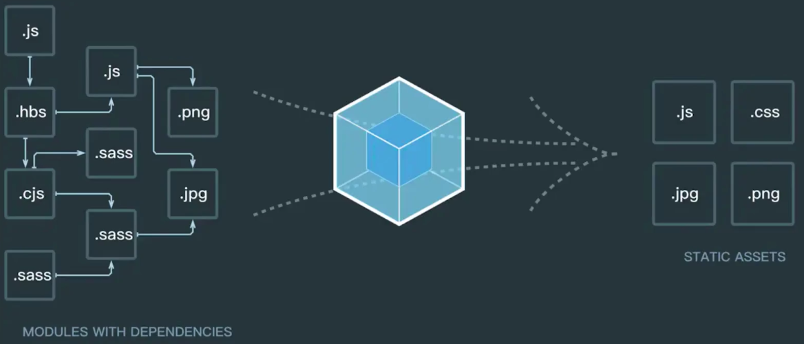

## 核心概念

### entry

指定入口文件

```
entry:'./src/index.js'
//多入口配置
entry:{
	main:'./src/indes.js',
	search:'./src/search.js'
}
```

### output

```
output:{
	path: path.resolve(__dirname,'dist'),
	filename:'[name].js'
}
```

### [loader](https://www.webpackjs.com/concepts/loaders/)

loader让webpack能够去处理那些非js文件的模块

```
module: {
        rules: [
            {
                test: /\.js$/,
                loader: ['babel-loader'],
                include: srcPath,
                exclude: /node_modules/
            },
            // {
            //     test: /\.vue$/,
            //     loader: ['vue-loader'],
            //     include: srcPath
            // },
            // {
            //     test: /\.css$/,
            //     // loader 的执行顺序是：从后往前（知识点）
            //     loader: ['style-loader', 'css-loader']
            // },
            {
                test: /\.css$/,
                // loader 的执行顺序是：从后往前
                loader: ['style-loader', 'css-loader', 'postcss-loader'] // 加了 postcss
            },
            {
                test: /\.less$/,
                // 增加 'less-loader' ，注意顺序
                loader: ['style-loader', 'css-loader', 'less-loader']
            }
        ]
    }
```


#### babel-loader

babel-loader是babel和loader的联通器

```
npm install --save-dev babel-loader@8.1.0 @babel/core@7.11.0 @babel.preset-env@7.11.0
```

#### core-js

编译新增api，使用js实现了一些promise之类的方法兼容低版本的浏览器使用

```
npm install --save-dev core-js@3.6.5
```

### [plugins](https://www.webpackjs.com/plugins/)

loader被用于帮助webpack处理各种模块，插件用于执行范围更广的任务

#### [html-webpack-plugin](https://www.webpackjs.com/plugins/html-webpack-plugin/)

```
npm install --save-dev html-webpack-plugin
```

```js
const HtmlWebpackPlugin = require('html-webpack-plugin');
const path = require('path');

module.exports = {
  entry: 'index.js',
  output: {
    path: path.resolve(__dirname, './dist'),
    filename: 'index_bundle.js',
  },
  plugins: [new HtmlWebpackPlugin()],
};
```

```html
<!DOCTYPE html>
<html>
  <head>
    <meta charset="UTF-8" />
    <title>webpack App</title>
  </head>
  <body>
    <script src="index_bundle.js"></script>
  </body>
</html>
```

##### 多入口

```js
plugins: [
        // new HtmlWebpackPlugin({
        //     template: path.join(srcPath, 'index.html'),
        //     filename: 'index.html'
        // })

        // 多入口 - 生成 index.html
        new HtmlWebpackPlugin({
            template: path.join(srcPath, 'index.html'),
            filename: 'index.html',
            // chunks 表示该页面要引用哪些 chunk （即上面的 index 和 other），默认全部引用
            chunks: ['index']  // 只引用 index.js
        }),
        // 多入口 - 生成 other.html
        new HtmlWebpackPlugin({
            template: path.join(srcPath, 'other.html'),
            filename: 'other.html',
            chunks: ['other']  // 只引用 other.js
        })
    ]
```

#### [MiniCssExtractPlugin](https://www.webpackjs.com/plugins/mini-css-extract-plugin)

将 CSS 提取到单独的文件中，为每个包含 CSS 的 JS 文件创建一个 CSS 文件，并且支持 CSS 和 SourceMaps 的按需加载。

```js
const MiniCssExtractPlugin = require("mini-css-extract-plugin");

module.exports = {
  plugins: [new MiniCssExtractPlugin()],
  module: {
    rules: [
      {
        test: /\.css$/i,
        use: [MiniCssExtractPlugin.loader, "css-loader"],
      },
    ],
  },
};
```


## loader和plugin的区别

- loader模块转换器，如 less -> css
- plugin扩展插件，如 HtmlWebpackPlugin

## 安装配置

### 安装

```json
npm install --save-dev webpack-cli@3.3.12 webpack@4.44.1
```

### 配置

默认配置文件名字为：webpack.config.js

```javascript
module.exports={
  mode:'development'//指定为开发模式，编译后的代码不再混淆和压缩
};
```

### 编译并测试

```json
{
	"scripts":{
		"webpack":"webpack --config webpack.config.js"
	}
}
```


## dev-server

## 解析ES6

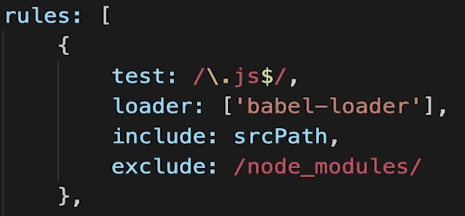

## 解析样式

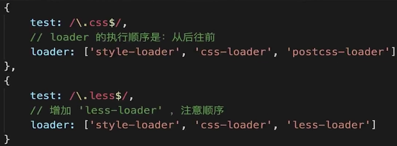

## 解析图片

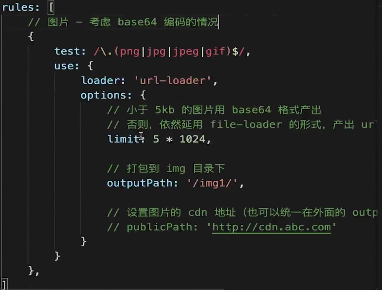

## 常见loader和plugin

## 如何产出一个lib


# 高级特性

## 多入口

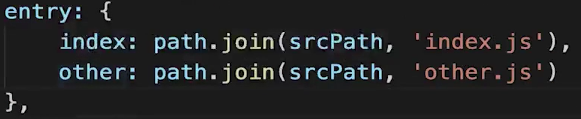

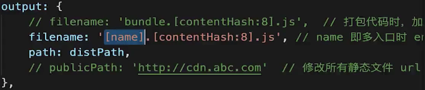

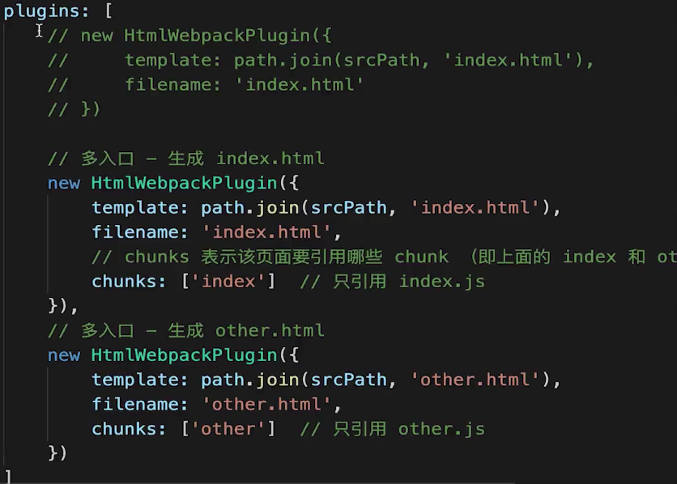

#### Webpack.common.js

```js
const path = require('path')
const HtmlWebpackPlugin = require('html-webpack-plugin')
const { srcPath, distPath } = require('./paths')

module.exports = {
    entry: {
        index: path.join(srcPath, 'index.js'),
        other: path.join(srcPath, 'other.js')
    },
    module: {
        rules: [
            {
                test: /\.js$/,
                loader: ['babel-loader'],
                include: srcPath,
                exclude: /node_modules/
            }
        ]
    },
    plugins: [
        // new HtmlWebpackPlugin({
        //     template: path.join(srcPath, 'index.html'),
        //     filename: 'index.html'
        // })

        // 多入口 - 生成 index.html
        new HtmlWebpackPlugin({
            template: path.join(srcPath, 'index.html'),
            filename: 'index.html',
            // chunks 表示该页面要引用哪些 chunk （即上面的 index 和 other），默认全部引用
            chunks: ['index', 'vendor', 'common']  // 要考虑代码分割
        }),
        // 多入口 - 生成 other.html
        new HtmlWebpackPlugin({
            template: path.join(srcPath, 'other.html'),
            filename: 'other.html',
            chunks: ['other', 'common']  // 考虑代码分割
        })
    ]
}

```


#### Webpack.prod.js

```js
const path = require('path')
const webpack = require('webpack')
const { smart } = require('webpack-merge')
const { CleanWebpackPlugin } = require('clean-webpack-plugin')
const MiniCssExtractPlugin = require('mini-css-extract-plugin')
const TerserJSPlugin = require('terser-webpack-plugin')
const OptimizeCSSAssetsPlugin = require('optimize-css-assets-webpack-plugin')
const webpackCommonConf = require('./webpack.common.js')
const { srcPath, distPath } = require('./paths')

module.exports = smart(webpackCommonConf, {
    mode: 'production',
    output: {
        // filename: 'bundle.[contentHash:8].js',  // 打包代码时，加上 hash 戳
        filename: '[name].[contentHash:8].js', // name 即多入口时 entry 的 key
        path: distPath,
        // publicPath: 'http://cdn.abc.com'  // 修改所有静态文件 url 的前缀（如 cdn 域名），这里暂时用不到
    },
    module: {
        rules: [
            // 图片 - 考虑 base64 编码的情况
            {
                test: /\.(png|jpg|jpeg|gif)$/,
                use: {
                    loader: 'url-loader',
                    options: {
                        // 小于 5kb 的图片用 base64 格式产出
                        // 否则，依然延用 file-loader 的形式，产出 url 格式
                        limit: 5 * 1024,

                        // 打包到 img 目录下
                        outputPath: '/img1/',

                        // 设置图片的 cdn 地址（也可以统一在外面的 output 中设置，那将作用于所有静态资源）
                        // publicPath: 'http://cdn.abc.com'
                    }
                }
            },
            // 抽离 css
            {
                test: /\.css$/,
                loader: [
                    MiniCssExtractPlugin.loader,  // 注意，这里不再用 style-loader
                    'css-loader',
                    'postcss-loader'
                ]
            },
            // 抽离 less
            {
                test: /\.less$/,
                loader: [
                    MiniCssExtractPlugin.loader,  // 注意，这里不再用 style-loader
                    'css-loader',
                    'less-loader',
                    'postcss-loader'
                ]
            }
        ]
    },
    plugins: [
        new CleanWebpackPlugin(), // 会默认清空 output.path 文件夹
        new webpack.DefinePlugin({
            // window.ENV = 'production'
            ENV: JSON.stringify('production')
        }),

        // 抽离 css 文件
        new MiniCssExtractPlugin({
            filename: 'css/main.[contentHash:8].css'
        })
    ],

    optimization: {
        // 压缩 css
        minimizer: [new TerserJSPlugin({}), new OptimizeCSSAssetsPlugin({})],

        // 分割代码块
        splitChunks: {
            chunks: 'all',
            /**
             * initial 入口 chunk，对于异步导入的文件不处理
                async 异步 chunk，只对异步导入的文件处理
                all 全部 chunk
             */

            // 缓存分组
            cacheGroups: {
                // 第三方模块
                vendor: {
                    name: 'vendor', // chunk 名称
                    priority: 1, // 权限更高，优先抽离，重要！！！
                    test: /node_modules/,
                    minSize: 0,  // 大小限制
                    minChunks: 1  // 最少复用过几次
                },

                // 公共的模块
                common: {
                    name: 'common', // chunk 名称
                    priority: 0, // 优先级
                    minSize: 0,  // 公共模块的大小限制
                    minChunks: 2  // 公共模块最少复用过几次
                }
            }
        }
    }
})
```

#### path.js

```js
/**
 * @description 常用文件夹路径
 * @author 双越
 */

const path = require('path')

const srcPath = path.join(__dirname, '..', 'src')
const distPath = path.join(__dirname, '..', 'dist')

module.exports = {
    srcPath,
    distPath
}

```


## 抽离和压缩css

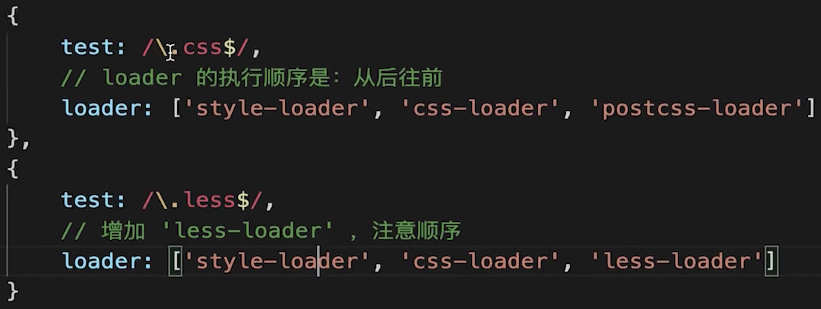

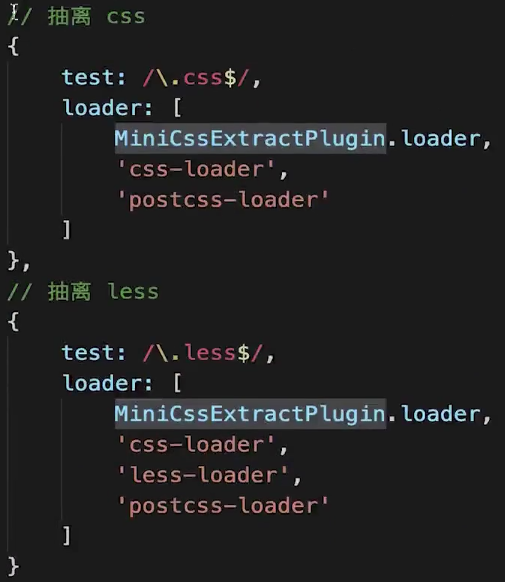

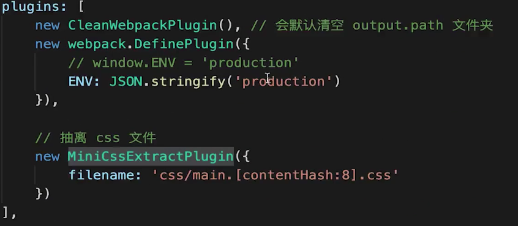

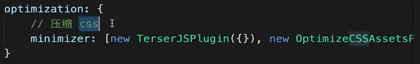

## 抽离公共代码

## 懒加载

## 处理React

# 性能优化

## 优化构建速度

### 优化babel-loader

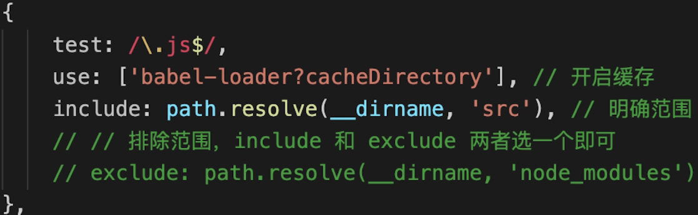

### ignorePlugin（避免引入无用模块）

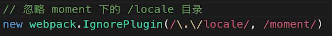

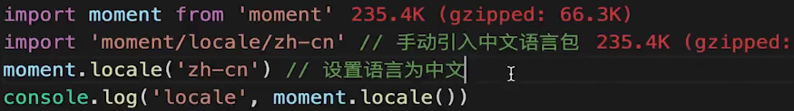

### noParse（避免重复打包）

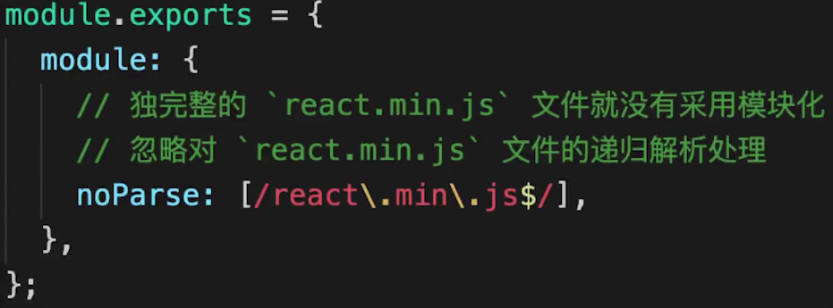

#### IgnorePlugin vs noParse

- IgnorePlugin直接不引入，代码中没有，减少产出体积
- noParse引入，但不打包

### happyPack（多进程打包）

- JS单线程，开启多进程打包
- 提高构建速度（特别是多核CPU）

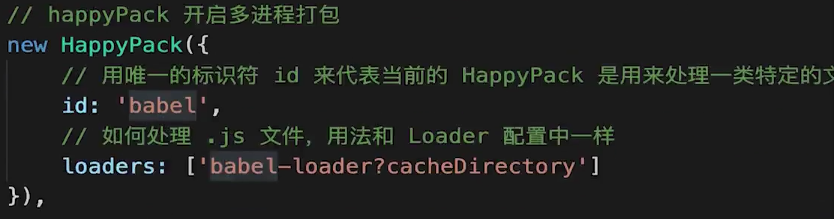

### ParallelUglifyPlugin（多进程压缩JS）

- webpack内置Uglify工具压缩JS
- JS单线程，开启多进程压缩更快

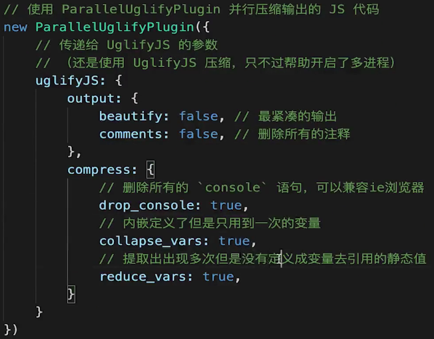

### 自动刷新

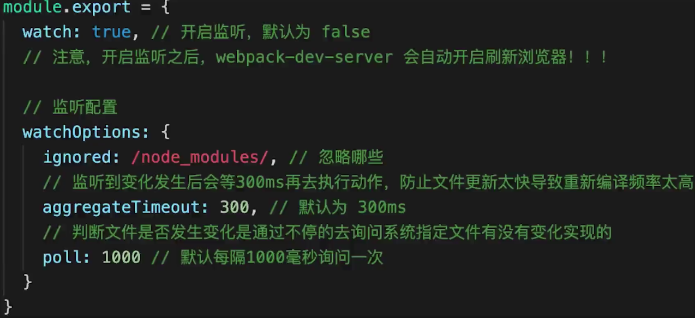

- 使用devServer的配置，自动刷新的功能默认开启

### 热更新

- 自动刷新：整个网页全部刷新，速度较慢，状态会丢失
- 热更新：新代码生效，网页不刷新，状态不丢失

### DllPlugin（动态链接库插件）

> 背景：
>
> - 前端框架Vue React，体积大，构建慢
> - 较稳定，不常升级版本
> - 同一个版本只构建一次即可，不用每次都重新构建

- webpack已内置DllPlugin
- DllPlugin - 打包出dll文件
- DllReferencePlugin - 使用dll文件

```javascript
const path = require('path')
const DllPlugin = require('webpack/lib/DllPlugin')
const { srcPath, distPath } = require('./paths')

module.exports = {
  mode: 'development',
  // JS 执行入口文件
  entry: {
    // 把 React 相关模块的放到一个单独的动态链接库
    react: ['react', 'react-dom']
  },
  output: {
    // 输出的动态链接库的文件名称，[name] 代表当前动态链接库的名称，
    // 也就是 entry 中配置的 react 和 polyfill
    filename: '[name].dll.js',
    // 输出的文件都放到 dist 目录下
    path: distPath,
    // 存放动态链接库的全局变量名称，例如对应 react 来说就是 _dll_react
    // 之所以在前面加上 _dll_ 是为了防止全局变量冲突
    library: '_dll_[name]',
  },
  plugins: [
    // 接入 DllPlugin
    new DllPlugin({
      // 动态链接库的全局变量名称，需要和 output.library 中保持一致
      // 该字段的值也就是输出的 manifest.json 文件 中 name 字段的值
      // 例如 react.manifest.json 中就有 "name": "_dll_react"
      name: '_dll_[name]',
      // 描述动态链接库的 manifest.json 文件输出时的文件名称
      path: path.join(distPath, '[name].manifest.json'),
    }),
  ],
}
```

## 优化产出代码

### 使用生产环境

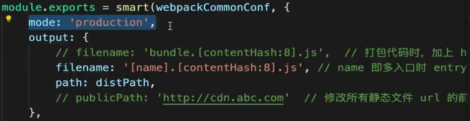

- 自动开启代码压缩
- Vue React等会自动删掉调试代码（如开发环境的warning）
- 启动Tree-Shaking( 删除无用代码 )，ES6 Module才能让tree-shaking生效，Commonjs就不行

#### ES6 Module 和 Commonjs区别

- ES6 Module静态引入，编译时引入

  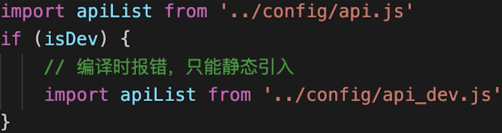

- Commonjs动态引入，执行时引入

  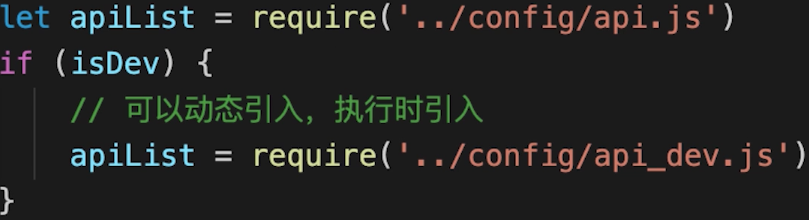

- 只有ES6 Module才能静态分析，实现Tree-Shaking

### 小图片base64编码

### bundle加hash

### 使用CDN

### 提取公共代码

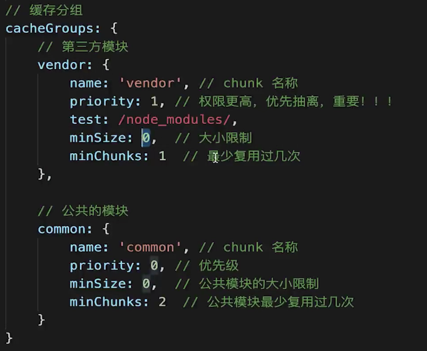


### 懒加载

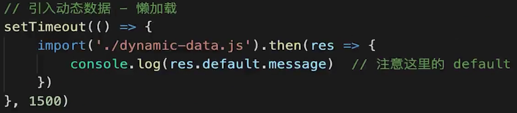

### Scope Hosting

- 代码体积更小
- 创建函数作用域更少
- 代码可读性更好

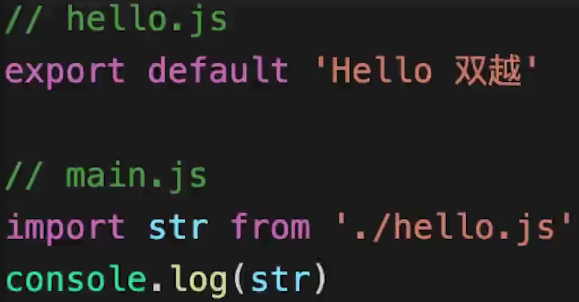

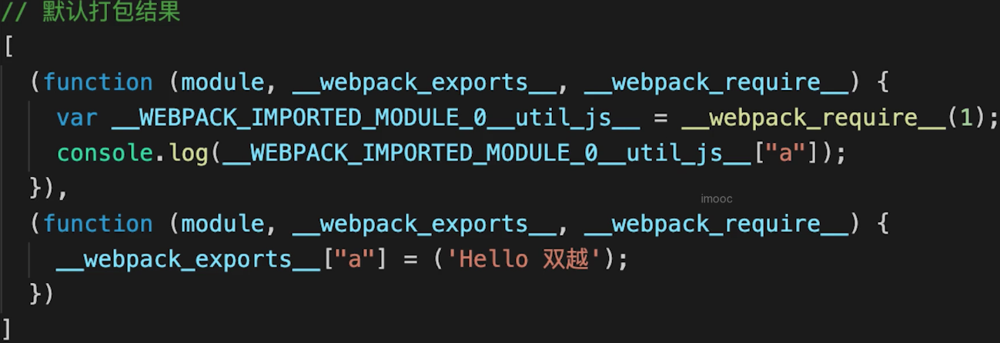

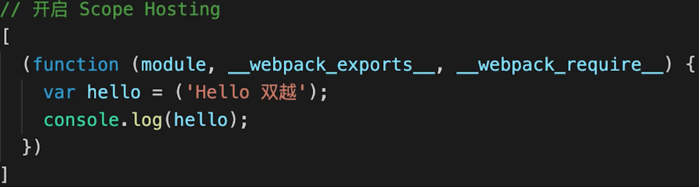

#### Scope Hosting配置

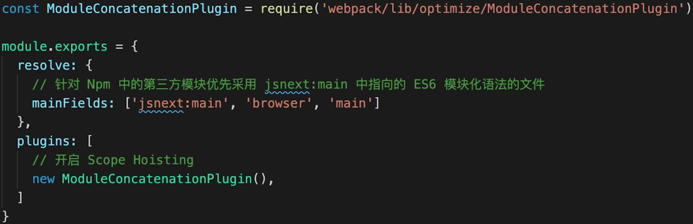

# Babel

- 环境搭建
- .babelrc配置
- presets和plugins

## babel和webpack的区别

- babel - JS新语法编译工具，不关心模块化
- webpack -  打包构建工具，是多个loader plugin的集合

## babel-polyfill的问题

- 会污染全局环境

  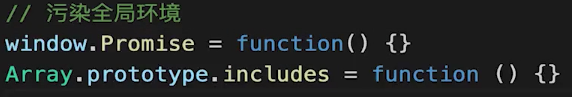

- 如果做一个独立的web系统，则无妨

- 如果做一个第三方的lib，则会有问题

## babel-polyfill按需引入

- 文件较大
- 只用一部分功能，无需全部引入
- 配置按需引入

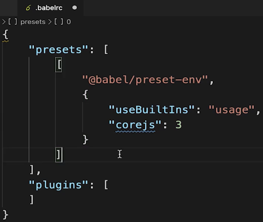

## babel-polyfill和babel-runtime的区别

- babel-polyfill会污染全局
- babel-runtime不会污染全局
- 产出第三方lib要用babel-runtime

