# 概念

## nodejs是什么

- nodejs是基于Chome V8引擎的Javascript运行时（运行环境）
- nodejs出现之前，js只能在浏览器运行
- nodejs出现之后，js可以在任何安装nodejs的环境运行

## commonjs和ES6 Module有何区别

- 语法不同

- commonjs是动态引入，执行时引入

  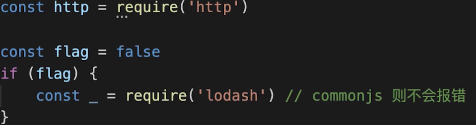

- ES6 Module是静态引入，编译时引入

  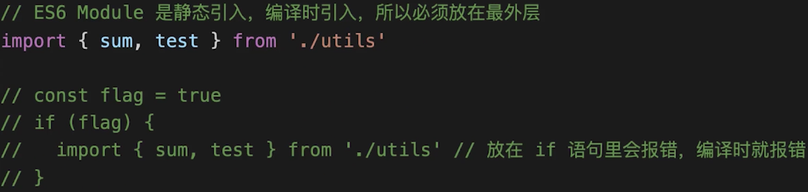

### commonjs require的三个级别

- nodejs自带模块，如erquire（‘http’）
- npm安装的模块，如require（‘lodash’）
- 自定义的模块，如require（‘../utils.js’）

## nodejs和前端js的区别

- 都使用ES语法
- 前端js使用JS Web API
- nodejs使用node API
- 前端js用于网页，在浏览器运行
- nodejs可用于服务端，如开发web server
- nodejs也可用于本机，如webpack等本机工具

# 框架的作用和价值

- 封装原生的api，让开发更简单
- 规范流程和格式，如koa2的中间件
- 让开发人员专注于业务和功能开发

# async/await执行顺序

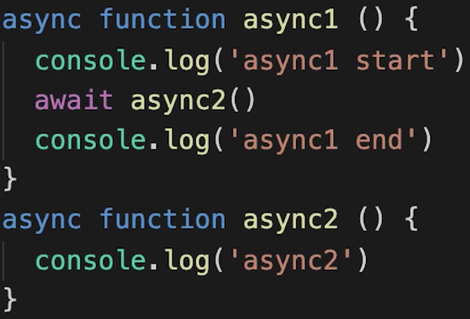

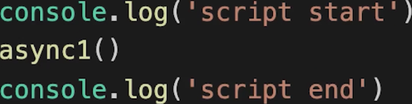

> await后面的内容相当于异步回调的内容！！

执行结果：

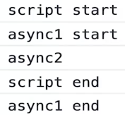

# koa2如何处理路由

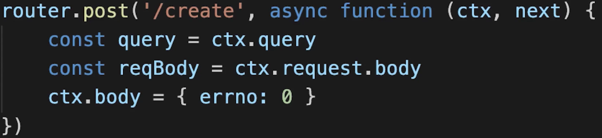

# koa2洋葱圈模型

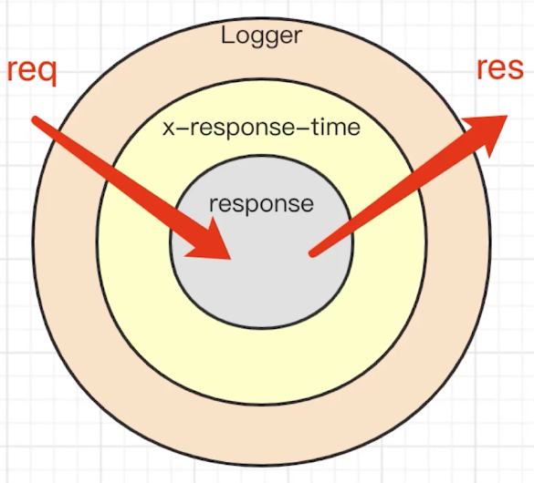

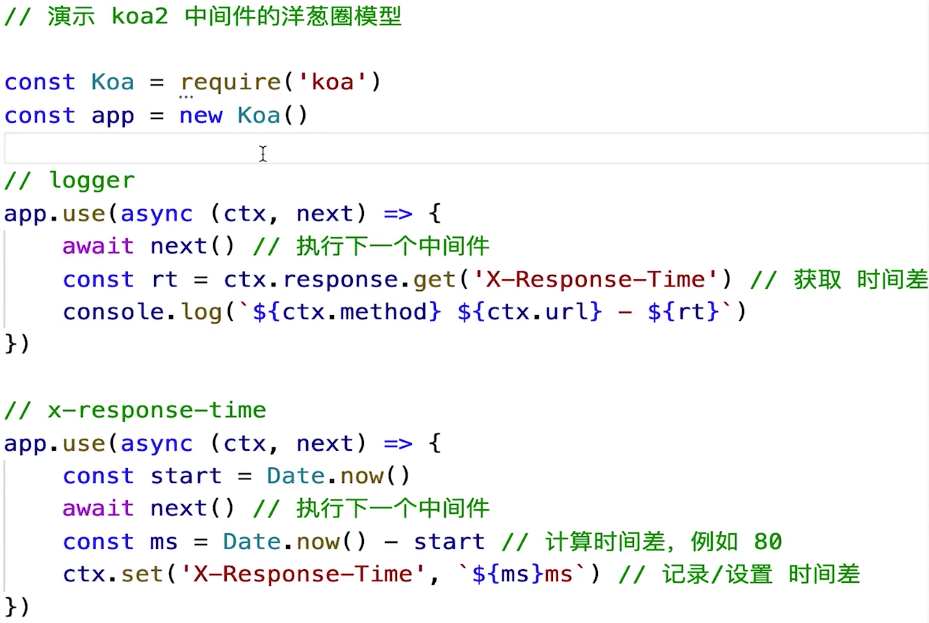

# 服务端经典分层模型

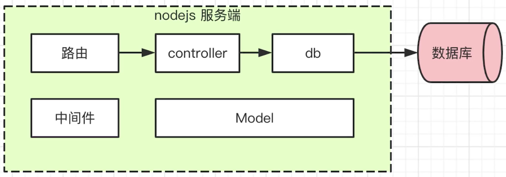

# Http

## 如何启动http服务

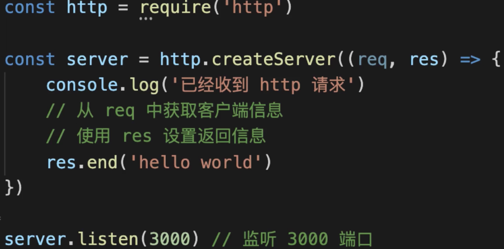

## 如何定义路由

- 定义路由的两大要素：method+pathname
- 从req中获取method和url
- 再通过url获取pathname

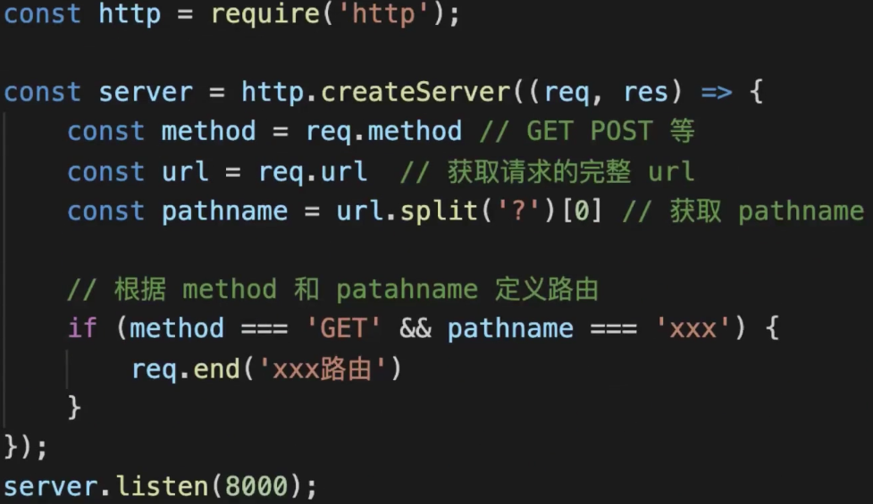

## 如何获取querystring

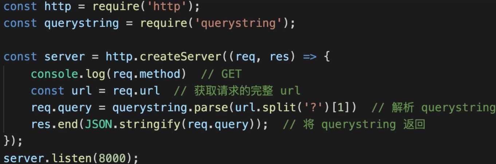

## 如何获取Request body

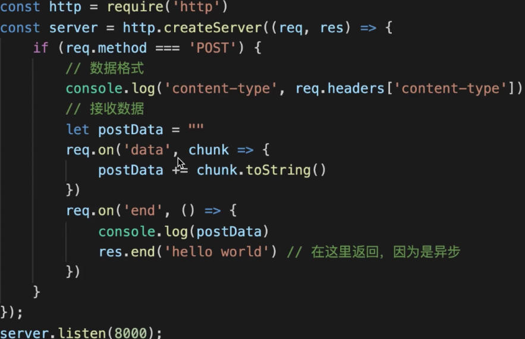

## 如何返回json格式的数据

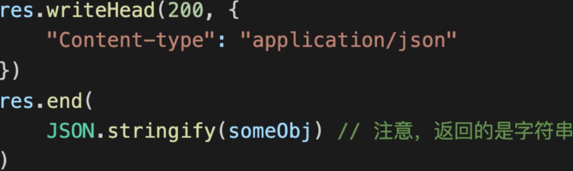

## session如何实现登录

- cookie可实现登录校验
- cookie不能泄漏用户信息，所以有了session
- session存储用户信息，cookie和session关联

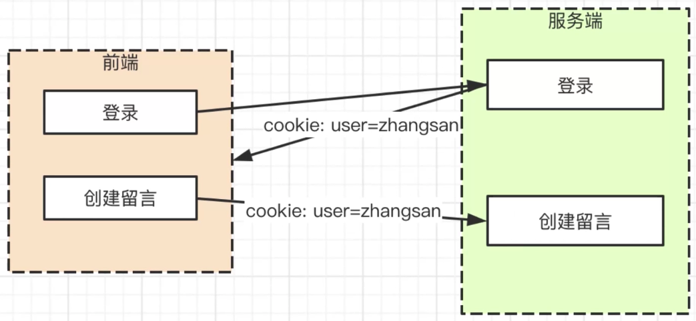

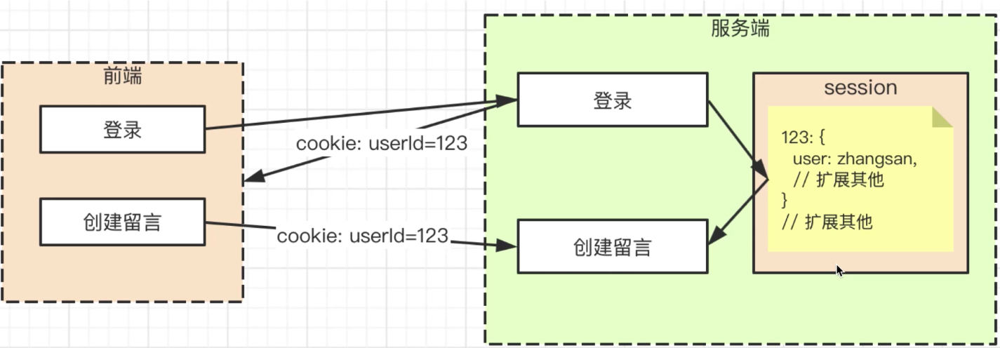

