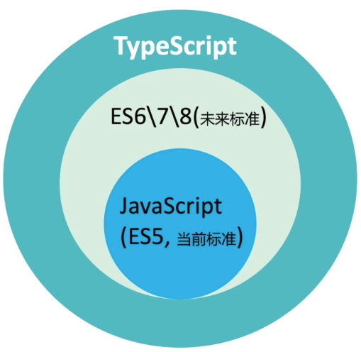
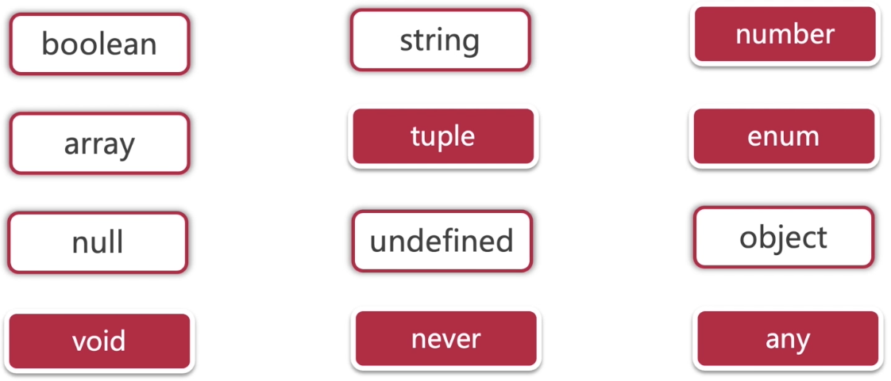

# TS理论基础

## 什么是TS



- TS无法直接在浏览器中运行

# TS工作流程


# TS的基础知识

## 数据类型



### Number

- 对数字的定义只有一个很笼统的number来表示
- 既能表示整数、也能表示浮点数，甚至也可以表示正负数

### String

- "hello" , `hello` , ' hello'
- 反引号：``, 可以创建一个字符串模板
- 与JavaScript一致

### boolean


### Array

- 数组中可以存放任意类型的数据

```typescript
let list1: number[] = [1,2,3,4] 
let list2: Array<number> = [1,2,3,4]
let list3 = [1,2,3,4]
let list4 = [1,"ddd"]
let list5 :any[] = [1,"dss",true]
```


### Tupple

- 固定长度、固定类型的Array
- 存在bug，使用 .push()可以突破元祖的长度限制
- 声明一个元祖的时候一定要指明类型

```
let person1:[number,string] = [1,"张三"]
```

### union组合类型

```typescript
let union : string | number

union = 2
union = "helo"


function merge(n1:number|string , n2:number|string ， resultType:"as-number"|"as-number"){
  return n1 + n2 ;
}
```


### Nullable可空类型

### Literal预定义类型

- 字面量类型

```typescript
let union : 0 | 1 | 2 ;
union = 1 ;

let literal : 1 | "2" | true | [1,2,3,4]
```

### enum

- 真正的枚举类型默认是数字，从0开始
- 可以自定义枚举类型值类型

```typescript
enum Color{
  red = 5, //可以指定枚举类型开始计算的值
  green = 10, //也可以自定义枚举类型值
  blue
}

enum Color2{
  red = "red", 
  green = "green", 
  blue = 1
}
```

### any

- 主要目的是为了加速开发过程，保留javascript的灵活性

### unknow

- 不保证类型，但是保证类型安全

```
let randomValue : unknown =66;

if(typeof randomValue === 'function'){
	randomValue();
}
```

### void

- 压根就不存在的值

### undefined

- 未经初始化的值

### never

```typescript
function throwError(message:string , errorCode:number):never{
	throw{
		message,
		errorCodde
	}
}

throwError('not found',404)
```

### function

```typescript
//可选参数，必须在参数列表最后
let log = (message:string,code?:number) =>{
	console.log(message,code)
}

//默认值，必须在参数列表最后
let log2 = (message:string,code:number = 0) =>{
	console.log(message,code)
}

log('hello')
```


## Type Assertions

- 类型适配（类型断言）

```typescript
let message:any;
message = 'abc';

//1
(<string>message).endsWith("c");

//2
(message as string).endsWith("c")
```

# TS的面对对象


## Object


```typescript
const person = {
	firstName:"zhangsan",
	lastName:"zhang",
	age:18
}
```


## Interface


```typescript
interface Point{
  x:number;
  y:number;
}

let drawPoint = (point:Point) => {
	console.log({x:point.x , y:point.y});
}
```

## class


```typescript
//接口中默认属性都是public
interface IPoint{
  //x:number;
  //y:number;
  //getX=()=>number;
  //getY=()=>number;
  //setX:(value)=>void;
  //setY:(value)=>void;
  X:number;
  Y:number;
  drawPoint:()=>void;
  getDistances:(p:IPoint)=>number;
}

class Point implements IPoint{
  //x:number;
  //y:numer;
  
  //构造函数不可以重载，但是可以使用可选参数和默认值
  //使用访问修饰符后就不可以使用可选参数了，public（默认）、private、protected
  constructor(private x:number, private y:number=2){
    //this.x=x;
    //this.y=y;
  }
  
  set X=(x：number){
    if(x<0){
      thorw new Error('x不能小于0')
    }
    this.x=x;
  }
  
  get X=(){
    return this.x;
  }
  
  set Y=(y:number){
    this.y=y;
  }
  
  get Y=(){
    return this.y;
  }
  
  drawPoint=()=>{
    console.log(this.x,this.y);
  }
  
  getDistances=(p:IPoint)=>{
    return Math.pow(p.X-this.x,2) + Math.pow(p.Y-this.y,2)
  }
}

const point = new Point(24,50)
//point.x=2;
//point.y=3;
point.drawPoint()

```


## 常量断言

- 常量断言可以断言任何类型
- 常量断言可以把对象中任何的原始类型成员变量都转换为readonly，只读属性
- 甚至是数组使用常量断言也可以完成只读类型的转化

```tsx
const alex={
	name:'zhangsan',
	job:'developer'
} as const;
```

## this

```tsx
//this必须是参数的第一位
function double(this:{value:number}){
	this.value = this.value*2;
}

const valid = {
	value:10,
	double
}

valid.double();
valid.value;
```


## typeof

```tsx
const center={
	x:0,
	y:0,
	z:0
}

type Point = typeof center;

const unit : Point = {
	x:center.x+1,
	y:center.y+1,
	z:center.z+1
}

const unit2 : typeof center = {
	x:center.x+1,
	y:center.y+1,
	z:center.z+1
}


const netResponse={
  name:"zhangsan",
  age:18
}

type response = typeof netResponse;

function process(person : response){
  console.log("name",person.name);
}
```

## keyof

```tsx
type Person={
	name:string,
	age:number,
	location:string
};

const alex:Person={
	name:'alex',
	age:30,
	location:'guangzhou'
};

type PersonKey = keyof Person;

function getValueByKey<Obj,Key extends keyof Obj>(obj:Obj,key:Key){
	const value = obj[key];
	return value;
}

const age = getValueByKey(alex,'age');
```


## 类型查找


```tsx
//提交给服务器的数据
export type RequestData={
  transactionId:string;
  payment:{
    creditCardNumber:string;
  }
}

function getPayment():RequestData["payment"]{
	return {
		creditCardNumber:'123456'
	}
}

function getAddress():RequestData["user"]["address"][0]{
  return {
    stress:'agungcahng',
    city:'sh'
  }
}
```


## 类型映射


```tsx
type Point={
	x:number;
	y:number,
	z:number
}

//export type Readonly<T>={
//  readonly [ key in keyof T ] : T[key]
//}

const center:Readonly<Point>={
	x:"0",
	y:0,
	z:0
}

center.x=100 //error
```


## 映射修饰符


```tsx
type Pont={
	readonly x:number;
	y?:number;
}

type Mapped<T>={
	-readonly [P in keyof T] ?: T[P]
}

type Result = Mapped<Point>
```

