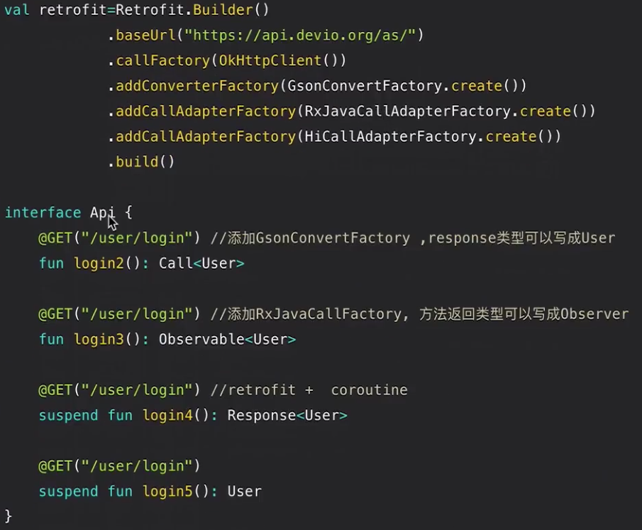
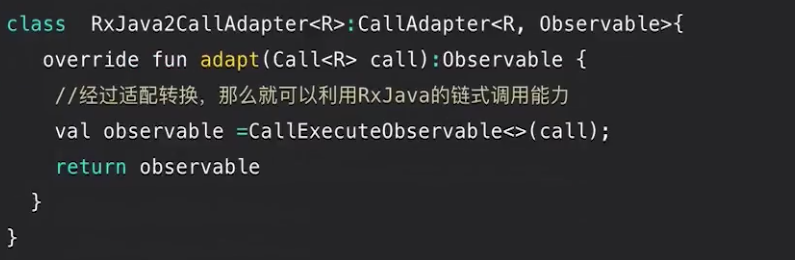
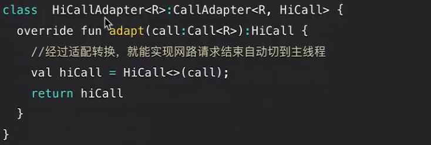
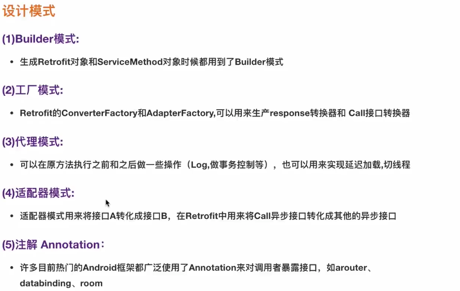
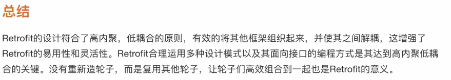

# Retrofit

## Retrofit概述

- Retrofit最初的样子

```kotlin
val retrofit = Retrofit.Builder()
  .baseUrl("http://api.devio.org/as/")
  .build();

interface Api{
  //默认情况下方法返回类型为Call<T>，response类型为ResponseBody
  @GET("/user/login")
  fun login():Call<ResponseBody>
}
```

- Retrofit的扩展玩法

  

- RxJavaCallAdapterFactory

  

- HiCallAdapterFactory

  

- HiCall

  ```kotlin
  class HiCall :Call<T>{
    
    private var delegate:Call<T>
    
    fun HiCall(delegate : Call<T>){
      this.delegate = delegate
    }
    
    override fun enqueue(callback: Callback<T>) {
      delegate.enqueue(response ->
      	mainHandler.post{
        	callback.onSuccess(response)
        }
      )
    }
  
    override fun execute(): Response<T> {
      //...
    }
  }
  ```

  




