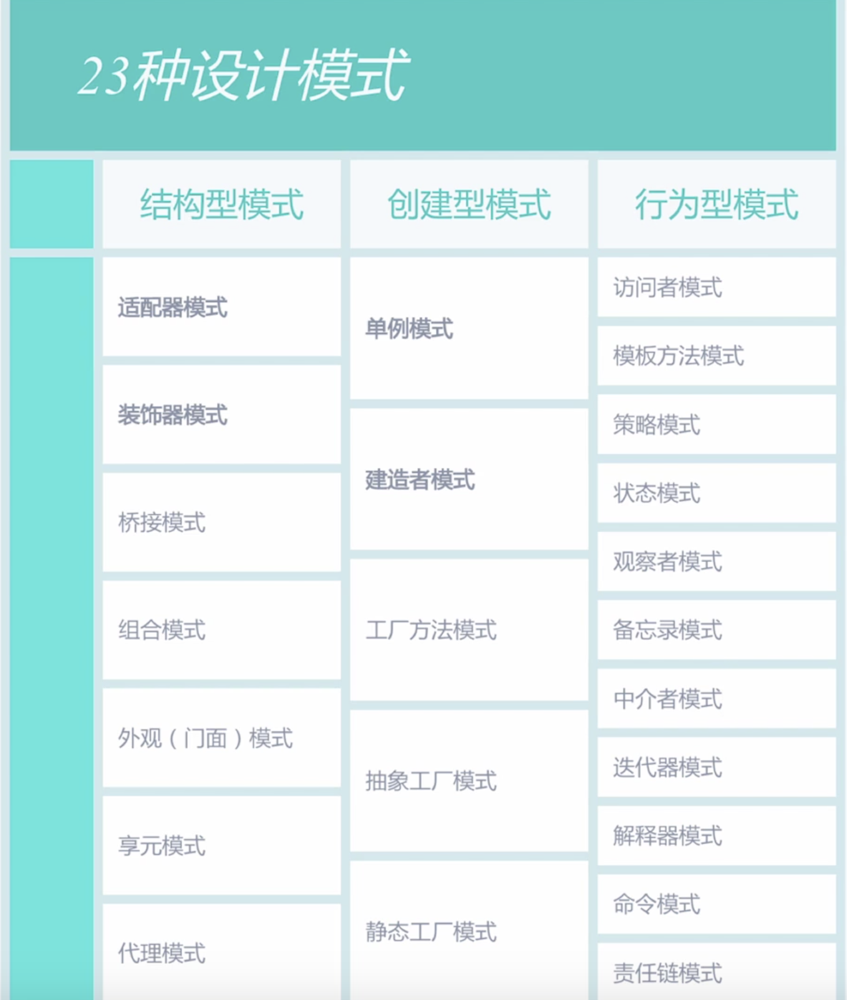
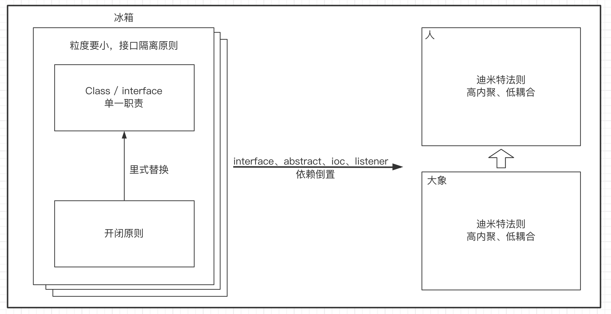

# 常用设计模式





# 单例模式

> 单例模式
>
> 优点：
>
>  * 1、由于单例模式在内存中只有一个实例，减少了内存的开支，特别是一个对象需要频繁地创建、销毁时，而且创建或者销毁时的性能又无法优化
>  * 2、单例模式减少对资源的多重占用
>  * 3、优化共享资源
>
> 缺点:
>
>  * 1、单例模式一般没有接口，扩展困难
>  * 2、单例对测试不利。在并行开发环境中，如果单例没有完成，是不能进行测试的

``` java
package com.example.lib_java.pattern;
import java.lang.reflect.Constructor;

/**
 * 饿汉模式
 *
 * @author wangshun
 */
class Singleton {
    //类的实例
    private static final Singleton singleton = new Singleton();

    //限制产生多个对象
    private Singleton() {
    }

    //通过该方法或的实例对象
    public static Singleton getSingleton() {
        return singleton;
    }

    //类中其他的方法
    public static void doSomething() {
    }
}


/**
 * 单例模式
 *
 * @author Administrator
 * 懒汉
 */
class Singleton1 {
    //类的实例
    private static Singleton1 singleton = null;

    //限制产生多个对象
    private Singleton1() {
    }

    //通过该方法或的实例对象
    public static synchronized Singleton1 getSingleton() {
        if (singleton == null) {
            singleton = new Singleton1();
        }
        return singleton;
    }
}

/**
 * 单例模式
 * 使用DCL双检查锁机制实现多线程环境下的延迟加载单例模式
 *
 * @author Administrator
 * 懒汉
 * <p>
 * 将instance = new Instance(); 拆分为3句话是：
 * 1、分配内存
 * 2、初始化
 * 3、将instance指向分配的内存空
 * <p>
 * volatile可以禁止指令重排序，确保先执行2，后执行3
 * 深入理解DCL(双检锁)的安全性 (https://www.cnblogs.com/redcreen/archive/2011/03/29/1998802.html)
 */
class Singleton2 {
    //volatile想要解决的问题是，在另一个线程中想要使用instance，发现instance!=null，但是实际上instance还未初始化完毕这个问题
    private volatile static Singleton2 instance;

    public static Singleton2 getInstance() {
        if (instance == null) {
            synchronized (Singleton2.class) {
                if (instance == null) {
                    instance = new Singleton2();
                }
            }
        }
        return instance;
    }
}

/**
 * 利用反射破坏单例模式
 * 通过反射得到的实例，只不过单例模式失去了应有的意义
 *
 * @author wangshun
 */
class Singleton22 {
    private static Singleton2 instance;

    public static Singleton2 getInstance() {
        if (instance == null) {
            synchronized (Singleton2.class) {
                if (instance == null) {
                    try {
                        Constructor<Singleton2> constructor = Singleton2.class.getDeclaredConstructor();
                        constructor.setAccessible(true);
                        instance = constructor.newInstance();
                    } catch (Exception e) {
                        e.printStackTrace();
                    }
                }
            }
        }
        return instance;
    }
}

/**
 * 枚举单例
 * 枚举单例模式的优点:
 * 1、线程安全   原因：从反编译后的类源码中可以看出也是通过类加载机制保证的反编译后的源码
 * 2、不会因为序列化而产生新实例  不会因为序列化而产生新实例原因：枚举类自己实现了readResolve（）方法，所以抗序列化，这个方法是当前类自己实现的（待验证）防止反射攻击
 * 3、防止反射攻击 由反编译类源码可知单例类的修饰是abstract的，所以没法实例化。
 * https://blog.csdn.net/Hey_M/article/details/88852666
 *
 * @author wangshun
 */
enum Singleton4 {
    INSTANCE {
        @Override
        protected void read() {
            System.out.println("read");
        }

        @Override
        protected void write() {
            System.out.println("write");
        }

    };

    protected abstract void read();

    protected abstract void write();
}

//预防反射攻击
//https://www.jianshu.com/p/dd238dc20e22

/**
 * 单例
 * volatile 双重校验
 */
class Singleton5 {
    private volatile static Singleton5 INSTANCE;

    private Singleton5() {
        //如果已存在，直接抛出异常，保证只会被new 一次
        if (INSTANCE != null) {
            throw new RuntimeException("对象已存在不可重复创建");
        }
    }

    public static Singleton5 getInstance() {

        if (INSTANCE == null) {
            //同步代码块
            synchronized (Singleton5.class) {
                if (INSTANCE == null) {
                    INSTANCE = new Singleton5();
                }
            }
        }
        return INSTANCE;
    }
}

/**
 * 使用静态内置类实现单例模式
 * 在多线程环境下是线程安全的，但是在遇到序列化对象的时候，使用默认方式运行得到的结果还是多例的。
 *
 * @author wangshun
 */
class Singleton6 {
    private static class MyObjectHandler {
        private static Singleton6 INSTANCE = new Singleton6();
    }

    private Singleton6() {
    }

    public static Singleton6 getInstance() {
        return MyObjectHandler.INSTANCE;
    }
}

/**
 * 使用static代码块实现单例模式
 *
 * @author wangshun
 */
class Singleton7 {
    private static Singleton7 INSTANCE = null;

    private Singleton7() {
    }

    static {
        INSTANCE = new Singleton7();
    }

    public static Singleton7 getInstance() {
        return INSTANCE;
    }
}

public class SingletonDemo {
    public static void main(String[] args) {
        //饿汉模式
        Singleton singleton = Singleton.getSingleton();

        //懒汉模式
        Singleton1 singleton1 = Singleton1.getSingleton();

        //懒汉模式
        Singleton2 singleton2 = Singleton2.getInstance();

        //反射破坏单例模式
        Singleton2 singleton22 = Singleton22.getInstance();
        System.out.println(singleton2.hashCode() + "-" + singleton22.hashCode()); //1829164700-2018699554

        //枚举单例
        Singleton4 singleton4 = Singleton4.INSTANCE;

        //静态内置类实现单例模式
        Singleton6 singleton6 = Singleton6.getInstance();

        final SingletonUtil<String> singletonStr = new SingletonUtil<String>() {
            @Override
            protected String create() {
                String str = "hello singleton";
                return str;
            }
        };
    }
}


```

## SingletonUtil

``` java
package com.example.lib_java.pattern;

public abstract class SingletonUtil<T> {
    private T mInstance;

    protected abstract T create();

    public final T get() {
        synchronized (this) {
            if (mInstance == null) {
                mInstance = create();
            }
            return mInstance;
        }
    }
}
```

# 工厂模式

> 工厂模式
>
> * 优点： 
>
>   * 1、良好的封装、代码结构清晰 
>
>     > 一个对象创建是有条件约束的，如一个调用者需要一个具体的产品对象，只要知道这个产品的类名（或约束字符串）就可以了，不用知道创建对象的艰辛过程，降低模块间的耦合。
>
>     
>
>   * 2、工厂方法模式的扩展非常优秀
>
>     > 在增加产品类的情况下，只要适当地修改具体的工厂类或扩展一个工厂类，就可以完成“拥抱变化”。
>
>     
>
>   * 3、屏蔽产品类，产品类如何变化，调用者都不用关心，它只需要关心产品的接口 
>
>     > 产品类的实现如何变化，调用者都不需要关心，它只需要关心产品的接口，只要接口保持不变，系统中的上层模块就不要发生变化。因为产品类的实例化工作是由工厂类负责的，一个产品对象具体由哪一个产品生成是由工厂类决定的。
>
>     
>
>   * 4、工厂方法模式是典型的解耦型框架
>
>     > 高层模块值需要知道产品的抽象类，其他的实现类都不用关心，符合迪米特法则，我不需要的就不要去交流；也符合依赖倒置原则，只依赖产品类的抽象；当然也符合里氏替换原则，使用产品子类替换产品父类，没问题！
>
>     
>
> * 简单工厂模式有如下缺点，而工厂方法模式可以解决这些问题：
>
>   > - 由于工厂类集中了所有实例的创建逻辑，这就直接导致一旦这个工厂出了问题，所有的客户端都会受到牵连。
>   > - 由于简单工厂模式的产品是基于一个共同的抽象类或者接口，这样一来，产品的种类增加的时候，即有不同的产品接口或者抽象类的时候，工厂类就需要判断何时创建何种接口的产品，这就和创建何种种类的产品相互混淆在了一起，违背了单一职责原则，导致系统丧失灵活性和可维护性。
>   > - 简单工厂模式违背了“开放-关闭原则”，因为当我们新增加一个产品的时候必须修改工厂类，相应的工厂类就需要重新编译一遍。
>   > - 简单工厂模式由于使用了静态工厂方法，造成工厂角色无法形成基于继承的等级结构。

``` java
/******************************************简单工厂模式******************************************/

//一个模块仅需要一个工厂类，没必要定义工厂类的共性设计抽象工厂类，直接使用工厂类的静态方法获取产品类的实例

// 抽象产品类
abstract class Product {
	public void method1() {
		// 业务逻辑处理
	}
}

// 具体产品类
class ConcreateProduct1 extends Product {
	public void method2() {
		// 业务逻辑处理
	}
}

class ConcreateProduct2 extends Product {
	public void method2() {
		// 业务逻辑处理
	}
}

// 具体工厂类
class Factory {
	public static <T extends Product> T createProduct(Class<T> c) {
		Product product = null;
		try {
			product = (Product) Class.forName(c.getName()).newInstance();
		} catch (Exception e) {
			// 异常处理
		}
		return (T) product;
	}
}

public class Main {
	// 场景类
	public static void main(String[] args) {
		ConcreateProduct1 product = Factory.createProduct(ConcreateProduct1.class);
		product.method1();
		product.method2();
		/*
		 * 继续业务逻辑
		 */
	}
}


/******************************************工厂模式******************************************/

// 抽象产品类
abstract class Product {
	public void method1() {
		// 业务逻辑处理
	}
}

// 具体产品类
class ConcreateProduct1 extends Product {
	public void method2() {
		// 业务逻辑处理
	}
}

class ConcreateProduct2 extends Product {
	public void method2() {
		// 业务逻辑处理
	}
}

// 抽象工厂类
abstract class Creator {
	/*
	 * 创建一个产品对象，其输入参数类型可以自行设置 通常为String、Enum、Class等，当然也可以为空
	 */
	public abstract <T extends Product> T createProduct(Class<T> c);
}

// 具体工厂类
class ConcreateCreator extends Creator {
	@Override
	public <T extends Product> T createProduct(Class<T> c) {
		Product product = null;
		try {
			product = (Product) Class.forName(c.getName()).newInstance();
		} catch (Exception e) {
			// 异常处理
		}
		return (T) product;
	}
}

public class Main {
	// 场景类
	public static void main(String[] args) {
		ConcreateCreator creator = new ConcreateCreator();
		ConcreateProduct1 product = (ConcreateProduct1) creator.createProduct(ConcreateProduct1.class);
		/*
		 * 继续业务逻辑
		 */
	}
}
```

# 抽象工厂模式

> 抽象工厂模式: 
>
> > 为创建一组相关或相互依赖的对象提供一个接口，而且无需指定它们的具体类。
>
> 优点：
>
>  * 	1、封装性
>  * 	2、产品族内的约束为非公开状态
>
> 缺点：
>
>  * 	抽象工厂模式最大的缺点就是产品族扩展非常困难（抽象工厂改变，工厂实现类也要改变）
>
> 使用场景：
>
>  * 	一个对象族（或是一组没有任何关系的对象）都有相同的约束，则可以使用抽象工厂模式。
>  * 抽象工厂提供一系列创建多个抽象产品的接口，而具体的工厂负责实现具体的产品实例。
>  * 抽象工厂模式与工厂方法模式最大的区别在于抽象工厂中每个工厂可以创建多个种类的产品。工厂方法模式中一种工厂只能创建一种具体产品，而在抽象工厂模式中一种具体工厂可以创建多个种类的具体产品。
> 
>Note:
> 
>- 抽象工厂模式优点
> 
>因为每个具体工厂类只负责创建产品，没有简单工厂中的逻辑判断，因此符合单一职责原则。
> 与简单工厂模式不同，抽象工厂并不使用静态工厂方法，可以形成基于继承的等级结构。
> 新增一个产品族（如上文类图中的MySQLUserDao，MySQLRoleDao，MySQLProductDao）时，只需要增加相应的具体产品和对应的具体工厂类即可。相比于简单工厂模式需要修改判断逻辑而言，抽象工厂模式更符合开-闭原则。
> 
>- 抽象工厂模式缺点
> 
>新增产品种类（如上文类图中的UserDao，RoleDao，ProductDao）时，需要修改工厂接口（或者抽象工厂）及所有具体工厂，此时不符合开-闭原则。抽象工厂模式对于新的产品族符合开-闭原则而对于新的产品种类不符合开-闭原则，这一特性也被称为开-闭原则的倾斜性。

``` java
// 抽象产品类A
abstract class AbstractProductA {
	public void shareMethod() {
     
	}
	public abstract void doSomething();
}

// 抽象产品类B
abstract class AbstractProductB {
	public void shareMethod() {

	}

	public abstract void doSomething();
}

// 产品A1的实现类
class ProductA1 extends AbstractProductA {
	@Override
	public void doSomething() {
		System.out.println("产品A1 的实现方法");
	}
}

// 产品A2的实现类
class ProductA2 extends AbstractProductA {
	@Override
	public void doSomething() {
		System.out.println("产品A2 的实现方法");
	}
}

// 产品B1的实现类
class ProductB1 extends AbstractProductB {
	@Override
	public void doSomething() {
		System.out.println("产品B1 的实现方法");
	}
}

// 产品B2的实现类
class ProductB2 extends AbstractProductB {
	@Override
	public void doSomething() {
		System.out.println("产品B2 的实现方法");
	}
}

// 抽象工厂类（有N个产品族就应该有N个创建方法）
abstract class AbstractCreator {
	// 创建A产品家族
	public abstract AbstractProductA createProductA();

	// 创建B产品家族
	public abstract AbstractProductB createProductB();
}

// 产品等级1 的实现类
class Creator1 extends AbstractCreator {
	@Override
	public AbstractProductA createProductA() {
		return new ProductA1();
	}

	@Override
	public AbstractProductB createProductB() {
		return new ProductB1();
	}
}

// 产品等级2 的实现类
class Creator2 extends AbstractCreator {
	@Override
	public AbstractProductA createProductA() {
		return new ProductA2();
	}

	@Override
	public AbstractProductB createProductB() {
		return new ProductB2();
	}
}

public class Main {
	public static void main(String[] args) {
		// 定义两个工厂
		AbstractCreator creator1 = new Creator1();
		AbstractCreator creator2 = new Creator2();
		// 产生A1对象
		AbstractProductA a1 = creator1.createPaoductA();
		// 产生A2对象
		AbstractProductA a2 = creator2.createPaoductA();
		// 产生B1对象
		AbstractProductB b1 = creator1.createPaoductB();
		// 产生B2对象
		AbstractProductB b2 = creator2.createPaoductB();
		/*
		 * 业务逻辑。。。
		 */

	}
}
```

# 门面模式

> 门面模式注重统一的对象，也就是提供一个访问子系统的接口，除了这个接口不允许有任何访问子系统的行为。
>
> 优点：
>
> - 减少系统的相互依赖
> - 提高了灵活性
> - 提高了安全性
>
> 缺点：
>
> - 不符合开闭原则，修改门面角色的风险较大。
>
> 使用场景：
>
> - 为一个复杂模块或子系统提供一个供外界访问的接口
> - 子系统相对独立
> - 预防低水平人员带来的风险扩散
>
> 门面对象不应参与业务逻辑，门面角色应该是稳定的，一个系统一旦投入运行就不应该被改变。一个子系统比较复杂时，就可以封装出一个或者多个门面来，项目结构简单扩展性好。

```java
package com.example.lib_java.pattern;

class SubSystemA {
    public void doSomethingA() {
        //业务逻辑
    }
}

class SubSystemB {
    public void doSomethingB() {
        //业务逻辑
    }
}

//此封装类处理复杂的业务逻辑
class Context {
    //被委托的对象
    private SubSystemA subSystemA = new SubSystemA();
    private SubSystemB subSystemB = new SubSystemB();

    //复杂的计算
    public void complexMethod() {
        this.subSystemB.doSomethingB();
        this.subSystemA.doSomethingA();
    }
}

class Facade {
    //被委托的对象
    private SubSystemA subSystemA = new SubSystemA();
    private SubSystemB subSystemB = new SubSystemB();
    private Context context = new Context();

    //提供给外部访问的方法
    public void methodA() {
        this.subSystemA.doSomethingA();
    }

    //提供给外部访问的方法
    public void methodB() {
        this.subSystemB.doSomethingB();
    }

  	//门面对象不应参与业务逻辑，只是提供一个访问子系统的一个路径
    public void methodC() {
        context.complexMethod();
    }
}

public class FacadeDemo {
    public static void main(String[] args) {
        Facade facade = new Facade();
        facade.methodA();
        facade.methodC();
    }
}
```

# 桥梁模式

>桥梁模式：
>
>优点：
>
>- 抽象和实现分离
>- 优秀的扩充能力
>- 实现细节对客户透明
>
>使用场景：
>
>- 不希望或不适用使用继承的场景
>- 接口或抽象类不稳定的场景
>- 重用性要求较高的场景
>
>设计的颗粒度越细，则被重用的可能性越大，而采用继承则受父类限制，不可能出现太细的颗粒度。桥梁模式主要考虑如何拆分抽象和实现，最终的意图还是对变化的封装，尽可能把变化的因素封装到最细、最小的逻辑单元中，避免风险扩散。

```java
package com.example.lib_java.pattern;

//实现化角色，定义角色必须的行为或者属性。
interface Implementor {
    public void doSomething();

    public void doAnything();
}

class ConcreteImplementor1 implements Implementor {

    @Override
    public void doSomething() {
        //业务逻辑处理
    }

    @Override
    public void doAnything() {
        //业务逻辑处理
    }
}

//抽象化角色，它的主要职责是定义出该角色的行为，同时保存一个对实现化角色的引用，该角色一般为抽象类。
abstract class Abstraction {
    private Implementor imp;

    public Abstraction(Implementor _imp) {
        this.imp = _imp;
    }

    //自身的行为和属性
    public void request() {

    }

    public Implementor getImp() {
        return imp;
    }
}

class RefineAbstraction extends Abstraction {

    public RefineAbstraction(Implementor _imp) {
        super(_imp);
    }

    @Override
    public void request() {
        //业务逻辑处理
        super.request();
        super.getImp().doAnything();
        System.out.println("hello");
    }
}

public class BridgePatternDemo {
    public static void main(String[] args) {
        Implementor1 implementor1 = new ConcreteImplementor1();
        RefineAbstraction refineAbstraction = new RefineAbstraction(implementor1);
        refineAbstraction.request();
    }
}
```

# 享元模式

> 享元模式：享元模式是池技术的重要实现方式。使用共享对象可有效支持大量的细粒度的对象。

```java
package com.example.lib_java.pattern.flyweight;
import java.util.HashMap;

abstract class Flyweight {
    //内部状态--内部状态是对象可共享出来的信息，存储在享元对象内部并且不会随环境改变而改变，如我们例子中的id、postAddress等，
  	//它们可以作为一个对象的动态附加信息，不必直接储存在具体某个对象中，属于可以共享的部分。
    private String intrinsic;􏴨􏴥􏲣􏱎􏱏􏴯􏱔􏰢􏲂􏱡􏲢􏰁􏰎􏰏􏰐􏴲􏴳􏴴􏴵􏰎􏰏􏰐􏱦
􏴨􏴥􏲣􏱎􏱏􏴯􏱔􏰢􏲂􏱡􏴨􏴥􏲣􏱎􏱏􏴯􏱔􏰢􏲂􏱡
    //外部状态--外部状态是对象得以依赖的一个标记，是随环境改变而改变的、不可以共享的状态，
    // 如 我们例子中的考试科目+考试地点复合字符串，它是一批对象的统一标识，是唯一的一个索引值。
    //在抽象享元中对外部状态加上了final关键字,防止获得了一个外部状态，然后无意修改了一下
    protected final String Extrinsic; //要求享元角色必须接受外部状态

    public Flyweight(String _Extrinsic) {
        this.Extrinsic = _Extrinsic;
    }

    //定义业务操作
    public abstract void operate(); //内部状态的getter/setter

    public String getIntrinsic() {
        return intrinsic;
    }

    public void setIntrinsic(String intrinsic) {
        this.intrinsic = intrinsic;
    }
}

class ConcreteFlyweight1 extends Flyweight {
    //接受外部状态
    public ConcreteFlyweight1(String _Extrinsic) {
        super(_Extrinsic);
    }

    //根据外部状态进行逻辑处理
    public void operate() {
        //业务逻辑
    }
}

 class FlyweightFactory { //定义一个池容器
    private static HashMap<String, Flyweight> pool = new HashMap<String, Flyweight>();

    //享元工厂
    public static Flyweight getFlyweight(String Extrinsic) {
        //需要返回的对象
        Flyweight flyweight = null;

        //在池中没有该对象
        if (pool.containsKey(Extrinsic)) {
            flyweight = pool.get(Extrinsic);
        } else {
            //根据外部状态创建享元对象
            flyweight = new ConcreteFlyweight1(Extrinsic); //放置到池中
            pool.put(Extrinsic, flyweight);
        }
        return flyweight;
    }
}

public class FlyweightDemo {
    public static void main(String[] args) {
        FlyweightFactory.getFlyweight("Extrinsic1").setIntrinsic("Intrinsic1");
        FlyweightFactory.getFlyweight("Extrinsic2").setIntrinsic("Intrinsic2");
        FlyweightFactory.getFlyweight("Extrinsic3").setIntrinsic("Intrinsic3");

        Flyweight extrinsic1 = FlyweightFactory.getFlyweight("Extrinsic1");
        System.out.println(extrinsic1.getIntrinsic());
    }
}

```

# 代理者模式

> 动态代理
>
> *	动态代理的主要意图就是解决审计问题，也就是横切面编程，在不改变我们已有代码结构的情况下增强或控制对象的行为。
>  * 	动态代理实现代理的职责，业务逻辑Subject实现相关的逻辑功能，两者之间没有必然的相互耦合关系。
>  * 	通知从另一个切面切入，最终在高层模块也就是Client进行耦合 完成逻辑封装任务。
>  * 	要实现动态代理的首要条件就是：被代理者必须实现一个接口。

``` java
import java.lang.reflect.InvocationHandler;
import java.lang.reflect.Method;
import java.lang.reflect.Proxy;

// 抽象主题
interface Subject {
	public void doSomething(String str);
}

// 真实主题
class RealSubject implements Subject {

	@Override
	public void doSomething(String str) {
		System.out.println("do something!---->" + str);
	}

}


/*********************************通知的实现 start************************************/
interface IAdvice{
	public void exec();
}

class BeforeAdvice implements IAdvice{

	@Override
	public void exec() {
		System.out.println("我是前置通知！");
	}
}
/*********************************通知的实现 end************************************/

//动态代理的Handler类
class MyInvocationHandler implements InvocationHandler {
	private Object target = null;

	public MyInvocationHandler(Object _obj) {
		this.target = _obj;
	}

	//接管所有方法的实现
	@Override
	public Object invoke(Object proxy, Method method, Object[] args) throws Throwable {
		return method.invoke(this.target, args);
	}
}


// 动态代理类
class DynamicProxy<T> {
	public static <T> T newProxyInstance(Subject subject) {
		ClassLoader loader=subject.getClass().getClassLoader();
		Class<?>[] interfaces=subject.getClass().getInterfaces(); 
		InvocationHandler handler=new MyInvocationHandler(subject);
		
		//寻找JoinPoint连接点，AOP框架使用元数据定义
		if (true) {
			//执行一个前置通知
			(new BeforeAdvice()).exec();
		}
		
		//重新生成一个对象
		return (T) Proxy.newProxyInstance(loader, interfaces, handler);
	}
}

public class Main {
	public static void main(String[] args) {
		// 定一个主题
		Subject subject = new RealSubject();
		
		// 定义主题代理，使用自己封装的动态代理者
		Subject proxy = DynamicProxy.newProxyInstance(subject);
		
		// 代理的行为 
		proxy.doSomething("finish!");
		
		//使用原生的动态代理者
		Subject proxy1=(Subject) Proxy.newProxyInstance(
				subject.getClass().getClassLoader()
				, subject.getClass().getInterfaces()
				, new MyInvocationHandler(subject));
		
		proxy1.doSomething("doSomething!");
	}

}
```

# 观察者模式

>观察者模式
>
>观察者模式的优点：
>
> * 	观察者和被观察者之间是抽象耦合
> * 	建立一套触发机制（形成了一个触发链，观察者模式可以完美地实现这里的链条形式。）
>
>观察者模式的缺点：
>
> *	观察者模式需要考虑一下开发效率和运行效率问题，一个被观察者，多个观察者，开发和调试就会比较复杂，而且在Java中消息的通知默认是顺序执行，一个观察者卡壳，会影响整体的执行效率。在这种情况下，一般考虑采用异步的方式。
>
>观察者模式的使用场景：
>
> * 关联行为场景。需要注意的是，关联行为是可拆分的，而不是“组合”关系。
> * 事件多级触发场景。
> * 跨系统的消息交换场景，如消息队列的处理机制。
>
>观察者模式的注意事项：
>
> * 广播链的问题
>
>     > 它和责任链模式的最大区别就是观察者广播链在传播的过程中消息是随时更改的，它是由相邻的两个节点协商的消息结构；而责任链模式在消息传递过程中基本上保持消息不可变，如果要改变，也只是在原有的消息上进行修正。
>
>     
>
> * 异步处理问题
>
>     > 被观察者发生动作了，观察者要做出回应，如果观察者比较多，而且处理时间比较长怎么办？那就用异步呗，异步处理就要考虑线程安全和队列的问题，这个大家有时间看看Message Queue，就会有更深的了解。

``` java
import java.util.Vector;
//被观察者
abstract class Subject {
	// 定义一个观察者数组
	private Vector<Observer> obsVector = new Vector<Observer>();

	// 增加一个观察者
	public void addObserver(Observer o) {
		this.obsVector.add(o);
	}

	// 删除一个观察者
	public void delObserver(Observer o) {
		this.obsVector.remove(o);
	}

	// 通知所有观察者
	public void notifyObservers(String message) {
		for (Observer o : this.obsVector) {
			o.update(message);
		}
	}
}

// 具体被观察者
class ConcreteSubject extends Subject {
	// 具体的业务
	public void doSomething(String doSomething) {
		/*
		 * do something
		 */
		super.notifyObservers(doSomething);
	}
}

// 观察者
interface Observer {
	// 更新方法
	public void update(String message);
}

// 具体观察者
class ConcreteObserver implements Observer {
	// 实现更新方法
	public void update(String message) {
		System.out.println("接收到信息: "+ message);
	}
}

// 场景类
public class Main2 {
	public static void main(String[] args) {
		// 创建一个被观察者
		ConcreteSubject subject = new ConcreteSubject();
		// 定义一个观察者
		Observer obs = new ConcreteObserver();
		// 观察者观察被观察者
		subject.addObserver(obs);
		// 观察者开始活动了
		subject.doSomething("今晚老地方见！");
	}
}
```

# 观察者模式（Java自带实现类）

``` java
import java.util.Observable;
import java.util.Observer;

// 被观察者
interface Subject {
	public void doSomething(String doSomething);
}

// 具体被观察者
class ConcreteSubject extends Observable implements Subject {
	// 具体的业务
	@Override
	public void doSomething(String doSomething) {
		/*
		 * doSomething...
		 */
		super.setChanged();
		super.notifyObservers("观察者报告： "+doSomething);
	}
}

// 具体观察者
class ConcreteObserver implements Observer {
	@Override
	public void update(Observable observable, Object msg) {
		System.out.println("观察到的信息：" + msg.toString());
	}
}

// 场景类
public class Main2 {
	public static void main(String[] args) {
		// 创建一个被观察者
		ConcreteSubject subject = new ConcreteSubject();
		// 定义一个观察者
		Observer obs = new ConcreteObserver();
		// 观察者观察被观察者
		subject.addObserver(obs);
		// 观察者开始活动了
		subject.doSomething("今晚老地方见！");
	}
}
```

# 监听者模式

``` java
// 执行者接口
interface Subject {
    	public String doSomething(int state);
}

class ConcreteSubject{
    	private Subject subject;

    	public void setSubject(Subject subject) {
				this.subject = subject;
			}
	
			public void doSomethingToo(){
				//点击事件
				String doSomething = subject.doSomething(1);
				System.out.println(doSomething);
			}
}

// 场景类
public class Main2 {
	public static void main(String[] args) {
		ConcreteSubject subject = new ConcreteSubject();
		
		//监听事件
		subject.setSubject(new Subject() {
			@Override
			public String doSomething(int state) {
				/*
				 * doSomething
				 */
				String result="";
				switch (state) {
				case 1:
					System.out.println("状态一：");
					result="doThing1";
					break;
				case 2:
					System.out.println("状态二：");
					result="doThing2";
					break;
				default:
					break;
				}
				return result;
			}
		});
		
		subject.doSomethingToo();
	}
}
```

# 建造者模式

## 源码示例

androidx.appcompat.app.AlertDialog的实现可以视为建造者模式的具体应用。调用方式如下：

``` java
builder = new AlertDialog.Builder(this).setIcon(R.mipmap.ic_launcher).setTitle("最普通dialog")
                .setMessage("我是最简单的dialog").setPositiveButton("确定（积极）", new DialogInterface.OnClickListener() {
                    @Override
                    public void onClick(DialogInterface dialogInterface, int i) {
                        Toast.makeText(MainActivity.this, "确定按钮", Toast.LENGTH_LONG).show();
                    }
                }).setNegativeButton("取消（消极）", new DialogInterface.OnClickListener() {
                    @Override
                    public void onClick(DialogInterface dialogInterface, int i) {
                        Toast.makeText(MainActivity.this, "关闭按钮", Toast.LENGTH_LONG).show();
                        dialogInterface.dismiss();
                    }
                });
builder.create().show();
```

> 调用示例：new AlertDialog.Builder(this).setIcon(...).setXXX().create().show();

``` java
public class AlertDialog extends AppCompatDialog implements DialogInterface {
  //...
	public static class Builder {
    		//...
        public Builder(@NonNull Context context) {
            this(context, resolveDialogTheme(context, 0));
        }
    		
    		public Builder setXXX(final ListAdapter adapter, final OnClickListener listener) {
            //...
            return this;
        }
    
    		public AlertDialog create() {
            final AlertDialog dialog = new AlertDialog(param1, param2);
            //...
            return dialog;
        }
  }
  
  public void show() {
       //...   
  }
}
```


## 基本使用

> 建造者模式：
>
> 优点：
> *	1、封装性
>  *	2、建造者独立，容易扩展
>  *	3、便于控制细节风险
>
> 适用场景：
> *	1、相同方法，不同的执行顺序，产生不同的事件结果时
> *	2、多个部件或者零件，都可以转配到一个对象中，但是生产出来的运行结果又不相同时
> *	3、产品非常复杂，或者产品类中的调用顺序不同产生了不同的效能
> *	4、在对象创建过程中会使用到系统中的一些其他对象，这些对象在产品对象的创建过程中不易得时
>
> 注意事项：
>
> * 建造者模式关注的是零件类型和装配工艺（顺序），这是它与工厂模式最大不同的地方


``` java
import java.util.ArrayList;
// 模型汽车抽象类
abstract class CarModel {
	private ArrayList<String> sequence = new ArrayList<String>();

	protected abstract void start();

	protected abstract void stop();

	protected abstract void alarm();

	protected abstract void engineBoom();

	// 不可继承、覆盖的方法
	final public void run() {
		for (int i = 0; i < this.sequence.size(); i++) {
			String actionName = this.sequence.get(i);
			if (actionName.equalsIgnoreCase("start")) {
				this.start();
			} else if (actionName.equalsIgnoreCase("stop")) {
				this.stop();
			} else if (actionName.equalsIgnoreCase("alarm")) {
				this.alarm();
			} else if (actionName.equalsIgnoreCase("engine boom")) {
				this.engineBoom();
			}
		}
	}

	final public void setSequence(ArrayList<String> sequence) {
		this.sequence = sequence;
	}
}

// 奔驰模型代码
class BenzModel extends CarModel {

	@Override
	protected void start() {
		System.out.println("Benz srart");
	}

	@Override
	protected void stop() {
		System.out.println("Benz stop");
	}

	@Override
	protected void alarm() {
		System.out.println("benz alarm");
	}

	@Override
	protected void engineBoom() {
		System.out.println("benz engineBoom");
	}

}

// 抽象汽车组装者
abstract class CarBuilder {
	public abstract void setSequence(ArrayList<String> sequence);

	public abstract CarModel getCarModel();
}

// 奔驰车组装者
class BenzBuilder extends CarBuilder {

	private BenzModel benz = new BenzModel();

	@Override
	public void setSequence(ArrayList<String> sequence) {
		this.benz.setSequence(sequence);
	}

	@Override
	public CarModel getCarModel() {
		return this.benz;
	}
}

// 导演类
class Director {
	private ArrayList<String> sequence = new ArrayList<String>();
	private BenzBuilder benzBuilder = new BenzBuilder();

	/*
	 * A 类型的奔驰车模型，先start，然后在stop
	 */
	public BenzModel getABenzModel() {
		this.sequence.clear();
		this.sequence.add("start");
		this.sequence.add("stop");
		this.benzBuilder.setSequence(sequence);
		return (BenzModel) this.benzBuilder.getCarModel();
	}

	/*
	 * 其他类型的车辆。。。
	 */

}

public class Main {
	// 场景类
	public static void main(String[] args) {
		Director director = new Director();
		// 造一百辆A类型奔驰车
		for (int i = 0; i < 100; i++) {
			director.getABenzModel().run();
		}
	}
}
```

# 模板模式

> 模板模式：
>
> 优点：
>
>  * 	1、封装不变部分，扩展可变部分
>  * 	2、提取公共部分，便于维护
>  * 	3、行为由父类控制，子类实现
>
> 缺点：
>
>  * 	一般设计习惯，抽象类负责声明最抽象、最一般的事物的属性和方法，实现类完成具体的事物属性和方法。但是模板模式却颠倒了过来，抽象类定义了部分抽象方法由子类来实现，子类执行的结果影响了父类的结果，也就是子类对父类产生了影响，这在复杂的项目中，会带来代码阅读难度。
>
> 适用场景：
>
>  * 	1、多个子类有公用的方法，并且逻辑基本相同时
>  * 	2、重要，复杂的算法，可以把核心算法设计为模板模式，周边的相关细节功能则由各个子类实现
>  * 	3、重构时，模板模式是一个经常使用的模式，把相同的代码抽取到父类中，然后通过钩子函数约束其行为
>
> > Note: 抽象模板中的方法尽量设计为protected类型，符合迪米特法则，不需要暴露的属性或者方法尽量不要设置为protected类型。实现类若非必要，尽量不要扩大父类中的访问权限。

``` java
abstract class AbstractClass {
	/*
	 * 一般方法
	 */
	protected abstract void doSomething();

	/*
	 * 一般方法
	 */
	protected abstract void doAnything();

	/*
	 * 钩子方法
	 * 默认返回 true
	 */
	protected boolean isDoAnything() {
		return true;
	}

	/*
	 * 模板方法
	 * 为了防止恶意的操作，一般模板的方法都加上final关键字，不允许被覆写
	 */
	final public void templateMethod() {
		/*
		 * 调用基本方法，完成相关逻辑
		 */
		this.doSomething();

		if (this.isDoAnything()) {
			this.doAnything();
		}
	}
}

class ConcreateClass1 extends AbstractClass {
	
	private boolean doAnything = false;

	@Override
	protected void doSomething() {
		System.out.println("ConcreateClass1 doSomething");
	}

	@Override
	protected void doAnything() {
		System.out.println("ConcreateClass1 doAnything");
	}

	@Override
	protected boolean isDoAnything() {
		return this.doAnything;
	}

	/*
	 * 子类的方法影响父类方法的执行
	 */
	public void setDoAnything(boolean isDoAngthing) {
		this.doAnything = isDoAngthing;
	}
}

class ConcreateClass2 extends AbstractClass {

	@Override
	protected void doSomething() {
		System.out.println("ConcreateClass2 doSomething");
	}

	@Override
	protected void doAnything() {
		System.out.println("ConcreateClass2 doAnything");
	}

	@Override
	protected boolean isDoAnything() {
		return false;
	}
}

public class Main {
	public static void main(String[] args) {
		AbstractClass class1 = new ConcreateClass1();
		AbstractClass class2 = new ConcreateClass2();

		class1.setDoAnything(true);

		class1.templateMethod();
		class2.templateMethod();
	}
}


output :
ConcreateClass1 doSomething
ConcreateClass1 doAnything
ConcreateClass2 doSomething
```

# 适配器模式

> 适配器模式
>
> 优点：
>  *	适配器模式可以让两个没有任何关系的类在一起运行，只要适配器这个角色能够搞定他们就行
>  *	增加了类的透明性
>  *	提高了类的复用度
>  *	灵活性非常好
>
> 使用场景：
>
>  *	你有动机修改一个已经投产中的接口时，适配器模式可能是最适合你的模式。比如：系统扩展了，需要使用一个
>  *	已有的或者新建立的类，但是这个类又不符合系统的接口，使用适配器模式。
>
> 注意事项：
>
>  *	适配器模式最好的详细设计阶段不要考虑他，他不是为了解决还处在开发阶段的问题，而是解决正在服役的项目问题，没有一个系统分析师会在详细设计的时候考虑
>  *	使用适配器模式，这个模式主要使用场景是扩展应用中。系统扩展了，不符合原有的设计的时候才考虑通过适配器模式减少代码的修改带来的风险。
>
> 最佳实践：
>
>  *	适配器模式是一个补偿模式，或者说是一个‘补救’模式，通常用来解决接口不相容的问题，在百分之百的完美设计中不可能使用的到。

``` java
// 目标角色
interface Target {
	// 目标角色有自己的方法
	public void request();
}

// 目标角色的实现类
class ConcreateTarget implements Target {
	@Override
	public void request() {
		System.out.println("if you need any help, pls call me!");
	}
}

// 源角色
class Adaptee {
	// 原有的业务逻辑
	public void doSomething() {
		System.out.println("I am kind of busy , leave me alone ,pls!");
	}
}

// 适配器角色
class Adapter extends Adaptee implements Target {
	@Override
	public void request() {
		super.doSomething();
	}
}

public class Main {
	public static void main(String[] args) {
		// 原有的业务逻辑
		Target target = new ConcreateTarget();
		target.request();
		// 增加了适配器角色的业务逻辑
		Adapter target2 = new Adapter();
		target2.request();
	}
}
```

# 原型模式

>原型模式：
>
>> 用原型实例指定创建对象的种类，并且通过拷贝这些原型创建新的对象。
>
>优点：
>
> * 性能优良
>
>     > 原型模式是在内存二进制流的拷贝，要比直接new一个对象性能好很多，特别是要在一个循环体内产生大量的对象时，原型模式可以更好地体现其优点。
>
>     
>
> * 逃避构造函数的约束
>
>     > 这既是它的优点也是缺点，直接在内存中拷贝，构造函数是不会执行的
>
>     
>
>使用场景：
>
> * 资源优化场景
>
>     > 类初始化需要消化非常多的资源，这个资源包括数据、硬件资源等。
>
>     
>
> * 性能和安全要求的场景
>
>     > 通过new产生一个对象需要非常繁琐的数据准备或访问权限，则可以使用原型模式。
>
>     
>
> * 一个对象多个修改者的场景
>
>     > 一个对象需要提供给其他对象访问，而且各个调用者可能都需要修改其值时，可以考虑使用原型模式拷贝多个对象供调用者使用。
>
>     
>
>     NOTE：
>            
>     - 在实际项目中，原型模式很少单独出现，一般是和工厂方法模式一起出现，通过clone的方法创建一个对象，然后由工厂方法提供给调用者。
>     - 一个实现了Cloneable并重写了clone方法的类A，有一个无参构造或有参构造B，通过new关键字产生了一个对象S，再然后通过S.clone()方式产生了一个新的对象T，那么在对象拷贝时构造函数B是不会被执行的。Object类的clone方法的原理是从内存中（具体地说就是堆内存）以二进制流的方式进行拷贝，重新分配一个内存块，那构造函数没有被执行也是非常正常的了。

``` java
class PrototypeClass implements Cloneable {
	public void method(){
		System.out.println("原型模式的方法");
	}
	
	// 覆写父类Object方法
	@Override
	public PrototypeClass clone() {
		PrototypeClass prototypeClass = null;
		try {
			prototypeClass = (PrototypeClass) super.clone();
		} catch (CloneNotSupportedException e) {
			// 异常处理
		}
		return prototypeClass;
	}
}

public class Main {
	public static void main(String[] args) {
		PrototypeClass prototypeClass = new PrototypeClass();
		PrototypeClass cloneClass = prototypeClass.clone();
		cloneClass.method();
	}
}
```

# 责任链模式

> 责任链模式：
>
> > 使多个对象都有机会处理请求，从而避免了请求的发送者和接受者之间的耦合关系。将这些对象连成一条链，并沿着这条链传递该请求，  直到有对象处理它为止。
>
> 重点：
>
> > 重点是在“链”上，有一条链去处理相似的请求在链中决定谁去处理这个请求，并返回相应的结果。链是由多个处理者组成的。
>
> 抽象的处理者必须实现三个职责：
>
>  *          定义一个请求的处理方法HandlerMessage，唯一对外开放的方法；
>  *          定义一个链的编排方法setNext，设置下一个处理者；
> *          定义了具体的请求者必须实现的两个方法：定义自己能够处理的级别getHandlerLevel和具体的处理任务。
>
> 优点：
>
> *      将请求和处理分开。请求者不用知道谁处理的，处理者可以不用知道请求的全貌，两者解耦，提高系统的灵活性。
>
> 缺点：
>
>  *      性能问题，每个请求都是从链头遍历到链尾，特别是在链比较长的时候，性能是一个非常大的问题
>  *      调试不很方便，特别是链条比较长，环节比较多的时候，由于采用类似递归的方式，调试的时候逻辑可能比较复杂。
>
> 注意：
>
>  *      链中节点数量需要控制，避免出现超长链的情况，一般做法是在Handler中设置一个最大节点数量，在setNext方法中判断是否已经是
>  *      超过其阈值，或者则不允许该链建立，避免无意识地破坏系统性能。

``` java
import java.util.ArrayList;
import java.util.Random;

abstract class Handler{
    public final static int FALTHER_LEVEL_REQUEST=1;
    public final static int HUSBAND_LEVEL_REQUEST=2;
    public final static int SON_LEVEL_REQUEST=3;

    //能处理的级别
    private int level=0;
    //责任传递，下一个责任人是谁
    private Handler nextHandler;
    //每个类都要说明一下自己能够处理的请求级别
    public Handler(int _level){
           this.level=_level;
    }
    
    //请求处理
    public final void HandleMessage(IWomen women){
        if (women.getType()==this.level){
            this.response(women);
        }else{
            if (this.nextHandler!=null){
                this.nextHandler.HandleMessage(women);
            }else{
                System.out.println("---没地方请示了，按不同意处理---\n");
            }
        }
    }
    //如果处理不了，设置下一个可能处理的对象
    public void setNext(Handler _handler){
        this.nextHandler=_handler;
    }

    //对请求的回应
    protected abstract void response(IWomen women);
}

class Father extends Handler{
    public Father(){
        super(Handler.FALTHER_LEVEL_REQUEST);
    }

    @Override
    protected void response(IWomen women) {
        System.out.println("---女儿向父亲请示---");
        System.out.println(women.getRequest());
        System.out.println("父亲的答复是：同意\n");
    }
}

class Husband extends Handler{
    public Husband(){
        super(Handler.HUSBAND_LEVEL_REQUEST);
    }

    @Override
    protected void response(IWomen women) {
        System.out.println("---妻子向丈夫请示---");
        System.out.println(women.getRequest());
        System.out.println("丈夫的答复是：同意\n");
    }
}

class Son extends Handler{
    public Son(){
        super(Handler.SON_LEVEL_REQUEST);
    }

    @Override
    protected void response(IWomen women) {
        System.out.println("---母亲向儿子请示---");
        System.out.println(women.getRequest());
        System.out.println("儿子的答复是：同意\n");
    }
}

//请求类的接口
interface IWomen{
    public int getType();
    public String getRequest();
}

//请求类的实现类
class Women implements IWomen{
    //设置请求的类型
    private int type=0;
    //请求的内容
    private String request="";
    //通过构造函数传递请求
    public Women(int _type,String _request){
        this.type=_type;
        switch (this.type){
            case 1:
                this.request="女儿的请求是："+_request;
                break;
            case 2:
                this.request="妻子的请求是："+_request;
                break;
            case 3:
                this.request="母亲的请求是："+_request;
                break;
        }
    }

    //获得状况
    @Override
    public int getType() {
        return this.type;
    }

    //获得请求
    @Override
    public String getRequest() {
        return this.request;
    }
}
//场景类
public class ZRLPattern {
    public static void main(String[] args) {
        //模拟随机请求
     Random random = new Random();
        ArrayList<IWomen> list = new ArrayList<>();
        for (int i = 0; i < 5; i++) {
            list.add(new Women(random.nextInt(4),"我要出去逛街"));
        }
        
     //定义三个请求对象
     Father father = new Father();
     Husband husband = new Husband();
     Son son = new Son();
     
     //设置请求顺序
     father.setNext(husband);
     husband.setNext(son);
        
     for (IWomen women : list) {
         father.HandleMessage(women);
     }

    }
}
```

# 装饰者模式

>装饰者模式： 
>
>优点： 
>
>- 装饰类和被装饰类可以独立发展，而不会互相耦合。 
>- 装饰模式是继承关系的一个替代方案装饰模式可以动态地扩展一个实现类的功能 
>
>缺点：
>
>-  对于装饰者模式多层的装饰是比较复杂的 
>
>使用场景： 
>
>- 需要扩展一个类的功能，或者给一个类增加附加的功能 
>- 需要动态地给一个对象增加功能，这些功能可以再动态地撤销
>- 需要为一批兄弟类进行改装或加装功能，当然是首选装饰者模式

``` java
// 抽象构件
abstract class Component {
	// 抽象方法
	public abstract void operate();
}

// 具体构件
class ConcreateComponent extends Component {
	// 具体实现
	@Override
	public void operate() {
		System.out.println("do something");
	}
}

// 抽象装饰者
abstract class Decorator extends Component {
	private Component component = null;

	// 通过构造函数传递被修饰者
	public Decorator(Component _component) {
		this.component = _component;
	}

	// 委托给被修饰者执行
	@Override
	public void operate() {
		this.component.operate();
	}
}

/**
 * 具体的装饰类1 原始的方法和装饰方法的执行顺序在具体的装饰类是固定的，可以通过方法的重载实现多种执行顺序。
 * 
 * @author Administrator
 * 
 */
class ConcreateDecorator1 extends Decorator {
	// 定义被修饰者
	public ConcreateDecorator1(Component _component) {
		super(_component);
	}

	// 定义自己的修饰方法
	private void method1() {
		System.out.println("method1 修饰");
	}

	// 重写父类的方法
	@Override
	public void operate() {
		this.method1();
		super.operate();
	}
}

// 具体的装饰类2
class ConcreateDecorator2 extends Decorator {
	// 定义被修饰者
	public ConcreateDecorator2(Component _component) {
		super(_component);
	}

	// 定义自己的修饰方法
	private void method2() {
		System.out.println("method2 修饰");
	}

	// 重写父类的方法
	@Override
	public void operate() {
		this.method2();
		super.operate();
	}
}

public class Main {
	// 场景类
	public static void main(String[] args) {
		Component component = new ConcreateComponent();
		// 第一次修饰
		component = new ConcreateDecorator1(component);
		// 第二次修饰
		component = new ConcreateDecorator2(component);
		// 继续试后运行
		component.operate();
	}
}
```

