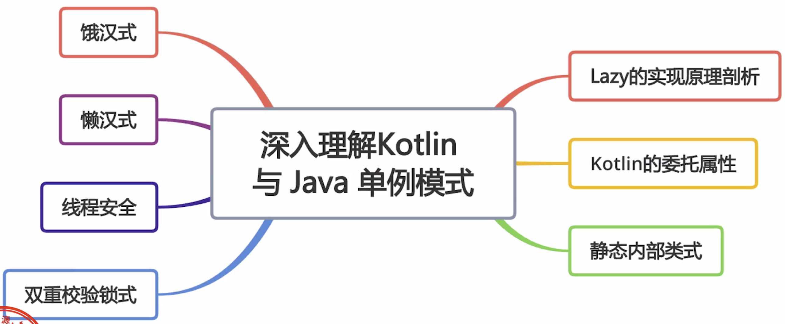

# Kotlin与Java设计模式

## Kotlin与Java单例模式



### Kotlin饿汉式单例

```Kotlin
object Singleton{}
```

### Kotlin懒汉式单例

```Kotlin
class Singleton private constructor() {
    companion object {
        private var instance: Singleton? = null
            get() {
                if (field == null) {
                    field = Singleton()
                }
                return instance
            }

        @Synchronized
        fun get(): Singleton {
            return instance!!
        }
    }
}
```

### Kotlin双重校验锁单例

```Kotlin
class Singleton private constructor() {
    companion object {
        val INSTANCE = Singleton by lazy(mode = LazyThreadSafetyMode.SYNCHRONIZED) {
            Singleton()
        }
    }
}
```

### Kotlin静态内部类单例

```Kotlin
class Singleton {
    companion object {
        val instance = SingletonProvider.holder
    }

    private object SingletonProvider {
        val holder = Singleton()
    }
}
```

## Kotlin装饰着模式

```kotlin
fun Panda.bamboo(decorator: () -> Unit) {
    eat()
    println("do something! ")
    decorator()
}
```

## Kotlin建造者模式

```kotlin
var pen = Pen()
//通过with来实现
  with(pen, {
    color = "red"
    width = 2f
    bound = true
  })
pen.write()


var pen = Pen()
//通过apply来实现
pen.apply {
  color = "red"
  width = 2f
  bound = true
  write()
}
```

## Kotlin适配器模式


