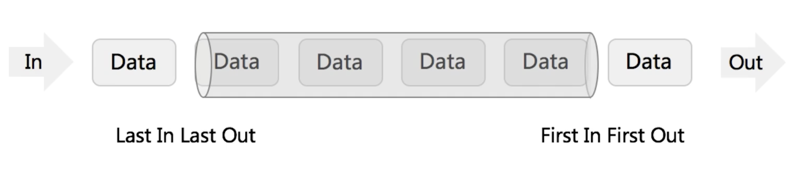

# Stack & Queue


## Stack

- FILO（Array or Linked List）

## [20. 有效的括号](https://leetcode.cn/problems/valid-parentheses/)

```java
class Solution {
    public boolean isValid(String s) {
        Stack<Character> stack = new Stack<>();
        HashMap<Character, Character> map = new HashMap<>(3);
        map.put(')', '(');
        map.put('}', '{');
        map.put(']', '[');

        char[] chars = s.toCharArray();
        for (int i = 0; i < chars.length; i++) {
            if (map.containsValue(chars[i])) {
                stack.push(chars[i]);
            } else if (stack.isEmpty() || !map.get(chars[i]).equals(stack.pop())) {
                return false;
            }
        }

        return stack.isEmpty();
    }
}
```

## [232. 用栈实现队列](https://leetcode.cn/problems/implement-queue-using-stacks/)

```java
class MyQueue {
    // java中的 Stack 有设计上的缺陷，官方推荐使用 Deque(双端队列) 代替 Stack  
    Deque<Integer> stIn;
    Deque<Integer> stOut;
    /** Initialize your data structure here. */
    public MyQueue() {
        stIn = new ArrayDeque<>();
        stOut = new ArrayDeque<>();
    }
    
    /** Push element x to the back of queue. */
    public void push(int x) {
        stIn.push(x);
    }
    
    /** Removes the element from in front of queue and returns that element. */
    public int pop() {
        // 只要 stOut 为空，那么就应该将 stIn 中所有的元素倒腾到 stOut 中
        if (stOut.isEmpty()) {
            while (!stIn.isEmpty()) {
                stOut.push(stIn.pop());
            }
        }
        // 再返回 stOut 中的元素
        return stOut.pop();
    }
    
    /** Get the front element. */
    public int peek() {
        // 直接使用已有的pop函数
        int res = this.pop();
        // 因为pop函数弹出了元素res，所以再添加回去
        stOut.push(res);
        return res;
    }
    
    /** Returns whether the queue is empty. */
    public boolean empty() {
        // 当 stIn 栈为空时，说明没有元素可以倒腾到 stOut 栈了
        // 并且 stOut 栈也为空时，说明没有以前从 stIn 中倒腾到的元素了 
        return stIn.isEmpty() && stOut.isEmpty();
    }
}
```

## [225. 用队列实现栈](https://leetcode.cn/problems/implement-stack-using-queues/)

### 方法一：使用两个队列实现

```java
class MyStack {
    Queue<Integer> queue1;
    Queue<Integer> queue2;

    public MyStack() {
        queue1 = new LinkedList<Integer>();
        queue2 = new LinkedList<Integer>();
    }

    /** Push element x onto stack. */
    public void push(int x) {
        queue2.offer(x);
        while (!queue1.isEmpty()) {
            queue2.offer(queue1.poll());
        }
        Queue<Integer> temp = queue1;
        queue1 = queue2;
        queue2 = temp;
    }

    public int pop() {
        return queue1.poll();
    }

    public int top() {
        return queue1.peek();
    }

    public boolean empty() {
        return queue1.isEmpty();
    }
}
```

### 方法二：使用一个队列实现

```java
class MyStack {
    Queue<Integer> queue;

    public MyStack() {
        queue = new LinkedList<Integer>();
    }

    public void push(int x) {
        int n = queue.size();
        queue.offer(x);
        for (int i = 0; i < n; i++) {
            queue.offer(queue.poll());
        }
    }

    public int pop() {
        return queue.poll();
    }

    public int top() {
        return queue.peek();
    }

    public boolean empty() {
        return queue.isEmpty();
    }
}
```


## Queue



- FIFO（Array or Doubly Linked List）


