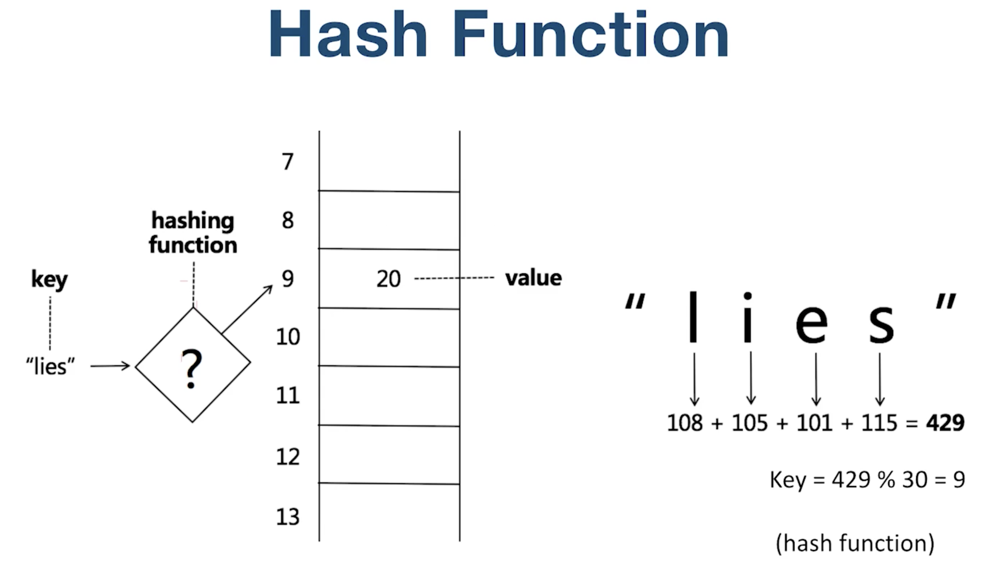
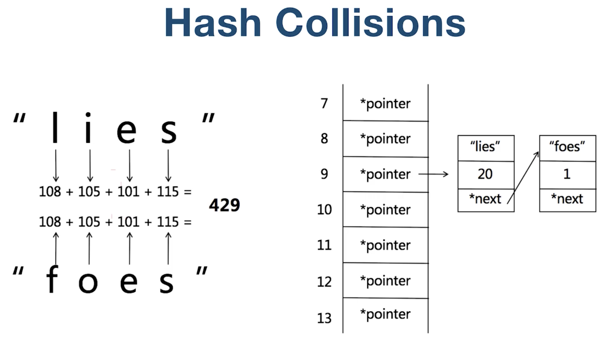

# Map & Set

## Hash函数



## Hash冲突



> 1. HashTable & Hash Function & Collisions
> 2. Map vs Set
> 3. HashMap & HashSet & TreeMap & TreeSet

##  [242. 有效的字母异位词](https://leetcode.cn/problems/valid-anagram/)

> 1. 对字母进行排序，然后比较排序好的单词一样即为异位词；（N.logN）
> 2. Map记录字母的次数；（O(n)）

```java
class Solution {
  
    public boolean isAnagram(String s, String t) {
        if (s.length() != t.length()) {
            return false;
        }

        HashMap<Character, Integer> map = new HashMap<>();

        char[] cArr = s.toCharArray();
        for (int i = 0; i < cArr.length; i++) {
            char c = cArr[i];
            map.put(c, map.getOrDefault(c, 0) + 1);
        }

        char[] tArr = t.toCharArray();
        for (int i = 0; i < tArr.length; i++) {
            char c = tArr[i];
            map.put(c, map.getOrDefault(c, 0) - 1);
            if (map.get(c) < 0) {
                return false;
            }
        }
        return true;
    }

    public boolean isAnagram2(String s, String t) {
        if (s.length() != t.length()) {
            return false;
        }
        char[] str1 = s.toCharArray();
        char[] str2 = t.toCharArray();
        Arrays.sort(str1);
        Arrays.sort(str2);
        return Arrays.equals(str1, str2);
    }
  
    public boolean isAnagram3(String s, String t) {
        if (s.length() != t.length()) {
            return false;
        }
        int[] table = new int[26];
        for (int i = 0; i < s.length(); i++) {
            table[s.charAt(i) - 'a']++;
        }
        for (int i = 0; i < t.length(); i++) {
            table[t.charAt(i) - 'a']--;
            if (table[t.charAt(i) - 'a'] < 0) {
                return false;
            }
        }
        return true;
    }
}
```


## [1. 两数之和](https://leetcode.cn/problems/two-sum/)

> 1. 暴力解法：双重for循环；O(n2)
> 2. Set，x+y=9=》y=9-x ; O(n)

```java
class Solution {
    public int[] twoSum(int[] nums, int target) {
        //Map-> key: value; value: index
        Map<Integer, Integer> map = new HashMap<>();
        for (int i = 0; i < nums.length; i++) {
            if (map.containsKey(target - nums[i])) {
                return new int[]{i, map.get(target - nums[i])};
            } else {
                map.put(nums[i], i);
            }
        }

        throw new IllegalArgumentException("No two sum solution");
    }
}
```


## [15. 三数之和](https://leetcode.cn/problems/3sum/)

> 1. 暴力求解；O(N3)
> 2. c = - (a+b) -> set O(N2)
> 3. Sort -> Find  O(N2)

```java
class Solution {
    public List<List<Integer>> threeSum1(int[] nums) {
        int n = nums.length;
        Arrays.sort(nums);
        List<List<Integer>> ans = new ArrayList<List<Integer>>();
        // 枚举 a
        for (int first = 0; first < n; ++first) {
            // 需要和上一次枚举的数不相同
            if (first > 0 && nums[first] == nums[first - 1]) {
                continue;
            }
            // c 对应的指针初始指向数组的最右端
            int third = n - 1;
            int target = -nums[first];

            // 枚举 b
            for (int second = first + 1; second < n; ++second) {
                // 需要和上一次枚举的数不相同
                if (second > first + 1 && nums[second] == nums[second - 1]) {
                    continue;
                }
                // 需要保证 b 的指针在 c 的指针的左侧
                while (second < third && nums[second] + nums[third] > target) {
                    --third;
                }

                // 如果指针重合，随着 b 后续的增加
                // 就不会有满足 a+b+c=0 并且 b<c 的 c 了，可以退出循环
                if (second == third) {
                    break;
                }
                if (nums[second] + nums[third] == target) {
                    List<Integer> list = new ArrayList<Integer>();
                    list.add(nums[first]);
                    list.add(nums[second]);
                    list.add(nums[third]);
                    ans.add(list);
                }
            }
        }
        return ans;
    }


    public List<List<Integer>> threeSum(int[] nums) {// 总时间复杂度：O(n^2)
        List<List<Integer>> ans = new ArrayList<>();
        if (nums == null || nums.length <= 2) return ans;

        Arrays.sort(nums); // O(nlogn)

        for (int i = 0; i < nums.length - 2; i++) { // O(n^2)

            if (nums[i] > 0) break; // 第一个数大于 0，后面的数都比它大，肯定不成立了

            if (i > 0 && nums[i] == nums[i - 1]) continue; // 去掉重复情况

            int target = -nums[i];

            int left = i + 1, right = nums.length - 1;

            while (left < right) {
                if (nums[left] + nums[right] == target) {

                    ans.add(new ArrayList<>(Arrays.asList(nums[i], nums[left], nums[right])));

                    // 现在要增加 left，减小 right，但是不能重复，比如: [-2, -1, -1, -1, 3, 3, 3], i = 0, left = 1, right = 6, [-2, -1, 3] 的答案加入后，需要排除重复的 -1 和 3
                    left++; right--; // 首先无论如何先要进行加减操作

                    while (left < right && nums[left] == nums[left - 1]) left++;

                    while (left < right && nums[right] == nums[right + 1]) right--;

                } else if (nums[left] + nums[right] < target) {
                    left++;
                } else {  // nums[left] + nums[right] > target
                    right--;
                }
            }
        }
        return ans;
    }
}

```


## [18. 四数之和](https://leetcode.cn/problems/4sum/)

```java
class Solution {
    public List<List<Integer>> fourSum(int[] nums, int target) {
        Arrays.sort(nums);
        List<List<Integer>> ans = new ArrayList<>();
        int len = nums.length;
        if (len < 4) {
            return ans;
        }
        for (int i = 0; i < len; i++) {
            if (i > 0 && nums[i] == nums[i - 1]) { // 第一个数去重
                continue;
            }
            for (int j = i + 1; j < len; j++) {
                if (j > i + 1 && nums[j] == nums[j - 1]) { // 第二个数去重
                    continue;
                }
                int left = j + 1;
                int right = len - 1;
                while (left < right) {
                    int sum = nums[i] + nums[j] + nums[left] + nums[right];
                    if (sum < target) {
                        left++;
                    } else if (sum > target) {
                        right--;
                    } else {
                        ans.add(Arrays.asList(nums[i], nums[j], nums[left], nums[right]));
                        while (left < right && nums[left] == nums[left + 1]) { // left去重
                            left++;
                        }
                        while (left < right && nums[right] == nums[right - 1]) { // right去重
                            right--;
                        }
                        left++;
                        right--;
                    }
                }
            }
        }
        return ans;
    }
    
}
```

