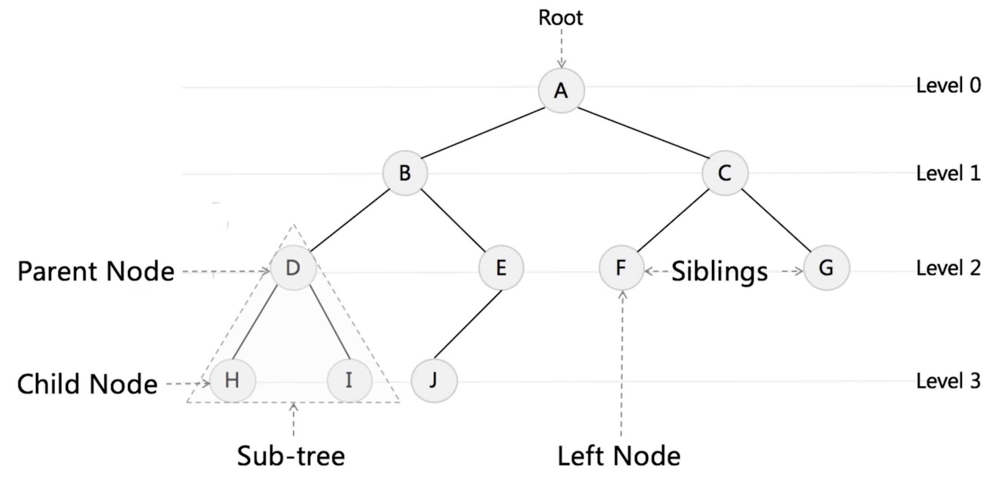
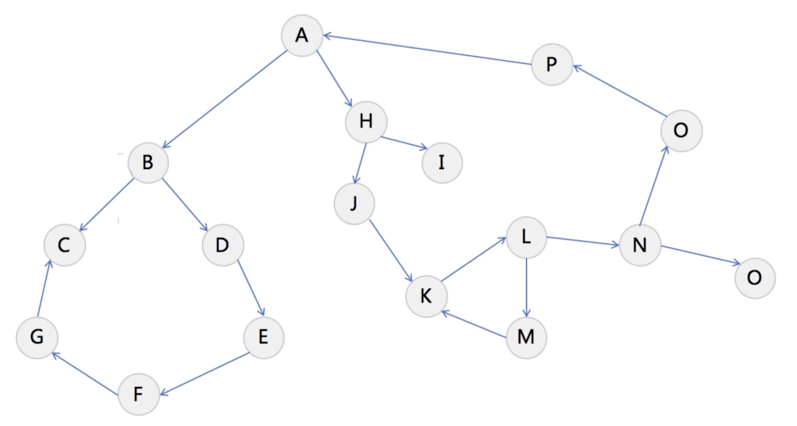

# Tree & Graph






## [98. 验证二叉搜索树](https://leetcode.cn/problems/validate-binary-search-tree/)

> 1. 对二叉树进行中序遍历，遍历结果为升序，即为二叉搜索树；
> 2. 使用递归判断；

```java
class Solution {
  //方法一：中序遍历
  public boolean isValidBST(TreeNode root) {
        Deque<TreeNode> stack = new LinkedList<TreeNode>();
        double inorder = -Double.MAX_VALUE;

        while (!stack.isEmpty() || root != null) {
            while (root != null) {
                stack.push(root);
                root = root.left;
            }
            root = stack.pop();
            // 如果中序遍历得到的节点的值小于等于前一个 inorder，说明不是二叉搜索树
            if (root.val <= inorder) {
                return false;
            }
            inorder = root.val;
            root = root.right;
        }
        return true;
    }
  
    //方法二：递归判断
    public boolean isValid(TreeNode root, Integer min, Integer max) {
        if (root == null) {
            return true;
        }
        if ((min != null && root.val <= min) || (max != null && root.val >= max)) {
            return false;
        }
        return isValid(root.left, min, root.val) && isValid(root.right, root.val, max);
    }

    public boolean isValidBST(TreeNode root) {
        return isValid(root, null, null);
    }
}
```


## [235. 二叉搜索树的最近公共祖先](https://leetcode.cn/problems/lowest-common-ancestor-of-a-binary-search-tree/)

```java
class Solution {
    public TreeNode lowestCommonAncestor(TreeNode root, TreeNode p, TreeNode q) {

        if (root.val > p.val && root.val > q.val) {
            return lowestCommonAncestor(root.left, p, q);
        }

        if (root.val < p.val && root.val < q.val) {
            return lowestCommonAncestor(root.right, p, q);
        }

        return root;
    }
}
```


##  [236. 二叉树的最近公共祖先](https://leetcode.cn/problems/lowest-common-ancestor-of-a-binary-tree/)

```java
class Solution {
    public TreeNode lowestCommonAncestor(TreeNode root, TreeNode p, TreeNode q) {
        if (root == null || root == p || root == q) {
            return root;
        }
        TreeNode left = lowestCommonAncestor(root.left, p, q);
        TreeNode right = lowestCommonAncestor(root.right, p, q);

        if (left == null) {
            return right;
        } else if (right == null) {
            return left;
        } else {
            return root;
        }
    }
  
  	public TreeNode lowestCommonAncestor2(TreeNode root, TreeNode p, TreeNode q) {
        while (root != null) {
            if (root.val > p.val && root.val > q.val) {
                root = root.left;
            } else if (root.val < p.val && root.val < q.val) {
                root = root.right;
            } else {
                return root;
            }
        }
        return root;
    }
}
```

