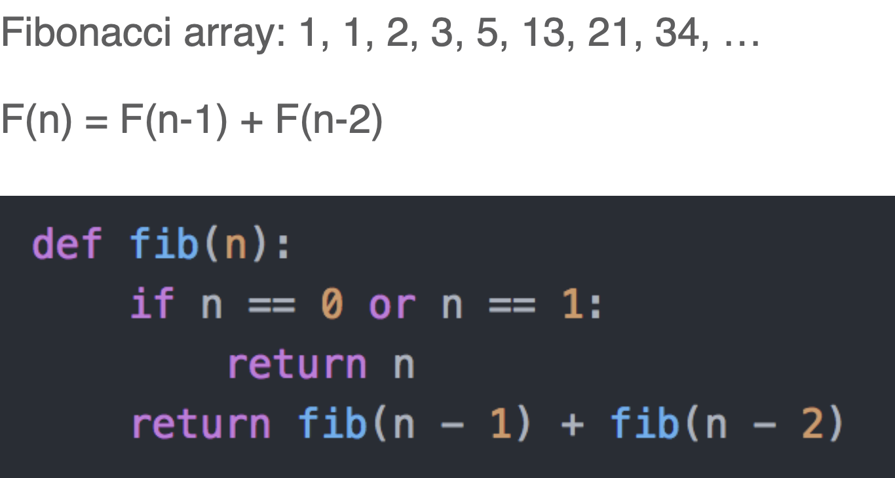
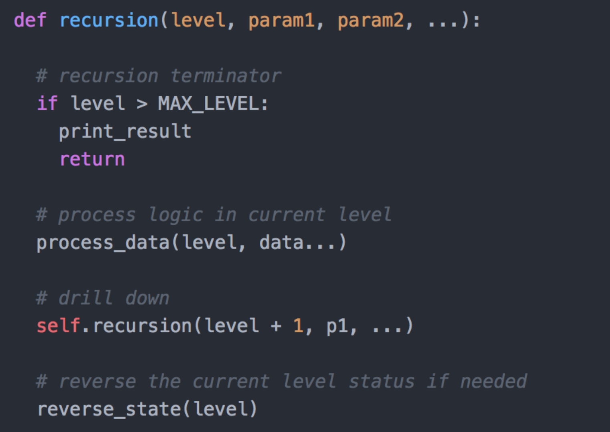
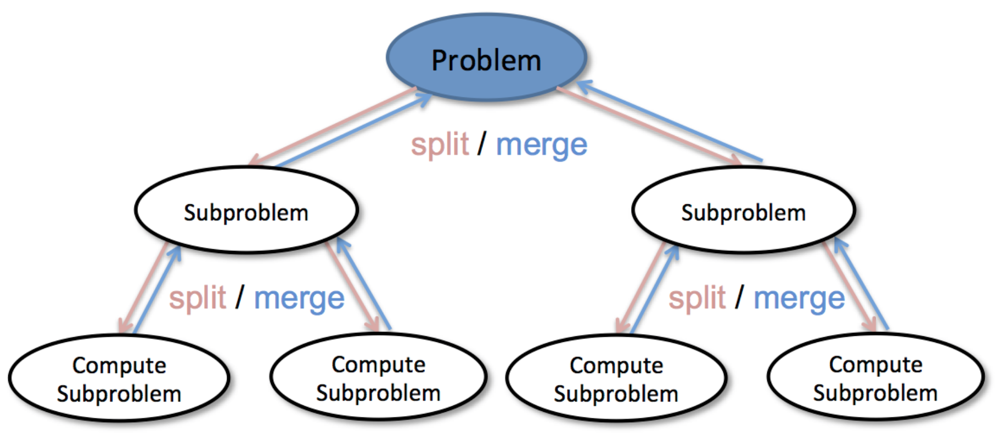
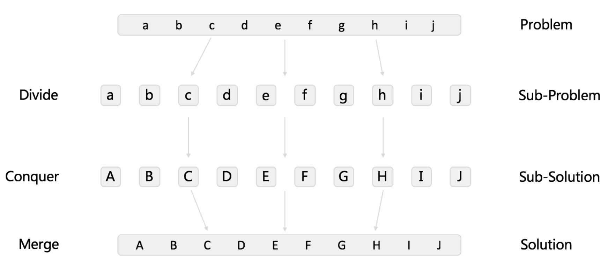
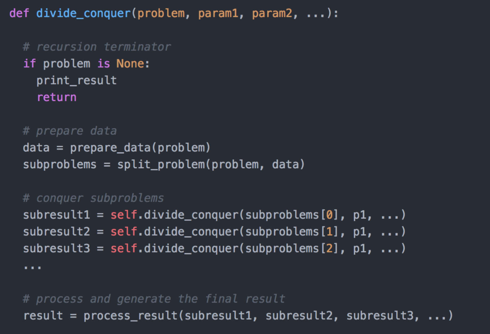

# Recursion & Divide & Conpuer


## Recursion



### Template Code



## Divide & Conpuer





### Template Code




## [50. Pow(x, n)](https://leetcode.cn/problems/powx-n/)

```java
//时间复杂度：O(logn) ; 空间复杂度：O(logn)
class Solution {
    public double myPow(double x, int n) {
        return n >= 0 ? quickMul(x, n) : 1.0 / quickMul(x, -n);
    }

    public double quickMul(double x, int n) {
        if (n == 0) {
            return 1.0;
        }
        double y = quickMul(x, n / 2);
        return n % 2 == 0 ? y * y : y * y * x;
    }
}

//时间复杂度：O(logn) ; 空间复杂度：O(logn)
class Solution {
    public double myPow(double x, int n) {
        if (n == 0) {
            return 1.0;
        }
        if (n < 0) {
            double helf = myPow(1.0 / x, -(n / 2));//此处必须是-(n/2)，因为-n/2可能会溢出
            return n % 2 == 0 ? helf * helf : (1.0 / x) * helf * helf;
        } else {
            double helf = myPow(x, n / 2);
            return n % 2 == 0 ? helf * helf : x * helf * helf;
        }
    }
}

//时间复杂度：O(log n) ; 空间复杂度：O(1) v
class Solution {
    public double myPow(double x, int n) {
        long N = n;
        if (N < 0) {
            x = 1 / x;
            N = -N;
        }
        double ans = 1.0;
        double x_contribute = x;

        while (N > 0) {
            if (N % 2 == 1) {
                ans = ans * x_contribute;
            }
            x_contribute = x_contribute * x_contribute;
            N = N >> 1;
        }
        return ans;
    }
}
```

## [169. 多数元素](https://leetcode.cn/problems/majority-element/)

```java
//Map存元素个数
class Solution {
    private Map<Integer, Integer> countNums(int[] nums) {
        Map<Integer, Integer> counts = new HashMap<Integer, Integer>();
        for (int num : nums) {
            if (!counts.containsKey(num)) {
                counts.put(num, 1);
            } else {
                counts.put(num, counts.get(num) + 1);
            }
        }
        return counts;
    }

    public int majorityElement(int[] nums) {
        Map<Integer, Integer> counts = countNums(nums);

        Map.Entry<Integer, Integer> majorityEntry = null;
        for (Map.Entry<Integer, Integer> entry : counts.entrySet()) {
            if (majorityEntry == null || entry.getValue() > majorityEntry.getValue()) {
                majorityEntry = entry;
            }
        }

        return majorityEntry.getKey();
    }
}

//排序法
class Solution {
    public int majorityElement(int[] nums) {
        Arrays.sort(nums);
        return nums[nums.length / 2];
    }
}

//分治法
class Solution {
    private int countInRange(int[] nums, int num, int lo, int hi) {
        int count = 0;
        for (int i = lo; i <= hi; i++) {
            if (nums[i] == num) {
                count++;
            }
        }
        return count;
    }

    private int majorityElementRec(int[] nums, int lo, int hi) {
        // base case; the only element in an array of size 1 is the majority
        // element.
        if (lo == hi) {
            return nums[lo];
        }

        // recurse on left and right halves of this slice.
        int mid = (hi - lo) / 2 + lo;
        int left = majorityElementRec(nums, lo, mid);
        int right = majorityElementRec(nums, mid + 1, hi);

        // if the two halves agree on the majority element, return it.
        if (left == right) {
            return left;
        }

        // otherwise, count each element and return the "winner".
        int leftCount = countInRange(nums, left, lo, hi);
        int rightCount = countInRange(nums, right, lo, hi);

        return leftCount > rightCount ? left : right;
    }

    public int majorityElement(int[] nums) {
        return majorityElementRec(nums, 0, nums.length - 1);
    }
}
```


