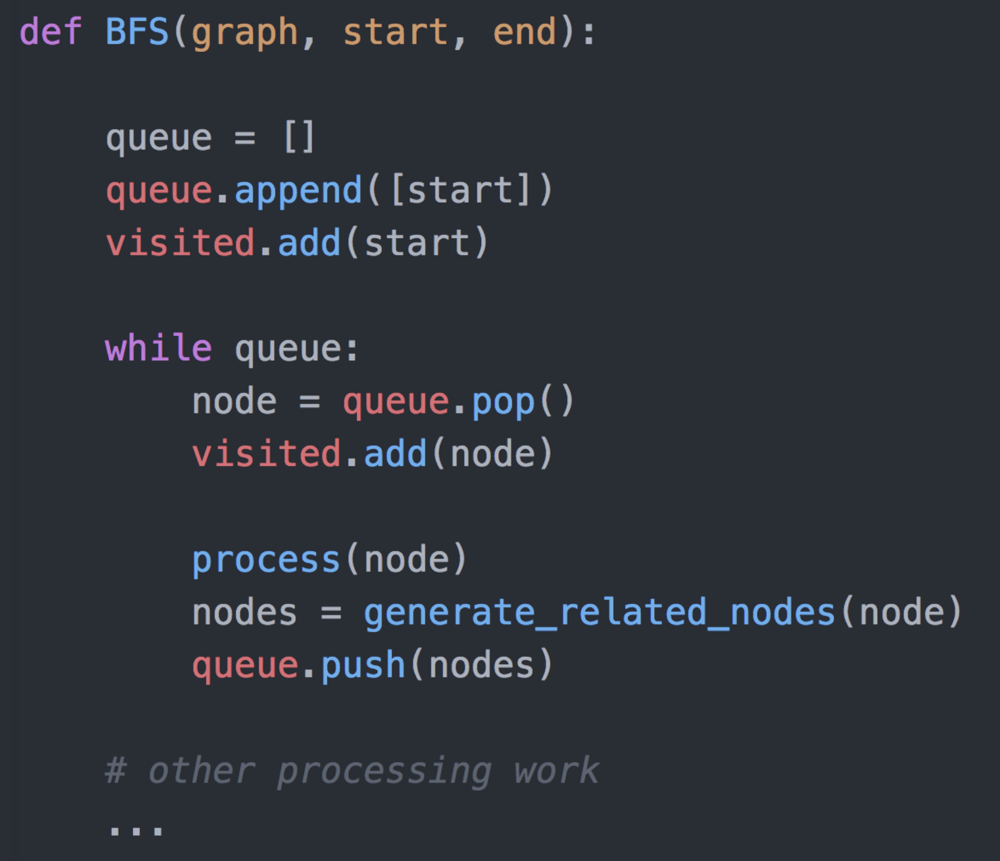
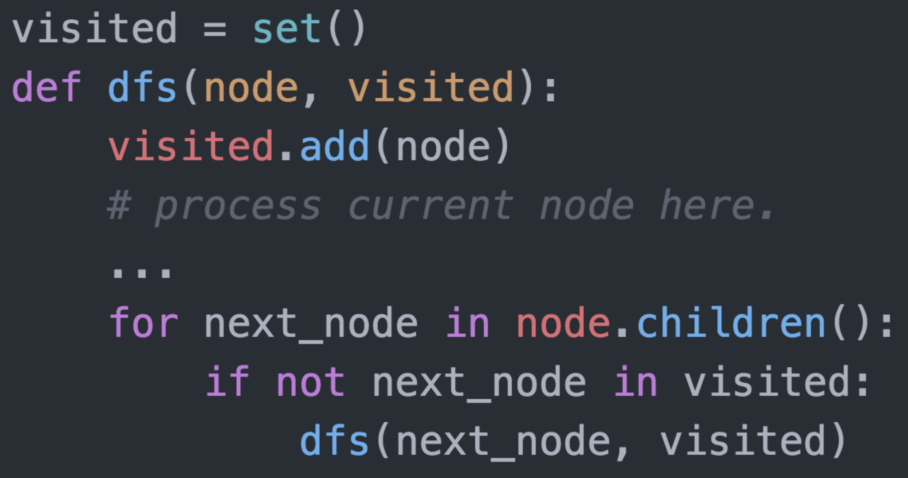
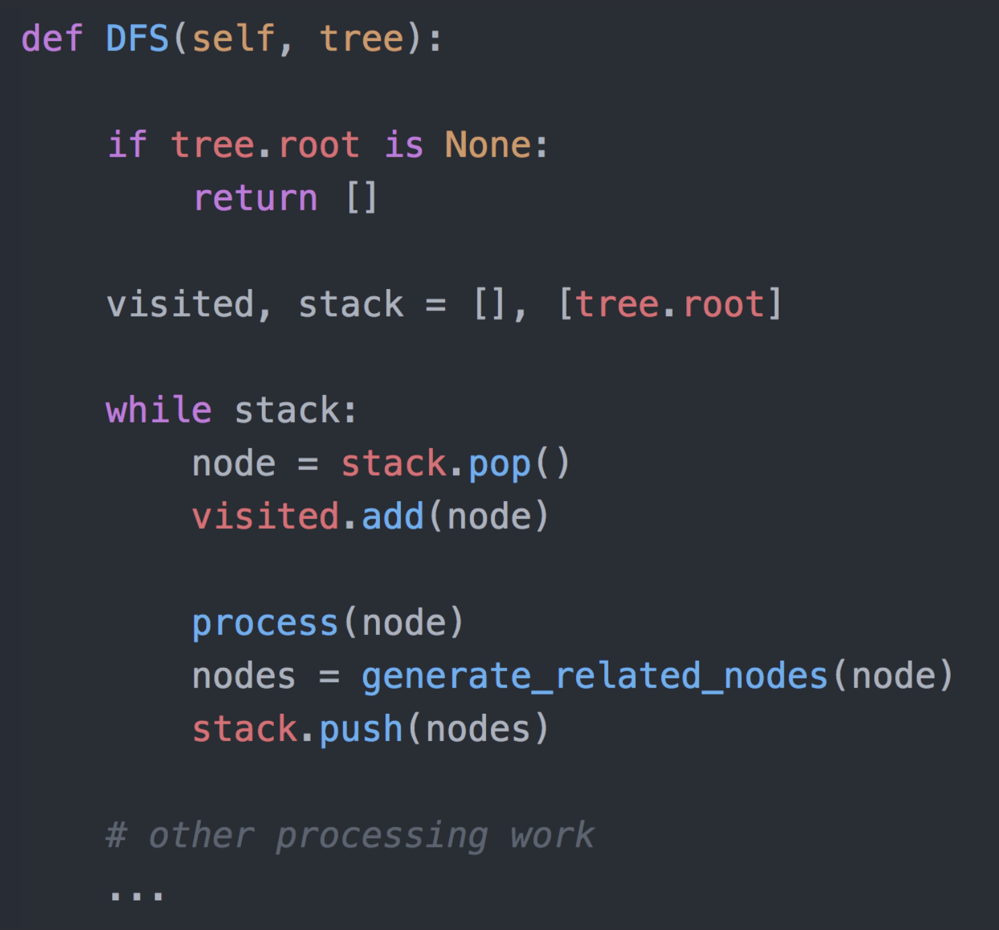

# BFS & DFS

## BFS（Breadth-First-Search）




## DFS (Depth-First-Search)

### 递归写法（推荐）




### 非递归写法




## [102. 二叉树的层序遍历](https://leetcode.cn/problems/binary-tree-level-order-traversal/)

```java
class Solution {
    public List<List<Integer>> levelOrder(TreeNode root) {
        List<List<Integer>> res = new ArrayList<>();
        if (root == null) {
            return res;
        }

        Queue<TreeNode> q = new LinkedList<>();
        q.add(root);

        while (!q.isEmpty()) {
            int levelSize = q.size();
            List<Integer> currLevel = new ArrayList<>();

            for (int i = 0; i < levelSize; i++) {
                TreeNode currNode = q.poll();
                currLevel.add(currNode.val);

                if (currNode.left != null) {
                    q.add(currNode.left);
                }

                if (currNode.right != null) {
                    q.add(currNode.right);
                }
            }
            res.add(currLevel);
        }
        return res;
    }
}
```


## [104. 二叉树的最大深度](https://leetcode.cn/problems/maximum-depth-of-binary-tree/)

```java
//BFS
class Solution {
    public int maxDepth(TreeNode root) {
        if (root == null) {
            return 0;
        }
        Queue<TreeNode> queue = new LinkedList<TreeNode>();
        queue.offer(root);
        int ans = 0;
        while (!queue.isEmpty()) {
            int size = queue.size();
            while (size > 0) {
                TreeNode node = queue.poll();
                if (node.left != null) {
                    queue.offer(node.left);
                }
                if (node.right != null) {
                    queue.offer(node.right);
                }
                size--;
            }
            ans++;
        }
        return ans;
    }
}

//DFS
class Solution {
    public int maxDepth(TreeNode root) {
        if (root == null) {
            return 0;
        } else {
            int leftHeight = maxDepth(root.left);
            int rightHeight = maxDepth(root.right);
            return Math.max(leftHeight, rightHeight) + 1;
        }
    }
}
```


## [111. 二叉树的最小深度](https://leetcode.cn/problems/minimum-depth-of-binary-tree/)

```java
//BFS
class Solution {
    class QueueNode {
        TreeNode node;
        int depth;

        public QueueNode(TreeNode node, int depth) {
            this.node = node;
            this.depth = depth;
        }
    }

    public int minDepth(TreeNode root) {
        if (root == null) {
            return 0;
        }

        Queue<QueueNode> queue = new LinkedList<QueueNode>();
        queue.offer(new QueueNode(root, 1));
        while (!queue.isEmpty()) {
            QueueNode nodeDepth = queue.poll();
            TreeNode node = nodeDepth.node;
            int depth = nodeDepth.depth;
            if (node.left == null && node.right == null) {
                return depth;
            }
            if (node.left != null) {
                queue.offer(new QueueNode(node.left, depth + 1));
            }
            if (node.right != null) {
                queue.offer(new QueueNode(node.right, depth + 1));
            }
        }

        return 0;
    }
}

//BFS 👍 
class Solution {
    public int minDepth(TreeNode root) {
        if (root == null) {
            return 0;
        }
        int minDep = 1;
        Queue<TreeNode> q = new LinkedList<>();
        q.add(root);

        while (!q.isEmpty()) {
            int levelSize = q.size();
            for (int i = 0; i < levelSize; i++) {
                TreeNode currNode = q.poll();
                if (currNode.left == null && currNode.right == null) {
                    return minDep;
                } else {
                    if (currNode.left != null) {
                        q.add(currNode.left);
                    }
                    if (currNode.right != null) {
                        q.add(currNode.right);
                    }
                }
            }
            minDep++;
        }
        return minDep;
    }
}

//DFS
class Solution {
    public int minDepth(TreeNode root) {
        if (root == null) {
            return 0;
        }

        if (root.left == null && root.right == null) {
            return 1;
        }

        int min_depth = Integer.MAX_VALUE;
        if (root.left != null) {
            min_depth = Math.min(minDepth(root.left), min_depth);
        }
        if (root.right != null) {
            min_depth = Math.min(minDepth(root.right), min_depth);
        }

        return min_depth + 1;
    }
}

class Solution {
    public int minDepth(TreeNode root) {
        if (root == null) {
            return 0;
        }

        int left = minDepth(root.left);
        int right = minDepth(root.right);

        return (left == 0 || right == 0) ? left + right + 1 : Math.min(left, right) + 1;
    }
}
```

##  [22. 括号生成](https://leetcode.cn/problems/generate-parentheses/)

```java
class Solution {
    public List<String> generateParenthesis(int n) {
        List<String> result = new ArrayList<String>();
        backtrack(result, "", n, n);
        return result;
    }

    public void backtrack(List<String> result, String subStr, int left, int right) {
        if (left == 0 && right == 0) {
            result.add(subStr);
            return;
        }
        if (left > 0) {
            backtrack(result, subStr + "(", left - 1, right);
        }
        if (left < right) {
            backtrack(result, subStr + ")", left, right - 1);
        }
    }
}
```

