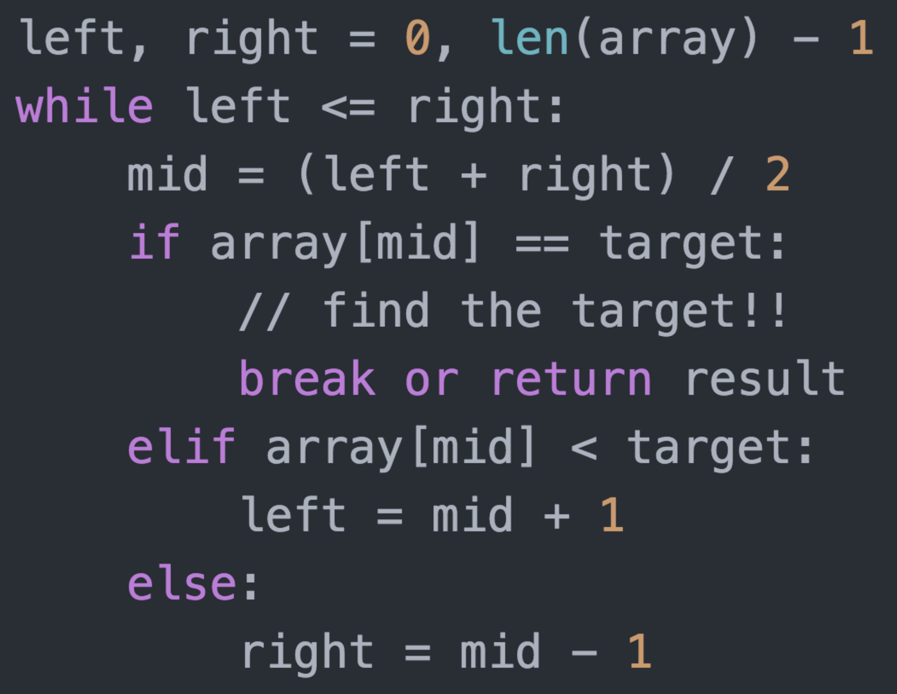

# Binary Search

> 二分查找三个必要条件：
>
> 1. Sorted 单调递增或递减；
> 2. Bounded 存在上下界
> 3. Accessible by index 能够通过索引访问

## Template Code



## [69. x 的平方根 ](https://leetcode.cn/problems/sqrtx/)

```java
class Solution {
    public int mySqrt(int x) {
        if (x == 0 || x == 1) {
            return x;
        }
        int l = 1, r = x, res = 0;
        while (l <= r) {
            int m = (l + r) / 2;
            if (m == x / m) { //如果采用m*m==x，可能会导致溢出
                return m;
            } else if (m > x / m) {
                r = m - 1;
            } else {
                l = m + 1;
                res = m;
            }
        }
        return res;
    }
}
```

