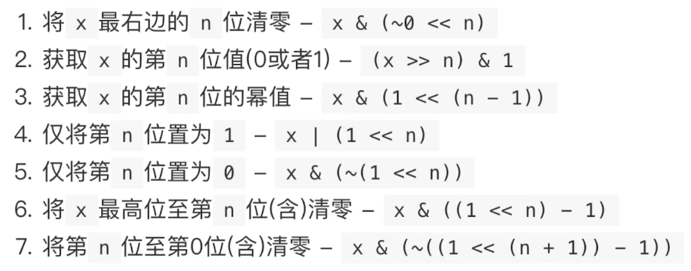

# Bitwase Operations

> 常用位运算操作：
>
> - 判断奇偶：X & 1 == 1 OR == 0  
> - 清零最低位的1：X = X & （X - 1）
> - 得到最低位的1：X & -X 

## 复杂位操作运算



## [191. 位1的个数](https://leetcode.cn/problems/number-of-1-bits/)

```java
public class Solution {
    public int hammingWeight(int n) {
        int ret = 0;
        for (int i = 0; i < 32; i++) {
            if ((n & (1 << i)) != 0) {
                ret++;
            }
        }
        return ret;
    }
}

// 👍 
public class Solution {
    public int hammingWeight(int n) {
        int ret = 0;
        while (n != 0) {
            n &= n - 1;
            ret++;
        }
        return ret;
    }
}
```

## [231. 2 的幂](https://leetcode.cn/problems/power-of-two/)

```java
class Solution {
    public boolean isPowerOfTwo(int n) {
        return n > 0 && (n & -n) == n;
    }
}

class Solution {
    public boolean isPowerOfTwo(int n) {
        return n > 0 && (n & (n - 1)) == 0;
    }
}
```

## [338. 比特位计数](https://leetcode.cn/problems/counting-bits/)

```java
class Solution {
    public int[] countBits(int n) {
        int[] bits = new int[n + 1];
        for (int i = 1; i <= n; i++) {
            bits[i] += bits[i&(i-1)] + 1;
        }
        return bits;
    }
}
```

## [52. N皇后 II](https://leetcode.cn/problems/n-queens-ii/)

```java
```

