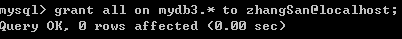
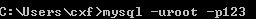
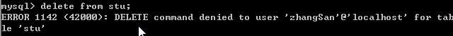
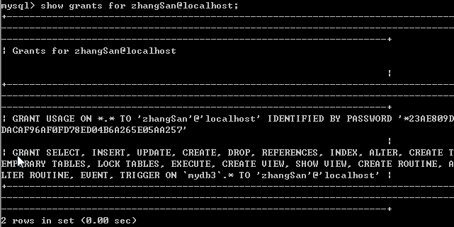
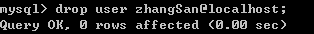

# DCL-数据控制语言

DCL(理解)

* 一个项目创建一个用户！一个项目对应的数据库只有一个！

* 这个用户只能对这个数据库有权限，其他数据库你就操作不了了！

1. 创建用户

* CREATE USER 用户名@IP地址 IDENTIFIED BY '密码';

  

  

  \> 用户只能在指定的IP地址上登录

* CREATE USER 用户名@'%' IDENTIFIED BY '密码';

  \> 用户可以在任意IP地址上登录

2. 给用户授权

 \* GRANT 权限1, … , 权限n ON 数据库.* TO 用户名@IP地址

  \> 权限、用户、数据库

  \> 给用户分派在指定的数据库上的指定的权限

  \> 例如；GRANT CREATE,ALTER,DROP,INSERT,UPDATE,DELETE,SELECT ON mydb1.* TO user1@localhost;

* 给user1用户分派在mydb1数据库上的create、alter、drop、insert、update、delete、select权限

* GRANT ALL ON 数据库.* TO 用户名@IP地址;

​    

  \> 给用户分派指定数据库上的所有权限

3. 撤销授权	 只有root才有撤销的权限

​    

* REVOKE 权限1, … , 权限n ON 数据库.* FROM 用户名@IP地址;

  \> 撤消指定用户在指定数据库上的指定权限

  \> 例如；REVOKE CREATE,ALTER,DROP ON mydb1.* FROM user1@localhost;

* 撤消user1用户在mydb1数据库上的create、alter、drop权限

   

​    

4. 查看权限 需要root权限查看

​    

* SHOW GRANTS FOR 用户名@IP地址

  \> 查看指定用户的权限

 

5. 删除用户

* DROP USER 用户名@IP地址

​    