# DQL-多表查询

select * 

from emp, dept, (select * from emp)

where

group by

having

order by

desc

limit

**多表查询**

  \1. 分类：

​    \* 合并结果集(了解)

​    \* 连接查询

​    \* 子查询

合并结果集(结果集相同而不是表完全相同)

  \* 要求被合并的表中，列的类型和列数相同

   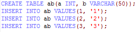

  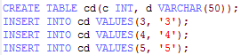

  \* UNION，去除重复行

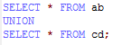

  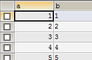

  \* UNION ALL，不去除重复行

SELECT * FROM cd

UNION ALL

SELECT * FROM ab;

 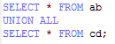

 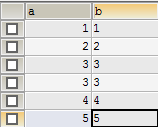

**连接查询**

  \1. 分类

​    \* 内连接

​    \* 外连接

​      \> 左外连接

​      \> 右外连接

​      \> 全外连接(MySQL不支持)

​    \* 自然连接（属于一种简化方式）

  \2. 内连接

 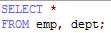

链接表之间的关联键做笛卡尔积显示

  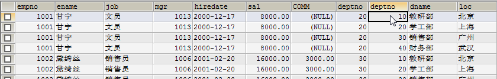

​    \* 方言：SELECT * FROM 表1 别名1, 表2 别名2 WHERE 别名1.xx=别名2.xx

  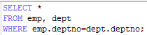

  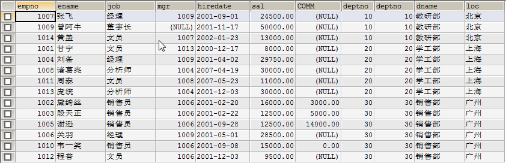

​    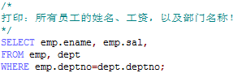

​    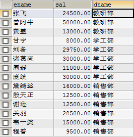

  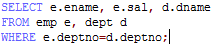

​    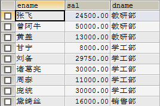

​    \* 标准：SELECT * FROM 表1 别名1 INNER JOIN 表2 别名2 ON 别名1.xx=别名2.xx

​    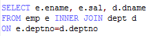

  

​    \* 自然：SELECT * FROM 表1 别名1 NATURAL JOIN 表2 别名2

 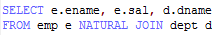

​    \* 内连接查询出的所有记录都满足条件。

  

  **3. 外连接**

​    \* 左外：SELECT * FROM 表1 别名1 LEFT OUTER JOIN 表2 别名2 ON 别名1.xx=别名2.xx

​      \> 左表记录无论是否满足条件都会查询出来，而右表只有满足条件才能出来。左表中不满足条件的记录，右表部分都为NULL

  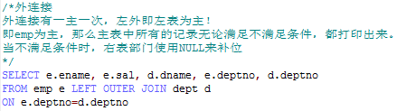

 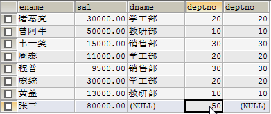

  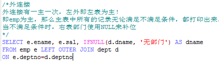

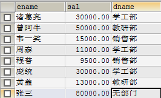

​    \* 左外自然：SELECT * FROM 表1 别名1 NATURAL LEFT OUTER JOIN 表2 别名2 ON 别名1.xx=别名2.xx

​    \* 右外：SELECT * FROM 表1 别名1 RIGHT OUTER JOIN 表2 别名2 ON 别名1.xx=别名2.xx

​      \> 右表记录无论是否满足条件都会查询出来，而左表只有满足条件才能出来。右表不满足条件的记录，其左表部分都为NULL

   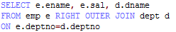

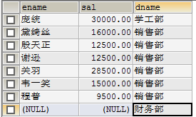

​    \* 右外自然：SELECT * FROM 表1 别名1 NATURAL RIGHT OUTER JOIN 表2 别名2 ON 别名1.xx=别名2.xx

​    \* 全链接：可以使用UNION来完成全链接

   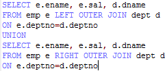

 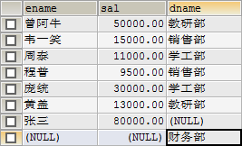

**子查询**

　　：查询中有查询（查看select关键字的个数！）

  \1. 出现的位置：

​    \* where后作为条件存在

​    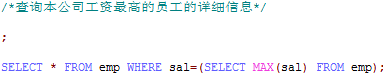

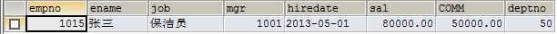

​    \* from后作为表存在(多行多列)

​    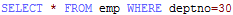

  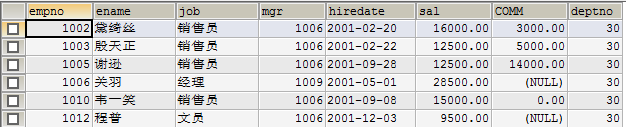

​    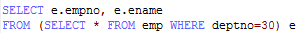

  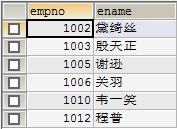

  \2. 条件

​    \* (***)单行单列：SELECT * FROM 表1 别名1 WHERE 列1 [=、>、<、>=、<=、!=] (SELECT 列 FROM 表2 别名2 WHERE 条件)

   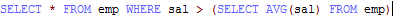

   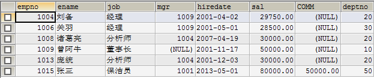

​    \* (**)多行单列：SELECT * FROM 表1 别名1 WHERE 列1 [IN, ALL, ANY] (SELECT 列 FROM 表2 别名2 WHERE 条件)

​    

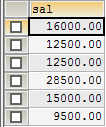

​    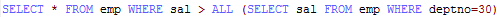

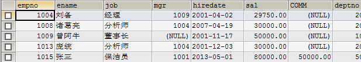

  

  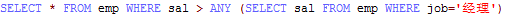

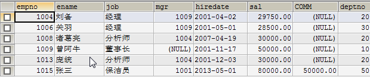

  \* (*)单行多列：SELECT * FROM 表1 别名1 WHERE (列1,列2) IN (SELECT 列1, 列2 FROM 表2 别名2 WHERE 条件)

  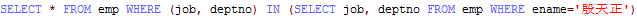

   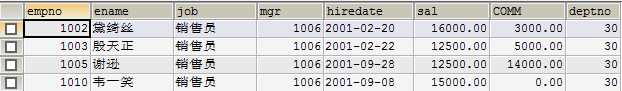

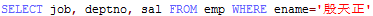

  

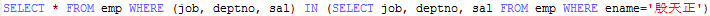

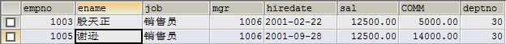

  \* (***)多行多列：SELECT * FROM 表1 别名1 , (SELECT ....) 别名2 WHERE 条件

====================================================

笛卡尔积

{a, b, c} {1,2}

{a1, a2, b1, b2, c1, c2}

====================================================

\1. 查出至少有一个员工的部门。显示部门编号、部门名称、部门位置、部门人数。

  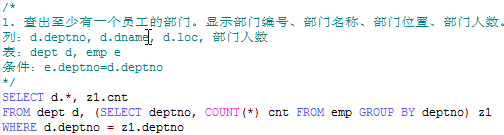

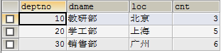

\3. 列出所有员工的姓名及其直接上级的姓名。

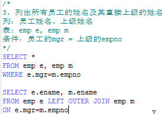

 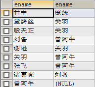

  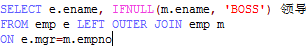

  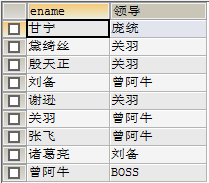

\4. 列出受雇日期早于直接上级的所有员工的编号、姓名、部门名称。

  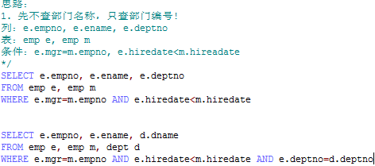

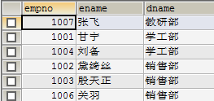

\5. 列出部门名称和这些部门的员工信息，同时列出那些没有员工的部门。

​    

 

\7. 列出最低薪金大于15000的各种工作及从事此工作的员工人数。

   

\8. 列出在销售部工作的员工的姓名，假定不知道销售部的部门编号。

  

  

\9. 列出薪金高于公司平均薪金的所有员工信息，所在部门名称，上级领导，工资等级。

   

 

10.列出与庞统从事相同工作的所有员工及部门名称。

   

11.列出薪金高于在30部门工作的所有员工的薪金的员工姓名和薪金、部门名称。

 

13.查出年份、利润、年度增长比

 

\2. 列出薪金比关羽高的所有员工。

\6. 列出所有文员的姓名及其部门名称，部门的人数。

12.列出每个部门的员工数量、平均工资。